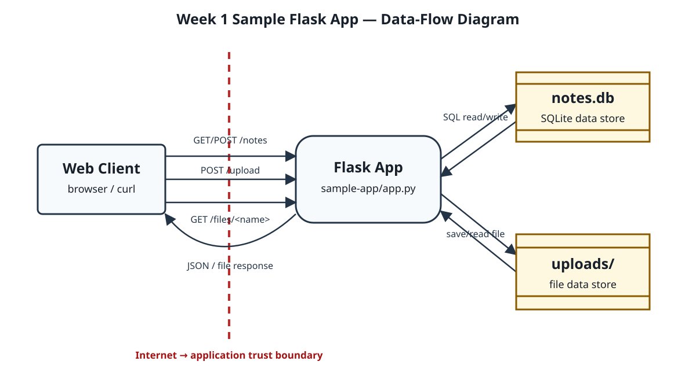

# Threat Model — Week 1 Sample Flask App

**Student:** Sai Shang Hlang (6631503129)

## 1. Data-flow diagram

The dashed line is the Internet-to-application trust boundary. Requests cross from an untrusted client into the Flask process, so authentication, authorization, validation, and resource limits must be enforced on the application side.

## 2. Elements and trust boundaries

| Element | Type | Trust boundary crossed? |
|---|---|---|
| Web client | External entity | Sends requests across Internet → app |
| Flask app | Process | Receives every public request across Internet → app |
| SQLite `notes.db` | Data store | App → data-store boundary |
| `uploads/` | Data store | App → filesystem boundary |
| `/notes` request/response | Data flow | Internet → app |
| `/upload` request/response | Data flow | Internet → app, then app → filesystem |
| `/files/<name>` request/response | Data flow | Internet → app, then filesystem → app → Internet |

## 3. STRIDE analysis

| Element | S | T | R | I | D | E |
|---|---|---|---|---|---|---|
| `/notes` | Client can claim any owner | Forged notes can be inserted | No audit log | All notes are returned publicly | Request flooding | Missing authorization may enable unintended actions |
| `/upload` | Uploader is not authenticated | Raw names originally allowed unsafe writes | Uploads are not logged | Response reveals attacker-controlled storage name | Unlimited uploads can fill storage | Dangerous stored content may affect privileged processing later |
| `/files/<name>` | Downloader is not authenticated | Existing files may be replaced through upload | Downloads are not logged | Anyone knowing a name can read the file | Repeated downloads consume resources | Lower direct risk; route uses `send_from_directory()` containment |

## 4. Top five risks and mitigations

1. **Unsafe upload path:** sanitize the name, allow-list file types, verify containment, and use server-generated storage identifiers.
2. **Spoofed note owner:** authenticate users and derive the owner from the server-side session.
3. **No audit logging:** record timestamp, authenticated identity, source address, route, result, and request ID without logging sensitive bodies.
4. **Public file access:** require authentication and verify ownership before serving a stored file.
5. **Upload denial of service:** enforce request-size, storage-quota, and per-client rate limits.

## Evidence reminder

Before submission, capture this rendered DFD beside a terminal showing the required identity command, student ID, date, and timezone. Do not use the SVG alone as identity evidence.
