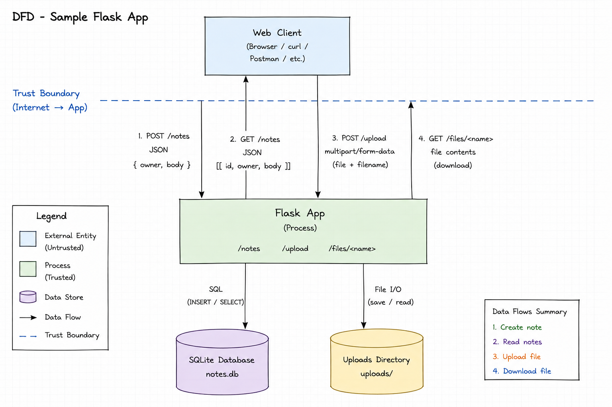

# Threat Model — Sample Flask App

## 1. Data-flow Diagram

The diagram shows the untrusted web client, the Flask application, SQLite `notes.db`, the `uploads/` store, and the `/notes`, `/upload`, and `/files/<name>` flows. The dashed line marks the Internet-to-application trust boundary.

## 2. Elements & Trust Boundaries

| Element | Type | Trust boundary crossed? |
|---|---|---|
| Web client | External entity | Yes — sends untrusted data across the Internet → Flask boundary |
| Flask app | Process | Yes — receives requests from the untrusted client |
| SQLite DB (`notes.db`) | Data store | No — directly accessed by the Flask process |
| `uploads/` store | Data store | No — directly accessed by the Flask process |
| `/notes` | Data flow | Yes — note data and responses cross the Internet → Flask boundary |
| `/upload` | Data flow | Yes — file content and filename cross the Internet → Flask boundary |
| `/files/<name>` | Data flow | Yes — filename requests enter and file content leaves the application |

## 3. STRIDE Analysis

This analysis describes the instructor's original design before the Task 8 upload mitigation.

| Element | S | T | R | I | D | E |
|---|---|---|---|---|---|---|
| `/notes` | A client can claim any `owner`; there is no authentication. | Anyone can add untrusted note content without authorization. | Note actions have no audit log or verified identity. | GET returns every note without access control. | Repeated reads or writes can consume application and database resources. | Missing authorization lets an anonymous client perform note actions intended for users. |
| `/upload` | Any unauthenticated client can upload. | Raw `f.filename` becomes part of a filesystem path, allowing an unsafe write. | Uploads have no audit log or verified uploader. | The response reveals the stored filename, and uploaded files may be publicly retrievable. | There are no upload size, quota, or rate limits. | An unsafe write could affect more privileged files if process permissions allow it; code execution is not proven by this design alone. |
| `/files/<name>` | Any unauthenticated client can request a file. | `send_from_directory` makes this read path comparatively defended against traversal; it does not write files. | Downloads have no audit log or verified requester. | Anyone who knows or guesses a filename can retrieve it. | Repeated or large downloads can consume bandwidth and worker capacity. | No direct privilege escalation is shown; missing authorization can disclose files but does not itself grant a higher role. |

The main trust-boundary problem is that the Flask app accepts identity, note data, file content, and filenames from an untrusted client without meaningful authentication or authorization. The `/files/<name>` read path is comparatively safer against path traversal because it uses `send_from_directory`, but it still lacks access control and logging.

## 4. Top 5 Risks

Likelihood and impact use a 1–3 scale, where 3 is high. The score is likelihood × impact.

| Rank | Risk | Likelihood | Impact | Score / level | Mitigation |
|---:|---|---:|---:|---|---|
| 1 | Arbitrary file write through `/upload` using a client filename | 3 | 3 | 9 / High | Sanitize or replace the filename and keep the save location under a fixed upload root. |
| 2 | Owner spoofing because there is no authentication | 3 | 3 | 9 / High | Authenticate users and derive `owner` from the authenticated session. |
| 3 | Notes readable without authorization | 3 | 3 | 9 / High | Authorize every read and filter records by the authenticated user. |
| 4 | Unlimited uploads exhaust disk or request capacity | 3 | 2 | 6 / Medium | Enforce request-size limits, quotas, and rate limits. |
| 5 | Missing audit logs prevent reliable attribution | 2 | 2 | 4 / Medium | Log security-relevant actions, results, timestamps, and verified identities. |

## 5. Conclusion

The highest risks come from trusting unauthenticated client input at the Internet-to-Flask boundary. Unsafe upload filenames can allow unintended file writes outside the intended upload directory, while missing note authentication and authorization can cause false ownership and disclosure.

Safe upload naming reduces the highest-ranked file-write risk, but it is only one layer. The application still needs authentication, ownership checks, audit logging, and resource limits to address the remaining threats.
