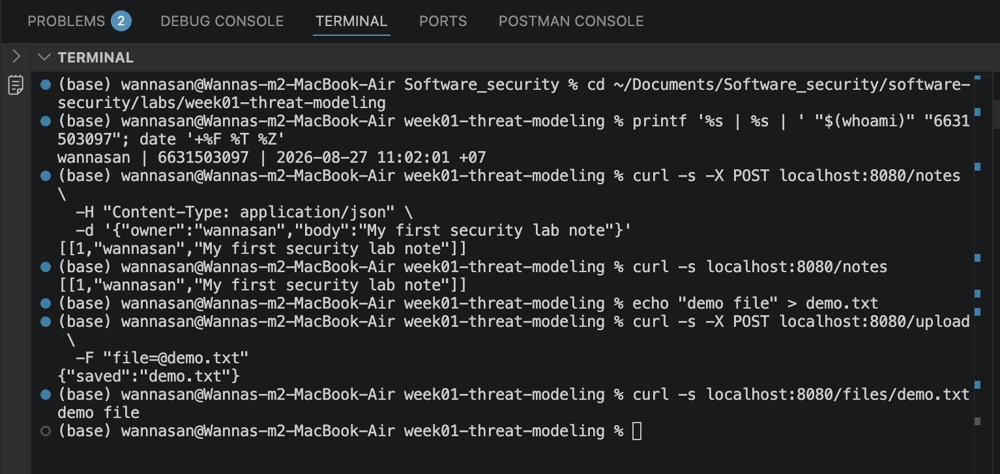
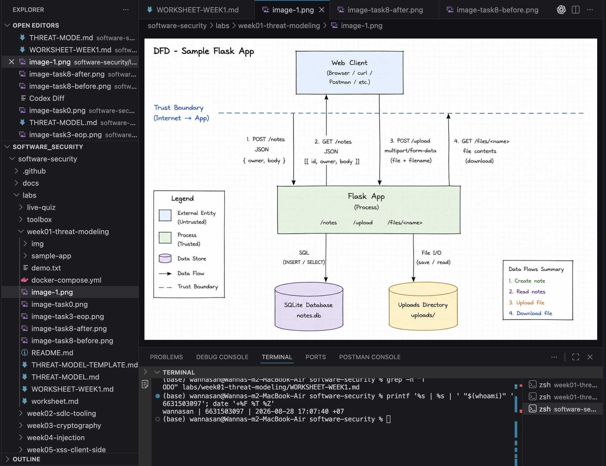
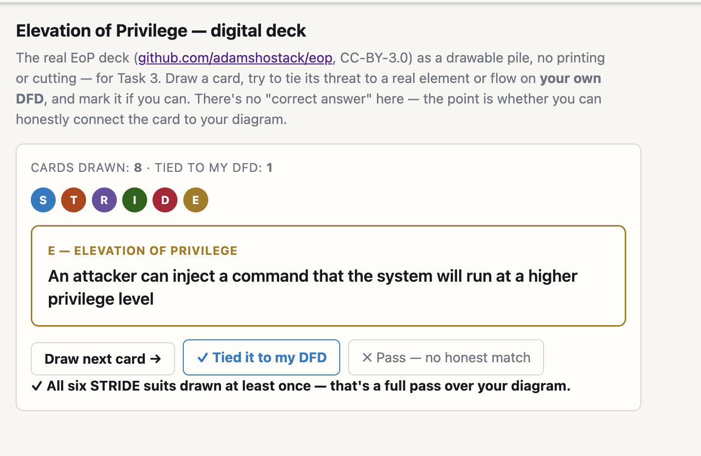
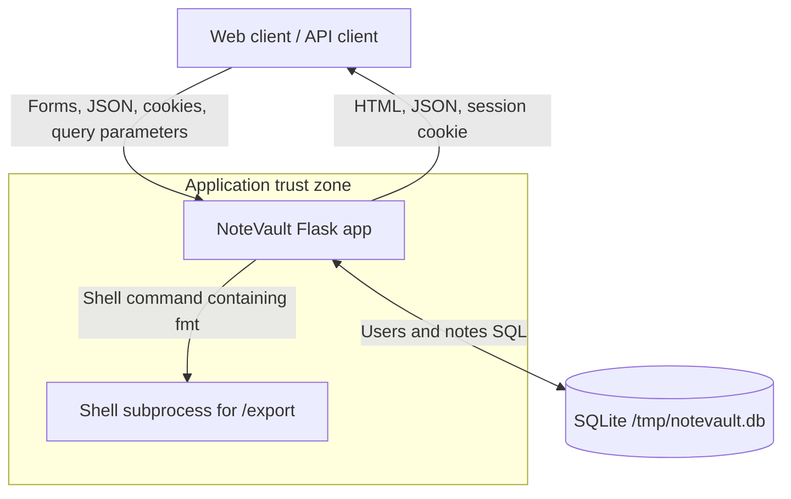
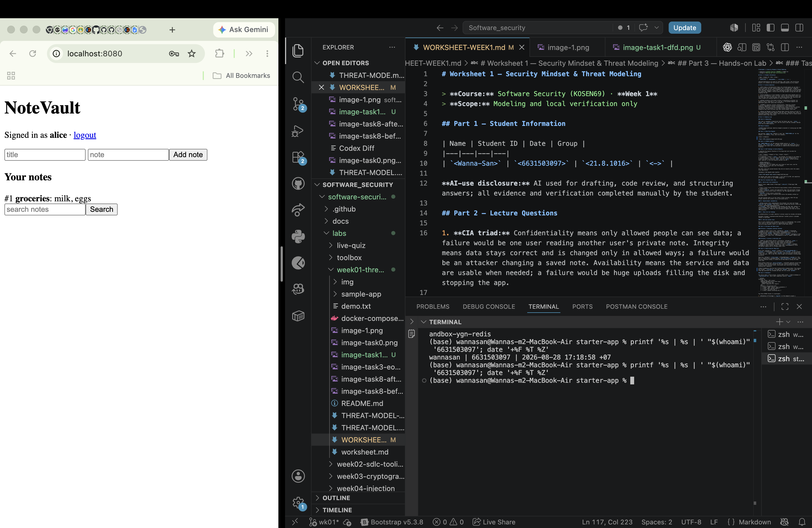
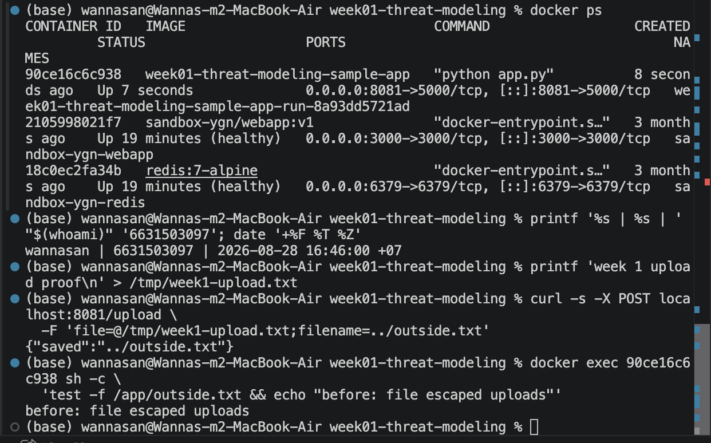
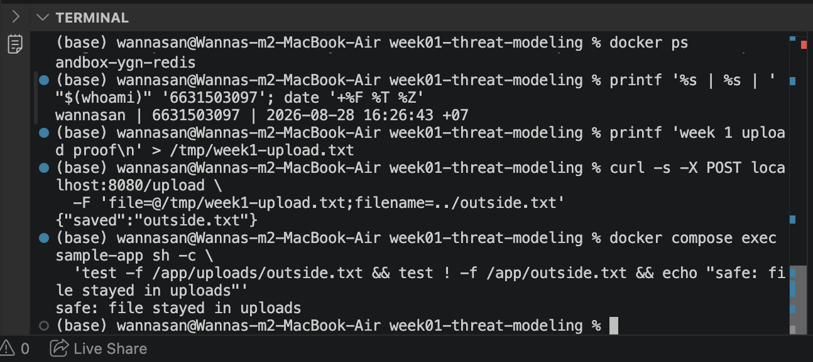

# Worksheet 1 — Security Mindset & Threat Modeling

> **Course:** Software Security (KOSEN69) · **Week 1**
> **Scope:** Modeling and local verification only

## Part 1 — Student Information

| Name | Student ID | Date | Group |
|---|---|---|---|
| `<Wanna-San>` | `<6631503097>` | `<21.8.2026>` | `<->` |

**AI-use disclosure:** AI used for drafting, code review, and structuring answers; all evidence and verification completed manually by the student.

## Part 2 — Lecture Questions

1. **CIA triad:** Confidentiality means only allowed people can see data; a failure would be one user reading another user's private note. Integrity means data stays correct and is changed only in allowed ways; a failure would be an attacker changing a saved note. Availability means the service and data are usable when needed; a failure would be huge uploads filling the disk and stopping the app.

2. **Trust boundary:** A trust boundary is where data moves between parts of a system with different levels of trust, such as from an Internet client into the Flask app. Each crossing needs extra checking because the receiving side cannot assume the incoming identity or data is honest or safe.

3. **Attack surface:** The attack surface is everything an attacker can interact with or send data to. In a web app, a file-upload endpoint and additional public API routes both increase it.

4. **STRIDE:** Spoofing violates authentication, Tampering violates integrity, Repudiation violates accountability or non-repudiation, Information Disclosure violates confidentiality, Denial of Service violates availability, and Elevation of Privilege violates authorization. These categories help check different ways each system element could fail.

5. **Secure by Design:** Secure by Design means security choices are part of the architecture and normal behavior from the start. Patching later reacts to individual problems after release, while secure design tries to remove unsafe patterns before they reach users.

## Part 3 — Hands-on Lab

### Task 0 — Onboarding

This task is intended to demonstrate that the Docker app runs, `/notes`, `/upload`, and `/files/<name>` work, and the source code was reviewed. Runtime proof must be added manually.

### Manual Evidence

 identity-stamped screenshot of running app and JSON/file response

### Task 1 — Data-flow Diagram

The existing `image-1.png` diagram is used. See `THREAT-MODEL.md` for the diagram, its elements, flows, and trust boundary.

**Task 1 evidence**



### Task 2 — STRIDE Analysis

See `THREAT-MODEL.md` for the complete STRIDE analysis of `/notes`, `/upload`, and `/files/<name>`. It models the original app before the Task 8 mitigation and treats the file-read path as comparatively defended against traversal.

### Task 3 — EoP Findings to Verify Manually

I completed the digital Elevation of Privilege deck and recorded the following result:

| Card / category | Element or flow | Threat | Valid? |
|---|---|---|---|
| S — Spoofing | Client → `/notes` | “An attacker can choose to use weaker or no authentication” | Yes — the sample Flask app has no authentication. A client can submit an arbitrary `owner` value to `/notes` without proving their identity, so the card honestly matches the DFD. |

- **Cards drawn:** 8
- **Tied to my DFD:** 1
- **Coverage:** All six STRIDE suits were drawn at least once, and the website reported a full pass over the diagram.
- **Final score:** 1

The other cards were passed because they did not honestly match the sample Flask application.

**Evidence — EoP digital deck result**



The digital deck shows 8 cards drawn, 1 card tied to my DFD, and completion of a full pass across all six STRIDE categories.

### Task 3b — Systems-level Pass

#### A. End-to-end trust boundaries

Request trace: **Web client → Flask app → `notes.db` → Flask app → Web client**.

- Client → Flask crosses the Internet-to-app boundary without authentication or authorization.
- Flask → `notes.db` crosses from application logic into persistent storage. Parameterized SQL protects query structure, but the supplied owner is still unverified.
- `notes.db` → Flask returns stored data.
- Flask → client sends all selected notes across the boundary without an ownership check.

The main missing check is at the client → Flask crossing, where the app accepts identity and content from an untrusted source.

#### B. Owned-element reachability

- **Flask process fully compromised:** the attacker can reach and change `notes.db` and `uploads/`, and return content through the service, within the process's operating-system permissions.
- **`uploads/` fully compromised:** the attacker can read, add, replace, or remove uploaded files and influence what the download route serves. This supports disclosure, tampering, and availability impacts but does not prove code execution.

#### C. Chain two low findings

No authentication → no audit identity → actions cannot be reliably attributed.

Guessable filename → unauthenticated download → another person's uploaded content is disclosed.

#### D. One-line system claim

Even if every element-level mitigation in Task 8 is implemented, this system still fails if the Flask process is compromised and no separate least-privilege boundary limits its reach to both data stores.

### Task 4 — Personas and Abuse Cases

#### Persona 1: Anonymous Internet attacker

1. **Goal:** affect server files. **Target:** `/upload` → filesystem. **Attempt:** send a path-like filename. **Consequence:** a file may be written outside `uploads/` where process permissions allow.
2. **Goal:** deny service. **Target:** client → `/upload`. **Attempt:** send repeated or very large files. **Consequence:** disk or request capacity may be exhausted.

#### Persona 2: Curious or malicious user

1. **Goal:** read another person's information. **Target:** `/notes` → client. **Attempt:** request all notes without proving identity. **Consequence:** note bodies and owner labels are disclosed.
2. **Goal:** hide authorship. **Target:** client → `/notes` → database. **Attempt:** submit another person's owner name. **Consequence:** false attribution remains with no reliable audit trail.

### Task 5 — Path-traversal Deep Dive

Write flow: **Client → `/upload` → Flask → `os.path.join(UPLOAD_DIR, f.filename)` → filesystem**. The client controls `f.filename`, so the original design lets `../` segments escape `uploads/` when the raw value becomes part of the save path. This is why the client-to-app trust-boundary crossing needs validation.

Read flow: **Client → `/files/<name>` → Flask/Werkzeug → `uploads/`**. This path is comparatively defended because `send_from_directory` performs a safe directory-relative lookup; it should not be described as having the same write flaw.

Secure design should use `secure_filename()`, preferably generate server-side filenames, store uploads outside the web root, enforce extension/content allow-lists and file-size limits, and prevent user-controlled strings from becoming path components.

**Task 5 evidence:** See the Task 8 before/after evidence below. The original app allowed `../outside.txt` to escape the `uploads/` directory, while the fixed app sanitized the filename and kept the file inside `uploads/`.

### Task 6 — NoteVault

The source shows a Flask process, browser/JSON clients, a SQLite database at `/tmp/notevault.db`, and a shell subprocess used by `/export`.



Top three STRIDE threats to investigate:

1. **Elevation of Privilege — `/register`:** the endpoint accepts a client-supplied role instead of always assigning the normal user role.
2. **Information Disclosure — `/api/notes/<nid>`:** the endpoint requires login but looks up a note by ID without checking its owner.
3. **Tampering/Elevation — `/export`:** untrusted `fmt` data is concatenated into a command executed with `shell=True`.

**Task 6 evidence**



### Task 7 — Security Requirements

1. The system must authenticate note users and derive note ownership from the authenticated session so that clients cannot spoof owners or read another user's notes.
2. The system must replace every uploaded client filename with a safe path component and reject an empty sanitized name so that upload input cannot escape the upload directory.
3. The system must record note, upload, and download actions with a timestamp, result, and authenticated identity when available so that security events can be investigated.

### Task 8 — Rank and Mitigate

See `THREAT-MODEL.md` for the complete top-five risk ranking, likelihood, impact, scores, and mitigations.

**Selected mitigation:** safe filename handling for `/upload`. The implementation uses `secure_filename()`, rejects an empty sanitized name, and saves and reports only the safe name.

Automated local verification found that a normal filename still saved, a path-like filename was reduced to a basename and remained inside `uploads/`, and an empty sanitized filename returned HTTP 400. This automated result is not identity-stamped submission evidence.

**Before-fix evidence:** The original `/upload` endpoint accepted `../outside.txt` and wrote the file outside the intended `uploads/` directory.



**After-fix evidence:** The fixed `/upload` endpoint sanitized `../outside.txt` to `outside.txt` and kept the file inside the intended `uploads/` directory.



Commit: [634f8cf](https://github.com/6631503097/software-security/commit/634f8cf)

This is an **instance fix** because `secure_filename()` is applied to one endpoint. A class fix would enforce that no user-supplied string ever becomes a path component, for example by generating opaque filenames through a shared storage layer.

## Part 4 — Reflection

1. The arbitrary-file-write finding maps to **CWE-501** because untrusted data crosses the client-to-app boundary and becomes a filesystem path, and to **OWASP A06 Insecure Design** because the design lacks a safe naming and storage rule.
2. **Real-world design flaw:** In the 2019 Capital One breach, an attacker gained access through a misconfigured web application firewall and obtained personal data from Capital One's systems. A stronger secure-by-design approach using least-privilege access and safer infrastructure configuration could have reduced or prevented the attack by limiting what the compromised component was allowed to reach.
3. Safe upload filename handling gives strong risk reduction for little code because it removes the direct path from a client-controlled name to an unsafe write location. Authentication, authorization, logging, and limits are still needed for the other risks.

## Evidence & Integrity

Use this exact identity stamp in the same screenshot as each piece of evidence:

```bash
printf '%s | %s | ' "$(whoami)" '<YOUR-STUDENT-ID>'; date '+%F %T %Z'
```

- Task 0 runtime and response: `image-task0.png`
- Task 1 DFD: `image-task1-dfd.png`
- Task 3 EoP cards and score: `image-task3-eop.png`
- Task 5 permitted local demonstration: completed and documented above
- Task 6 NoteVault runtime and DFD check: `image-task6-notevault.png`
- Task 8 before/after proof: `image-task8-before.png` / `image-task8-after.png`
- Commit: [634f8cf](https://github.com/6631503097/software-security/commit/634f8cf)

**Personalized flag:** Week 1 has no personalized flag.

### Explain in Your Own Words

I reviewed how requests move from the browser into Flask and then to the database or filesystem. The upload weakness exists because the original app trusts the client filename while building the save path.

The fix sanitizes that value before using it and rejects a name that becomes empty. Missing authentication, authorization, audit logging, and resource limits remain separate risks.

## Audit the AI

### AI Answer Used

The /upload endpoint is vulnerable to path traversal because it uses the client-supplied filename when constructing the filesystem path. An attacker can provide a filename such as ../outside.txt, causing the application to write outside the intended uploads directory. The mitigation is to sanitize the filename with secure_filename() before saving it.

### What Was Wrong or Risky

The risky part of this AI answer was that it stated the vulnerability as a fact before verifying which version of the application was being tested. I later checked the original repository version separately and manually confirmed that ../outside.txt escaped the uploads directory. I also tested the fixed version and confirmed that the filename was sanitized and remained inside uploads/. This showed me that an AI explanation should not be treated as evidence without checking the actual code and runtime behavior.

### Correct Verified Version

The safe-upload implementation in `sample-app/app.py` is the candidate corrected version. Automated checks do not replace the required identity-stamped manual verification.

## Comprehension & Prompt

### A. Explain in Plain English

`/upload` receives a file and saves it in the app's upload folder. The original code trusted the filename sent by the client, so directory steps in that name could make the final path point outside the folder. The path was built by joining `uploads` with the untrusted name.

### B. Prompt Problem

> Inspect the exact current Flask code in `labs/week01-threat-modeling/sample-app/app.py`. Produce a minimal secure fix for `/upload` that prevents user-controlled filenames from becoming unsafe path components while preserving valid uploads. Use appropriate Flask/Werkzeug APIs, reject or safely transform unsafe or empty filenames, save and return only the safe name, and do not change unrelated routes. Add a small verification proving that a normal filename still works and a path-like filename cannot write outside `uploads/`; clearly separate automated results from manual identity-stamped evidence.

**Verified result:** Manual before/after testing confirmed that the original version allowed `../outside.txt` to escape the intended `uploads/` directory, while the corrected version sanitized the filename to `outside.txt` and kept the file inside `uploads/`. Evidence is shown in `image-task8-before.png` and `image-task8-after.png`.
