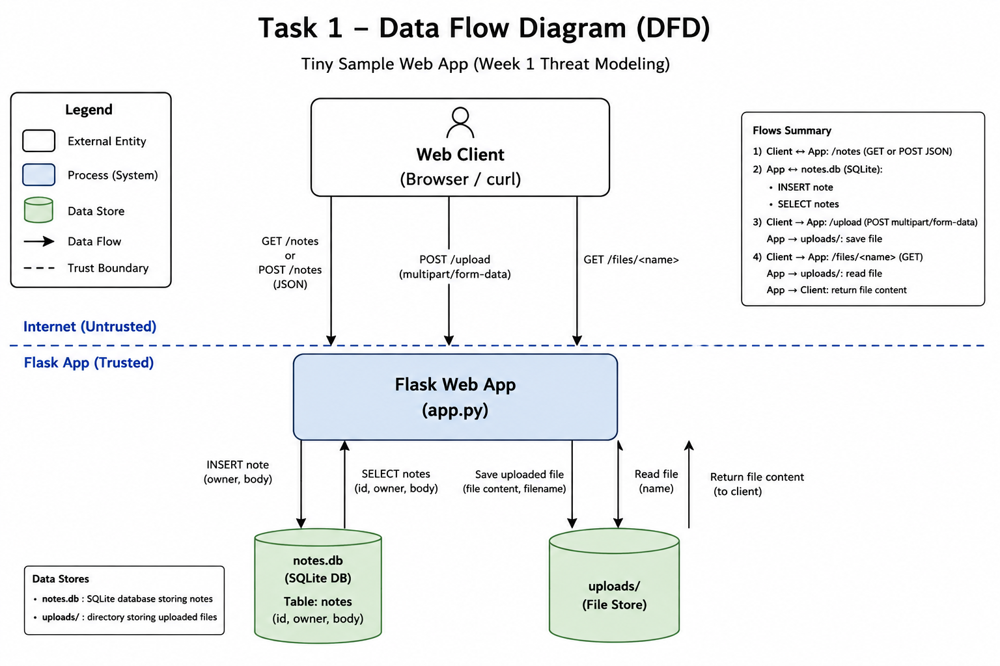

# Threat Model — Week 1 Sample Flask App

## 1. Data-flow diagram

## 2. Elements & trust boundaries
| Element | Type (process/store/entity/flow) | Trust boundary crossed? |
|---|---|---|
| Web client | external entity | yes (Internet → app) |
| Flask app | process | yes (receives Internet → app requests) |
| SQLite DB (`notes.db`) | data store | no |
| `uploads/` | data store | no |

## 3. STRIDE analysis
### Task 2 — STRIDE Analysis

The application should authenticate users and derive the note owner from the authenticated identity instead of trusting the client-supplied `owner` value. File uploads should use a validated or server-generated filename, and the application should add audit logging and resource limits to reduce repudiation and denial-of-service risks.

| Element | S | T | R | I | D | E |
|---|---|---|---|---|---|---|
| `/notes` | Client can spoof another user by supplying any `owner` value because there is no authentication. | A client can insert arbitrary note content into the database. | There is no logging, so actions cannot be reliably tied to a real user. | `GET /notes` returns all stored notes without access control. | Repeated POST requests could grow the database and consume resources. | No explicit authorization exists, so a client may perform actions that should require a trusted identity. |
| `/upload` | The uploader is not authenticated, so the server cannot verify who submitted a file. | `f.filename` is used directly in the save path, so user-controlled input influences filesystem writes. | There is no audit logging for uploads. | The response reveals the accepted filename and the upload behavior may expose information about server-side file handling. | Large or repeated uploads could consume disk space. | If file writes reach unintended locations, the impact could extend beyond the intended upload directory. |
| `/files/<name>` | No authentication is required to request a file. | This endpoint is read-only, so direct tampering risk is lower than `/upload`. | File access is not logged. | Anyone who knows a filename may be able to retrieve the uploaded file. | Repeated file requests could consume server resources. | Direct privilege escalation is limited here because `send_from_directory()` constrains file reads to the upload directory. |

## Task 3 — Elevation of Privilege Game

I used the digital Elevation of Privilege (EoP) deck and drew five cards. I tied a card to my DFD only when the threat could honestly be connected to a real element or data flow in the sample application.

| Card | STRIDE | Result | Element / Flow | Finding |
|---|---|---|---|---|
| Denial of Service 3 | Denial of Service | Pass | — | The card describes draining an easily replaceable battery. The sample Flask application has no battery-powered component represented in the DFD, so there is no honest match. |
| Elevation of Privilege 5 | Elevation of Privilege | Valid (+1) | `/upload` → `uploads/` → `/files/<name>` | Filename/path data goes through different handling paths. `/upload` uses the client-supplied `f.filename` when saving, while `/files/<name>` uses `send_from_directory()` to constrain file reads. This inconsistent validation can create a security gap. |
| Denial of Service 10 | Denial of Service | Valid (+1) | `/upload` → `uploads/` | `/upload` accepts unauthenticated file uploads without an explicit upload-size or resource limit. Repeated uploads could consume persistent disk space, so the impact may remain after the attacker stops sending requests. |
| Denial of Service 7 | Denial of Service | Pass | — | The card describes making a client unavailable with a persistent effect. The analyzed Flask application does not provide a clear mechanism for causing this persistent client-side denial of service. |
| Denial of Service 6 | Denial of Service | Valid (+1) | Flask App / public endpoints | The application exposes endpoints without authentication or rate limiting. A large number of requests could temporarily consume server resources and reduce availability, with the effect ending when the request flood stops. |

**Cards Drawn:** 5  
**Tied to My DFD:** 3  
**Total Score:** 3

### Task 3 Summary

Three of the five drawn cards could be honestly connected to the sample application's DFD. The valid findings showed inconsistent filename/path handling and two denial-of-service risks: persistent resource consumption through file uploads and temporary server resource exhaustion through unauthenticated requests. The other two cards were passed because their threats could not be reasonably connected to the system.

## Task 3b — Systems-level Pass

### 1. Trust boundaries end-to-end

A request to `/notes` starts from the untrusted web client and crosses the Internet-to-application trust boundary before reaching the Flask application. The Flask application then accesses `notes.db` to store or retrieve note data, and the response travels back through the application to the client.

The most important unchecked crossing is the Internet → Flask application boundary. The application accepts the client-supplied `owner` value without authentication or authorization, so untrusted input is treated as if it represents a valid identity.

### 2. Owned-element reachability

**If the Flask process is fully compromised:**  
An attacker could reach both `notes.db` and the `uploads/` directory because the Flask process has legitimate access to both data stores. This could allow the attacker to read or modify notes and access or modify uploaded files.

**If the `uploads/` store is fully compromised:**  
An attacker could control files stored in the upload directory. Since `/files/<name>` serves files from this directory, attacker-controlled content could potentially be returned to clients through the Flask application.

### 3. Chain two low findings

Missing authentication on `/upload` → unrestricted repeated uploads → disk space is exhausted and the application becomes unavailable.

Another possible chain is:

Predictable/known uploaded filename → unauthenticated `/files/<name>` access → unauthorized disclosure of uploaded file contents.

### 4. One-line system claim

Even if every element-level mitigation in Task 8 is implemented, this system still fails if a compromised Flask process retains unrestricted access to both the database and uploaded files.

## Task 4 — Abuse Cases & Attacker Personas

### Persona 1 — Curious User

This attacker is a normal user who can access the web application but is curious about data belonging to other users. The attacker does not have administrative access and only interacts with the exposed application endpoints.

**Abuse Case 1 — Impersonating another note owner**  
The user sends a request to `/notes` and supplies another person's name in the `owner` field. Because the application does not authenticate the supplied owner, the Flask App accepts the value and stores the note in `notes.db` as if it belonged to that person.

**DFD elements:** Web Client → `/notes` → Flask App → `notes.db`

**Abuse Case 2 — Reading other users' notes**  
The user sends `GET /notes` and receives all notes stored in `notes.db`. Since there is no authentication or per-user authorization check, the user may see notes that were created by other users.

**DFD elements:** Web Client → `/notes` → Flask App → `notes.db`

### Persona 2 — Anonymous Internet Attacker

This attacker has no account and accesses the Flask application from the untrusted Internet. Their goal is to misuse publicly reachable endpoints without needing authentication.

**Abuse Case 3 — Uploading uncontrolled files**  
The attacker sends files to `/upload`. The application accepts the upload without authentication and uses the client-controlled `f.filename` when creating the filesystem path, allowing untrusted input to influence writes to the file store.

**DFD elements:** Web Client → `/upload` → Flask App → `uploads/`

**Abuse Case 4 — Consuming application resources**  
The attacker repeatedly sends uploads or other requests to the application. Because the application has no visible rate limiting or upload-size controls, repeated requests could consume disk or server resources and reduce availability.

**DFD elements:** Web Client → Flask App → `uploads/`

## Task 5 — Path-Traversal Deep Dive

### 1. Data Flow

เส้นทางการอัปโหลดไฟล์:

Web Client → `POST /upload` → Flask App → `uploads/`

เส้นทางการอ่านไฟล์:

Web Client → `GET /files/<name>` → Flask App → `uploads/` → Web Client

### 2. ความเสี่ยง

`/upload` ใช้ `f.filename` ที่มาจากผู้ใช้โดยตรงในการสร้าง path สำหรับบันทึกไฟล์ หากชื่อไฟล์มี `../` อาจทำให้ path ออกจากโฟลเดอร์ `uploads/` และเขียนไฟล์ไปยังตำแหน่งที่ไม่ควรได้

ส่วน `/files/<name>` ปลอดภัยกว่าฝั่ง upload เพราะใช้ `send_from_directory()` เพื่อจำกัดการอ่านไฟล์ให้อยู่ใน directory ที่กำหนด

### 3. Secure Design

ควรใช้ `secure_filename()` ตรวจสอบชื่อไฟล์, ใช้ allow-list จำกัดประเภทไฟล์ และเก็บไฟล์ไว้นอก web root นอกจากนี้ควรสร้างชื่อไฟล์ใหม่จากฝั่ง server เช่น UUID แทนการใช้ชื่อไฟล์จากผู้ใช้โดยตรง

### 4. Mitigation

ไม่ควรนำข้อมูลจากผู้ใช้มาเป็นส่วนหนึ่งของ filesystem path โดยตรง การใช้ชื่อไฟล์ที่ server สร้างเองช่วยลดความเสี่ยงของ path traversal และ arbitrary file write

## Task 6 — Threat Model: NoteVault

### DFD

Web Client → Flask App → SQLite DB (`/tmp/notevault.db`)

Main flows:
- Register/Login → Flask App → `users`
- Home/Notes → Flask App → `notes`
- `/api/notes/<id>` → Flask App → `notes`
- `/search` → Flask App → `notes`
- `/admin` → Flask App → `users`
- `/export` → Flask App → shell command

### Top 3 STRIDE Threats

1. **Spoofing / Elevation of Privilege — User can choose their own role**  
   `/register` accepts a client-supplied `role` value. A user can therefore request a privileged role such as `admin` instead of being forced to register as a normal user.

2. **Information Disclosure — Note ownership is not checked in `/api/notes/<id>`**  
   The endpoint checks only whether the requester is logged in, then retrieves a note by ID without checking whether the note belongs to that user. This may expose notes owned by another user.

3. **Tampering / Injection — Untrusted input reaches SQL and shell commands**  
   `/search` builds an SQL query using string formatting with the user-controlled search term, and `/export` concatenates `fmt` into a command executed with `shell=True`. Both flows cross trust boundaries without safe parameter handling.

### Mitigation

The application should enforce server-side authorization instead of trusting client-supplied roles, check note ownership before returning individual notes, and keep untrusted input out of SQL strings and shell commands. Parameterized SQL queries and avoiding `shell=True` would reduce these injection risks.

### Top 3 STRIDE Threats

1. **Elevation of Privilege — Client-controlled role**
   `/register` accepts the `role` value from the client. An attacker could register with `role=admin` and gain administrator privileges.
   **Mitigation:** Do not accept roles from the client. New users should always receive the `user` role on the server side.

2. **Information Disclosure — IDOR in `/api/notes/<nid>`**
   The API checks that the requester is logged in, but does not check whether the requested note belongs to that user. An authenticated user may access another user's note by changing the note ID.
   **Mitigation:** Check that `owner` matches the authenticated user before returning the note.

3. **Elevation of Privilege / Tampering — Command Injection in `/export`**
   The `fmt` parameter is concatenated directly into a shell command and executed with `shell=True`. User-controlled input may therefore affect the command executed by the server.
   **Mitigation:** Avoid `shell=True` and validate `fmt` against a fixed allow-list such as `txt` or `json`.
   
## 4. Top 5 risks (likelihood × impact) + mitigation
1.
2.
3.
4.
5.
