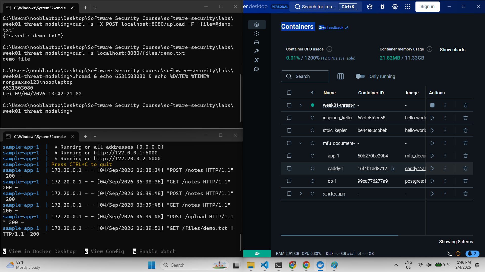
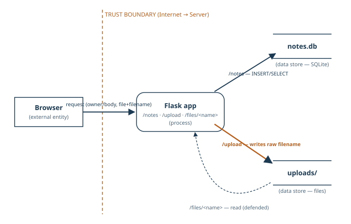
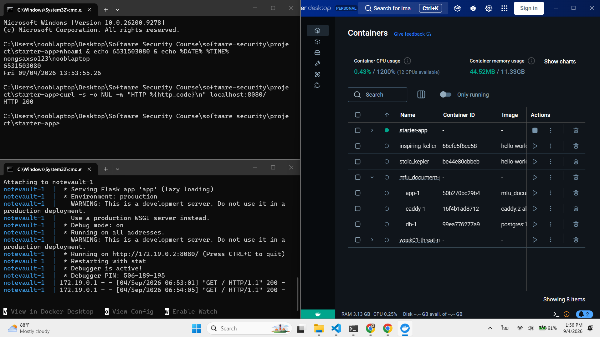
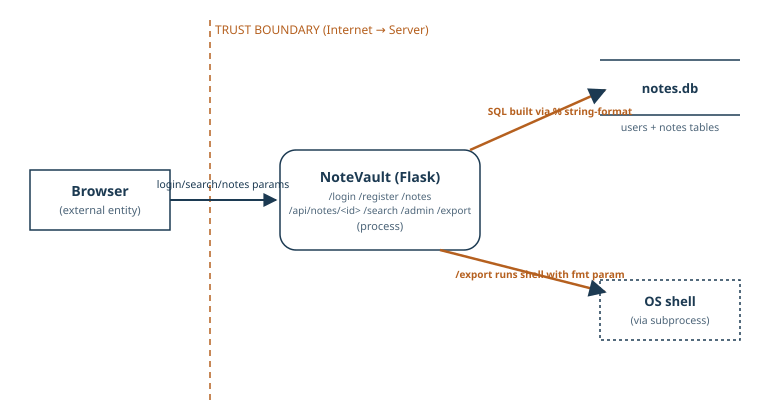
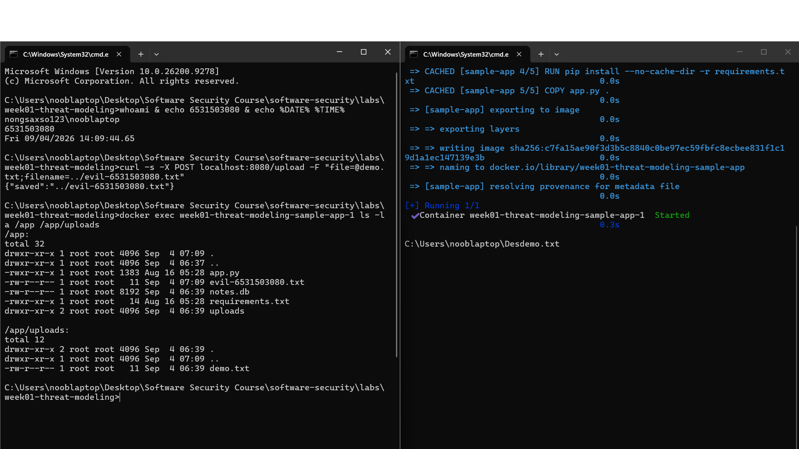
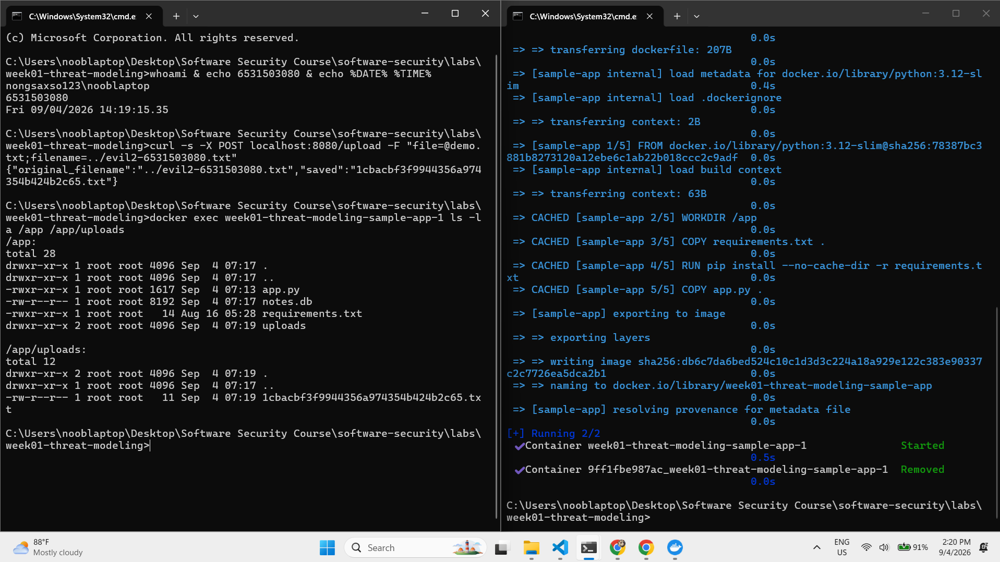

# Threat Model — sample-app (Week 1)

## 0. Task 0 — Environment proof

## 1. Data-flow diagram

## 2. Elements & trust boundaries
| Element | Type (process/store/entity/flow) | Trust boundary crossed? |
|---|---|---|
| Web client | external entity | yes (Internet → app) |
| Flask app | process | |
| SQLite DB (`notes.db`) | data store | |
| `uploads/` store | data store | |

## 3. STRIDE analysis
| Element | S — Spoofing | T — Tampering | R — Repudiation | I — Info disclosure | D — DoS | E — Elevation |
|---|---|---|---|---|---|---|
| /notes | ไม่มี auth — ใครก็ POST โดยอ้าง `owner` เป็นใครก็ได้ | ไม่มีการตรวจสอบ `body`/`owner` เลย ใครก็ใส่ข้อมูลปลอมได้ | ไม่มี log — พิสูจน์ไม่ได้ว่าใครสร้าง note ไหน | **GET /notes คืนทุก note ให้ทุกคน** ไม่มีการกรองว่าใครเห็นของใครได้ — จุดเสี่ยงสุดของ endpoint นี้ | ไม่จำกัดขนาด/จำนวน note → spam จน DB บวมได้ | ไม่มีระดับสิทธิ์ในระบบนี้ (ไม่เกี่ยวข้องตรงๆ) |
| /upload | ไม่มี auth — ใครก็อัปโหลดโดยอ้างเป็นใครก็ได้ | `../` ใน filename เขียนไฟล์ออกนอก `uploads/` ได้ — arbitrary-file-write | ไม่มี log — พิสูจน์ไม่ได้ว่าใครอัปโหลด | response ตอบ `{"saved": filename}` กลับ path ที่เซฟจริงให้ผู้โจมตี ช่วยยืนยันว่า traversal สำเร็จ | ไม่จำกัดขนาดไฟล์ → อัปโหลดจนดิสก์เต็ม | อัปโหลดไฟล์อันตราย (เช่น script) แล้วถูกเรียกใช้ภายหลัง = รันโค้ดได้ |
| /files/<name> | ไม่มี auth บนฝั่งอ่านเช่นกัน — ใครก็อ่านไฟล์ได้ถ้ารู้ชื่อ | ป้องกัน path traversal ไว้ดีแล้ว (Werkzeug `safe_join` + router บล็อก `/` ใน segment) | ไม่มี log ว่าใครอ่านไฟล์ไหน | **จุดเสี่ยงหลัก:** ไฟล์ทุกคนอ่านได้หมด ไม่ผูกกับเจ้าของ — เดาชื่อไฟล์แล้วอ่านของคนอื่นได้ | ไม่จำกัด rate — เรียกไฟล์ใหญ่ซ้ำๆ ได้ไม่จำกัด | ไม่เกี่ยวข้องตรงๆ กับ endpoint นี้ |

## 3b. Task 3 — Elevation of Privilege game (score: 6/6 threats found)
Ran STRIDE cards against the DFD a second time (game-style pass, not the per-element grid):
- Spoofing / Repudiation / Info Disclosure / DoS / Elevation — same 5 as Task 2, confirmed via the card prompts.
- **New (Tampering card): `/upload` accepts `../notes.db` as a filename, letting an attacker overwrite the entire notes database via the write bug.** This chains the `/upload` write primitive directly into the `/notes` data store — not just "writes somewhere odd," but destroys real application data from a single endpoint.

## 3c. Task 3b — Systems-level pass
1. **Boundaries crossed end-to-end:** only 1 — Browser → Flask app (Internet → Server). It has zero checks: no auth, no input validation.
2. **If Flask process is fully owned:** attacker reaches full read/write on `notes.db` and `uploads/`, container env vars, and any network-reachable service on the same docker network.
3. **Chain:** A (`/upload` has no auth — looks minor, "just a demo app") → B (filename unsanitized, writes outside `uploads/` — looks minor, "just a write bug") → **consequence: unauthenticated internet-facing write access to `notes.db` or even `app.py` itself — overwriting `app.py` means attacker code runs on the next container restart.**
4. **System claim:** *"Even if every element-level mitigation in Task 8 is implemented, this system still fails if the Flask process keeps unrestricted write access to its own source code and database with no privilege separation — the one remaining flaw compromises everything the process touches."*

## 3d. Task 4 — Abuse cases & attacker personas
**Persona 1 — curious regular user** (low skill, opportunistic, not out to destroy anything):
1. Calls `GET /notes` to read every user's notes, not just their own (Info Disclosure, Task 2).
2. Guesses common filenames and calls `GET /files/<name>` to read files other users uploaded.

**Persona 2 — internet attacker with intent to damage the system** (skilled, targeted):
1. Uploads a file named `../notes.db` via `/upload` to overwrite the whole database, wiping every user's notes (builds on Task 3's chained finding).
2. Uploads a file named `../app.py` to overwrite the app's own source code, so malicious code runs on the next container restart (builds on Task 3b's system claim).

## 3e. Task 5 — Path-traversal deep-dive
**Flow:** Browser sends file+filename → `f.save(os.path.join(UPLOAD_DIR, f.filename))` uses the raw, unsanitized filename → `os.path.join` does not confine the result inside `uploads/`, so `../../escaped.txt` resolves outside it and writes wherever the process can reach.

**Why `/files/<name>` is safe from the same trick:** the `<name>` route segment cannot contain `/` — Werkzeug's router rejects any traversal payload with a slash before the view even runs (404), and `send_from_directory`'s `safe_join` guards the rest. `/upload`'s filename comes from the uploaded file's metadata, not the URL path, so it never gets that guard.

**Secure design:**
- `secure_filename()` to strip dangerous characters (instance-level patch)
- allow-list extensions (reject `.php`, `.py`, `.sh`, etc.)
- **class fix:** generate a random/UUID filename server-side; store the user's original filename in the DB for display only — a user-supplied string never becomes a path component.

## 3f. Task 6 — NoteVault (term project target)
Stopped sample-app, ran `project/starter-app` instead.

**Top 3 threats (from reading `project/starter-app/app.py`):**
1. **SQL Injection in `/login` and `/search`** — both build queries with `%` string-formatting instead of parameters (e.g. `"...WHERE username = '%s' AND password = '%s'" % (...)`), so a crafted username/search term can alter the query logic (auth bypass, data exfiltration).
2. **Elevation of Privilege via `/register`** — the endpoint accepts a client-supplied `role` field with no validation, so anyone can register as `role=admin` and reach `/admin` (which dumps every user's password hash).
3. **IDOR at `/api/notes/<nid>`** — checks only "is someone logged in," never "does this note belong to them," so any authenticated user can read any other user's (including admin's) private notes by guessing/incrementing `nid`.

*(Also noticed but out of scope for this quick pass: JWT decode accepts `algorithms=["HS256","none"]` — forgeable session tokens; `/export`'s `fmt` param reaches a `shell=True` subprocess call — possible command injection; passwords hashed with MD5. Flagging these for the full term-project assessment later.)*

## 3g. Task 7 — Security requirements
1. **(→ Task 2, Info Disclosure on `/notes` & `/files/<name>`)** The system must authenticate every request to `/notes` and `/files/<name>` and only return notes/files owned by the requesting user, so that an anonymous or unauthorized user cannot read another user's notes or uploaded files.
2. **(→ Task 6, Tampering/SQLi on `/login` & `/search`)** The system must build every SQL query in `/login` and `/search` using parameterized queries — never string-formatting or concatenating user input into SQL — so that a crafted username, password, or search term cannot alter query logic to bypass authentication or exfiltrate data.
3. **(→ Task 6, Elevation of Privilege on `/register`)** The system must ignore any client-supplied `role` field on `/register` and always assign the default non-privileged role server-side, so that a user cannot self-elevate to admin by sending `role=admin` in the registration request.

## 4. Top 5 risks (likelihood × impact) + mitigation
| # | Threat | Likelihood (1-5) | Impact (1-5) | Score | Mitigation |
|---|---|---|---|---|---|
| 1 | Unauthenticated arbitrary file write via `/upload` (`../` in filename) — can overwrite `notes.db` or even `app.py`, so attacker code runs on next container restart | 5 | 5 | 25 | Never let a user-supplied string become a path component: generate a server-side random filename + allow-listed extension only |
| 2 | SQL Injection in NoteVault `/login` and `/search` (string-formatted queries) — auth bypass / full data exfiltration | 4 | 5 | 20 | Parameterized queries everywhere; never format/concatenate user input into SQL |
| 3 | Unauthenticated info disclosure: `GET /notes` returns every user's notes; `/files/<name>` lets anyone read any uploaded file | 5 | 3 | 15 | Require auth on `/notes` and filter by `owner`; bind `/files/<name>` reads to the uploading user |
| 4 | Elevation of Privilege via NoteVault `/register` trusting a client-supplied `role` field | 3 | 5 | 15 | Ignore/strip `role` from the registration payload; server always assigns the default role |
| 5 | IDOR at NoteVault `/api/notes/<nid>` — checks "is logged in" but never "is the owner" | 4 | 3 | 12 | Check `note.owner == current_user` before returning a note, not just session validity |

**Chosen to actually implement: #1 (`/upload` arbitrary-file-write)** — highest score, and it's on `sample-app` which I can run and test locally.

### Task 8 — Defend / fix it: implementation
**Fix:** `sample-app/app.py`, `/upload` — server now generates the on-disk filename itself (`uuid.uuid4().hex` + an allow-listed extension matched against `^\.[A-Za-z0-9]{1,10}$`); the client-supplied filename is never used to build a path, only returned as `original_filename` for display.

**BEFORE (vulnerable):** `POST /upload` with `filename=../evil-6531503080.txt` → response `{"saved":"../evil-6531503080.txt"}` → file lands at `/app/evil-6531503080.txt`, **outside** `uploads/`, next to `app.py` and `notes.db`.

**AFTER (fixed):** same attack, `filename=../evil2-6531503080.txt` → response `{"original_filename":"../evil2-6531503080.txt","saved":"1cbacbf3f9944356a974354b424b2c65.txt"}` → file lands **inside** `/app/uploads/` only, under a random name; nothing appears at `/app`.

**Class fix, not instance fix:** this doesn't blacklist `../` or sanitize the string — it removes the client-controlled string from the path entirely. No matter what filename an attacker sends (`../../etc/passwd`, absolute paths, null bytes, unicode tricks), it can never influence where the file lands, because the path is built only from `uuid.uuid4()` (server-generated) and a regex-validated extension. `secure_filename()` alone would have been an instance fix — it strips *known* dangerous patterns but keeps user input in the path, so a new bypass technique against it (or a library bug) could reopen the hole; this design has no such input to bypass.

**Commit:** `a767efc` on branch `wk01` — `fix(week01): stop /upload path traversal by generating filenames server-side`
