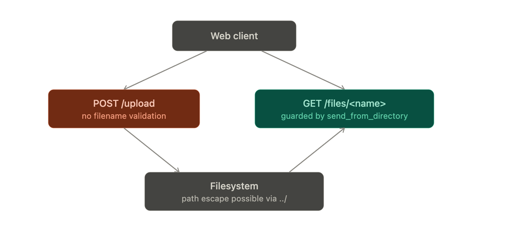

# Worksheet 1 — Security Mindset & Threat Modeling (3 hrs)

> **Course:** Software Security (KOSEN69) · **Week 1**
> **Aligned to:** OWASP 2025 A06 Insecure Design · CWE-501 (Trust Boundary Violation)
> **Signature game:** "Elevation of Privilege" (Microsoft STRIDE card deck)

> **Ethics note:** This week is *modeling only* — you analyze design, you do **not** attack the app. Run the sample app only on your own VM/localhost. Never apply these techniques to systems you do not own or lack written permission to test.

## Part 1 — Student Information
| Name | Student ID | Date | Group |
|Hathaichanok Yimjan|6631503045|15/8/2569|---|
| | | | |

## Part 2 — Lecture Questions
Answer in your own words (2–4 sentences each).
1. Define the CIA triad and give one concrete failure example for each of the three properties.
Answer = The CIA triad is a core security model that stands for Confidentiality, Integrity, and Availability. Confidentiality failure: the 2017 Equifax breach exposed sensitive personal information. Integrity failure: the 2020 SolarWinds attack modified legitimate software updates with malicious code. Availability failure: the 2016 Dyn DNS outage disrupted websites such as Twitter, Netflix, and Reddit.
2. What is a *trust boundary*, and why does data crossing one deserve extra scrutiny?
Answer = A trust boundary is a point where data moves between different levels of trust. Data crossing it needs extra scrutiny because it may come from an untrusted source.
3. Explain "attack surface." Name two things that increase it in a web app.
Answer = The attack surface is all the points where an attacker can try to enter or attack a web app. It increases with more APIs, login pages, file uploads, or third-party dependencies
4. What does each STRIDE letter map to, and which security property does each threat violate?
Answer = S = Spoofing → Authentication, T = Tampering → Integrity, R = Repudiation → Accountability. I = Information Disclosure → Confidentiality, D = Denial of Service → Availability, and E = Elevation of Privilege → Authorization.
5. What does "Secure by Design" (CISA) mean, and how does it differ from bolting security on after release?
Answer = Secure by Design means building security into a product from the beginning. It is different from adding security after release because security is considered during design and development, not only after problems are found.

## Part 3 — Hands-on Lab (180 min)
**Learning goals:** build a data-flow diagram (DFD), apply STRIDE to a real Flask app, rank risks, and propose mitigations.

**Prerequisites:** Docker + Docker Compose in your VM; a drawing tool (draw.io / paper + photo); the Elevation of Privilege deck (print or virtual) — free print-and-play PDF at [github.com/adamshostack/eop](https://github.com/adamshostack/eop).

**Environment setup**
```bash
cd labs/week01-threat-modeling
docker compose up --build           # starts sample-app on http://localhost:8080
curl -s -X POST localhost:8080/notes -H 'Content-Type: application/json' \
     -d '{"owner":"alice","body":"hello"}'   # observe behavior, do not attack
curl -s localhost:8080/notes

echo "demo file" > demo.txt
curl -s -X POST localhost:8080/upload -F "file=@demo.txt"   # observe behavior, do not attack
curl -s localhost:8080/files/demo.txt
```

Source to model lives in `sample-app/app.py`. Template to fill: `THREAT-MODEL-TEMPLATE.md` (copy it, do not edit the original).

**What to submit per task:** the threat/element identified + a screenshot (DFD, table, or running app) + a 2–3 sentence mitigation.

**Task 0 — Onboarding (5 min)** · *Goal:* prove the environment works. *Steps:* `docker compose up`, hit `/notes` and `/files/<name>`, read `sample-app/app.py`. *Deliverable:* screenshot of the running app + the JSON response.

**Task 1 — Draw the DFD (25 min)** · *Goal:* map the system. *Steps:* identify the external entity (web client), the process (Flask app), the data store (`notes.db` SQLite), the `uploads/` store, and the flows for `/notes`, `/upload`, `/files/<name>`; mark the Internet→app trust boundary with a dashed line. *Deliverable:* DFD image embedded in your copy of the template.

Answer = 

**Task 2 — STRIDE the elements (30 min)** · *Goal:* enumerate threats per element. *Steps:* for each element fill the S/T/R/I/D/E grid. Ground it in real code: `/notes` accepts a client-supplied `owner` with no auth (Spoofing); `/upload` saves raw `f.filename` — arbitrary-file-write (Tampering) — and echoes the resolved save path back in its response (Information disclosure); `/files/<name>` reads it back but is comparatively defended (see Task 5); no logging anywhere (Repudiation). *Deliverable:* completed STRIDE table.

**Task 3 — Elevation of Privilege game (20 min)** · *Goal:* find threats you missed. *Steps:* play the EoP deck against your DFD; each card you can tie to a real element/flow scores a point; record every valid threat. No printer or scissors? Draw from the digital deck below instead — same 78 cards, same rule. *Deliverable:* list of carded threats + score.
Ans = ## Task 3 — Elevation of Privilege Game

**Cards drawn: 3 · Tied to DFD: 1 · Passed: 2**

| # | Card (STRIDE) | Element / Flow | Result | Note |
|---|---|---|---|---|
| 1 | [R] Shared key used to authenticate as different principals, confusing logs | Web client → Flask app (`owner` field) | ✓ Tied | No literal shared key exists, but the unverified `owner` field is functionally equivalent — anyone can claim any identity. Worse than the card implies: there are no logs at all, so repudiation is total, not just "confusing." |
| 2 | [E] Attacker injects a command that runs at higher privilege | — | ✗ Pass | No command execution surface in app.py (no os.system/subprocess/eval), and SQL queries are parameterized. The app's real high-severity flaw is path traversal (Tampering), not command injection. |
| 3 | [I] Attacker sees error messages with security-sensitive content | — | ✗ Pass | Tested with malformed /notes and /upload requests — both returned generic Werkzeug 400 pages, no stack trace or internal paths. Confirms debug=False. Only the Server header leaks version info, a different threat category. |

**Score: 1/3**ส
```sim
eop-deck
```

**Task 3b — Systems-level pass (25 min) 🔭** · *Goal:* find what the per-element grid cannot see. Tasks 2 and 3 enumerate threats **one element at a time**, and that is exactly where threat models are known to stop short — students taught STRIDE alone reliably identify component threats and *discount system-level ones* ([Joshi et al., ASEE 2024](https://arxiv.org/abs/2404.16632)). So do a second pass over the **whole** diagram:


- **Trust boundaries end-to-end.** Follow one request from the client to `notes.db` and back. List every boundary it crosses. Which crossing has no check on it?
- **Assume one element is fully owned.** Pick the Flask process, then the `uploads/` store. For each: what does the attacker now *reach* — not what is it, but where does it get them?
- **Chain two "low" findings.** Find two threats you or the EoP deck rated minor that combine into something you would not accept. Write the chain as `A → B → consequence`.
- **One-line system claim.** Finish: "Even if every element-level mitigation in Task 8 is implemented, this system still fails if ___."

Use the simulation below before you start — toggle a component to attacker-controlled and watch what it reaches:
Ans = 1. Trust boundaries: the request crosses 2 boundaries — (1) internet → Flask app, (2) Flask app → notes.db. Neither has any check (no auth, no ownership filter).

2. Owned element:

Owning the Flask process → attacker reaches both notes.db and uploads/ fully (process holds the DB connection and filesystem permissions for both).
Owning uploads/ (via path traversal) → attacker can write outside the folder, potentially overwriting notes.db or even app.py if the process has write permission there.

3. Chain: Spoofing (owner field is unverified) → Information disclosure (/upload echoes the resolved save path) → combined: attacker impersonates any identity and learns the exact server path → turns a blind path-traversal guess into a precise, targeted arbitrary file write.

4. System claim: "...this system still fails if the fix trusts client-supplied input (identity, filenames) without a real server-side identity check — patching endpoint-by-endpoint doesn't remove the root cause."
```sim
trust-boundary
```

*Deliverable:* the boundary list, two owned-element reachability notes, one written chain, and the system claim.

**Task 4 — Abuse cases & attacker personas (20 min)** · *Goal:* think like specific adversaries. *Steps:* define 2 personas (e.g. a curious logged-in user; an anonymous internet attacker) and write 2 abuse cases each against the sample app, tied to DFD elements. *Deliverable:* 4 abuse cases.
Ans = Persona 1: Curious logged-in-ish user (regular user, no advanced skills)

1.1 — Opens GET /notes, sees everyone's notes since responses aren't filtered by owner → Information disclosure
1.2 — POSTs {"owner":"teacher", ...} to impersonate someone else and spread a fake message → Spoofing + Repudiation (no logs to trace who really sent it)

Persona 2: Anonymous internet attacker (no account, no privileges)

2.1 — Uploads a file with ../ in the filename to escape uploads/ and write elsewhere on disk → Tampering (ties into Task 5)
2.2 — Spams POST /notes with huge body payloads, no rate/size limit, to exhaust disk/CPU → Denial of Service

**Task 5 — Path-traversal deep-dive (25 min)** · *Goal:* analyze the riskiest flow. *Steps:* trace `/upload` → `/files/<name>`; explain how `../` in a filename escapes `uploads/`; sketch the secure design (`secure_filename`, store outside web root, allow-list extensions). *Deliverable:* the data flow + secure-design note.

Ans = 
**Task 6 — Threat-model the project target (30 min)** · *Goal:* kick off your term project. *Steps:* stop the sample-app first (`docker compose down` — both apps bind host port 8080), then run **NoteVault** (`cd ../../project/starter-app && docker compose up`), draw a quick DFD, and list the top 3 STRIDE threats you'd investigate. *Deliverable:* NoteVault DFD + top-3 threats (reuse these in your project report — `project/REPORT-TEMPLATE.md` in the repo root).

Ans = 

**Top 3 STRIDE threats to investigate:**

1. **Spoofing / Elevation of Privilege — JWT accepts `alg: none`**
   `jwt.decode(tok, SECRET, algorithms=["HS256", "none"])` allows unsigned tokens, letting anyone forge a token claiming `sub: "admin"` without knowing SECRET.

2. **Tampering / Elevation of Privilege — SQL injection via string formatting**
   `/login` and `/search` build SQL queries with `%` string formatting instead of parameterized queries, letting user input alter query structure.

3. **Tampering / Elevation of Privilege — Command injection via `/export`**
   `subprocess.run("echo exporting notes as " + fmt, shell=True, ...)` concatenates the client-supplied `fmt` parameter directly into a shell command.

**Task 7 — Security requirements (15 min)** · *Goal:* turn threats into testable requirements. *Steps:* write 3 security requirements as acceptance criteria ("the system must … so that …"), each mapped to a threat from Task 2 or Task 6. *Deliverable:* 3 testable security requirements.
Ans = 1. Mapped to: JWT alg: none bypass (Task 6, #1)

The system must reject any JWT whose header specifies alg: none or any algorithm not explicitly allow-listed, so that an attacker cannot forge a valid session token without knowing the signing secret.
Test: send a request with a cookie containing an unsigned/none-alg token claiming sub: "admin" — expect 401, not access.

2. Mapped to: SQL injection in /login and /search (Task 6, #2)

The system must use parameterized queries for all database access that includes user-supplied input, so that no input value can alter SQL query structure.
Test: submit a username/search term containing SQL metacharacters (e.g. a single quote) — expect the value to be treated as literal data, not query syntax, and the request to fail authentication/return zero results rather than erroring or bypassing logic.

3. Mapped to: Command injection in /export (Task 6, #3)

The system must never pass user-supplied input to a shell via shell=True (or equivalent), so that no client-controlled value can execute arbitrary OS commands.
Test: submit an fmt value containing a shell metacharacter (e.g. ;) — expect it to be rejected or treated as inert data, not executed.

**Task 8 — Defend / fix it: rank & mitigate (25 min) 🛡️** · *Goal:* turn threats into action you can prove. *Steps:* rank the top 5 threats by likelihood × impact; propose one concrete mitigation each (e.g., auth on `/notes`, `secure_filename()` + allowlist for `/upload`, request logging for Repudiation, size/rate limits for DoS). Then **pick one and actually implement it** in your fork.
Ans = 
| # | Threat | Likelihood | Impact | Mitigation |
|---|---|---|---|---|
| 1 | Path traversal in `/upload` (Tampering) | High | Critical — arbitrary file write, possible RCE | `secure_filename()` + allow-list extensions + store outside web root with generated (UUID) filenames |
| 2 | No auth on `/notes` (Spoofing) | High | High — impersonation, data integrity | Require auth token/session before accepting `owner` |
| 3 | `GET /notes` returns all rows to anyone (Information disclosure) | High | Medium-High — privacy leak | Filter query results by authenticated caller |
| 4 | No request logging anywhere (Repudiation) | High | Medium — blocks incident response | Add logging middleware (caller, timestamp, action) |
| 5 | No size/rate limits on `/notes`, `/upload` (Denial of Service) | Medium | Medium — resource exhaustion | Set `MAX_CONTENT_LENGTH` + basic rate limiting |


*Deliverable — the top-5 table, plus for the one you implemented:*
1. the **diff** (commit hash on your `wk01` branch),
2. **evidence it works**: the request that succeeded before your change and is refused after — both outputs,
3. **why it closes the class, not the instance** (2–3 sentences). `secure_filename()` on one endpoint is an instance fix; *"no user-supplied string ever becomes a path component"* is a class fix. Say which yours is, and if it's an instance fix, say what the class fix would be.

> **Why this is weighted.** Fewer than half of working developers can spot a security hole in code, and being shown vulnerabilities does not by itself teach you to find or close them. Exploiting is the half that feels like progress; defending is the half that transfers to your job.

## Part 4 — Reflection
1. Map your top finding to a CWE and to OWASP A06 (Insecure Design); explain the mapping in one sentence.
Ans = Our top finding is path traversal in the /upload endpoint. It can be mapped to CWE-22: Improper Limitation of a Pathname to a Restricted Directory because the application does not properly restrict the uploaded filename to the intended uploads/ directory. This also relates to OWASP A06: Insecure Design because the system design trusts client-controlled filename input without applying a secure file-storage design.
2. Name one real-world breach caused by a design flaw (not a missing patch) and what design control would have prevented it.
Ans = A real-world example is the 2017 Equifax breach, where a vulnerability in a public-facing system contributed to the exposure of sensitive personal information. A stronger security design process, including continuous asset inventory, vulnerability management, and security testing of internet-facing systems, could have reduced the risk.
3. Of your five mitigations, which gives the most risk reduction per unit of effort, and why?
Ans = The mitigation that gives the most risk reduction per unit of effort is adding authentication and server-side identity checks to /notes. The current application trusts the client-supplied owner field, so an attacker can claim another user's identity. Requiring authentication and deriving the owner from the authenticated session prevents this class of spoofing and improves data integrity with relatively little implementation effort.

## Grading rubric (100)
| Criterion | Points |
|---|---|
| Lecture questions (Part 2) | 20 |
| Exploitation + evidence (DFD + STRIDE table + EoP findings + screenshots) | 40 |
| Defense (top-5 ranking + mitigations) | 25 |
| Reflection (CWE/OWASP mapping + breach + best mitigation) | 15 |

**Assessed within the rows above** (they are not extra points — they are what those points are for):
- **Systems-level reasoning** (inside *Exploitation + evidence*, Task 3b): does the model reach past single elements to boundaries, reachability and chains? Scored with the STRIDE + systems-thinking rubrics of [Joshi et al. 2024](https://arxiv.org/abs/2404.16632).
- **Defensive proof** (inside *Defense*, Task 8): a claimed mitigation with no before/after evidence scores at most half. A mitigation you can show closing a *class* scores full.
- **Adversarial thinking** (across the whole sheet): do the abuse cases, personas and chains show you reasoning as an attacker with goals and constraints — or just listing categories? This is the course's central disposition and it is assessed, not assumed.

---

## Evidence & Integrity (required)

- **Identity proof:** every screenshot/diagram must show a terminal running `printf '%s | %s | ' "$(whoami)" '<YOUR-STUDENT-ID>'; date '+%F %T %Z'` **in the
  same image as the evidence**. When the evidence is a browser page, a DevTools panel or a
  rendered response, put that terminal **beside the browser and capture the whole screen** — a
  cropped window carries nothing that identifies you, and the lab's own output is
  byte-identical for the whole cohort *by design*, so the stamp is the only thing that makes
  the shot yours. Generic or borrowed evidence is not accepted.
- **Personalized flag (if this lab issues one):** ____________________
  *Flags are unique per student — submitting another student's flag is a violation. How to submit: **learn.zcr.ai/submit** (full guide: `SUBMISSION.md` in the repo root).*
- **Explain in your own words** *(graded on your reasoning, not copied text):*
  1. What did you do, and **why did the vulnerability work**?
  2. **Why does your fix actually stop it** — and what could still break it?

---

## 🤖 Audit the AI (required)

AI is a power tool you must **distrust** — you are graded on your *critique*, not the AI's answer.

1. Ask an AI assistant to exploit **or** fix this week's vulnerability. Paste its full answer.
2. **Find what's wrong or risky** in it — insecure code, a subtly incomplete fix, a hallucinated API/function/CVE, a missed edge case, or wrong reasoning. Quote the exact line(s).
3. Produce the **correct, verified** version yourself and explain in 2–3 sentences why the AI's output was insufficient.

> Disclose your AI use in the Part 1 table. This task counts toward your **Defense + Reflection** score.

---

## 🧠 Comprehension & Prompt (required)

**A. Explain in Plain English (EiPE).** In 2–3 sentences, in your own words, describe what this week's vulnerable code/endpoint actually *does* and *why it is exploitable* — explain the mechanism, don't dump jargon.

**B. Prompt Problem.** Write a **single prompt** that makes an AI produce a *correct, secure* fix for one finding. Run it: does the exploit now fail? If not, refine the prompt and try again. Submit the **final prompt + the verified result**.
*Graded on the prompt's precision and your verification — this trains problem decomposition and AI literacy (Denny et al. 2024).*
