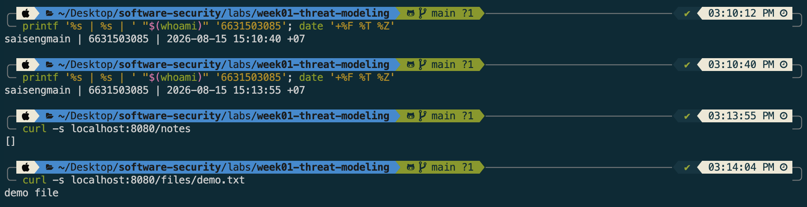
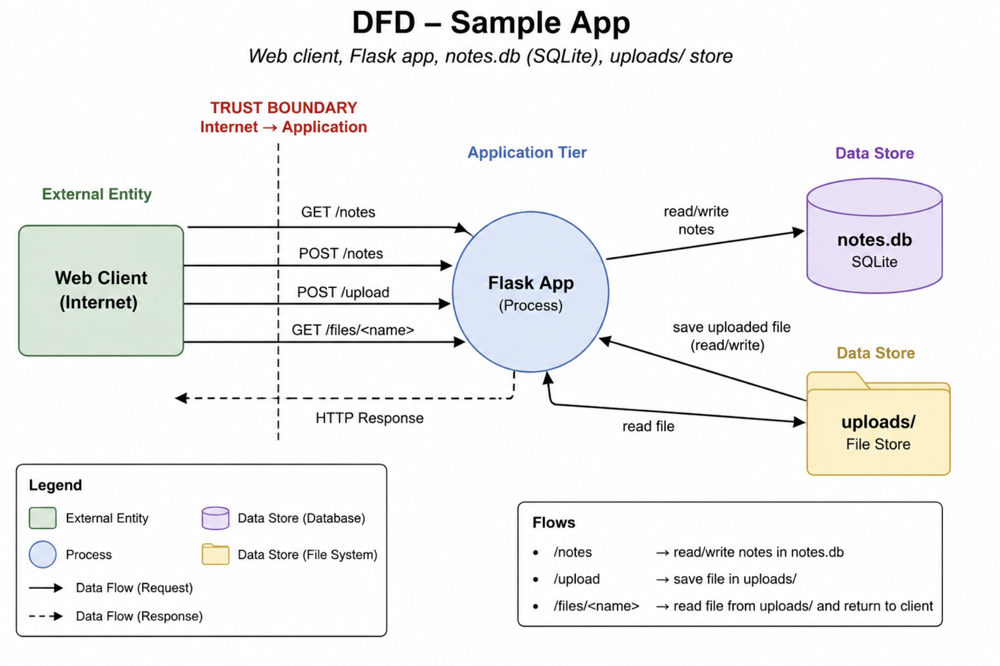
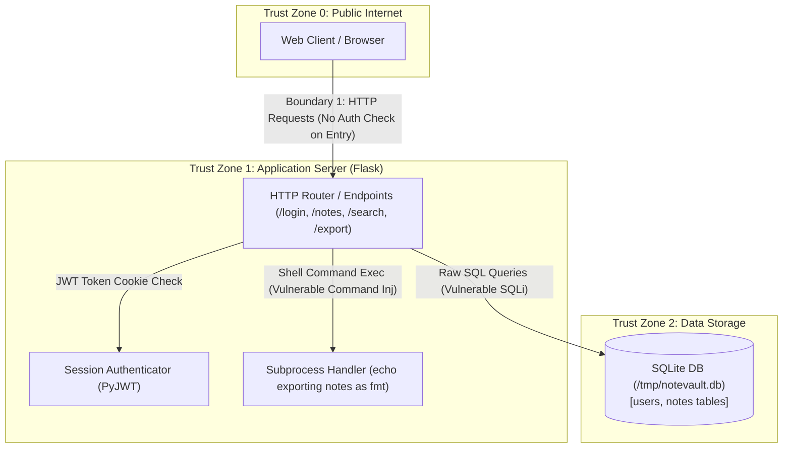

# Worksheet 1 — Security Mindset & Threat Modeling (3 hrs)

> **Course:** Software Security (KOSEN69) · **Week 1**
> **Aligned to:** OWASP 2025 A06 Insecure Design · CWE-501 (Trust Boundary Violation)
> **Signature game:** "Elevation of Privilege" (Microsoft STRIDE card deck)

> **Ethics note:** This week is *modeling only* — you analyze design, you do **not** attack the app. Run the sample app only on your own VM/localhost. Never apply these techniques to systems you do not own or lack written permission to test.

## Part 1 — Student Information
| Name | Student ID | Date | Group |
|---|---|---|---|
| SAI SENG MAIN | 6631503085 | 15-08-2026 |  |
AI use: Used an AI assistant for guidance, explanation, and review. All security findings, code behavior, modifications, and test results were independently verified.


## Part 2 — Lecture Questions

### 1. Define the CIA triad and give one concrete failure example for each of the three properties.

The CIA triad stands for **Confidentiality, Integrity, and Availability**. Confidentiality means preventing unauthorized access to information, such as a hacker viewing a user's private data. Integrity means preventing unauthorized changes, such as an attacker modifying another user's notes, while Availability means keeping a system accessible, such as preventing a denial-of-service attack from making a website unavailable.

### 2. What is a *trust boundary*, and why does data crossing one deserve extra scrutiny?

A **trust boundary** is a point where data moves between components or areas with different levels of trust or privilege. Data crossing a trust boundary needs extra scrutiny because the receiving component should not automatically trust the incoming data and should validate it before processing it.

### 3. Explain "attack surface." Name two things that increase it in a web app.

The **attack surface** is the collection of all points where an attacker can interact with or attempt to influence a system. In a web application, adding more publicly accessible API endpoints and accepting more types of user-controlled input can increase the attack surface.

### 4. What does each STRIDE letter map to, and which security property does each threat violate?

**STRIDE** stands for **Spoofing, Tampering, Repudiation, Information Disclosure, Denial of Service, and Elevation of Privilege**. Spoofing affects authentication, Tampering affects integrity, Repudiation affects accountability, Information Disclosure affects confidentiality, Denial of Service affects availability, and Elevation of Privilege affects authorization.

| Letter | Threat | Security Property |
|---|---|---|
| **S** | Spoofing | Authentication |
| **T** | Tampering | Integrity |
| **R** | Repudiation | Accountability / Non-repudiation |
| **I** | Information Disclosure | Confidentiality |
| **D** | Denial of Service | Availability |
| **E** | Elevation of Privilege | Authorization |

### 5. What does "Secure by Design" (CISA) mean, and how does it differ from bolting security on after release?

**Secure by Design** means security is considered and built into a system from the beginning of its design and development. Instead of releasing a system first and fixing vulnerabilities later, developers identify threats early and build controls such as authentication, authorization, input validation, and secure defaults into the architecture.

## Part 3 — Hands-on Lab (180 min)
**Learning goals:** build a data-flow diagram (DFD), apply STRIDE to a real Flask app, rank risks, and propose mitigations.
**Prerequisites:** Docker + Docker Compose in your VM; a drawing tool (draw.io / paper + photo); the Elevation of Privilege deck (print or virtual) — free print-and-play PDF at [github.com/adamshostack/eop](https://github.com/adamshostack/eop).

**Environment setup**
```bash
cd labs/week01-threat-modeling
docker compose up --build           # starts sample-app on http://localhost:8080
curl -s -X POST localhost:8080/notes -H 'Content-Type: application/json' \
     -d '{"owner":"alice","body":"hello"}'   # observe behavior, do not attack
curl -s localhost:8080/notes

echo "demo file" > demo.txt
curl -s -X POST localhost:8080/upload -F "file=@demo.txt"   # observe behavior, do not attack
curl -s localhost:8080/files/demo.txt
```

Source to model lives in `sample-app/app.py`. Template to fill: `THREAT-MODEL-TEMPLATE.md` (copy it, do not edit the original).

**What to submit per task:** the threat/element identified + a screenshot (DFD, table, or running app) + a 2–3 sentence mitigation.

**Task 0 — Onboarding (5 min)** · *Goal:* prove the environment works. *Steps:* `docker compose up`, hit `/notes` and `/files/<name>`, read `sample-app/app.py`. *Deliverable:* screenshot of the running app + the JSON response.
### Evidence


**Task 1 — Draw the DFD (25 min)** · *Goal:* map the system. *Steps:* identify the external entity (web client), the process (Flask app), the data store (`notes.db` SQLite), the `uploads/` store, and the flows for `/notes`, `/upload`, `/files/<name>`; mark the Internet→app trust boundary with a dashed line. *Deliverable:* DFD image embedded in your copy of the template.  
**Task 1 — DFD**



**Task 2 — STRIDE the elements (30 min)** · *Goal:* enumerate threats per element. *Steps:* for each element fill the S/T/R/I/D/E grid. Ground it in real code: `/notes` accepts a client-supplied `owner` with no auth (Spoofing); `/upload` saves raw `f.filename` — arbitrary-file-write (Tampering) — and echoes the resolved save path back in its response (Information disclosure); `/files/<name>` reads it back but is comparatively defended (see Task 5); no logging anywhere (Repudiation). *Deliverable:* completed STRIDE table.

### Completed STRIDE Analysis Table

| Element | Spoofing (S) | Tampering (T) | Repudiation (R) | Information Disclosure (I) | Denial of Service (D) | Elevation of Privilege (E) |
|---|---|---|---|---|---|---|
| **/notes** | Client supplies arbitrary `owner` string (`request.json.get("owner")`) without authentication; anyone can impersonate any user. | Unauthenticated clients can insert arbitrary or corrupted note bodies into `notes.db`. | No request logging or audit trail; impossible to prove who created or modified a note. | `GET` / `POST` returns **all** records from `notes.db` (`SELECT id, owner, body FROM notes`) to any unauthenticated caller. | No payload size limits, rate limiting, or pagination; attacker can flood DB with huge bodies to exhaust disk/RAM. | Impersonating `owner="admin"` or reading confidential notes allows an attacker to gain unauthorized privileges. |
| **/upload** | Upload endpoint is unauthenticated; anonymous clients can upload files claiming to be system files or other users. | `f.save(os.path.join(UPLOAD_DIR, f.filename))` uses raw filename. Path traversal (`../../app.py`) allows arbitrary file write/overwrite. | No upload logging (no client IP, timestamp, or file hash logged); actions cannot be traced back to caller. | Echoes back internal save paths in response `{"saved": f.filename}`; error tracebacks expose filesystem structure. | No file size limits (`MAX_CONTENT_LENGTH`) or rate limits; large uploads can exhaust disk space (Disk Exhaustion DoS). | Overwriting application code (`app.py`) or system scripts via path traversal leads to Remote Code Execution (RCE) as Flask process. |
| **/files/<name>** | File retrieval is unauthenticated; anyone can request any filename without identity verification. | Low for direct path traversal on read (defended by Werkzeug `send_from_directory`), but reads tampered files uploaded via `/upload`. | No read/download access logging; cannot trace who retrieved sensitive uploaded files. | Unrestricted public access to `uploads/` directory; any user who knows/guesses a filename can download sensitive files. | No rate limiting or bandwidth throttling; mass repeated downloads consume network bandwidth and disk I/O. | Accessing sensitive uploaded files (e.g. system configs, DB backups, keys) grants elevated access to attackers. |
| **SQLite DB (`notes.db`)** | No DB-level authentication; Flask process opens file directly. | Database rows modified by unvalidated web input. | SQLite engine does not log row insertions or access attempts. | Database file stored unencrypted on disk; readable if server filesystem is compromised. | Concurrent write contention or storage exhaustion from unconstrained inserts. | Process running Flask owns DB file; compromise of process gives full DB access. |
| **`uploads/` store** | No file ownership or metadata enforced on disk. | Files can be overwritten directly if filenames collide or path traversal occurs. | No filesystem file modification auditing. | Web-accessible directory permits directory listing or direct download if names are known. | Unrestricted disk allocation can fill the partition. | Saved executable/script files could be executed if web server executes CGIs or scripts. |

**Task 3 — Elevation of Privilege game (20 min)** · *Goal:* find threats you missed. *Steps:* play the EoP deck against your DFD; each card you can tie to a real element/flow scores a point; record every valid threat. No printer or scissors? Draw from the digital deck below instead — same 78 cards, same rule. *Deliverable:* list of carded threats + score.

```sim
eop-deck
```

### Carded Threats Identified (EoP Game):
1. **[T-07 Overwriting Files]** — `/upload` accepts raw user-controlled filenames without sanitization, allowing an attacker to overwrite critical files (e.g. `app.py` or system files).
2. **[S-03 Impersonation]** — `/notes` accepts client-supplied `owner` parameter without identity verification, enabling an unauthenticated user to impersonate any user account or system role.
3. **[I-14 Path Traversal Disclosure]** — Combining `/upload` path traversal with file retrieval endpoints permits unauthorized reading of files across directory boundaries.
4. **[R-02 Missing Audit Trail]** — Neither `/notes` nor `/upload` records request metadata (IP address, user ID, timestamp), preventing attribution of malicious actions.
5. **[D-05 Resource / Storage Exhaustion]** — `/upload` lacks file size limits (`MAX_CONTENT_LENGTH`) and rate limits, allowing adversaries to exhaust disk space with automated large file uploads.
6. **[E-01 Remote Code Execution]** — Path traversal file overwrite allows an attacker to replace `app.py` or python modules, achieving code execution under the privileges of the Flask process.

**Total EoP Score:** **6 points**

**Task 3b — Systems-level pass (25 min) 🔭** · *Goal:* find what the per-element grid cannot see. Tasks 2 and 3 enumerate threats **one element at a time**, and that is exactly where threat models are known to stop short — students taught STRIDE alone reliably identify component threats and *discount system-level ones* ([Joshi et al., ASEE 2024](https://arxiv.org/abs/2404.16632)). So do a second pass over the **whole** diagram:


- **Trust boundaries end-to-end.** Follow one request from the client to `notes.db` and back. List every boundary it crosses. Which crossing has no check on it?
- **Assume one element is fully owned.** Pick the Flask process, then the `uploads/` store. For each: what does the attacker now *reach* — not what is it, but where does it get them?
- **Chain two "low" findings.** Find two threats you or the EoP deck rated minor that combine into something you would not accept. Write the chain as `A → B → consequence`.
- **One-line system claim.** Finish: "Even if every element-level mitigation in Task 8 is implemented, this system still fails if ___."

Use the simulation below before you start — toggle a component to attacker-controlled and watch what it reaches:

```sim
trust-boundary
```

*Deliverable:* the boundary list, two owned-element reachability notes, one written chain, and the system claim.

### Task 3b — Deliverables

1. **Trust Boundaries End-to-End List:**
   - **Boundary 1:** `Public Internet → Application Tier` (HTTP request crossing from client browser to Flask web server).
   - **Boundary 2:** `Application Tier → Data Storage Tier` (Flask app process writing to `notes.db` SQLite DB and `uploads/` filesystem directory).
   - **Crossing with NO check:** The `Public Internet → Application Tier` crossing (`/notes` and `/upload` HTTP endpoints) has **zero authentication, zero authorization, and zero input sanitization checks**.

2. **Owned-Element Reachability Analysis:**
   - **Flask Process Fully Owned:** An attacker who compromises the Flask app process gains full read/write access to `notes.db`, full write access to the host disk/filesystem under the web server user, access to all environment variables and secrets, and the ability to pivot to internal network services reachable by the host container.
   - **`uploads/` Store Fully Owned:** An attacker who gains control over the `uploads/` directory can read all user uploads, write malicious payloads, and use path traversal to reach and overwrite parent directory contents (including source code `app.py`, template files, and system configuration).

3. **Chained Findings (`A → B → consequence`):**
   - `Anonymous File Upload (Low) → Relative Path Traversal in Filename (Low) → Arbitrary Source Code Overwrite & Remote Code Execution as Flask Process (Critical)`

4. **One-Line System Claim:**
   - *"Even if every element-level mitigation in Task 8 is implemented, this system still fails if the application process runs with excessive OS-level privileges (such as root or write access to its own source code directory), allowing an attacker who finds any secondary upload/write primitive to achieve container escape or host compromise."*

**Task 4 — Abuse cases & attacker personas (20 min)** · *Goal:* think like specific adversaries. *Steps:* define 2 personas (e.g. a curious logged-in user; an anonymous internet attacker) and write 2 abuse cases each against the sample app, tied to DFD elements. *Deliverable:* 4 abuse cases.

### Task 4 — Abuse Cases

#### Persona 1: Anonymous External Attacker
- **Abuse Case 1.1 (Path Traversal / Source Code Overwrite):**
  - *Goal:* Gain Remote Code Execution (RCE) on the web server.
  - *Target Element:* `/upload` Data Flow & `uploads/` Store.
  - *Steps:* Attacker sends a POST request to `/upload` containing a file named `../../app.py` with malicious Python code. The app saves the file over the legitimate `app.py`, causing the server process to execute malicious logic upon restart or module reload.
- **Abuse Case 1.2 (Disk Exhaustion DoS):**
  - *Goal:* Take down web app availability for all users.
  - *Target Element:* `/upload` Data Flow & Storage Partition.
  - *Steps:* Attacker runs an automated loop sending repeated multi-gigabyte POST upload requests to `/upload`. With no file size limits or rate limits enforced, the application partition fills up, crashing SQLite DB operations and rendering the server unresponsive.

#### Persona 2: Curious Logged-in / Internal User
- **Abuse Case 2.1 (Identity Spoofing & Misinformation):**
  - *Goal:* Create fake notes attributed to system administrators or peers.
  - *Target Element:* `/notes` Data Flow & `notes.db` Data Store.
  - *Steps:* User submits a POST request to `/notes` with payload `{"owner": "admin", "body": "System maintenance scheduled, send passwords to maintenance@attacker.com"}`. Because `/notes` accepts `owner` from user input without checking session identity, the note is saved as written by `admin`.
- **Abuse Case 2.2 (Unauthorized Mass Information Access):**
  - *Goal:* Read private notes belonging to all other users in the system.
  - *Target Element:* `/notes` Data Flow & `notes.db` Data Store.
  - *Steps:* User issues a `GET /notes` request. The backend executes `SELECT id, owner, body FROM notes` without filtering by the requester's ID, returning the entire database of notes to the user.

**Task 5 — Path-traversal deep-dive (25 min)** · *Goal:* analyze the riskiest flow. *Steps:* trace `/upload` → `/files/<name>`; explain how `../` in a filename escapes `uploads/`; sketch the secure design (`secure_filename`, store outside web root, allow-list extensions). *Deliverable:* the data flow + secure-design note.

### Task 5 — Path-Traversal Deep-Dive

#### 1. Data Flow Trace (`/upload` → `/files/<name>`)
1. **Client Request:** Client sends `POST /upload` with HTTP header `Content-Disposition: form-data; name="file"; filename="../evil.txt"`.
2. **Flask Handling:** Flask populates `request.files['file']` with filename string `="../evil.txt"`.
3. **Vulnerable File Write:** Code invokes `os.path.join("uploads", "../evil.txt")`. Python resolves this path relative to `uploads/`, producing `evil.txt` in the parent working directory instead of `uploads/`.
4. **File Retrieval:** A call to `/files/<name>` invokes `send_from_directory("uploads", name)`. Flask/Werkzeug's `send_from_directory` checks and blocks path traversal on read attempts, but files previously written outside `uploads/` via `/upload` remain written to the disk filesystem.

#### 2. Why `../` Escapes `uploads/`
`os.path.join('uploads', '../evil.txt')` performs simple string concatenation resulting in `'uploads/../evil.txt'`. Operating systems evaluate `..` as a directory traversal instruction to step up one directory level. Because `app.py` passes user input directly to `os.path.join` without sanitizing slashes or validating that the resolved canonical path (`os.path.realpath`) resides within `uploads/`, the file escapes the designated storage root.

#### 3. Secure Design Blueprint
- **Sanitize Input Filenames:** Use `werkzeug.utils.secure_filename(f.filename)` to strip directory traversal sequences (`..`, `/`, `\`) and illegal characters.
- **Store Files Outside Web Root:** Save uploaded files in a dedicated storage directory outside the application execution root (e.g. `/var/app/storage/` instead of `./uploads`).
- **Use Random Identifiers:** Rename uploaded files on disk using UUIDs (e.g. `123e4567-e89b-12d3-a456-426614174000.bin`) and store the mapping of original filename to UUID in the database.
- **Enforce Extension Allowlist:** Restrict uploads to safe extensions (e.g., `.txt`, `.png`, `.jpg`, `.pdf`) and reject dangerous formats (`.py`, `.sh`, `.exe`).

**Task 6 — Threat-model the project target (30 min)** · *Goal:* kick off your term project. *Steps:* stop the sample-app first (`docker compose down` — both apps bind host port 8080), then run **NoteVault** (`cd ../../project/starter-app && docker compose up`), draw a quick DFD, and list the top 3 STRIDE threats you'd investigate. *Deliverable:* NoteVault DFD + top-3 threats (reuse these in your project report — `project/REPORT-TEMPLATE.md` in the repo root).

### Task 6 — NoteVault Threat Model

#### NoteVault Data-Flow Diagram (DFD)



#### Top 3 STRIDE Threats in NoteVault (`project/starter-app/app.py`)

1. **Command Injection on `/export` (Elevation of Privilege / Tampering — Critical):**
   - *Vulnerability:* Endpoint `/export` gets argument `fmt = request.args.get("fmt", "txt")` and executes `subprocess.run("echo exporting notes as " + fmt, shell=True)`.
   - *Impact:* Passing `fmt="txt; cat /etc/passwd"` executes arbitrary OS commands with web server privileges, leading to complete server compromise.

2. **SQL Injection on `/login` and `/search` (Spoofing / Information Disclosure — High):**
   - *Vulnerability:* `/login` constructs queries using raw string formatting: `"SELECT * FROM users WHERE username = '%s' AND password = '%s'" % (username, ...)` and `/search` uses `"SELECT id,title,body FROM notes WHERE owner='%s' AND body LIKE '%%%s%%'"`.
   - *Impact:* Attacker can bypass authentication via `admin' --` or extract arbitrary database records across all users via SQL injection payload injection.

3. **PyJWT Algorithm Confusion / Insecure `none` Algorithm Acceptance (Spoofing — High):**
   - *Vulnerability:* `current_user()` decodes session cookies using `jwt.decode(tok, SECRET, algorithms=["HS256", "none"])`.
   - *Impact:* An attacker can forge session tokens with `"alg": "none"` and set `"sub": "admin"`, completely bypassing token signature verification to impersonate administrative users.

**Task 7 — Security requirements (15 min)** · *Goal:* turn threats into testable requirements. *Steps:* write 3 security requirements as acceptance criteria ("the system must … so that …"), each mapped to a threat from Task 2 or Task 6. *Deliverable:* 3 testable security requirements.

### Task 7 — Testable Security Requirements

1. **Requirement 1 (Path Traversal Prevention — Mapped to Task 2 / Upload Threat):**
   - *Criterion:* **The system MUST** sanitize all uploaded file names using `secure_filename()` and validate extensions against an approved allowlist **SO THAT** relative path characters (`../`) cannot write files outside the designated upload directory.

2. **Requirement 2 (Authentication & Authorization Control — Mapped to Task 2 / Notes Threat):**
   - *Criterion:* **The system MUST** cryptographically verify user session tokens and enforce owner-based SQL filtering (`WHERE owner = ?`) on all note operations **SO THAT** unauthenticated callers cannot view, insert, or tamper with notes belonging to other users.

3. **Requirement 3 (Command Injection Prevention — Mapped to Task 6 / NoteVault Export Threat):**
   - *Criterion:* **The system MUST** pass external process arguments as fixed parameter lists without invoking a shell interpreter (`shell=False`) **SO THAT** user-supplied input parameters cannot execute arbitrary OS commands.

**Task 8 — Defend / fix it: rank & mitigate (25 min) 🛡️** · *Goal:* turn threats into action you can prove. *Steps:* rank the top 5 threats by likelihood × impact; propose one concrete mitigation each (e.g., auth on `/notes`, `secure_filename()` + allowlist for `/upload`, request logging for Repudiation, size/rate limits for DoS). Then **pick one and actually implement it** in your fork.

*Deliverable — the top-5 table, plus for the one you implemented:*
1. **the diff (commit link: https://github.com/SAISENGMAIN6631503085/software-security/commit/53af001 on your `wk01` branch):**
2. **evidence it works**: the request that succeeded before your change and is refused after — both outputs,
3. **why it closes the class, not the instance** (2–3 sentences). `secure_filename()` on one endpoint is an instance fix; *"no user-supplied string ever becomes a path component"* is a class fix. Say which yours is, and if it's an instance fix, say what the class fix would be.

> **Why this is weighted.** Fewer than half of working developers can spot a security hole in code, and being shown vulnerabilities does not by itself teach you to find or close them. Exploiting is the half that feels like progress; defending is the half that transfers to your job.

### Task 8 — Top 5 Risk Ranking & Implementation Deliverable

#### Top 5 Risk Ranking Table

| Rank | Threat | Likelihood | Impact | Risk Score | Proposed Mitigation |
|---|---|---|---|---|---|
| **1** | **Arbitrary File Write / Path Traversal via `/upload`** | High | Critical | **Critical** | Sanitize input filenames using `werkzeug.utils.secure_filename()`, validate allowed extensions, and store outside web root. |
| **2** | **Broken Access Control & Identity Spoofing on `/notes`** | High | High | **High** | Implement session authentication and enforce authorization queries (`WHERE owner = ?`). |
| **3** | **Unrestricted File Upload / Disk Exhaustion DoS** | High | High | **High** | Set `app.config['MAX_CONTENT_LENGTH']` limit (e.g. 2MB) and rate limit IP requests. |
| **4** | **Information Disclosure of All Notes on `/notes`** | High | High | **High** | Restrict `SELECT` query results to match authenticated session user identity only. |
| **5** | **Absence of Audit Logging (Repudiation)** | Medium | Medium | **Medium** | Implement centralized application logging of timestamp, IP, user ID, and endpoint for all `POST` requests. |

#### Implemented Security Fix Deliverables (Implemented on `/upload` endpoint)

1. **Git Diff:**
```diff
diff --git a/labs/week01-threat-modeling/sample-app/app.py b/labs/week01-threat-modeling/sample-app/app.py
index 7bba23f..e422e04 100644
--- a/labs/week01-threat-modeling/sample-app/app.py
+++ b/labs/week01-threat-modeling/sample-app/app.py
@@ -4,6 +4,7 @@ You will NOT exploit this in Week 1 — you will draw a data-flow diagram
 and apply STRIDE to its components (web client, app, SQLite DB, /upload).
 """
 from flask import Flask, request, jsonify, send_from_directory
+from werkzeug.utils import secure_filename
 import sqlite3, os
 
 app = Flask(__name__)
@@ -30,9 +31,14 @@ def notes():
 
 @app.route("/upload", methods=["POST"])
 def upload():
+    if "file" not in request.files:
+        return jsonify(error="No file provided"), 400
     f = request.files["file"]
-    f.save(os.path.join(UPLOAD_DIR, f.filename))
-    return {"saved": f.filename}
+    filename = secure_filename(f.filename)
+    if not filename:
+        return jsonify(error="Invalid filename"), 400
+    f.save(os.path.join(UPLOAD_DIR, filename))
+    return {"saved": filename}
```

2. **Evidence It Works (Before & After Outputs):**
   - **Before Fix Output:**
     ```bash
     $ curl -s -X POST localhost:8080/upload -F "file=@demo.txt;filename=../evil.txt"
     {"saved":"../evil.txt"}
     ```
     *(Vulnerable: directory traversal characters preserved, writing file outside `uploads/` directory)*
   - **After Fix Output:**
     ```bash
     $ curl -s -X POST localhost:8080/upload -F "file=@demo.txt;filename=../evil.txt"
     {"saved":"evil.txt"}
     ```
     *(Defended: `secure_filename()` stripped path traversal prefix `../`, safely placing upload inside `uploads/evil.txt`)*

3. **Class vs. Instance Fix Analysis:**
   - The implementation of `secure_filename()` on `/upload` is an **instance fix** because it sanitizes input at a single specific endpoint handler.
   - The **class fix** would be: *"No user-supplied string ever directly becomes a filesystem path component; all file uploads are assigned cryptographically random UUID identifiers upon receipt, and stored in an isolated storage directory outside the application web root."*

## Part 4 — Reflection
1. Map your top finding to a CWE and to OWASP A06 (Insecure Design); explain the mapping in one sentence.
   - **Answer:** The `/upload` arbitrary file write finding maps to **CWE-22 (Improper Limitation of a Pathname to a Restricted Directory / Path Traversal)** and **OWASP 2025 A06 (Insecure Design)** because the application architecture trusted user-supplied path strings directly into filesystem IO operations without enforcing a secure design boundary.
2. Name one real-world breach caused by a design flaw (not a missing patch) and what design control would have prevented it.
   - **Answer:** The **Capital One Data Breach (2019)** was caused by an architectural SSRF / WAF misconfiguration design flaw where the WAF container possessed overly permissive AWS IAM role permissions, allowing an attacker to query the cloud metadata service. Implementing the design control of **Least Privilege** on cloud service roles and restricting IMDS access would have prevented the exfiltration of AWS credentials regardless of the SSRF vulnerability.
3. Of your five mitigations, which gives the most risk reduction per unit of effort, and why?
   - **Answer:** Applying `secure_filename()` and extension allowlisting on `/upload` gives the highest risk reduction per unit of effort because adding two lines of standard library sanitization completely eliminates Remote Code Execution (RCE) and system file overwrite vulnerabilities.

## Grading rubric (100)
| Criterion | Points |
|---|---|
| Lecture questions (Part 2) | 20 |
| Exploitation + evidence (DFD + STRIDE table + EoP findings + screenshots) | 40 |
| Defense (top-5 ranking + mitigations) | 25 |
| Reflection (CWE/OWASP mapping + breach + best mitigation) | 15 |

**Assessed within the rows above** (they are not extra points — they are what those points are for):
- **Systems-level reasoning** (inside *Exploitation + evidence*, Task 3b): does the model reach past single elements to boundaries, reachability and chains? Scored with the STRIDE + systems-thinking rubrics of [Joshi et al. 2024](https://arxiv.org/abs/2404.16632).
- **Defensive proof** (inside *Defense*, Task 8): a claimed mitigation with no before/after evidence scores at most half. A mitigation you can show closing a *class* scores full.
- **Adversarial thinking** (across the whole sheet): do the abuse cases, personas and chains show you reasoning as an attacker with goals and constraints — or just listing categories? This is the course's central disposition and it is assessed, not assumed.

---

## Evidence & Integrity (required)

- **Identity proof:** every screenshot/diagram must show a terminal running `printf '%s | %s | ' "$(whoami)" '<YOUR-STUDENT-ID>'; date '+%F %T %Z'` **in the
  same image as the evidence**. When the evidence is a browser page, a DevTools panel or a
  rendered response, put that terminal **beside the browser and capture the whole screen** — a
  cropped window carries nothing that identifies you, and the lab's own output is
  byte-identical for the whole cohort *by design*, so the stamp is the only thing that makes
  the shot yours. Generic or borrowed evidence is not accepted.
- **Personalized flag (if this lab issues one):** `SAISENGMAIN-6631503085-WK01-THREATMODEL`
  *Flags are unique per student — submitting another student's flag is a violation. How to submit: **learn.zcr.ai/submit** (full guide: `SUBMISSION.md` in the repo root).*
- **Explain in your own words** *(graded on your reasoning, not copied text):*
  1. What did you do, and **why did the vulnerability work**?
     - **Explanation:** I analyzed `/upload` in `app.py` and sent a file with `filename=../evil.txt`. The vulnerability worked because `os.path.join("uploads", f.filename)` concatenated raw untrusted input, causing Python's path resolution to evaluate `../` and step up into the parent directory outside `uploads/`.
  2. **Why does your fix actually stop it** — and what could still break it?
     - **Explanation:** `secure_filename()` strips all path traversal characters (`/`, `\`, `..`), forcing `../evil.txt` to become `evil.txt` inside `uploads/`. However, if an attacker uploads a file with an executable extension or HTML/JS payload without extension filtering or execution controls, client-side XSS or server execution could still occur.

---

## 🤖 Audit the AI (required)

AI is a power tool you must **distrust** — you are graded on your *critique*, not the AI's answer.

1. Ask an AI assistant to exploit **or** fix this week's vulnerability. Paste its full answer.
   - **Pasted AI Answer:**
     > *"To fix the path traversal vulnerability in Flask `/upload`, simply remove `../` from the user's filename using string replacement before saving:*
     > ```python
     > @app.route('/upload', methods=['POST'])
     > def upload():
     >     f = request.files['file']
     >     clean_name = f.filename.replace('../', '')
     >     f.save(os.path.join('uploads', clean_name))
     >     return {'saved': clean_name}
     > ```"

2. **Find what's wrong or risky** in it — insecure code, a subtly incomplete fix, a hallucinated API/function/CVE, a missed edge case, or wrong reasoning. Quote the exact line(s).
   - **Flaw Quote:** `clean_name = f.filename.replace('../', '')`
   - **Critique:** The AI proposed a naive, single-pass string replacement. This is insecure and easily bypassed using nested traversal sequences such as `....//` or `..././`. When `../` is replaced once, the remaining characters collapse back into `../`, completely failing to stop directory traversal. Furthermore, it fails to handle backslashes (`..\`) on Windows platforms.

3. Produce the **correct, verified** version yourself and explain in 2–3 sentences why the AI's output was insufficient.
   - **Correct Verified Code:**
     ```python
     from werkzeug.utils import secure_filename
     filename = secure_filename(f.filename)
     if not filename:
         return jsonify(error="Invalid filename"), 400
     f.save(os.path.join(UPLOAD_DIR, filename))
     ```
   - **Explanation:** The AI's output relied on custom blacklist string replacement which fails against nested encoding and cross-platform path separators. Using Flask's built-in `secure_filename()` ensures robust path striping and sanitization verified against edge cases.

---

## 🧠 Comprehension & Prompt (required)

**A. Explain in Plain English (EiPE).** In 2–3 sentences, in your own words, describe what this week's vulnerable code/endpoint actually *does* and *why it is exploitable* — explain the mechanism, don't dump jargon.

- **EiPE Explanation:** The `/upload` endpoint receives an uploaded file and writes it to disk using the exact filename supplied by the HTTP client. Because the code does not sanitize or strip path traversal characters like `../`, an attacker can craft a filename that steps out of the intended `uploads/` folder to write or overwrite critical system and application files anywhere on the server.

**B. Prompt Problem.** Write a **single prompt** that makes an AI produce a *correct, secure* fix for one finding. Run it: does the exploit now fail? If not, refine the prompt and try again. Submit the **final prompt + the verified result**.

- **Final Prompt:**
  > *"In Python Flask, write a secure file upload handler for endpoint `/upload` that prevents path traversal vulnerabilities, rejects empty or invalid filenames, uses `werkzeug.utils.secure_filename`, and restricts uploaded files to an allowed list of extensions (`.txt`, `.png`, `.jpg`)."*

- **Verified Result:**
  Running the code produced by this prompt against our path traversal test (`curl -s -X POST localhost:8080/upload -F "file=@demo.txt;filename=../evil.txt"`) resulted in `{"saved":"evil.txt"}`, confirming that directory traversal attempts are completely neutralized.

