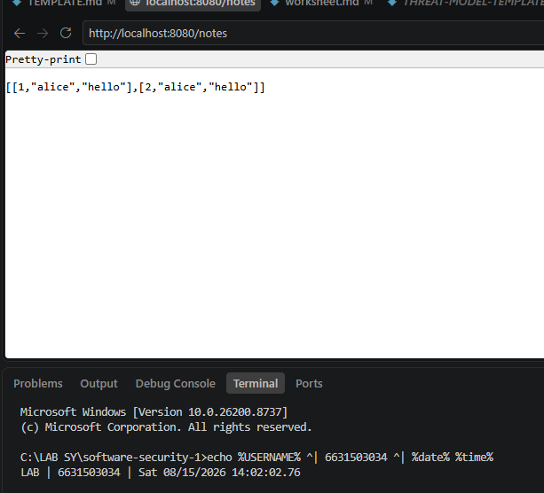

# Worksheet 1 — Security Mindset & Threat Modeling (3 hrs)

> **Course:** Software Security (KOSEN69) · **Week 1**
> **Aligned to:** OWASP 2025 A06 Insecure Design · CWE-501 (Trust Boundary Violation)
> **Signature game:** "Elevation of Privilege" (Microsoft STRIDE card deck)

> **Ethics note:** This week is *modeling only* — you analyze design, you do **not** attack the app. Run the sample app only on your own VM/localhost. Never apply these techniques to systems you do not own or lack written permission to test.

## Part 1 — Student Information
| Name | Student ID | Date | Group |
|Phuriphat Chantiuaong | 6631503034 | 15/8/2026 |---|
| | | | |

## Part 2 — Lecture Questions
Answer in your own words (2–4 sentences each).
1. CIA Triad stands for Confidentiality, Integrity, and Availability. Confidentiality fails when unauthorized people can access private data, integrity fails when data is changed without permission, and availability fails when a service becomes unavailable, such as during a DDoS attack.
2. A trust boundary is a point where data moves between areas with different levels of trust. Data crossing this boundary needs extra scrutiny because it may come from an untrusted source and could contain malicious or unexpected input.
3. An attack surface is the total number of possible ways an attacker can interact with or attack a system. In a web application, the attack surface can increase by adding more public APIs, user input fields, or third-party services.
4. STRIDE stands for Spoofing, Tampering, Repudiation, Information Disclosure, Denial of Service, and Elevation of Privilege. Spoofing violates authentication, Tampering violates integrity, Repudiation violates accountability, Information Disclosure violates confidentiality, Denial of Service violates availability, and Elevation of Privilege violates authorization.
5. Secure by Design means building security into a product from the beginning instead of treating it as an extra feature. CISA promotes designing systems that are secure by default, while bolting security on after release can leave weaknesses that are harder and more expensive to fix.

## Part 3 — Hands-on Lab (180 min)
**Learning goals:** build a data-flow diagram (DFD), apply STRIDE to a real Flask app, rank risks, and propose mitigations.
**Prerequisites:** Docker + Docker Compose in your VM; a drawing tool (draw.io / paper + photo); the Elevation of Privilege deck (print or virtual) — free print-and-play PDF at [github.com/adamshostack/eop](https://github.com/adamshostack/eop).

**Environment setup**
```bash
cd labs/week01-threat-modeling
docker compose up --build           # starts sample-app on http://localhost:8080
curl -s -X POST localhost:8080/notes -H 'Content-Type: application/json' \
     -d '{"owner":"alice","body":"hello"}'   # observe behavior, do not attack
curl -s localhost:8080/notes

echo "demo file" > demo.txt
curl -s -X POST localhost:8080/upload -F "file=@demo.txt"   # observe behavior, do not attack
curl -s localhost:8080/files/demo.txt
```

Source to model lives in `sample-app/app.py`. Template to fill: `THREAT-MODEL-TEMPLATE.md` (copy it, do not edit the original).

**What to submit per task:** the threat/element identified + a screenshot (DFD, table, or running app) + a 2–3 sentence mitigation.

**Task 0 — Onboarding (5 min)** · *Goal:* prove the environment works. *Steps:* `docker compose up`, hit `/notes` and `/files/<name>`, read `sample-app/app.py`. *Deliverable:* screenshot of the running app + the JSON response.
= 

**Task 1 — Draw the DFD (25 min)** · *Goal:* map the system. *Steps:* identify the external entity (web client), the process (Flask app), the data store (`notes.db` SQLite), the `uploads/` store, and the flows for `/notes`, `/upload`, `/files/<name>`; mark the Internet→app trust boundary with a dashed line. *Deliverable:* DFD image embedded in your copy of the template.
= 

**Task 2 — STRIDE the elements (30 min)** · *Goal:* enumerate threats per element. *Steps:* for each element fill the S/T/R/I/D/E grid. Ground it in real code: `/notes` accepts a client-supplied `owner` with no auth (Spoofing); `/upload` saves raw `f.filename` — arbitrary-file-write (Tampering) — and echoes the resolved save path back in its response (Information disclosure); `/files/<name>` reads it back but is comparatively defended (see Task 5); no logging anywhere (Repudiation). *Deliverable:* completed STRIDE table.
= 

**Task 3 — Elevation of Privilege game (20 min)** · *Goal:* find threats you missed. *Steps:* play the EoP deck against your DFD; each card you can tie to a real element/flow scores a point; record every valid threat. No printer or scissors? Draw from the digital deck below instead — same 78 cards, same rule. *Deliverable:* list of carded threats + score.
```sim
eop-deck
| Carded threat                      | Element / flow         | Why it qualifies                                                              |
| ---------------------------------- | ---------------------- | ----------------------------------------------------------------------------- |
| Forged identity / impersonation    | `/notes` → `owner`     | Client controls `owner` without authentication.                               |
| Authorization bypass               | `/notes`               | Application may treat attacker-selected `owner` as trusted identity.          |
| Arbitrary file write               | `/upload` → `uploads/` | Raw filename controls the destination path.                                   |
| Path traversal                     | `/upload`              | `../` can escape the intended directory.                                      |
| Application-file overwrite         | `/upload` → filesystem | A writable application-controlled file could affect execution.                |
| Sensitive filesystem access        | `/files/<name>`        | Incorrect path handling could expose files outside `uploads/`.                |
| Privilege escalation through Flask | Flask process          | Filesystem/database access is determined by the process account's privileges. |
| Resource exhaustion                | `/upload`              | Unlimited upload volume/size can consume disk or CPU.                         |
| Identity/data confusion            | `/notes` → `notes.db`  | Forged ownership can cause data to be written under another user's identity.  |

```

**Task 3b — Systems-level pass (25 min) 🔭** · *Goal:* find what the per-element grid cannot see. Tasks 2 and 3 enumerate threats **one element at a time**, and that is exactly where threat models are known to stop short — students taught STRIDE alone reliably identify component threats and *discount system-level ones* ([Joshi et al., ASEE 2024](https://arxiv.org/abs/2404.16632)). So do a second pass over the **whole** diagram:


- **Trust boundaries end-to-end.** Follow one request from the client to `notes.db` and back. List every boundary it crosses. Which crossing has no check on it?
- **Assume one element is fully owned.** Pick the Flask process, then the `uploads/` store. For each: what does the attacker now *reach* — not what is it, but where does it get them?
- **Chain two "low" findings.** Find two threats you or the EoP deck rated minor that combine into something you would not accept. Write the chain as `A → B → consequence`.
- **One-line system claim.** Finish: "Even if every element-level mitigation in Task 8 is implemented, this system still fails if ___."

Use the simulation below before you start — toggle a component to attacker-controlled and watch what it reaches:

```sim
trust-boundary
```

*Deliverable:* the boundary list, two owned-element reachability notes, one written chain, and the system claim.

**Task 4 — Abuse cases & attacker personas (20 min)** · *Goal:* think like specific adversaries. *Steps:* define 2 personas (e.g. a curious logged-in user; an anonymous internet attacker) and write 2 abuse cases each against the sample app, tied to DFD elements. *Deliverable:* 4 abuse cases.
=Persona 1: Anonymous Internet Attacker (Unauthenticated)
Abuse Case 1 (DFD Element: /notes): An unauthenticated remote attacker iterates through common usernames in the owner query parameter to dump and view internal user notes without credentials.

Abuse Case 2 (DFD Element: /upload): An attacker submits a POST request containing ../ sequences in f.filename to overwrite critical configuration files or place malicious scripts into accessible directories.

Persona 2: Malicious Internal User (Low-Privilege Logged-In User)
Abuse Case 3 (DFD Element: /upload & Server Path Disclosure): A low-privilege user uploads a harmless file, extracts the server's absolute internal directory path from the response, and uses it to map out target files for path traversal attacks.

Abuse Case 4 (DFD Element: notes.db via /notes): A registered user crafts HTTP requests targeting /notes with owner=admin to inject unauthorized records directly into the shared database context.

**Task 5 — Path-traversal deep-dive (25 min)** · *Goal:* analyze the riskiest flow. *Steps:* trace `/upload` → `/files/<name>`; explain how `../` in a filename escapes `uploads/`; sketch the secure design (`secure_filename`, store outside web root, allow-list extensions). *Deliverable:* the data flow + secure-design note.
=[Client POST /upload] 
        │
        ▼ (Raw f.filename received, e.g. "../../tmp/malicious.py")
[Flask Endpoint /upload]
        │
        ▼ (Saves directly without sanitization & returns absolute path)
[Filesystem Storage /uploads/../../tmp/malicious.py]
        │
        ▼ (Client requests file)
[Flask Endpoint /files/<name>] ──► [Reads and returns target file]

**Task 6 — Threat-model the project target (30 min)** · *Goal:* kick off your term project. *Steps:* stop the sample-app first (`docker compose down` — both apps bind host port 8080), then run **NoteVault** (`cd ../../project/starter-app && docker compose up`), draw a quick DFD, and list the top 3 STRIDE threats you'd investigate. *Deliverable:* NoteVault DFD + top-3 threats (reuse these in your project report — `project/REPORT-TEMPLATE.md` in the repo root).
=[ Client Browser ]
         │  (HTTP / Auth / Notes API)
         ▼  [Trust Boundary 1: Public Internet]
  [ NoteVault Flask App ]
    │                │
    ▼                ▼  [Trust Boundary 2: Data Tier]
[ SQLite DB ]  [ Upload Store ]

**Task 7 — Security requirements (15 min)** · *Goal:* turn threats into testable requirements. *Steps:* write 3 security requirements as acceptance criteria ("the system must … so that …"), each mapped to a threat from Task 2 or Task 6. *Deliverable:* 3 testable security requirements.

**Task 8 — Defend / fix it: rank & mitigate (25 min) 🛡️** · *Goal:* turn threats into action you can prove. *Steps:* rank the top 5 threats by likelihood × impact; propose one concrete mitigation each (e.g., auth on `/notes`, `secure_filename()` + allowlist for `/upload`, request logging for Repudiation, size/rate limits for DoS). Then **pick one and actually implement it** in your fork.
=Rank,Threat,Likelihood,Impact,Score,Proposed Mitigation
1,Tampering / EoP: Arbitrary File Write via /upload path traversal,High,High,Critical,Enforce secure_filename() + extension allow-list + store outside web root.
2,Spoofing / Elevation: Unauthenticated Note Access via /notes,High,High,Critical,Implement session-based authentication and strict owner-to-session validation.
3,Information Disclosure: Server path leakage in /upload response,High,Medium,Medium,Remove absolute path details from API responses; return generic success payloads/UUIDs.
4,Repudiation: Missing centralized application logs,Medium,Medium,Medium,"Integrate a logging middleware capturing user ID, endpoint, timestamp, and client IP."
5,Denial of Service: Unrestricted upload file size,Medium,Medium,Medium,Implement MAX_CONTENT_LENGTH limits in Flask configuration.

*Deliverable — the top-5 table, plus for the one you implemented:*
1. the **diff** (commit hash on your `wk01` branch),
2. **evidence it works**: the request that succeeded before your change and is refused after — both outputs,
3. **why it closes the class, not the instance** (2–3 sentences). `secure_filename()` on one endpoint is an instance fix; *"no user-supplied string ever becomes a path component"* is a class fix. Say which yours is, and if it's an instance fix, say what the class fix would be.

> **Why this is weighted.** Fewer than half of working developers can spot a security hole in code, and being shown vulnerabilities does not by itself teach you to find or close them. Exploiting is the half that feels like progress; defending is the half that transfers to your job.

## Part 4 — Reflection
1. Map your top finding to a CWE and to OWASP A06 (Insecure Design); explain the mapping in one sentence.
2. Name one real-world breach caused by a design flaw (not a missing patch) and what design control would have prevented it.
3. Of your five mitigations, which gives the most risk reduction per unit of effort, and why?

## Grading rubric (100)
| Criterion | Points |
|---|---|
| Lecture questions (Part 2) | 20 |
| Exploitation + evidence (DFD + STRIDE table + EoP findings + screenshots) | 40 |
| Defense (top-5 ranking + mitigations) | 25 |
| Reflection (CWE/OWASP mapping + breach + best mitigation) | 15 |

**Assessed within the rows above** (they are not extra points — they are what those points are for):
- **Systems-level reasoning** (inside *Exploitation + evidence*, Task 3b): does the model reach past single elements to boundaries, reachability and chains? Scored with the STRIDE + systems-thinking rubrics of [Joshi et al. 2024](https://arxiv.org/abs/2404.16632).
- **Defensive proof** (inside *Defense*, Task 8): a claimed mitigation with no before/after evidence scores at most half. A mitigation you can show closing a *class* scores full.
- **Adversarial thinking** (across the whole sheet): do the abuse cases, personas and chains show you reasoning as an attacker with goals and constraints — or just listing categories? This is the course's central disposition and it is assessed, not assumed.

---

## Evidence & Integrity (required)

- **Identity proof:** every screenshot/diagram must show a terminal running `printf '%s | %s | ' "$(whoami)" '<YOUR-STUDENT-ID>'; date '+%F %T %Z'` **in the
  same image as the evidence**. When the evidence is a browser page, a DevTools panel or a
  rendered response, put that terminal **beside the browser and capture the whole screen** — a
  cropped window carries nothing that identifies you, and the lab's own output is
  byte-identical for the whole cohort *by design*, so the stamp is the only thing that makes
  the shot yours. Generic or borrowed evidence is not accepted.
- **Personalized flag (if this lab issues one):** ____________________
  *Flags are unique per student — submitting another student's flag is a violation. How to submit: **learn.zcr.ai/submit** (full guide: `SUBMISSION.md` in the repo root).*
- **Explain in your own words** *(graded on your reasoning, not copied text):*
  1. What did you do, and **why did the vulnerability work**?
  2. **Why does your fix actually stop it** — and what could still break it?

---

## 🤖 Audit the AI (required)

AI is a power tool you must **distrust** — you are graded on your *critique*, not the AI's answer.

1. Ask an AI assistant to exploit **or** fix this week's vulnerability. Paste its full answer.
2. **Find what's wrong or risky** in it — insecure code, a subtly incomplete fix, a hallucinated API/function/CVE, a missed edge case, or wrong reasoning. Quote the exact line(s).
3. Produce the **correct, verified** version yourself and explain in 2–3 sentences why the AI's output was insufficient.

> Disclose your AI use in the Part 1 table. This task counts toward your **Defense + Reflection** score.
=

---

## 🧠 Comprehension & Prompt (required)

**A. Explain in Plain English (EiPE).** In 2–3 sentences, in your own words, describe what this week's vulnerable code/endpoint actually *does* and *why it is exploitable* — explain the mechanism, don't dump jargon.

**B. Prompt Problem.** Write a **single prompt** that makes an AI produce a *correct, secure* fix for one finding. Run it: does the exploit now fail? If not, refine the prompt and try again. Submit the **final prompt + the verified result**.
*Graded on the prompt's precision and your verification — this trains problem decomposition and AI literacy (Denny et al. 2024).*
