# Worksheet 2 — Secure SDLC & Tooling (3 hrs)

> **Course:** Software Security (KOSEN69) · **Week 2**
> **Aligned to:** OWASP 2025 (A05 Injection [CWE-89, CWE-78], A04 Cryptographic Failures [CWE-327], A02 Security Misconfiguration [CWE-798, CWE-489]) · CWE-798, CWE-89, CWE-78, CWE-327, CWE-489
> **Signature game:** "Bug Triage Race" (scan → triage; score = true positives − misclassified)

> **Ethics note:** The scanners run only against the provided `vulnerable-repo/` on your own machine. Do not point SAST/secret scanners at third-party repos or production systems without authorization. Treat any secret you find here as fake lab data.

## Part 1 — Student Information
| Name | Student ID | Date | Group |
|---|---|---|---|
| Pirisa Kitichai|6631503031 | 15/08/2026 | - |

## Part 2 — Lecture Questions
Answer in your own words (2–4 sentences each).

## 1. Distinguish SAST, DAST, and SCA — what does each see, and when in the SDLC does each run?
**Ans** SAST ดู source code โดยไม่ต้องรัน เพื่อหาช่องโหว่จากรูปแบบของโค้ด พวก SQL Injection ฟังก์ชันที่ไม่ปลอดภัย จึงเหมาะกับช่ วงเขียนโค้ดหรือก่อน merge. DAST จะทดสอบแอพที่กำลังรันอยู่จากภายนอก เพื่อดูพฤติกรรมจริงของระบบ ส่วน SCA ใช้ตรวจ dependency หรือ library ที่โปรเจกต์ใช้งานว่ามี CVE หรือช่องโหว่ที่รู้จักหรือไม่.

## 2. What is secret scanning, and why do hardcoded secrets keep ending up in repos?
**Ans** Secret scanning คือการค้นหาค่า credential หรือ secret เช่น API key, password และ token ที่ถูกใส่ไว้ใน source code หรือ repository. Hardcoded secrets มักหลุดเข้า repo เพราะนักพัฒนาต้องการทดสอบให้เร็ว หรือเผลอ commit ไฟล์ configuration โดยไม่ได้แยก secret ออกจาก code และบางครั้งอาจยังค้างอยู่ใน Git history แม้จะลบออกจากไฟล์ปัจจุบันแล้ว.

## 3. What does "shift-left / DevSecOps" mean in practice for a CI pipeline?
**Ans** Shift-left คือการนำการตรวจสอบด้าน security เข้ามาทำตั้งแต่ ช่วงต้นของ develop แทนที่จะรอไปตรวจตอนใกล้ deploy. ใน CI pipeline สามารถเพิ่ม SAST, secret scanning และ SCA ให้ทำงานอัตโนมัติทุกครั้งที่มีการ push หรือเปิด pull request และให้ pipeline fail เมื่อพบช่องโหว่ที่มีความรุนแรงสูง.

## 4. Why is coverage-guided fuzzing considered the dominant modern bug-finding technique?
**Ans** Coverage-guided fuzzing จะสร้างและปรับ input โดยดูว่า input ไหนสามารถพาโปรแกรมไปถึงเส้นทางของโค้ดใหม่ ๆ ได้ จึงช่วยค้นหาพฤติกรรมที่ผิดปกติระหว่างการรันจริง. วิธีนี้มีประโยชน์กับบั๊กที่เกิดจากเงื่อนไขของข้อมูลตอน runtime เช่น out-of-bounds หรือ crash ซึ่งเครื่องมือที่ดูแค่ source code อาจหาไม่เจอ.

## 5. Define true positive vs. false positive in scanner triage, and why misclassifying both directions is costly.
**Ans** True positive คือ finding ที่เครื่องมือแจ้งแล้วเป็นช่องโหว่จริง 
ส่วน false positive คือเครื่องมือแจ้งเตือนแต่เมื่อวิเคราะห์แล้วไม่ได้เป็นช่องโหว่จริง. ถ้ามอง false positive เป็นช่องโหว่จริงจะเสียเวลาในการแก้สิ่งที่ไม่จำเป็น แต่ถ้ามอง true positive เป็น false positive อาจทำให้ช่องโหว่จริงถูกปล่อยเข้าสู่ production และสร้างความเสียหายได้.


## Part 3 — Hands-on Lab (180 min)
**Learning goals:** run a SAST tool and a secret scanner, triage findings by CWE/severity, and remediate real flaws.
**Prerequisites:** Docker installed; internet to pull the Semgrep/Gitleaks images.

**Environment setup**
```bash
cd labs/week02-sdlc-tooling
cat scan.sh                 # see exactly what it runs
bash scan.sh                # Semgrep (p/default + p/owasp-top-ten) then Gitleaks on ./vulnerable-repo
```
Target under scan: `vulnerable-repo/app.py` (plus `requirements.txt`). It contains five planted flaws.

**What to submit per task:** the command/payload run + a screenshot of the finding + a 2–3 sentence mitigation.

**Task 0 — Onboarding (5 min)** · *Goal:* confirm tooling. *Steps:* run `bash scan.sh`; confirm both Semgrep and Gitleaks sections produce output. *Deliverable:* screenshot showing both tools ran.

### Task 0 — Onboarding

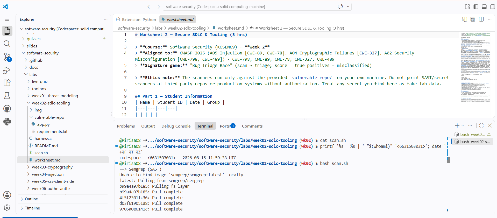
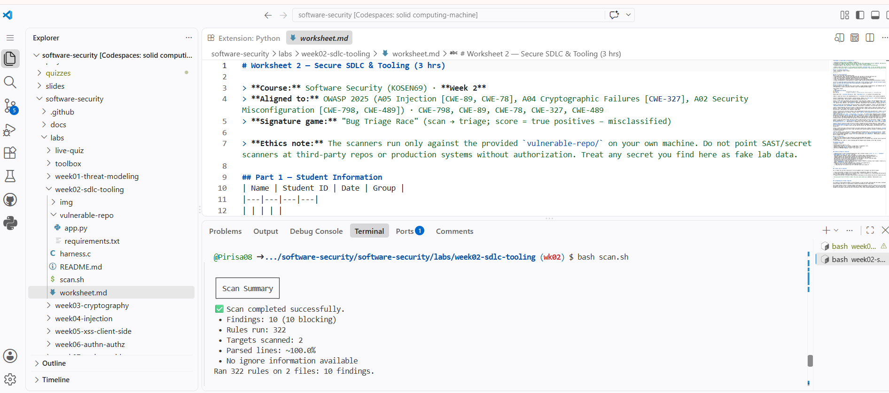
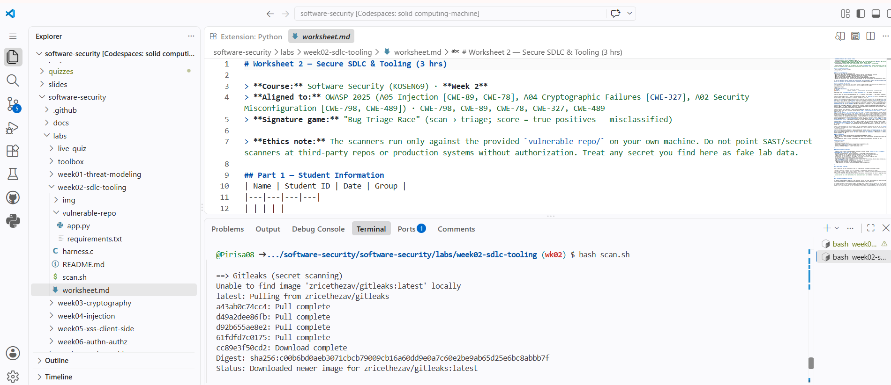
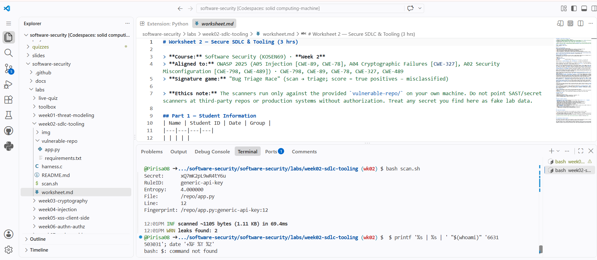

**Task 1 — SAST sweep with Semgrep (25 min)** · *Goal:* find code flaws. *Steps:* read the Semgrep output; locate the SQL injection in `/user` (CWE-89, string-formatted query), the OS command injection in `/ping` (CWE-78, `shell=True`), the weak `md5` password hash (CWE-327), and `debug=True` (CWE-489). *Deliverable:* one screenshot per finding with the file:line.

### Task 1 — SQL Injection (CWE-89)

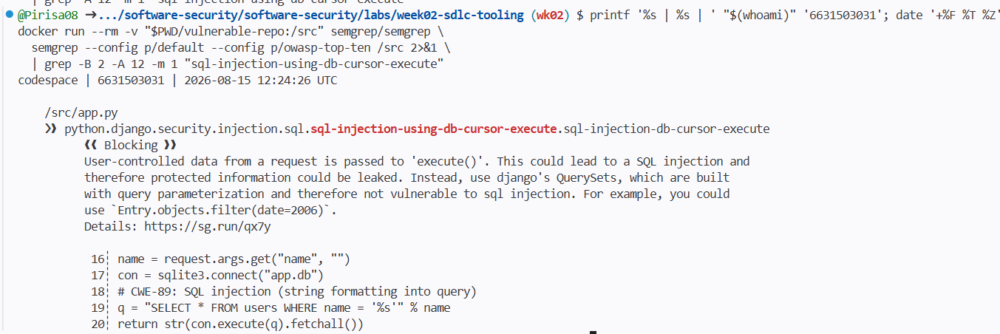

### Task 1.2 — OS Command Injection (CWE-78)

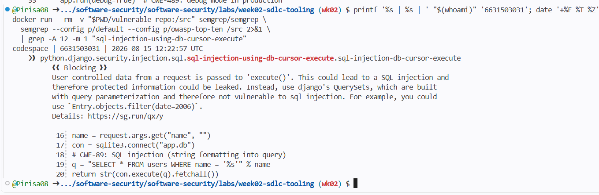

### Task 1.3 — Weak MD5 Password Hash (CWE-327)

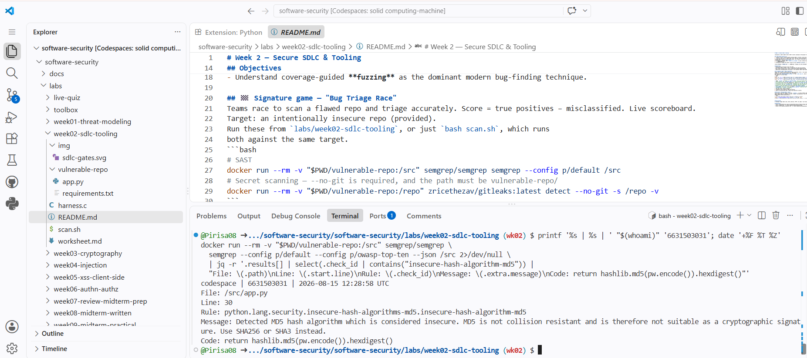

### Task 1.4 — Debug Mode Enabled (CWE-489)

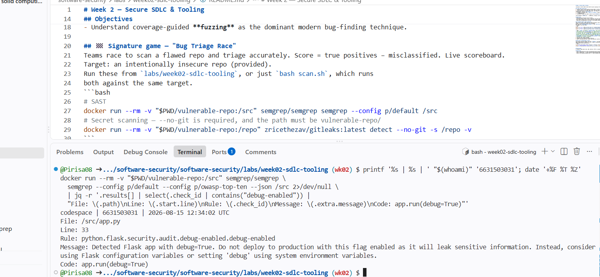

**Task 2 — Secret scan with Gitleaks (15 min)** · *Goal:* find leaked credentials. *Steps:* read the Gitleaks output; identify `AWS_SECRET_ACCESS_KEY` and `DB_PASSWORD` (CWE-798). *Deliverable:* screenshot + the rule that fired for each.

### Task 2 — Secret Scanning

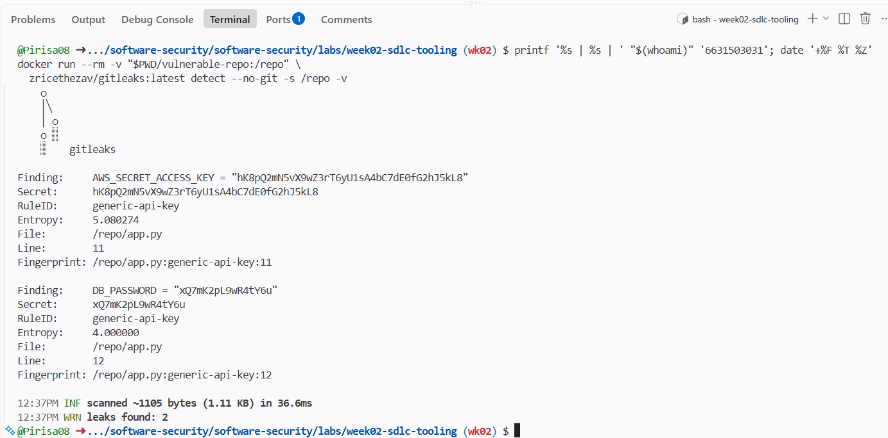

**Task 3 — Bug Triage Race (30 min)** · *Goal:* triage accurately. *Steps:* build a table with columns *Tool | File:Line | CWE | Severity | TP/FP | Fix idea*; mark at least 3 true positives and 1 likely false positive and justify each. (Score = TP − misclassified.) *Deliverable:* the completed triage table.

| Tool                                     | File:Line      | CWE     | Severity | TP/FP     | Fix idea                                                                                                                                                                                                         |
| ---------------------------------------- | -------------- | ------- | -------- | --------- | ---------------------------------------------------------------------------------------------------------------------------------------------------------------------------------------------------------------- |
| Semgrep                                  | `app.py:19-20` | CWE-89  | High     | TP        | Use a parameterized SQL query with a `?` placeholder instead of formatting user input into the query.                                                                                                            |
| Semgrep                                  | `app.py:26`    | CWE-78  | Critical | TP        | Remove `shell=True` and pass `ping` and the host as a subprocess argument list.                                                                                                                                  |
| Semgrep                                  | `app.py:30`    | CWE-327 | High     | TP        | Replace MD5 password hashing with a password-hashing algorithm such as bcrypt or Argon2.                                                                                                                         |
| Semgrep                                  | `app.py:33`    | CWE-489 | Medium   | TP        | Disable Flask debug mode in production by setting `debug=False`.                                                                                                                                                 |
| Gitleaks                                 | `app.py:11`    | CWE-798 | High     | TP        | Remove the AWS secret from source code and load it from an environment variable or secret manager.                                                                                                               |
| Gitleaks                                 | `app.py:12`    | CWE-798 | High     | TP        | Remove the database password from source code and load it securely at runtime.                                                                                                                                   |
| Semgrep (`sqlalchemy-execute-raw-query`) | `app.py:20`    | CWE-89  | Low      | Likely FP | The rule identifies the call as a SQLAlchemy-style raw query, but this program uses Python `sqlite3`, not SQLAlchemy. The SQL injection itself is real and is already correctly reported by other Semgrep rules. |

Triage justification: The SQL injection, command injection, MD5 password hash, debug mode, and hardcoded secrets are true positives because the reported vulnerable operations are directly present in app.py. I marked the SQLAlchemy-specific Semgrep finding as a likely false positive because the application uses Python's sqlite3 module rather than SQLAlchemy, although the underlying SQL injection at the same location is still a real vulnerability.

**Task 4 — Fuzzing intro (10 min)** · *Goal:* see coverage-guided fuzzing find a bug SAST won't. *Steps:* in the `labs/toolbox` container (Apple clang has no libFuzzer runtime), build `clang -g -fsanitize=address,fuzzer harness.c -o fuzz`, then **seed the corpus** and run it:
`mkdir -p corpus && printf 'FUZ' > corpus/seed && ./fuzz corpus`. It crashes almost immediately with an AddressSanitizer heap-buffer-overflow at `harness.c:23` (the `data[3]` read with no `size > 3` check). Seeding matters: an unseeded `./fuzz` has to rediscover the magic bytes by chance and often finds nothing for minutes — that unpredictability is itself worth a sentence in your write-up. (The deep fuzzing+exploit lab is Week 11.) *Deliverable:* the ASan crash output (or a screenshot) + a 2-sentence note on why fuzzing finds this bug when a linter/SAST pass over the same 4-line check would not.

### Task 4 — Fuzzing Asan
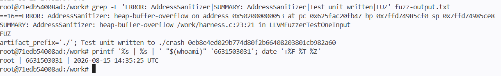

Fuzzing เจอบั๊กจากการรันโปรแกรมด้วย seed FUZ ทำให้โปรแกรมไปอ่าน data[3] ทั้งที่ข้อมูลมีแค่ 3 bytes จึงเกิด out-of-bounds read. ส่วน SAST หรือ linter อาจหาไม่เจอ เพราะเครื่องมือแบบนี้วิเคราะห์จากรูปแบบของโค้ดเป็นหลัก และอาจไม่รู้ว่าตอนรันจริง input มีขนาดไม่พอเมื่อมาถึงบรรทัดนี้

**Task 5 — Scan the project target (40 min)** · *Goal:* apply the tools to your term project. *Steps:* run Semgrep + Gitleaks against **NoteVault** (`../../project/starter-app`); also run an SCA scan: `docker run --rm -v "$PWD/../../project/starter-app:/src" aquasec/trivy fs /src`. *Deliverable:* a findings list (tool, file:line/CVE, CWE) — reuse it in your project vuln report.

### Task 5 — Scan the project target

I scanned the NoteVault project using Semgrep, Gitleaks, and Trivy.

#### Semgrep
Semgrep found 31 findings in the project. Important findings included SQL injection, command injection, insecure MD5 password hashing, a hardcoded JWT secret, and Flask debug mode.

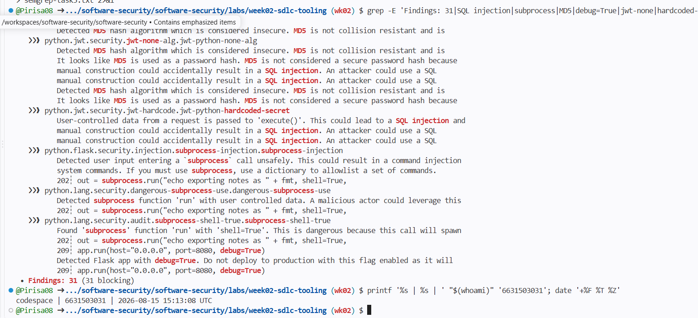

#### Gitleaks
Gitleaks scanned the NoteVault project and did not detect any secrets.

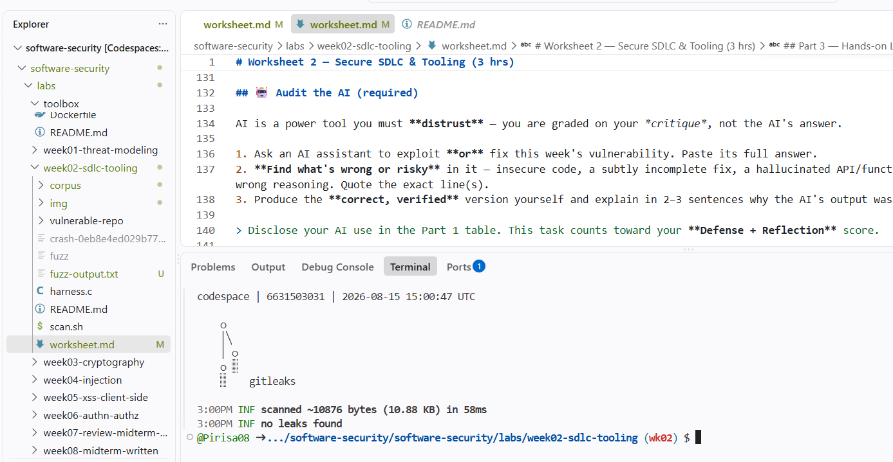

#### Trivy
Trivy found vulnerable dependencies in `requirements.txt`. When filtering for HIGH and CRITICAL vulnerabilities, it reported 12 HIGH vulnerabilities and 0 CRITICAL vulnerabilities.

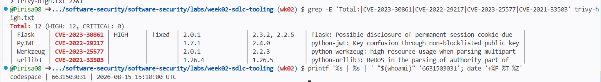

#### Findings

| Tool | File:Line / CVE | Finding | CWE |
|---|---|---|---|
| Semgrep | `app.py:128-130` | SQL Injection | CWE-89 |
| Semgrep | `app.py:202-203` | Command Injection | CWE-78 |
| Semgrep | `app.py:68-69, 117, 129` | MD5 used for password hashing | CWE-916 |
| Semgrep | `app.py:134` | Hardcoded JWT secret | CWE-522 |
| Semgrep | `app.py:209` | Flask debug mode enabled | CWE-489 |
| Gitleaks | — | No leaks found | — |
| Trivy | `CVE-2023-30861` | Vulnerable Flask 2.0.1 dependency | CWE-539 |
| Trivy | `CVE-2022-29217` | Vulnerable PyJWT 1.7.1 dependency | CWE-327 |
| Trivy | `CVE-2023-25577` | Vulnerable Werkzeug 2.0.1 dependency | CWE-770 |
| Trivy | `CVE-2021-33503` | Vulnerable urllib3 1.26.4 dependency | CWE-400 |

**Task 6 — Build a security CI gate (25 min)** · *Goal:* automate the scan (previews Week 15). *Steps:* adapt `../week15-devsecops-pipeline/security-ci.yml` into a workflow that runs Semgrep + Trivy + Gitleaks and **fails on HIGH/CRITICAL**; run it locally (`act`) or commit to your fork and read the Actions log. *Deliverable:* the workflow file + a screenshot of a failing run.

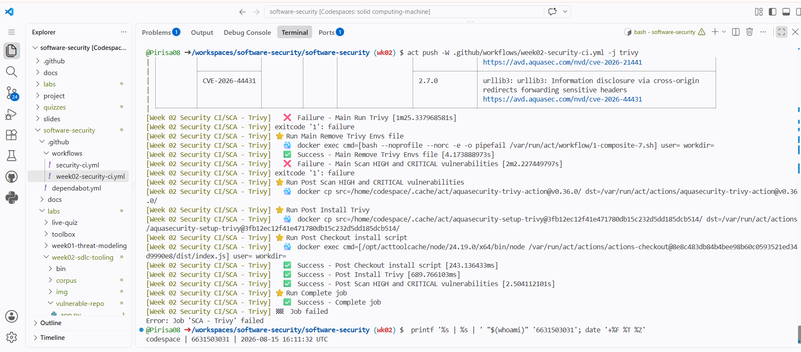

### Task 7 — SAST blind spots (20 min)

**Bug:** Hardcoded credentials/secrets in `vulnerable-repo/app.py`

```python
AWS_SECRET_ACCESS_KEY = "..."
DB_PASSWORD = "..."
```

Semgrep did not flag these hardcoded secrets in the scan, while Gitleaks detected both of them. This happens because the Semgrep rules used in this lab focus mainly on insecure code patterns and data flow, while Gitleaks is designed specifically to detect credential-like values and secrets stored in source code.

---

### Task 8 — Defend / fix it (10 min)

**Goal:** remediate the planted flaws in `vulnerable-repo/app.py`.

**Steps:** rewrite `/user` to use a parameterized query (`?` placeholder); remove `shell=True` and pass an argument list in `/ping`; move both secrets to environment variables; replace `md5` with bcrypt/Argon2; and set `debug=False`.

**Deliverable:** a before/after diff for each fix mapped to its CWE.

I fixed the planted vulnerabilities in `vulnerable-repo/app.py`.

| CWE | Vulnerability | Fix |
|---|---|---|
| CWE-798 | Hardcoded credentials/secrets | Moved the secrets to environment variables using `os.environ.get()` |
| CWE-89 | SQL Injection | Replaced string formatting with a parameterized query using `?` |
| CWE-78 | OS Command Injection | Removed `shell=True` and passed the command as an argument list |
| CWE-327 | Weak MD5 password hashing | Replaced MD5 with bcrypt |
| CWE-489 | Flask debug mode enabled | Changed `debug=True` to `debug=False` |

#### Evidence — Hardcoded Secrets Fix

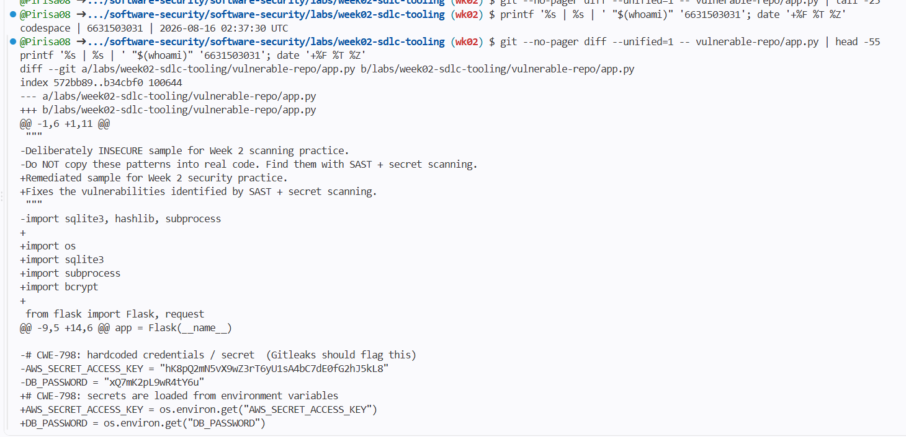

#### Evidence — SQL Injection, Command Injection and MD5 Fixes

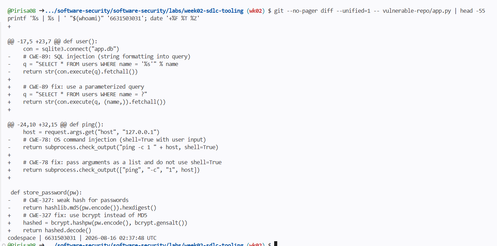

#### Evidence — MD5 and Debug Mode Fixes

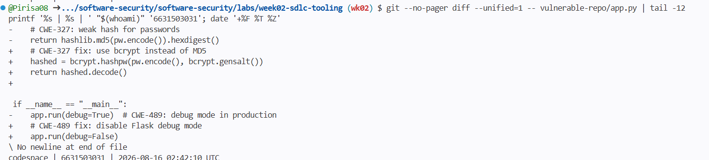

The SQL injection fix prevents user input from becoming part of the SQL command itself by using a parameterized query. The command injection fix avoids invoking a shell, while the secrets are no longer stored directly in source code, bcrypt replaces the weak MD5 password hash, and Flask debug mode is disabled.

## Part 4 — Reflection
## 1. Map two of your findings to their CWE and to the matching OWASP 2025 category.

**Ans** Finding แรก คือ SQL Injection ใน `/user`ตรงกับ **CWE-89** และอยู่ใน **OWASP 2025 A05: Injection** เพราะ โปรแกรมเอา input จาก user ไปร่วมกับ SQL query โดยตรง. Finding 2 คือ ใช้ MD5 สำหรับเก็บรหัสผ่าน ซึ่งตรงกับ **CWE-327** และอยู่ใน **OWASP 2025 A04: Cryptographic Failures** เพราะ MD5 เป็น hash algorithm ที่ไม่เหมาะสำหรับการป้องกัน password.

## 2. Name a real-world breach caused by a hardcoded/leaked secret or an injection flaw, and what control would have caught it pre-release.

**Ans** ตัวอย่างคือ เหตุการณ์ **TalkTalk ปี 2015** มีการใช้ SQL Injection เพื่อเข้าถึงข้อมูลลูกค้า. หากมีการใช้ SAST/DAST ใน CI pipeline ร่วมกับการตรวจสอบว่า SQL query ใช้ parameterized queries ก่อน release ก็มีโอกาส ตรวจพบ หรือ ป้องกันช่องโหว่นี้ได้ก่อนนำระบบขึ้น production.

## 3. Which single tool (SAST vs. secret scanning) gave the highest-value findings on this repo, and why?

**Ans** สำหรับ repo นี้ หนูคิดว่า **SAST ให้ findings ที่มีค่าสูงกว่า** เพราะ Semgrep เจอช่องโหว่ หลายประเภท ที่สามารถถูกโจมตี ได้โดยตรง เช่น SQL Injection, Command Injection, MD5 password hashing และ debug mode. 
Secret scanning ก็สำคัญเพราะสามารถหา AWS key และ database password ได้ แต่ SAST ให้ภาพรวมของปัญหาด้าน security ในโค้ดได้กว้างกว่าและช่วยชี้ตำแหน่งที่ควรแก้ได้หลายจุด.

## Grading rubric (100)
| Criterion | Points |
|---|---|
| Lecture questions (Part 2) | 20 |
| Exploitation + evidence (scan output + triage table + screenshots) | 40 |
| Defense (remediated `app.py` with before/after diffs) | 25 |
| Reflection (CWE/OWASP mapping + breach + tool value) | 15 |

---

## Evidence & Integrity (required)

- **Identity proof:** every screenshot/diagram must show a terminal running `printf '%s | %s | ' "$(whoami)" '<YOUR-STUDENT-ID>'; date '+%F %T %Z'` **in the
  same image as the evidence**. When the evidence is a browser page, a DevTools panel or a
  rendered response, put that terminal **beside the browser and capture the whole screen** — a
  cropped window carries nothing that identifies you, and the lab's own output is
  byte-identical for the whole cohort *by design*, so the stamp is the only thing that makes
  the shot yours. Generic or borrowed evidence is not accepted.
- **Personalized flag:** **N/A — this week has no arena challenge, so no flag is issued.** Leave this blank.
- **Explain in your own words** *(graded on your reasoning, not copied text):*
  1. What did you do, and **why did the vulnerability work**?
  2. **Why does your fix actually stop it** — and what could still break it?

---

## 🤖 Audit the AI (required)

### 1. AI answer

I asked an AI assistant how to fix the hardcoded secrets in `vulnerable-repo/app.py`.

The AI suggested:

```python
import os

AWS_SECRET_ACCESS_KEY = os.environ.get(
    "AWS_SECRET_ACCESS_KEY",
    "default-aws-secret"
)

DB_PASSWORD = os.environ.get(
    "DB_PASSWORD",
    "default-db-password"
)
```

The AI explained that moving the credentials to environment variables would prevent secrets from being stored directly in the source code.

### 2. What is wrong or risky?

The risky lines are:

```python
"default-aws-secret"
"default-db-password"
```

Although the code uses environment variables, it still contains hardcoded fallback secrets. If the environment variables are missing, the application will silently use these default values, so credentials are still present in the source code and could be exposed or reused.

### 3. Correct version

I corrected the code so that the application reads the secrets from environment variables without storing fallback secret values in the source code:

```python
import os

AWS_SECRET_ACCESS_KEY = os.environ.get("AWS_SECRET_ACCESS_KEY")
DB_PASSWORD = os.environ.get("DB_PASSWORD")
```

This version is safer because the actual secret values are no longer stored directly in the source code. It also avoids using a hardcoded fallback credential if an environment variable is missing.

### Verification

I used Gitleaks to check the remediated `vulnerable-repo/app.py` again.

```bash
docker run --rm -v "$PWD/vulnerable-repo:/repo" \
zricethezav/gitleaks:latest detect --no-git -s /repo -v
```
**Verified result:** Gitleaks reported no leaks found, confirming that the previously hardcoded secret values were no longer detected in the source code.

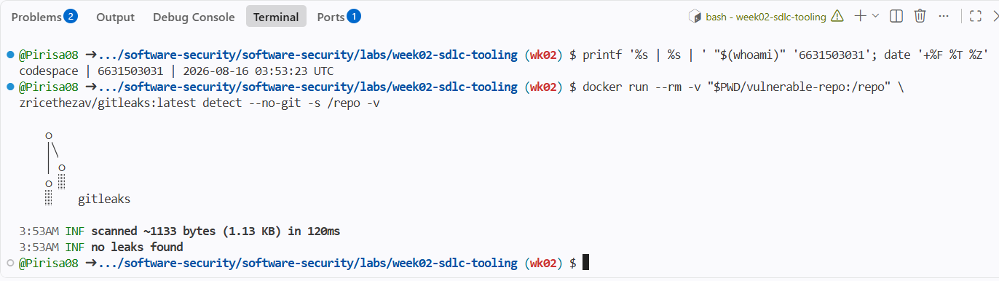

> Disclose your AI use in the Part 1 table. This task counts toward your **Defense + Reflection** score.

| Name | Student ID | Date | Group | AI Use |
|---|---|---|---|---|
| Pirisa Kitichai | 6631503031 | 15/08/2026 | - | Used ChatGPT for guidance and review. I ran and verified the lab commands and results myself. |

---

## 🧠 Comprehension & Prompt (required)

### A. Explain in Plain English (EiPE)

โค้ดเอาข้อมูลที่ผู้ใช้กรอกไปใช้กับ SQL และคำสั่งระบบโดยตรง. ถ้าผู้ใช้ใส่ข้อมูลอันตราย โปรแกรมอาจทำคำสั่งที่ไม่ได้ตั้งใจ.

### B. Prompt Problem

**Final prompt:**

> Fix the hardcoded `AWS_SECRET_ACCESS_KEY` and `DB_PASSWORD` in this Python code. Move them to environment variables and do not keep any default secret values in the source code.

**Verified result:**  
After the fix, I ran Gitleaks again and got `no leaks found`.

