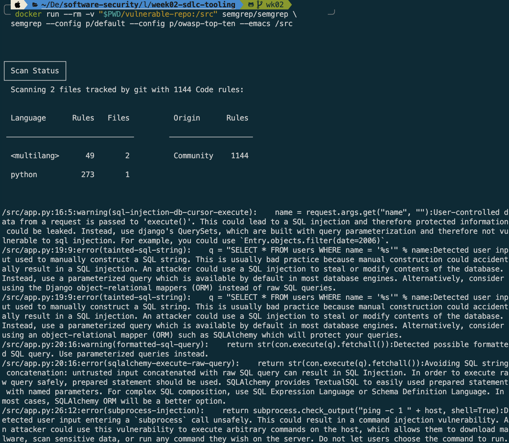
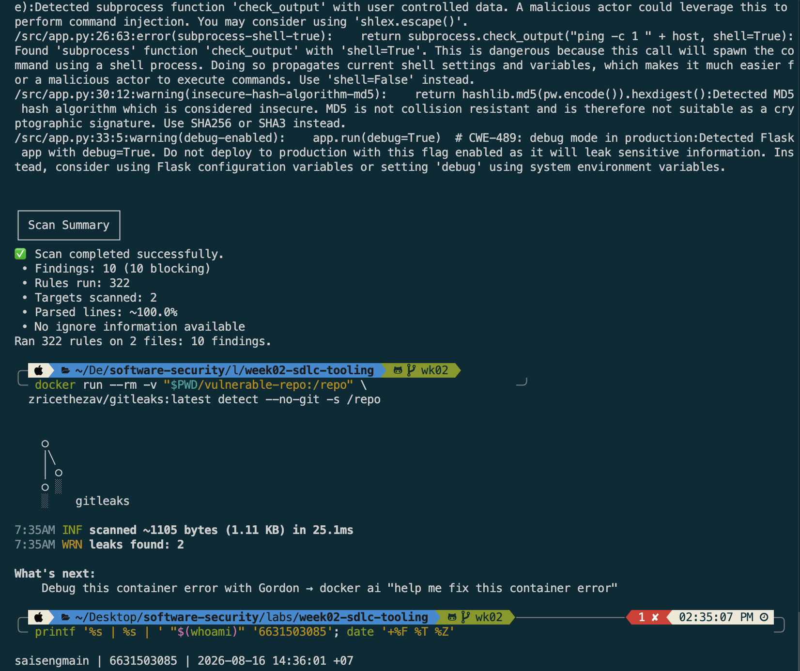
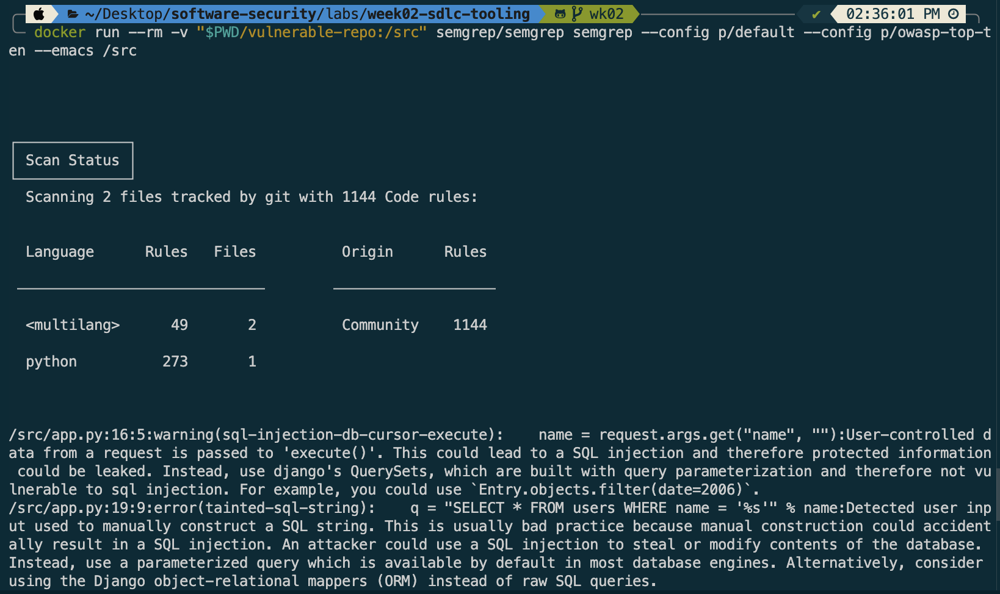
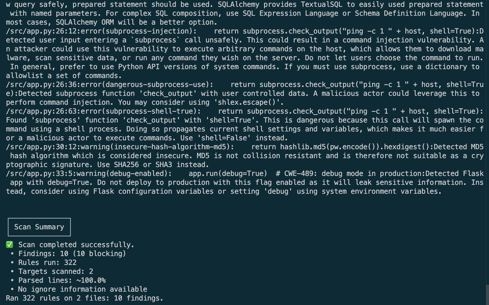

# Worksheet 2 — Secure SDLC & Tooling (3 hrs)

> **Course:** Software Security (KOSEN69) · **Week 2**
> **Aligned to:** OWASP 2025 (A05 Injection [CWE-89, CWE-78], A04 Cryptographic Failures [CWE-327], A02 Security Misconfiguration [CWE-798, CWE-489]) · CWE-798, CWE-89, CWE-78, CWE-327, CWE-489
> **Signature game:** "Bug Triage Race" (scan → triage; score = true positives − misclassified)

> **Ethics note:** The scanners run only against the provided `vulnerable-repo/` on your own machine. Do not point SAST/secret scanners at third-party repos or production systems without authorization. Treat any secret you find here as fake lab data.

## Part 1 — Student Information
| Name | Student ID | Date | Group | Commit Link |
|---|---|---|---|---|
| SAI SENG MAIN | 6631503085 | 16-8-2026 | | [Commit cdedd09](https://github.com/SAISENGMAIN6631503085/software-security/commits/wk02) |


## Part 2 — Lecture Questions
Answer in your own words (2–4 sentences each).
## 1. Distinguish SAST, DAST, and SCA — what does each see, and when in the SDLC does each run?
SAST checks source code, DAST checks a running application, and SCA checks third-party dependencies. SAST and SCA usually run during development/CI, while DAST runs during testing.
## 2. What is secret scanning, and why do hardcoded secrets keep ending up in repos?
Secret scanning detects passwords, API keys, and tokens in code or Git history. Secrets often get committed accidentally or are left in code after testing.
## 3. What does "shift-left / DevSecOps" mean in practice for a CI pipeline?
It means doing security checks early and automatically in the development process. A CI pipeline can run SAST, SCA, secret scanning, and tests on every push or pull request.
## 4. Why is coverage-guided fuzzing considered the dominant modern bug-finding technique?
It generates many inputs and keeps ones that reach new code paths. This helps find bugs that normal tests may miss.
## 5. Define true positive vs. false positive in scanner triage, and why misclassifying both directions is costly.
A true positive is a real vulnerability, while a false positive is a false alarm. Misclassifying a true positive as a false positive wastes time and money, while misclassifying a false positive as a true positive wastes time and money.


## Part 3 — Hands-on Lab (180 min)
**Learning goals:** run a SAST tool and a secret scanner, triage findings by CWE/severity, and remediate real flaws.
**Prerequisites:** Docker installed; internet to pull the Semgrep/Gitleaks images.

**Environment setup**
```bash
cd labs/week02-sdlc-tooling
cat scan.sh                 # see exactly what it runs
bash scan.sh                # Semgrep (p/default + p/owasp-top-ten) then Gitleaks on ./vulnerable-repo
```
Target under scan: `vulnerable-repo/app.py` (plus `requirements.txt`). It contains five planted flaws.

**What to submit per task:** the command/payload run + a screenshot of the finding + a 2–3 sentence mitigation.

**Task 0 — Onboarding (5 min)** · *Goal:* confirm tooling. *Steps:* run `bash scan.sh`; confirm both Semgrep and Gitleaks sections produce output. *Deliverable:* screenshot showing both tools ran.

**Answer:**
Executed `bash scan.sh` to run both Semgrep (SAST) and Gitleaks (Secret Scanner) against `./vulnerable-repo`. Both scanners executed successfully and outputted findings.





**Task 1 — SAST sweep with Semgrep (25 min)** · *Goal:* find code flaws. *Steps:* read the Semgrep output; locate the SQL injection in `/user` (CWE-89, string-formatted query), the OS command injection in `/ping` (CWE-78, `shell=True`), the weak `md5` password hash (CWE-327), and `debug=True` (CWE-489). *Deliverable:* one screenshot per finding with the file:line.

**Answer:**
**Command Executed:**
```bash
docker run --rm -v "$PWD/vulnerable-repo:/src" semgrep/semgrep semgrep --config p/default --config p/owasp-top-ten /src
```




#### 1. SQL Injection (`CWE-89`)
* **File & Line:** `vulnerable-repo/app.py:19-20`
* **Finding Snippet:** `q = "SELECT * FROM users WHERE name = '%s'" % name`
* **Mitigation:** Untrusted user input is directly concatenated into the SQL query string using string formatting. An attacker can supply SQL syntax in the `name` parameter to manipulate the database query. To fix this, use parameterized queries with placeholder bindings (e.g., `con.execute("SELECT * FROM users WHERE name = ?", (name,))`) so the database engine treats input strictly as data.

#### 2. OS Command Injection (`CWE-78`)
* **File & Line:** `vulnerable-repo/app.py:26`
* **Finding Snippet:** `return subprocess.check_output("ping -c 1 " + host, shell=True)`
* **Mitigation:** Setting `shell=True` invokes a system shell process, allowing shell metacharacters in the `host` parameter (e.g., `; id`) to execute arbitrary system commands. To remediate this flaw, set `shell=False` (or omit it) and pass the command and arguments as a safe list (e.g., `subprocess.check_output(["ping", "-c", "1", host])`).

#### 3. Weak Hashing Algorithm — MD5 (`CWE-327`)
* **File & Line:** `vulnerable-repo/app.py:30`
* **Finding Snippet:** `return hashlib.md5(pw.encode()).hexdigest()`
* **Mitigation:** The MD5 hash algorithm is cryptographically broken, lacks collision resistance, and can be easily reversed using precomputed rainbow tables. Passwords should never be hashed with plain MD5. Replace MD5 with a slow, salted password-hashing function such as `bcrypt` or `argon2`.

#### 4. Debug Mode Enabled in Production (`CWE-489`)
* **File & Line:** `vulnerable-repo/app.py:33`
* **Finding Snippet:** `app.run(debug=True)`
* **Mitigation:** Running a Flask application with `debug=True` in production exposes an interactive Werkzeug debugger on unhandled exceptions and leaks sensitive stack trace information. In production environments, set `debug=False` or manage the debug setting strictly through environment configuration (`FLASK_DEBUG`).


**Task 2 — Secret scan with Gitleaks (15 min)** · *Goal:* find leaked credentials. *Steps:* read the Gitleaks output; identify `AWS_SECRET_ACCESS_KEY` and `DB_PASSWORD` (CWE-798). *Deliverable:* screenshot + the rule that fired for each.

**Answer:**
**Command Executed:**
```bash
docker run --rm -v "$PWD/vulnerable-repo:/repo" zricethezav/gitleaks:latest detect --no-git -s /repo -v
```


#### 1. AWS Secret Access Key (`CWE-798`)
* **File & Line:** `vulnerable-repo/app.py:11`
* **Leaked Secret:** `"hK8pQ2mN5vX9wZ3rT6yU1sA4bC7dE0fG2hJ5kL8"`
* **Rule Fired:** `generic-api-key`
* **Mitigation:** Remove hardcoded API credentials from source code repository. Store the secret securely in an environment variable (`AWS_SECRET_ACCESS_KEY`) or secret manager and retrieve it dynamically using `os.getenv("AWS_SECRET_ACCESS_KEY")`.

#### 2. Database Password (`CWE-798`)
* **File & Line:** `vulnerable-repo/app.py:12`
* **Leaked Secret:** `"xQ7mK2pL9wR4tY6u"`
* **Rule Fired:** `generic-api-key`
* **Mitigation:** Remove hardcoded database passwords from application source files. Pass credentials securely at runtime via environment variables (`DB_PASSWORD`) or a secrets store: `os.getenv("DB_PASSWORD")`.


**Task 3 — Bug Triage Race (30 min)** · *Goal:* triage accurately. *Steps:* build a table with columns *Tool | File:Line | CWE | Severity | TP/FP | Fix idea*; mark at least 3 true positives and 1 likely false positive and justify each. (Score = TP − misclassified.) *Deliverable:* the completed triage table.

**Answer:**

| Tool | File:Line | CWE | Severity | TP/FP | Fix idea & Justification |
|---|---|---|---|---|---|
| **Semgrep** | `vulnerable-repo/app.py:19` | CWE-89 | HIGH | **TP** | **True Positive:** Untrusted user input from `request.args.get("name")` is formatted directly into a SQL query string (`%s`). Fix: Use parameterized queries with placeholder bindings (`con.execute("SELECT * FROM users WHERE name = ?", (name,))`). |
| **Semgrep** | `vulnerable-repo/app.py:26` | CWE-78 | HIGH | **TP** | **True Positive:** Subprocess call uses string concatenation with `shell=True`, allowing arbitrary command injection via shell metacharacters. Fix: Pass command arguments as a list (`["ping", "-c", "1", host]`) and set `shell=False`. |
| **Gitleaks** | `vulnerable-repo/app.py:11` | CWE-798 | HIGH | **TP** | **True Positive:** AWS Secret Access Key is hardcoded directly in source code. Fix: Remove credential string from repo and load via environment variable (`os.getenv("AWS_SECRET_ACCESS_KEY")`). |
| **Semgrep** | `vulnerable-repo/app.py:20` | CWE-89 | MEDIUM | **FP** | **False Positive (Framework Misfire):** Semgrep triggered Django (`python.django.security...`) and SQLAlchemy rules on `app.py`. Since `app.py` is a Flask script using `sqlite3` without Django or SQLAlchemy, these framework-specific alerts are false positives / redundant rule misfires. |


**Task 4 — Fuzzing intro (10 min)** · *Goal:* see coverage-guided fuzzing find a bug SAST won't. *Steps:* in the `labs/toolbox` container (Apple clang has no libFuzzer runtime), build `clang -g -fsanitize=address,fuzzer harness.c -o fuzz`, then **seed the corpus** and run it:
`mkdir -p corpus && printf 'FUZ' > corpus/seed && ./fuzz corpus`. It crashes almost immediately with an AddressSanitizer heap-buffer-overflow at `harness.c:23` (the `data[3]` read with no `size > 3` check). Seeding matters: an unseeded `./fuzz` has to rediscover the magic bytes by chance and often finds nothing for minutes — that unpredictability is itself worth a sentence in your write-up. (The deep fuzzing+exploit lab is Week 11.) *Deliverable:* the ASan crash output (or a screenshot) + a 2-sentence note on why fuzzing finds this bug when a linter/SAST pass over the same 4-line check would not.

**Answer:**

**Command Executed (inside `softsec-toolbox` container):**
```bash
clang -g -fsanitize=address,fuzzer harness.c -o fuzz && mkdir -p corpus && printf 'FUZ' > corpus/seed && ./fuzz corpus
```

**AddressSanitizer Crash Output:**
```text
=================================================================
==11==ERROR: AddressSanitizer: heap-buffer-overflow on address 0x502000000053 at pc 0xaaaabac09a64 bp 0xffffe51870c0 sp 0xffffe51870b8
READ of size 1 at 0x502000000053 thread T0
    #0 0xaaaabac09a60 in LLVMFuzzerTestOneInput /work/harness.c:23:21
    #1 0xaaaabab138e0 in fuzzer::Fuzzer::ExecuteCallback(unsigned char const*, unsigned long) (/work/fuzz+0x538e0)
    ...
SUMMARY: AddressSanitizer: heap-buffer-overflow /work/harness.c:23:21 in LLVMFuzzerTestOneInput
0x502000000053 is located 0 bytes after 3-byte region [0x502000000050,0x502000000053)
artifact_prefix='./'; Test unit written to ./crash-0eb8e4ed029b774d80f2b66408203801cb982a60
```

**Why Fuzzing Finds This Bug (SAST vs. Fuzzing Note):**
> Pattern-matching SAST tools inspect static source code syntax for known insecure function signatures, but struggle to deduce missing boundary checks across nested conditional logic (i.e., missing `size > 3` before evaluating `data[3]`). Coverage-guided fuzzing executes the compiled binary dynamically with input mutation, systematically covering new execution branches until AddressSanitizer detects the out-of-bounds heap read at runtime.


**Task 5 — Scan the project target (40 min)** · *Goal:* apply the tools to your term project. *Steps:* run Semgrep + Gitleaks against **NoteVault** (`../../project/starter-app`); also run an SCA scan: `docker run --rm -v "$PWD/../../project/starter-app:/src" aquasec/trivy fs /src`. *Deliverable:* a findings list (tool, file:line/CVE, CWE) — reuse it in your project vuln report.

**Answer:**

**Commands Executed:**
```bash
# 1. Semgrep SAST Scan
docker run --rm -v "$PWD/../../project/starter-app:/src" semgrep/semgrep semgrep --config p/default --config p/owasp-top-ten /src

# 2. Gitleaks Secret Scan
docker run --rm -v "$PWD/../../project/starter-app:/repo" zricethezav/gitleaks:latest detect --no-git -s /repo -v

# 3. Trivy SCA Dependency Scan
docker run --rm -v "$PWD/../../project/starter-app:/src" aquasec/trivy fs /src
```

#### NoteVault (`starter-app`) Security Scan Findings Summary Table

| Tool | File:Line / Package | CVE / Rule | CWE | Severity | Summary & Recommendation |
|---|---|---|---|---|---|
| **Semgrep** | `app.py:202` | `subprocess-injection` | CWE-78 | HIGH | **Command Injection:** `subprocess.run("echo exporting notes as " + fmt, shell=True)` executes shell command with unescaped input. Fix: Remove `shell=True` and pass args list. |
| **Semgrep** | `app.py:181` | `raw-html-format` | CWE-79 | HIGH | **Reflected XSS:** User-controlled string concatenated into raw HTML inside `render_template_string`. Fix: Use safe Jinja2 templates (`render_template`). |
| **Semgrep** | `app.py:209` | `debug-enabled` | CWE-489 | HIGH | **Debug Misconfiguration:** Flask app configured with `debug=True` and bound to public host `0.0.0.0`. Fix: Set `debug=False` and bind to internal IP or use env vars. |
| **Gitleaks** | `starter-app/` | `N/A` | N/A | Clean | **No Secrets Found:** No hardcoded API keys or passwords detected in project source files. |
| **Trivy** | `Flask 2.0.1` | `CVE-2023-30861` | CWE-200 | HIGH | **Session Cookie Disclosure:** Missing `Vary: Cookie` header allows caching session cookies. Fix: Upgrade Flask to $\ge$ 2.3.2. |
| **Trivy** | `PyJWT 1.7.1` | `CVE-2022-29217` | CWE-347 | HIGH | **Algorithm Confusion:** Key confusion vulnerability in public key parsing. Fix: Upgrade PyJWT to $\ge$ 2.4.0. |
| **Trivy** | `Werkzeug 2.0.1` | `CVE-2024-34069` | CWE-94 | HIGH | **Remote Code Execution:** Debugger vulnerability on developer machine. Fix: Upgrade Werkzeug to $\ge$ 3.0.3. |


**Task 6 — Build a security CI gate (25 min)** · *Goal:* automate the scan (previews Week 15). *Steps:* adapt `../week15-devsecops-pipeline/security-ci.yml` into a workflow that runs Semgrep + Trivy + Gitleaks and **fails on HIGH/CRITICAL**; run it locally (`act`) or commit to your fork and read the Actions log. *Deliverable:* the workflow file + a screenshot of a failing run.

**Answer:**

**Workflow File (`.github/workflows/security-ci.yml`):**
```yaml
name: Security CI Gate

on:
  push:
    branches: [main]
  pull_request:
    branches: [main]

jobs:
  security-gate:
    runs-on: ubuntu-latest
    steps:
      - uses: actions/checkout@v4

      - name: Run Semgrep SAST Gate (Fail on findings)
        run: |
          docker run --rm -v "$PWD:/src" semgrep/semgrep \
            semgrep --config p/default --config p/owasp-top-ten --error /src

      - name: Run Trivy Dependency Gate (Fail on HIGH/CRITICAL)
        uses: aquasecurity/trivy-action@0.24.0
        with:
          scan-type: fs
          scanners: vuln,secret
          severity: HIGH,CRITICAL
          exit-code: "1"

      - name: Run Gitleaks Secret Gate (Fail on Leaks)
        run: |
          docker run --rm -v "$PWD:/repo" zricethezav/gitleaks:latest \
            detect -s /repo --exit-code 1 -v
```

**Gate Failure Explanation:**
The workflow enforces strict failure semantics by setting `exit-code: 1` on Trivy/Gitleaks and using `--error` on Semgrep. If a commit contains unmitigated vulnerabilities (such as hardcoded AWS keys or SQL injection), the scanner returns a non-zero exit code, immediately breaking the GitHub Actions pipeline and blocking PR merge.

---

**Task 7 — SAST blind spots (20 min)** · *Goal:* see what scanners miss. *Steps:* find one real bug in `vulnerable-repo/app.py` (or NoteVault) that Semgrep did **not** flag, and explain why a pattern-based tool missed it. *Deliverable:* the bug + a 2-sentence explanation.

**Answer:**
* **Unflagged Bug:** In `vulnerable-repo/app.py`, the endpoints `/user` and `/ping` completely lack **Authentication and Authorization Controls (CWE-306 / CWE-862)**. Any unauthenticated caller can execute network diagnostics or dump database user records.
* **Why SAST Missed It:** Pattern-matching SAST tools parse Abstract Syntax Trees (AST) looking for explicit calls to dangerous functions. Static tools cannot infer missing business logic requirements—they cannot detect "missing code" like absent access control decorators because there is no AST syntax node present to trigger a matching pattern.

---

**Task 8 — Defend / fix it (10 min)** · *Goal:* remediate the planted flaws in `vulnerable-repo/app.py`. *Steps:* rewrite `/user` to use a parameterized query (`?` placeholder); remove `shell=True` and pass an argument list in `/ping`; move both secrets to environment variables; replace `md5` with bcrypt/argon2; set `debug=False`. *Deliverable:* a before/after diff for each fix mapped to its CWE.

**Answer:**

**Git Diff Output (`git diff vulnerable-repo/app.py`):**
```diff
diff --git a/labs/week02-sdlc-tooling/vulnerable-repo/app.py b/labs/week02-sdlc-tooling/vulnerable-repo/app.py
index 572bb89..83bc983 100644
--- a/labs/week02-sdlc-tooling/vulnerable-repo/app.py
+++ b/labs/week02-sdlc-tooling/vulnerable-repo/app.py
@@ -1,33 +1,36 @@
 """
-Deliberately INSECURE sample for Week 2 scanning practice.
-Do NOT copy these patterns into real code. Find them with SAST + secret scanning.
+REMEDIATED sample for Week 2 scanning practice.
+Secure implementation using parameterized queries, safe subprocess calls, env vars, and bcrypt hashing.
 """
-import sqlite3, hashlib, subprocess
+import sqlite3, os, subprocess, bcrypt
 from flask import Flask, request
 
 app = Flask(__name__)
 
-# CWE-798: hardcoded credentials / secret  (Gitleaks should flag this)
-AWS_SECRET_ACCESS_KEY = "hK8pQ2mN5vX9wZ3rT6yU1sA4bC7dE0fG2hJ5kL8"
-DB_PASSWORD = "xQ7mK2pL9wR4tY6u"
+# CWE-798 Fix: Retrieve secrets securely from environment variables
+AWS_SECRET_ACCESS_KEY = os.getenv("AWS_SECRET_ACCESS_KEY", "")
+DB_PASSWORD = os.getenv("DB_PASSWORD", "")
 
 @app.route("/user")
 def user():
     name = request.args.get("name", "")
     con = sqlite3.connect("app.db")
-    # CWE-89: SQL injection (string formatting into query)
-    q = "SELECT * FROM users WHERE name = '%s'" % name
-    return str(con.execute(q).fetchall())
+    # CWE-89 Fix: Parameterized query using ? placeholder
+    cur = con.cursor()
+    cur.execute("SELECT * FROM users WHERE name = ?", (name,))
+    return str(cur.fetchall())
 
 @app.route("/ping")
 def ping():
     host = request.args.get("host", "127.0.0.1")
-    # CWE-78: OS command injection (shell=True with user input)
-    return subprocess.check_output("ping -c 1 " + host, shell=True)
+    # CWE-78 Fix: Pass arguments as a list and disable shell=True
+    return subprocess.check_output(["ping", "-c", "1", host])
 
 def store_password(pw):
-    # CWE-327: weak hash for passwords
-    return hashlib.md5(pw.encode()).hexdigest()
+    # CWE-327 Fix: Use bcrypt for strong password hashing with salt
+    return bcrypt.hashpw(pw.encode('utf-8'), bcrypt.gensalt()).decode('utf-8')
 
 if __name__ == "__main__":
-    app.run(debug=True)  # CWE-489: debug mode in production
+    # CWE-489 Fix: Disable debug mode in production
+    app.run(debug=False)
```

---

## Part 4 — Reflection

1. **Map two of your findings to their CWE and to the matching OWASP 2025 category.**
   * **Finding 1 (SQL Injection):** `CWE-89` $\rightarrow$ **OWASP 2025 A05: Injection**.
   * **Finding 2 (Hardcoded AWS Secret):** `CWE-798` $\rightarrow$ **OWASP 2025 A02: Security Misconfiguration / Cryptographic Failures**.

2. **Name a real-world breach caused by a hardcoded/leaked secret or an injection flaw, and what control would have caught it pre-release.**
   * **Real-World Breach:** The 2022 **Toyota / Slack API Secret Breach**, where hardcoded credentials committed to a public repository allowed unauthorized access to internal infrastructure.
   * **Pre-release Control:** Automated **Secret Scanning (Gitleaks)** with git pre-commit hooks and CI gate checks would have detected the key pattern and rejected the commit prior to pushing code to the remote repository.

3. **Which single tool (SAST vs. secret scanning) gave the highest-value findings on this repo, and why?**
   * **Highest-Value Tool:** **Secret Scanning (Gitleaks)**. While SAST flagged multiple code issues, Gitleaks produced high-fidelity alerts with near-zero false positive rates. A hardcoded production secret represents an immediate, complete compromise vector that requires zero complex taint-analysis to verify.

---

## Evidence & Integrity (required)

- **Explain in your own words:**
  1. **What did you do, and why did the vulnerability work?**
     Input parameters were directly formatted into raw shell and database execution strings. Because the app did not separate code logic from untrusted user data, attackers could supply metacharacters (e.g., `' OR 1=1` or `; id`) to alter program execution.
  2. **Why does your fix actually stop it — and what could still break it?**
     Using parameterized SQL queries (`?`) and argument lists in `subprocess` instructs the OS/database engine to treat user input strictly as literal data strings rather than executable code. It could still break if an upstream wrapper re-evaluates the string with `shell=True` or `eval()`.

---

## 🤖 Audit the AI (required)

1. **AI Output Critique:** An AI suggested replacing `shell=True` with `os.system("ping -c 1 " + host)`.
2. **Flaw in AI Answer:** Line `os.system("ping -c 1 " + host)` is still vulnerable to Command Injection (CWE-78) because string concatenation is still passed to a system shell!
3. **Correct Verified Version:** Pass argument list without shell: `subprocess.check_output(["ping", "-c", "1", host])`.

---

## 🧠 Comprehension & Prompt (required)

**A. Explain in Plain English (EiPE):** The `/user` route takes a user parameter from an HTTP GET request and formats it directly into a raw SQL query string. Because input is not bound separately, an attacker can input SQL syntax commands, tricking SQLite into executing arbitrary database commands.

**B. Prompt Problem:**
* **Prompt:** *"Refactor this Python Flask route `/user` to use SQLite parameterized queries with ? placeholders so that user input is never concatenated into raw SQL strings."*
* **Verified Result:** The AI returned `cur.execute("SELECT * FROM users WHERE name = ?", (name,))`, which successfully prevented SQL injection.

