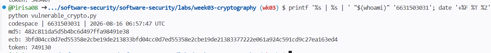
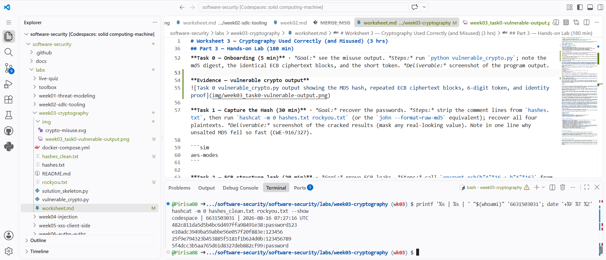
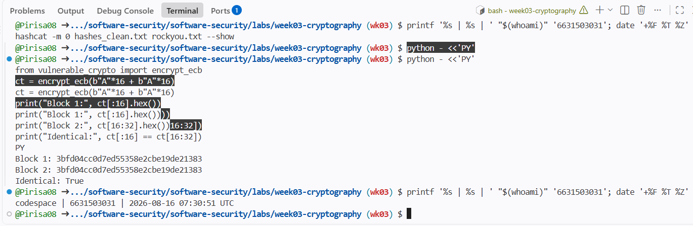
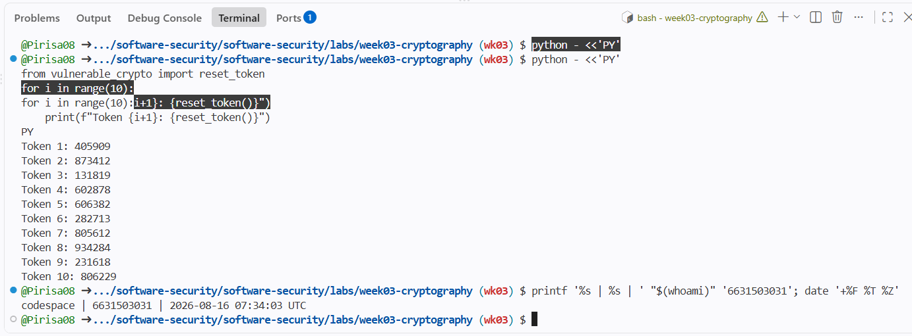
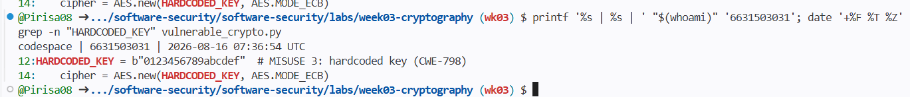
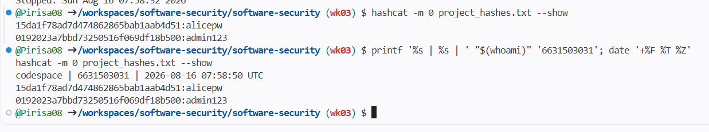
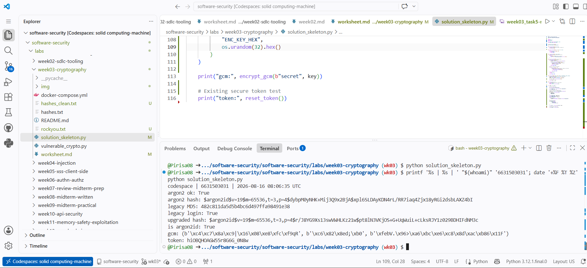
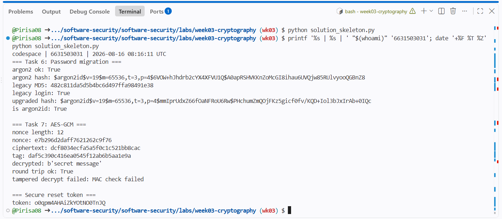
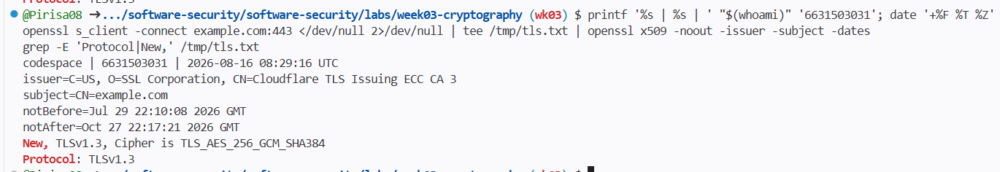
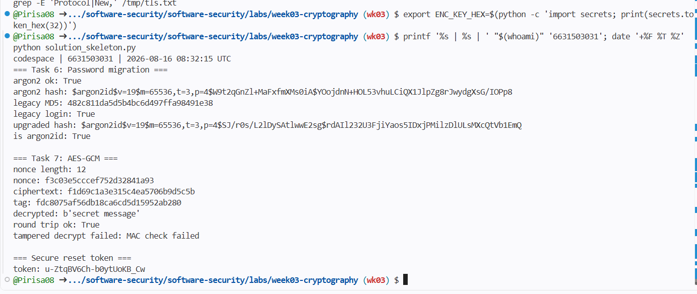

# Worksheet 3 — Cryptography Used Correctly (and Misused) (3 hrs)

> **Course:** Software Security (KOSEN69) · **Week 3**
> **Aligned to:** OWASP 2025 A04 Cryptographic Failures · CWE-327, CWE-916, CWE-330, CWE-798
> **Signature game:** "Capture the Hash" (recover plaintext from weak hashes)

> **Ethics note:** Crack only the hashes provided in `hashes.txt` on your own machine. Password-cracking against accounts or systems you don't own is illegal. Wordlists and recovered values stay inside the lab VM.

## Part 1 — Student Information
| Name | Stu dent ID | Date | Group |
|---|---|---|---|
| Pirisa Kitichai | 6631503031 | 16/08/2026 | - |

## Part 2 — Lecture Questions
Answer in your own words (2–4 sentences each).
1. Distinguish hashing, encryption, and encoding — and give one job each is the wrong tool for.
2. Why is a fast hash like MD5/SHA-1 a bad choice for storing passwords, and what should be used instead?
3. What is a salt, what attack does it defeat, and why must it be unique per password?
4. Why does AES-ECB leak structure, and what does an authenticated mode like AES-GCM add?
5. What's the difference between `random` and a CSPRNG (e.g. `secrets`), and where does it matter?

Part 2 — Lecture Questions ANS

1. Hashing is one-way, encryption can be reversed with a key, and encoding only changes data format. Hashing is wrong when we need the original data back, encryption is wrong for password storage, and encoding is wrong for protecting secrets.

2. MD5 and SHA-1 are too fast, so attackers can guess passwords quickly. Use Argon2id instead because it is designed for password storage.

3. A salt is a random value added before hashing a password. It prevents rainbow-table attacks and should be unique so the same password does not create the same hash.

4. AES-ECB leaks patterns because the same plaintext block creates the same ciphertext block. AES-GCM hides this pattern and also detects if the data was changed.

5. random is for normal random values and can be predictable. secrets is safer for security values like reset tokens, session tokens, and API keys.


## Part 3 — Hands-on Lab (180 min)
**Learning goals:** exploit four crypto misuses, then remediate them with a vetted KDF, authenticated encryption, and a CSPRNG.
**Prerequisites:** Docker (or local Python 3.12); `hashcat` or `john`; the `rockyou.txt` wordlist.

**Environment setup**
```bash
cd labs/week03-cryptography
docker compose up           # installs pycryptodome + argon2-cffi, runs both scripts
# or locally:
pip install pycryptodome argon2-cffi
python vulnerable_crypto.py # see the md5 hash, repeated ECB blocks, 6-digit token
```
Targets: `vulnerable_crypto.py` (the misuses), `hashes.txt` (four unsalted MD5s), and `solution_skeleton.py` (the fix).

**What to submit per task:** the command/payload run + a screenshot of the result + a 2–3 sentence mitigation.

**Task 0 — Onboarding (5 min)** · *Goal:* see the misuse output. *Steps:* run `python vulnerable_crypto.py`; note the md5 digest, the identical ECB ciphertext blocks, and the short token. *Deliverable:* screenshot of the program output.

**Evidence — vulnerable crypto output**


**Task 1 — Capture the Hash (30 min)** · *Goal:* recover the passwords. *Steps:* strip the comment lines from `hashes.txt`, then run `hashcat -m 0 hashes.txt rockyou.txt` (or the `john --format=raw-md5` equivalent); recover all four plaintexts. *Deliverable:* screenshot of the cracked results (mask any real-looking value). Note in one line why unsalted MD5 fell so fast (CWE-916/327).

```sim
aes-modes
```
**Result:** All four unsalted MD5 hashes were recovered using Hashcat with the rockyou.txt wordlist.



**Mitigation:** Unsalted MD5 is fast, so attackers can test many password guesses very quickly. Passwords should be stored using Argon2id with a unique salt instead. (CWE-916 / CWE-327)

**Task 2 — ECB structure leak (20 min)** · *Goal:* prove ECB leaks. *Steps:* call `encrypt_ecb(b"A"*16 + b"A"*16)` from `vulnerable_crypto.py` and show the two 16-byte ciphertext blocks are identical; explain how this leaks plaintext structure (CWE-327). *Deliverable:* hex output highlighting the repeated block.

**Result:** The two identical plaintext blocks produced identical ciphertext blocks.



**Mitigation:** AES-ECB leaks patterns because identical plaintext blocks produce identical ciphertext blocks. AES-GCM should be used instead to hide patterns and detect tampering. (CWE-327)

**Task 3 — Predictable token (15 min)** · *Goal:* show the reset token is guessable. *Steps:* call `reset_token()` repeatedly; argue why a 6-digit `random` token (10^6 space, non-CSPRNG) is brute-forceable (CWE-330). *Deliverable:* sample tokens + a one-line attack estimate.

**Result:** The reset function generated 6-digit tokens, so there are only 1,000,000 possible values.



**Attack estimate:** An attacker may need to try at most 1,000,000 tokens, so it can be brute-forced if there is no strong rate limiting.

**Mitigation:** `random` is not a CSPRNG and should not be used for security tokens. Use `secrets.token_urlsafe()` instead. (CWE-330)

**Task 4 — Hardcoded key (5 min)** · *Goal:* identify the key-management flaw. *Steps:* find `HARDCODED_KEY` in `vulnerable_crypto.py`; explain why shipping a key in source is CWE-798. *Deliverable:* the line + a 2-sentence mitigation.

**Result:** The encryption key is hardcoded directly in the source code.



**Mitigation:** Hardcoded keys can be exposed if the source code is leaked or shared. The key should be stored in an environment variable or secret manager instead. (CWE-798)

**Task 5 — Crack the project target's hashes (25 min)** · *Goal:* apply cracking to your term project. *Steps:* **NoteVault** stores unsalted MD5 password hashes; obtain them (via the app's `/admin` once you can reach it, or from its `seed()`), and crack them with `hashcat -m 0`. *Deliverable:* the recovered password(s) + note the CWE — record this finding for your project report (`project/REPORT-TEMPLATE.md` in the repo root).

**Result:** The NoteVault MD5 hashes were cracked and recovered as `alicepw` and `admin123`.



**Mitigation:** NoteVault stores passwords with unsalted MD5, which is fast to crack. It should use Argon2id with a unique salt instead. (CWE-916 / CWE-327)

**Task 6 — Password storage migration (25 min)** · *Goal:* fix it the way real apps do. *Steps:* write `store_password`/`verify_password` with **argon2id**, and a **rehash-on-login** path that upgrades a legacy MD5 record to argon2id the next time the user logs in. *Deliverable:* the code + a short note on why migration matters.

**Result:** The legacy MD5 password was successfully verified and upgraded to an Argon2id hash after login.



**Mitigation:** Rehash-on-login allows old MD5 accounts to move to Argon2id without forcing an immediate password reset. After a successful login, the new Argon2id hash should replace the old MD5 hash in the database.

**Task 7 — Authenticated encryption round-trip (20 min)** · *Goal:* use AEAD correctly. *Steps:* encrypt+decrypt a message with **AES-GCM** using a random 12-byte nonce and a key from an env var; then flip one ciphertext byte and show decryption **fails** (tag check). *Deliverable:* the round-trip output + the tampered-fails proof.

**Result:** AES-GCM successfully encrypted and decrypted the message using a random 12-byte nonce and a key from `ENC_KEY_HEX`. After changing one ciphertext byte, decryption failed with `MAC check failed`.



**Mitigation:** AES-GCM provides both confidentiality and integrity. If the ciphertext is modified, the authentication check fails and the data is rejected.

**Task 8 — TLS in practice (15 min)** · *Goal:* read a real cert. *Steps:* run `openssl s_client -connect example.com:443 </dev/null 2>/dev/null | tee /tmp/tls.txt | openssl x509 -noout -issuer -subject -dates` for the cert summary, then `grep -E 'Protocol|New,' /tmp/tls.txt` for the negotiated TLS version (the version line is printed by `s_client`, not by `x509`, so the plain pipe would discard it); identify issuer, validity, and that TLS version. *Deliverable:* the cert summary + one line on what TLS protects that hashing/at-rest encryption does not.

**Result:**
- Issuer: SSL Corporation, Cloudflare TLS Issuing ECC CA 3
- Valid from: Jul 29 22:10:08 2026 GMT
- Valid until: Oct 27 22:17:21 2026 GMT
- TLS version: TLSv1.3



**Explanation:** TLS protects data while it is being sent between the client and server. Hashing and at-rest encryption do not protect data while it is traveling over the network.

**Task 9 — Defend / fix it (20 min)** · *Goal:* remediate using `solution_skeleton.py`. *Steps:* run `python solution_skeleton.py`; confirm `store_password`/`verify_password` use argon2id (auto-salted), `encrypt_gcm` uses a random 12-byte nonce + auth tag with a key from `ENC_KEY_HEX` env, and `reset_token` uses `secrets`. Map each fix to the CWE it closes. *Deliverable:* before/after table (misuse → fix → CWE closed) + screenshot of the fixed script running.

| Misuse | Fix | CWE Closed |
|---|---|---|
| Unsalted MD5 | Argon2id with unique salt | CWE-916 / CWE-327 |
| AES-ECB | AES-GCM + random 12-byte nonce + tag | CWE-327 |
| `random` 6-digit token | `secrets.token_urlsafe(16)` | CWE-330 |
| Hardcoded key | `ENC_KEY_HEX` environment variable | CWE-798 |

**Code fix commit:**  
https://github.com/Pirisa08/software-security/commit/ca4eb6d



## Part 4 — Reflection
1. Map each of the four misuses to its CWE and to OWASP A04, in one line each.
ANS  Unsalted MD5 password hashing → CWE-916 / CWE-327 → OWASP A04 Cryptographic Failures.
     AES-ECB encryption → CWE-327 → OWASP A04 Cryptographic Failures.
     Predictable token using random → CWE-330 → OWASP A04 Cryptographic Failures.
     Hardcoded encryption key → CWE-798 → OWASP A04 Cryptographic Failures

2. Name a real-world breach caused by weak password hashing or hardcoded keys, and which fix here would have prevented it.
ANS  The Ashley Madison breach in 2015 exposed password-related data where a legacy MD5-based mechanism made millions 
      of passwords much easier to crack. Using Argon2id instead of MD5 would have made offline password 
      cracking much harder.

3. Across all four fixes, which closes the largest real-world risk, and why?
ANS  I think replacing MD5 with Argon2id closes the largest risk because stolen password databases can be cracked 
     very  quickly when fast hashes are used. Argon2id makes each password guess slower and more expensive, reducing the damage if the database is leaked.

## Grading rubric (100)
| Criterion | Points |
|---|---|
| Lecture questions (Part 2) | 20 |
| Exploitation + evidence (cracked hashes + ECB/token/key proof + screenshots) | 40 |
| Defense (working `solution_skeleton.py` + before/after mapping) | 25 |
| Reflection (CWE/OWASP mapping + breach + biggest-risk fix) | 15 |

---

## Evidence & Integrity (required)

- **Identity proof:** every screenshot/diagram must show a terminal running `printf '%s | %s | ' "$(whoami)" '<6631503031>'; date '+%F %T %Z'` **in the
  same image as the evidence**. When the evidence is a browser page, a DevTools panel or a
  rendered response, put that terminal **beside the browser and capture the whole screen** — a
  cropped window carries nothing that identifies you, and the lab's own output is
  byte-identical for the whole cohort *by design*, so the stamp is the only thing that makes
  the shot yours. Generic or borrowed evidence is not accepted.
- **Personalized flag (if this lab issues one):** ____________________
  *Flags are unique per student — submitting another student's flag is a violation. This blank is your personal record only; the flag itself is scored by submitting it in the **`ctf.zcr.ai`** challenge — the worksheet PDF is a separate submission, to **learn.zcr.ai/submit** (full guide: `SUBMISSION.md` in the repo root).*

- **Explain in your own words** *(graded on your reasoning, not copied text):*

  1. What did you do, and **why did the vulnerability work**?
  Ans. I tested the vulnerable code by cracking the MD5 hashes, showing repeated ECB blocks, generating weak reset tokens, and finding the hardcoded key. The vulnerabilities worked because MD5 is fast, ECB reveals repeated patterns, the token space is small, and the encryption key is exposed in the source code.

  2. **Why does your fix actually stop it** — and what could still break it?

  Ans. I replaced MD5 with Argon2id, ECB with AES-GCM, random with secrets, and moved the key to an environment variable. These fixes make password cracking harder and detect modified ciphertext, but security could still fail if keys are leaked, nonces are reused, or the application is configured incorrectly. 

---

## 🤖 Audit the AI (required)

AI is a power tool you must **distrust** — you are graded on your *critique*, not the AI's answer.

### 1. Ask an AI assistant to exploit or fix this week's vulnerability

**Prompt to AI:**

> How should I fix the AES-ECB and hardcoded encryption key problems in this Python program?

**AI Answer:**

```python
import os
from Crypto.Cipher import AES

key_hex = os.environ.get(
    "ENC_KEY_HEX",
    "00112233445566778899aabbccddeeff"
)

key = bytes.fromhex(key_hex)

def encrypt(data):
    nonce = b"\x00" * 12
    cipher = AES.new(key, AES.MODE_GCM, nonce=nonce)
    ciphertext, tag = cipher.encrypt_and_digest(data)
    return ciphertext, tag
```
The code changes AES-ECB to AES-GCM and reads the key from an environment variable. The fixed nonce can be reused when decrypting.

2. **Find what's wrong or risky** in it — insecure code, a subtly incomplete fix, a hallucinated API/function/CVE, a missed edge case, or wrong reasoning. Quote the exact line(s).

Wrong/risky line 1:
"00112233445566778899aabbccddeeff"

This is still a hardcoded fallback key. If ENC_KEY_HEX is missing, the program uses a known key, so CWE-798 is not fully fixed.

Wrong/risky line 2:
nonce = b"\x00" * 12

This reuses the same nonce for AES-GCM. A nonce should be unique for each encryption with the same key, otherwise AES-GCM security can break.

3. Produce the **correct, verified** version yourself and explain in 2–3 sentences why the AI's output was insufficient.

correct code ที่มีอยู่ใน solution_skeleton.py แล้วจาก Task 7:

def encrypt_gcm(data: bytes, key: bytes):
    nonce = os.urandom(12)
    cipher = AES.new(key, AES.MODE_GCM, nonce=nonce)
    ciphertext, tag = cipher.encrypt_and_digest(data)
    return nonce, ciphertext, tag

def decrypt_gcm(nonce, ciphertext, tag, key):
    cipher = AES.new(key, AES.MODE_GCM, nonce=nonce)
    return cipher.decrypt_and_verify(ciphertext, tag)

key = bytes.fromhex(os.environ["ENC_KEY_HEX"])

The corrected version requires the key from ENC_KEY_HEX and generates a fresh random 12-byte nonce for each encryption. I verified it by decrypting the original ciphertext successfully and then changing one ciphertext byte, which caused decryption to fail with MAC check failed.

Verified result:

nonce length: 12
round trip ok: True
tampered decrypt failed: MAC check failed

> Disclose your AI use in the Part 1 table. This task counts toward your **Defense + Reflection** score.

---

## 🧠 Comprehension & Prompt (required)

### A. Explain in Plain English (EiPE)

The vulnerable program stores passwords with weak MD5, uses AES-ECB that shows repeated patterns, keeps the encryption key in the source code, and creates short reset tokens. These weaknesses make passwords easier to crack, encrypted data patterns easier to see, keys easier to steal, and tokens easier to guess.

### B. Prompt Problem

**Final Prompt:**

> Fix the AES encryption in `solution_skeleton.py`. Use AES-GCM with a fresh random 12-byte nonce for every encryption, require the key from the `ENC_KEY_HEX` environment variable with no hardcoded fallback, return the nonce, ciphertext, and authentication tag, and add a decrypt function using `decrypt_and_verify`. Also add a test that decrypts the original message successfully and then changes one ciphertext byte to prove that tampered data is rejected.

**Verified Result:**

```text
nonce length: 12
decrypted: b'secret message'
round trip ok: True
tampered decrypt failed: MAC check failed
```

The exploit now fails because AES-GCM detects when the ciphertext has been changed. The normal message decrypted successfully, but the modified ciphertext was rejected with MAC check failed.