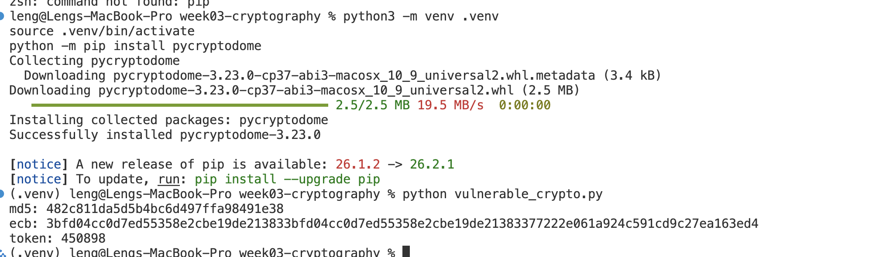
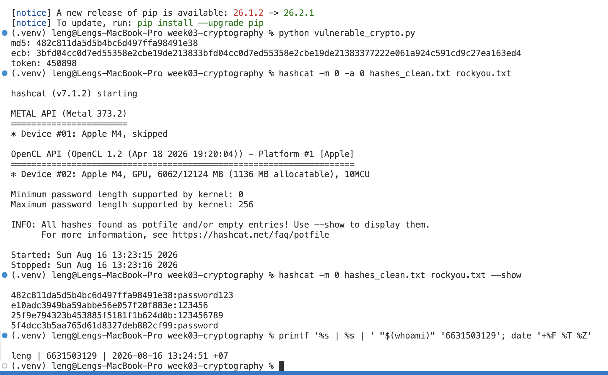
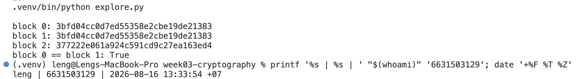
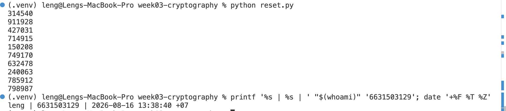
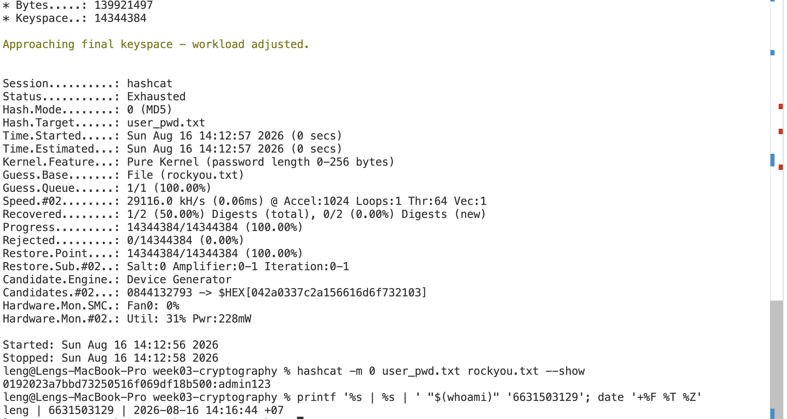
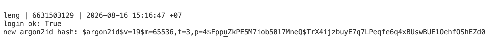
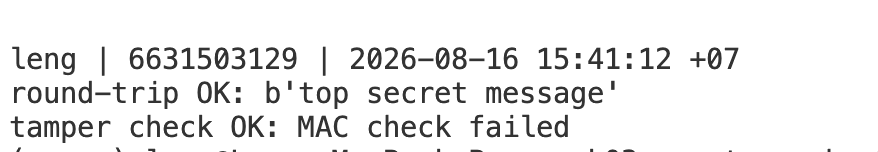
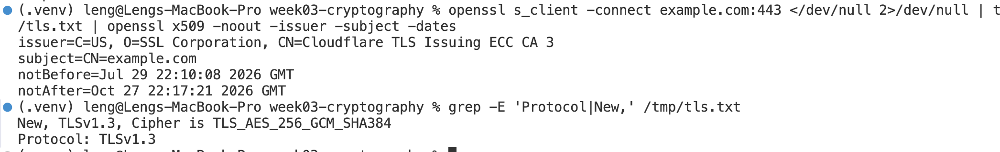
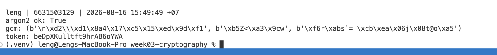

# Worksheet 3 — Cryptography Used Correctly (and Misused) (3 hrs)

> **Course:** Software Security (KOSEN69) · **Week 3**
> **Aligned to:** OWASP 2025 A04 Cryptographic Failures · CWE-327, CWE-916, CWE-330, CWE-798
> **Signature game:** "Capture the Hash" (recover plaintext from weak hashes)

> **Ethics note:** Crack only the hashes provided in `hashes.txt` on your own machine. Password-cracking against accounts or systems you don't own is illegal. Wordlists and recovered values stay inside the lab VM.

## Part 1 — Student Information
| Name | Student ID | Date | Group | AI use disclosure |
|---|---|---|---|---|
| Sai Shang Hlang | 6631503129 | 16 Aug 2026 | - | I used Codex to review the worksheet, improve the explanations, and check the cryptographic implementation. I reviewed the changes against the lab code and must capture the final evidence screenshots myself. |

## Part 2 — Lecture Questions
Answer in your own words (2–4 sentences each).
1. Distinguish hashing, encryption, and encoding — and give one job each is the wrong tool for.
   - **Hashing** is a one-way transformation to a fixed-size digest, so it is the wrong tool when the original data must be recovered. **Encryption** is reversible with the correct key, so it is the wrong way to store passwords because disclosure of one key could expose every password. **Encoding** only changes the representation of data and requires no secret, so Base64 or hexadecimal encoding must never be used to hide sensitive information.
2. Why is a fast hash like MD5/SHA-1 a bad choice for storing passwords, and what should be used instead?
   - MD5 and SHA-1 are unsuitable for password storage mainly because they are fast, allowing an attacker with a stolen database to test enormous numbers of guesses cheaply. Passwords should be processed with a password-hashing function such as Argon2id, using a unique automatic salt and an appropriate memory/time cost.
3. What is a salt, what attack does it defeat, and why must it be unique per password?
   - A salt is a random, non-secret value combined with a password before password hashing. A unique salt prevents reusable rainbow-table attacks and ensures that two users with the same password have different stored hashes, forcing attackers to crack each hash separately.

4. Why does AES-ECB leak structure, and what does an authenticated mode like AES-GCM add?
   - AES-ECB leaks structure because identical plaintext blocks under the same key produce identical ciphertext blocks. AES-GCM uses a unique nonce to hide these repetitions and adds an authentication tag so unauthorized modification is detected during decryption.
5. What's the difference between `random` and a CSPRNG (e.g. `secrets`), and where does it matter?
   - Python's `random` module is designed for simulation and can be predictable if its internal state or seed is learned. A cryptographically secure pseudorandom number generator such as `secrets` is required for password-reset tokens, session identifiers, cryptographic keys, and nonces because those values must remain infeasible to predict.


## Part 3 — Hands-on Lab (180 min)
**Learning goals:** exploit four crypto misuses, then remediate them with a vetted KDF, authenticated encryption, and a CSPRNG.
**Prerequisites:** Docker (or local Python 3.12); `hashcat` or `john`; the `rockyou.txt` wordlist.

**Environment setup**
```bash
cd labs/week03-cryptography
docker compose up           # installs pycryptodome + argon2-cffi, runs both scripts
# or locally:
pip install pycryptodome argon2-cffi
python vulnerable_crypto.py # see the md5 hash, repeated ECB blocks, 6-digit token
```

For the fixed script, provide a fresh 32-byte key through the environment before starting Compose:

```bash
export ENC_KEY_HEX="$(openssl rand -hex 32)"
docker compose up
```
Targets: `vulnerable_crypto.py` (the misuses), `hashes.txt` (four unsalted MD5s), and `solution_skeleton.py` (the fix).

**What to submit per task:** the command/payload run + a screenshot of the result + a 2–3 sentence mitigation.

**Task 0 — Onboarding (5 min)** · *Goal:* see the misuse output. *Steps:* run `python vulnerable_crypto.py`; note the md5 digest, the identical ECB ciphertext blocks, and the short token. *Deliverable:* screenshot of the program output.



**Mitigation note:** Replace unsalted MD5 with Argon2id, replace ECB with an authenticated mode such as AES-GCM, and generate security tokens with `secrets`. Cryptographic keys must come from controlled runtime configuration rather than source code.

> **Personal evidence required:** Replace `image.png` with a new screenshot that shows the identity command in the same image.

**Task 1 — Capture the Hash (30 min)** · *Goal:* recover the passwords. *Steps:* strip the comment lines from `hashes.txt`, then run `hashcat -m 0 hashes.txt rockyou.txt` (or the `john --format=raw-md5` equivalent); recover all four plaintexts. *Deliverable:* screenshot of the cracked results (mask any real-looking value). Note in one line why unsalted MD5 fell so fast (CWE-916/327).
Unsalted MD5 fell quickly because it is designed to run fast and the same password always produces the same digest, so hashcat can reuse a common-password wordlist without computing a separate salted search for each record. Argon2id adds a unique salt and deliberately expensive memory/time costs, making every password guess much more costly.


```sim
aes-modes
```

**Task 2 — ECB structure leak (20 min)** · *Goal:* prove ECB leaks. *Steps:* call `encrypt_ecb(b"A"*16 + b"A"*16)` from `vulnerable_crypto.py` and show the two 16-byte ciphertext blocks are identical; explain how this leaks plaintext structure (CWE-327). *Deliverable:* hex output highlighting the repeated block.

***block 0: 3bfd04cc0d7ed55358e2cbe19de21383
block 1: 3bfd04cc0d7ed55358e2cbe19de21383
***


The first two plaintext blocks are both sixteen `A` bytes, and ECB encrypts them into the same ciphertext block. An observer cannot immediately read the plaintext, but repeated ciphertext reveals repeated fields or visual structure; AES-GCM with a unique nonce prevents this pattern leakage and also authenticates the ciphertext.

**Task 3 — Predictable token (15 min)** · *Goal:* show the reset token is guessable. *Steps:* call `reset_token()` repeatedly; argue why a 6-digit `random` token (10^6 space, non-CSPRNG) is brute-forceable (CWE-330). 


- `reset_token()` chooses six digits, so there are only 1,000,000 possible values. Without rate limiting, an attacker capable of 100 guesses per second could try the entire space in about 10,000 seconds (2.8 hours), or succeed on average in about 1.4 hours.

**Mitigation note:** Generate reset tokens with `secrets.token_urlsafe(16)` or a similarly strong CSPRNG and make them single-use with a short expiration time. The reset endpoint must also enforce rate limits so online guessing is not practical.

*Deliverable:* sample tokens + a one-line attack estimate.

**Task 4 — Hardcoded key (5 min)** · *Goal:* identify the key-management flaw. *Steps:* find `HARDCODED_KEY` in `vulnerable_crypto.py`; explain why shipping a key in source is CWE-798. *Deliverable:* the line + a 2-sentence mitigation.

Line 12 HARDCODED_KEY = b"0123456789abcdef" 

The encryption key is written directly in the code (HARDCODED_KEY), so anyone who sees the source like on GitHub, can read the key and decrypt everything. The fix is to keep the key out of the code and load it from an environment variable instead, so it stays secret and can be changed without editing the code.

> **Personal evidence required:** Add a screenshot of the source line and the identity command in the same image.


**Task 5 — Crack the project target's hashes (25 min)** · *Goal:* apply cracking to your term project. *Steps:* **NoteVault** stores unsalted MD5 password hashes; obtain them (via the app's `/admin` once you can reach it, or from its `seed()`), and crack them with `hashcat -m 0`. *Deliverable:* the recovered password(s) + note the CWE — record this finding for your project report (`project/REPORT-TEMPLATE.md` in the repo root).


CWE-916 (Use of Password Hash With Insufficient Computational Effort)

CWE-327 (Use of a Broken or Risky Cryptographic Algorithm) 

NoteVault stores passwords as unsalted MD5 in `seed()`, `register()`, and `login()`, even though MD5 was never designed for password storage. The two seeded credentials are `alice` → `alicepw` and `admin` → `admin123`; the existing screenshot proves the admin recovery, but the final evidence must also show the Alice recovery using a targeted local wordlist.

**Mitigation note:** Store new passwords with Argon2id and transparently upgrade a verified legacy MD5 record on the user's next login. After the migration window, disable MD5 verification and require resets for accounts that never returned.


**Task 6 — Password storage migration (25 min)** · *Goal:* fix it the way real apps do. *Steps:* write `store_password`/`verify_password` with **argon2id**, and a **rehash-on-login** path that upgrades a legacy MD5 record to argon2id the next time the user logs in. *Deliverable:* the code + a short note on why migration matters.

```python
def verify_and_upgrade(stored_hash: str, pw: str) -> tuple[bool, str | None]:
    if stored_hash.startswith("$argon2id"):
        if not verify_password(stored_hash, pw):
            return False, None
        if ph.check_needs_rehash(stored_hash):
            return True, store_password(pw)
        return True, None

    candidate = hashlib.md5(pw.encode()).hexdigest()
    if hmac.compare_digest(candidate, stored_hash):
        return True, store_password(pw)
    return False, None
```



Forcing every user to reset their password immediately would be disruptive and many wouldn't comply, leaving legacy MD5 hashes exposed indefinitely. Rehash-on-login upgrades each user's hash to argon2id transparently the next time they authenticate — using the plaintext password the server only ever sees at login time anyway — so the migration completes gradually with zero forced resets.

The corrected migration verifies an existing Argon2id record normally, upgrades a matching legacy MD5 record, and returns no replacement hash for an incorrect password. Only the successful-login path should write the returned Argon2id value back to the database.

> **Personal evidence required:** Retain a stamped screenshot proving successful legacy verification and the new `$argon2id$` hash.

**Task 7 — Authenticated encryption round-trip (20 min)** · *Goal:* use AEAD correctly. *Steps:* encrypt+decrypt a message with **AES-GCM** using a random 12-byte nonce and a key from an env var; then flip one ciphertext byte and show decryption **fails** (tag check). *Deliverable:* the round-trip output + the tampered-fails proof.



AES-GCM provides confidentiality and integrity together: the correct key, nonce, ciphertext, and tag reproduce the original message, while changing one ciphertext byte causes `decrypt_and_verify()` to raise an error. A fresh nonce must be generated for every message under a given key because nonce reuse can break GCM's security.

**Task 8 — TLS in practice (15 min)** · *Goal:* read a real cert. *Steps:* run `openssl s_client -connect example.com:443 </dev/null 2>/dev/null | tee /tmp/tls.txt | openssl x509 -noout -issuer -subject -dates` for the cert summary, then `grep -E 'Protocol|New,' /tmp/tls.txt` for the negotiated TLS version (the version line is printed by `s_client`, not by `x509`, so the plain pipe would discard it); identify issuer, validity, and that TLS version. *Deliverable:* the cert summary + one line on what TLS protects that hashing/at-rest encryption does not.



The observed certificate has subject `example.com`, issuer `Cloudflare TLS Issuing ECC CA 3`, and validity from 29 July 2026 through 27 October 2026; the connection negotiated TLS 1.3. TLS protects data in transit against network eavesdropping and tampering and authenticates the remote endpoint, while hashing and at-rest encryption alone do not protect traffic moving across the network.

> **Personal evidence required:** Replace `image-8.png` with a screenshot that includes the identity command in the same image.


**Task 9 — Defend / fix it (20 min)** · *Goal:* remediate using `solution_skeleton.py`. *Steps:* run `python solution_skeleton.py`; confirm `store_password`/`verify_password` use argon2id (auto-salted), `encrypt_gcm` uses a random 12-byte nonce + auth tag with a key from `ENC_KEY_HEX` env, and `reset_token` uses `secrets`. Map each fix to the CWE it closes. *Deliverable:* before/after table (misuse → fix → CWE closed) + screenshot of the fixed script running.



| # | Misuse (before) | Fix (after) | CWE closed |
|---|---|---|---|
| 1 | `hashlib.md5(pw)` — fast, unsalted hash for passwords | `PasswordHasher().hash(pw)` — argon2id, auto-salted, slow/memory-hard | CWE-916 (weak password hash) / CWE-327 (broken crypto algorithm) |
| 2 | `AES.new(key, AES.MODE_ECB)` — identical blocks produce identical ciphertext, no integrity check | `AES.new(key, AES.MODE_GCM, nonce=...)` with `encrypt_and_digest`/`decrypt_and_verify` — random nonce per message, authenticated (tamper-evident) | CWE-327 (broken/risky crypto algorithm — ECB mode) |
| 3 | `random.choice(...)` 6-digit token — Mersenne Twister PRNG, only 10^6 space | `secrets.token_urlsafe(16)` — OS-level CSPRNG, effectively unguessable | CWE-330 (use of insufficiently random values) |
| 4 | `HARDCODED_KEY = b"0123456789abcdef"` — key baked into source | key loaded from `ENC_KEY_HEX` environment variable at runtime | CWE-798 (use of hardcoded credentials) |

The fixed script requires `ENC_KEY_HEX` to decode to exactly 32 bytes instead of silently creating a temporary key. It also demonstrates an Argon2id migration, an AES-GCM round trip, rejection of modified ciphertext, and a CSPRNG reset token.

**Code-fix commit:** [`c9e6b17`](https://github.com/Leng201202/software-security/commit/c9e6b17b341b99ac036ddf12ec9b5af634820ce8)

## Part 4 — Reflection
1. Map each of the four misuses to its CWE and to OWASP A04, in one line each.
   - Unsalted, fast MD5 password storage maps to **CWE-916** and **CWE-327**, and to **OWASP A04 Cryptographic Failures**, because stolen hashes can be guessed cheaply.
   - AES-ECB maps to **CWE-327** and OWASP A04 because the risky mode leaks repeated plaintext structure and supplies no authenticity check.
   - A six-digit token generated by `random` maps to **CWE-330** and OWASP A04 because the value has a small search space and is not generated by a CSPRNG.
   - A source-code encryption key maps to **CWE-798** and OWASP A04 because every copy of the source or image exposes the secret needed to decrypt protected data.
2. Name a real-world breach caused by weak password hashing or hardcoded keys, and which fix here would have prevented it.
   - LinkedIn's 2012 breach exposed unsalted password hashes; the UK Information Commissioner's Office reports that the use of unsalted SHA-1 allowed most passwords to be cracked rapidly. Argon2id with a unique salt and suitable memory/time cost would have made large-scale offline guessing much more expensive. Source: [ICO password guidance](https://ico.org.uk/for-organisations/uk-gdpr-guidance-and-resources/security/a-guide-to-data-security/passwords-in-online-services/).
3. Across all four fixes, which closes the largest real-world risk, and why?
   - Migrating password storage to Argon2id closes the largest risk because a password database is a high-value bulk target and users frequently reuse passwords across services. AES-GCM, CSPRNG tokens, and external key management are also necessary, but slowing every offline password guess reduces the impact of one database theft across all user accounts.

## Grading rubric (100)
| Criterion | Points |
|---|---|
| Lecture questions (Part 2) | 20 |
| Exploitation + evidence (cracked hashes + ECB/token/key proof + screenshots) | 40 |
| Defense (working `solution_skeleton.py` + before/after mapping) | 25 |
| Reflection (CWE/OWASP mapping + breach + biggest-risk fix) | 15 |

---

## Evidence & Integrity (required)

- **Identity proof:** every screenshot/diagram must show a terminal running `printf '%s | %s | ' "$(whoami)" '<YOUR-STUDENT-ID>'; date '+%F %T %Z'` **in the
  same image as the evidence**. When the evidence is a browser page, a DevTools panel or a
  rendered response, put that terminal **beside the browser and capture the whole screen** — a
  cropped window carries nothing that identifies you, and the lab's own output is
  byte-identical for the whole cohort *by design*, so the stamp is the only thing that makes
  the shot yours. Generic or borrowed evidence is not accepted.
- **Personalized flag (if this lab issues one):** ____________________
  *Flags are unique per student — submitting another student's flag is a violation. This blank is your personal record only; the flag itself is scored by submitting it in the **`ctf.zcr.ai`** challenge — the worksheet PDF is a separate submission, to **learn.zcr.ai/submit** (full guide: `SUBMISSION.md` in the repo root).*
- **Explain in your own words** *(graded on your reasoning, not copied text):*
  1. What did you do, and **why did the vulnerability work**?
  2. **Why does your fix actually stop it** — and what could still break it?

---

## 🤖 Audit the AI (required)

AI is a power tool you must **distrust** — you are graded on your *critique*, not the AI's answer.

1. Ask an AI assistant to exploit **or** fix this week's vulnerability. Paste its full answer.
2. **Find what's wrong or risky** in it — insecure code, a subtly incomplete fix, a hallucinated API/function/CVE, a missed edge case, or wrong reasoning. Quote the exact line(s).
3. Produce the **correct, verified** version yourself and explain in 2–3 sentences why the AI's output was insufficient.

> Disclose your AI use in the Part 1 table. This task counts toward your **Defense + Reflection** score.

### AI answer received

> Replace ECB with GCM like this:
> ```python
> key = bytes.fromhex(os.getenv("ENC_KEY_HEX", "00" * 32))
> nonce = b"0" * 12
> cipher = AES.new(key, AES.MODE_GCM, nonce=nonce)
> ciphertext, tag = cipher.encrypt_and_digest(data)
> ```
> The authentication tag means this is now secure.

### My audit

The dangerous lines are `os.getenv("ENC_KEY_HEX", "00" * 32)` and `nonce = b"0" * 12`. The fallback is a public hardcoded key, and reusing a fixed nonce with AES-GCM can reveal relationships between plaintexts and undermine authentication, so merely adding a tag does not make this design secure.

### Corrected and verified version

The corrected implementation refuses to start without a valid 32-byte `ENC_KEY_HEX` value and generates a fresh 12-byte nonce with `secrets.token_bytes(12)` for each encryption. Decryption uses `decrypt_and_verify()`, so the correct ciphertext completes a round trip while a one-byte modification is rejected; the final stamped screenshot must show both results.

---

## 🧠 Comprehension & Prompt (required)

**A. Explain in Plain English (EiPE).** In 2–3 sentences, in your own words, describe what this week's vulnerable code/endpoint actually *does* and *why it is exploitable* — explain the mechanism, don't dump jargon.

The vulnerable script stores passwords with a very fast unsalted hash, encrypts repeated blocks in a way that leaves visible patterns, generates reset codes from a predictable non-security random generator, and places its encryption key directly in the source. An attacker who obtains the hashes or source can therefore guess passwords quickly, identify patterns, predict or brute-force reset codes, and recover the encryption key.

**B. Prompt Problem.** Write a **single prompt** that makes an AI produce a *correct, secure* fix for one finding. Run it: does the exploit now fail? If not, refine the prompt and try again. Submit the **final prompt + the verified result**.
*Graded on the prompt's precision and your verification — this trains problem decomposition and AI literacy (Denny et al. 2024).*

**Final prompt:**

> Complete `solution_skeleton.py` using Argon2id with automatic salts for password storage, a rehash-on-login function that upgrades valid legacy MD5 records, AES-256-GCM with a fresh 12-byte CSPRNG nonce for every message, a required 64-hex-character `ENC_KEY_HEX` environment variable with no fallback key, authenticated decryption that rejects a modified ciphertext, and `secrets.token_urlsafe(16)` for reset tokens. Catch only expected Argon2 verification errors, compare the legacy MD5 digest with `hmac.compare_digest()`, and add tests for valid and invalid passwords, migration, encryption round trip, tamper rejection, key validation, and token length.

**Automated verification:** `python -m unittest -v test_solution.py` passes all six tests for password verification, legacy migration, fresh GCM nonces, tamper rejection, key validation, and token generation. Running the fixed script also prints successful Argon2 verification and migration, `gcm round-trip: b'secret'`, `tamper check: rejected`, and a long URL-safe token; rerun these commands and capture your own identity-stamped output before submission.

---

## Personal evidence still required before submission

The written corrections cannot replace personal evidence. Retake or add screenshots for Tasks 0, 4, 5 (both NoteVault credentials), 6, 8, and the final fixed-script run, with this command visible in every image:

```bash
printf '%s | %s | ' "$(whoami)" '6631503129'; date '+%F %T %Z'
```
