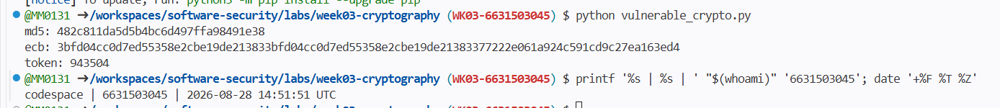
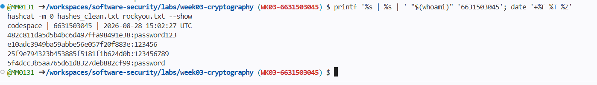
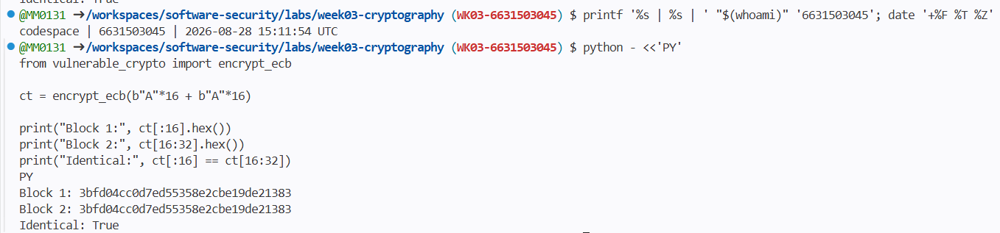
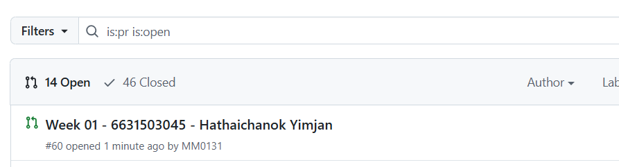
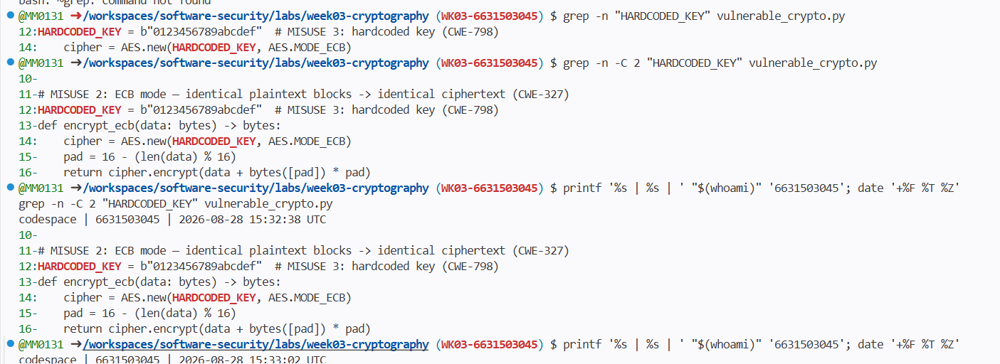
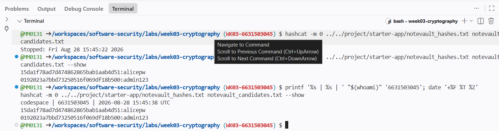
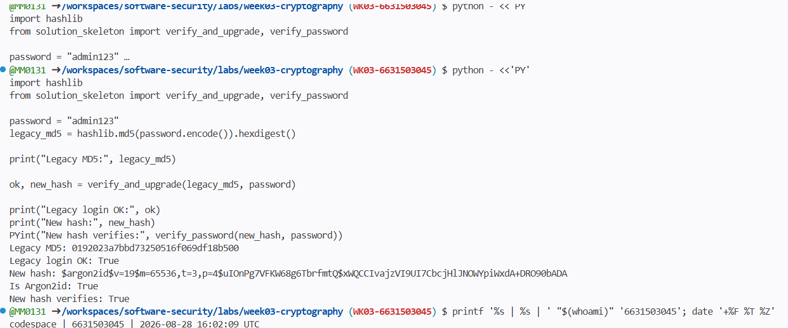
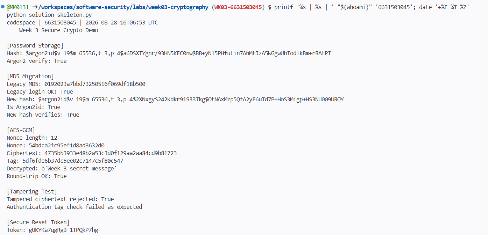
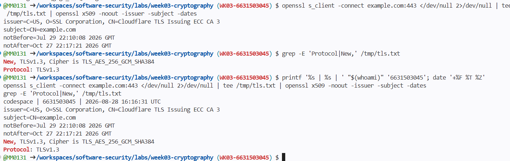
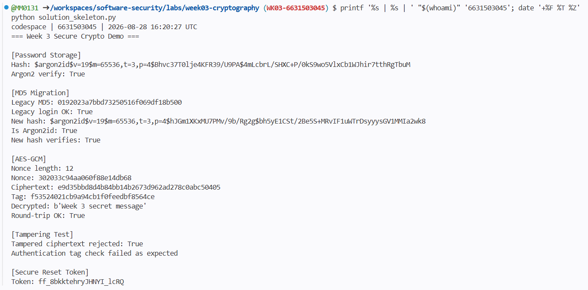

# Worksheet 3 — Cryptography Used Correctly (and Misused) (3 hrs)

> **Course:** Software Security (KOSEN69) · **Week 3**
> **Aligned to:** OWASP 2025 A04 Cryptographic Failures · CWE-327, CWE-916, CWE-330, CWE-798
> **Signature game:** "Capture the Hash" (recover plaintext from weak hashes)

> **Ethics note:** Crack only the hashes provided in `hashes.txt` on your own machine. Password-cracking against accounts or systems you don't own is illegal. Wordlists and recovered values stay inside the lab VM.

## Part 1 — Student Information
| Name | Student ID | Date | Group |
|---|---|---|---|
|Hataichanok Yimyan | 6631503045 |28/08| - |

## Part 2 — Lecture Questions
Answer in your own words (2–4 sentences each).
1. Distinguish hashing, encryption, and encoding — and give one job each is the wrong tool for.
2. Why is a fast hash like MD5/SHA-1 a bad choice for storing passwords, and what should be used instead?
3. What is a salt, what attack does it defeat, and why must it be unique per password?
4. Why does AES-ECB leak structure, and what does an authenticated mode like AES-GCM add?
5. What's the difference between `random` and a CSPRNG (e.g. `secrets`), and where does it matter?

ANS ## Part 2 — Lecture Questions

1. Hashing converts data into a fixed-length value and is designed to be one-way, while encryption can be reversed with the correct key. Encoding only changes the data format for compatibility or transport. Hashing is the wrong tool for hiding data that must be recovered, encryption is wrong for password storage, and encoding is wrong for protecting secrets.

2. MD5 and SHA-1 are too fast, so attackers can try a huge number of password guesses very quickly if the hashes are stolen. Passwords should instead be stored using a slow password-hashing algorithm such as Argon2id, bcrypt, or scrypt.

3. A salt is a random value added to a password before hashing. It prevents identical passwords from producing identical stored hashes and makes precomputed attacks such as rainbow tables much less useful. Each password needs a unique salt so attackers cannot reuse the same cracking work across many accounts.

4. AES-ECB encrypts identical plaintext blocks into identical ciphertext blocks, so repeated patterns in the original data can still be visible. AES-GCM adds authenticated encryption, which protects both confidentiality and integrity and can detect if the ciphertext has been modified.

5. Python's `random` module is designed for general-purpose randomness and its output may be predictable, so it should not be used for security-sensitive values. A CSPRNG such as `secrets` is designed to generate unpredictable values and should be used for reset tokens, session tokens, API keys, and other security credentials.


## Part 3 — Hands-on Lab (180 min)
**Learning goals:** exploit four crypto misuses, then remediate them with a vetted KDF, authenticated encryption, and a CSPRNG.
**Prerequisites:** Docker (or local Python 3.12); `hashcat` or `john`; the `rockyou.txt` wordlist.

**Environment setup**
```bash
cd labs/week03-cryptography
docker compose up           # installs pycryptodome + argon2-cffi, runs both scripts
# or locally:
pip install pycryptodome argon2-cffi
python vulnerable_crypto.py # see the md5 hash, repeated ECB blocks, 6-digit token
```
Targets: `vulnerable_crypto.py` (the misuses), `hashes.txt` (four unsalted MD5s), and `solution_skeleton.py` (the fix).

**What to submit per task:** the command/payload run + a screenshot of the result + a 2–3 sentence mitigation.

**Task 0 — Onboarding (5 min)** · *Goal:* see the misuse output. *Steps:* run `python vulnerable_crypto.py`; note the md5 digest, the identical ECB ciphertext blocks, and the short token. *Deliverable:* screenshot of the program output.



**Task 1 — Capture the Hash (30 min)** · *Goal:* recover the passwords. *Steps:* strip the comment lines from `hashes.txt`, then run `hashcat -m 0 hashes.txt rockyou.txt` (or the `john --format=raw-md5` equivalent); recover all four plaintexts. *Deliverable:* screenshot of the cracked results (mask any real-looking value). Note in one line why unsalted MD5 fell so fast (CWE-916/327).

```sim
aes-modes
```


**Task 2 — ECB structure leak (20 min)** · *Goal:* prove ECB leaks. *Steps:* call `encrypt_ecb(b"A"*16 + b"A"*16)` from `vulnerable_crypto.py` and show the two 16-byte ciphertext blocks are identical; explain how this leaks plaintext structure (CWE-327). *Deliverable:* hex output highlighting the repeated block.

ANS ## Task 2 — ECB Structure Leak

**Command:**

```bash
python - <<'PY'
from vulnerable_crypto import encrypt_ecb

ct = encrypt_ecb(b"A"*16 + b"A"*16)

print("Block 1:", ct[:16].hex())
print("Block 2:", ct[16:32].hex())
print("Identical:", ct[:16] == ct[16:32])
PY
```


**Task 3 — Predictable token (15 min)** · *Goal:* show the reset token is guessable. *Steps:* call `reset_token()` repeatedly; argue why a 6-digit `random` token (10^6 space, non-CSPRNG) is brute-forceable (CWE-330). *Deliverable:* sample tokens + a one-line attack estimate.

ANS ## Task 3 — Predictable Token

**Command:**

```bash
python - <<'PY'
from vulnerable_crypto import reset_token

for i in range(10):
    print(f"Token {i+1}: {reset_token()}")
PY
```
Result:

The application generated short 6-digit reset tokens using Python's random module.

Attack estimate:

A 6-digit numeric token has only 1,000,000 possible values. An attacker who can make repeated guesses could brute-force this space, especially if the application has no rate limiting or lockout protection.

Explanation:

Python's random module is designed for simulation and general-purpose randomness, not for security-sensitive values. Password reset tokens should be generated with a cryptographically secure random number generator such as Python's secrets module. This issue maps to CWE-330.


ถ้าจะเขียน attack estimate ให้ชัดขึ้นอีกนิด:

```text
10^6 possible tokens = 1,000,000 guesses maximum

ถ้าทายเฉลี่ยก็ประมาณครึ่งหนึ่ง:

~500,000 guesses on average
```


**Task 4 — Hardcoded key (5 min)**· *Goal:* identify the key-management flaw. *Steps:* find `HARDCODED_KEY` in `vulnerable_crypto.py`; explain why shipping a key in source is CWE-798. *Deliverable:* the line + a 2-sentence mitigation.

ANS ## Task 4 — Hardcoded Key

**Command:**

```bash
grep -n -C 2 "HARDCODED_KEY" vulnerable_crypto.py
Finding:

The encryption key is hardcoded directly inside vulnerable_crypto.py.

Explanation:

Hardcoding a cryptographic key in source code is insecure because anyone who can access the source code, repository history, or packaged application may recover the key. This issue maps to CWE-798 because the secret credential is embedded directly in the application instead of being managed separately.

Mitigation:

The encryption key should be stored outside the source code, such as in an environment variable or a dedicated secrets-management system. The application should load the key at runtime and the secret should never be committed to the repository.


สรุปสั้น ๆ ที่อาจารย์อยากเห็นคือ:

```text
Hardcoded key in source
→ source/repo leaked
→ encryption key leaked
→ encrypted data can potentially be decrypted

และ fix คือ:

HARDCODED_KEY
↓
environment variable / secret manager
```


**Task 5 — Crack the project target's hashes (25 min)** · *Goal:* apply cracking to your term project. *Steps:* **NoteVault** stores unsalted MD5 password hashes; obtain them (via the app's `/admin` once you can reach it, or from its `seed()`), and crack them with `hashcat -m 0`. *Deliverable:* the recovered password(s) + note the CWE — record this finding for your project report (`project/REPORT-TEMPLATE.md` in the repo root).

ANS  **Recovered passwords:**

- `alice` → `alicepw`
- `admin` → `admin123`

`admin123` was recovered using the RockYou wordlist. `alicepw` was not present in RockYou, so a small candidate list based on the application's seeded default credentials was used to verify that the MD5 hash can also be recovered with Hashcat.

The finding demonstrates that NoteVault stores passwords using unsalted MD5. MD5 is fast to compute, allowing attackers to test password candidates very quickly if the password database is exposed. This maps to CWE-916 and CWE-327.



**Task 6 — Password storage migration (25 min)** · *Goal:* fix it the way real apps do. *Steps:* write `store_password`/`verify_password` with **argon2id**, and a **rehash-on-login** path that upgrades a legacy MD5 record to argon2id the next time the user logs in. *Deliverable:* the code + a short note on why migration matters.

ANS **Implementation:**

The password storage was migrated from legacy MD5 to Argon2id using `PasswordHasher`.  
New passwords are automatically salted and hashed with Argon2id.

A rehash-on-login flow was also added. If a legacy MD5 password is verified successfully, the application immediately creates a new Argon2id hash so the stored password can be upgraded.

**Verification command:**

```bash
printf '%s | %s | ' "$(whoami)" '6631503045'; date '+%F %T %Z'
python solution_skeleton.py
```


**Task 7 — Authenticated encryption round-trip (20 min)** · *Goal:* use AEAD correctly. *Steps:* encrypt+decrypt a message with **AES-GCM** using a random 12-byte nonce and a key from an env var; then flip one ciphertext byte and show decryption **fails** (tag check). *Deliverable:* the round-trip output + the tampered-fails proof.
ANS ## Task 7 — Authenticated Encryption Round-Trip

AES-GCM was used with a random 12-byte nonce and a key loaded from `ENC_KEY_HEX`.

**Command:**
```bash
export ENC_KEY_HEX=$(python -c "import secrets; print(secrets.token_hex(32))")
printf '%s | %s | ' "$(whoami)" '6631503045'; date '+%F %T %Z'
python solution_skeleton.py

Result:

Nonce length: 12
Round-trip OK: True
Tampered ciphertext rejected: True

Explanation:
AES-GCM successfully decrypted the original ciphertext, but rejected the modified ciphertext because the authentication tag no longer matched. This provides both confidentiality and integrity.
```


**Task 8 — TLS in practice (15 min)** · *Goal:* read a real cert. *Steps:* run `openssl s_client -connect example.com:443 </dev/null 2>/dev/null | tee /tmp/tls.txt | openssl x509 -noout -issuer -subject -dates` for the cert summary, then `grep -E 'Protocol|New,' /tmp/tls.txt` for the negotiated TLS version (the version line is printed by `s_client`, not by `x509`, so the plain pipe would discard it); identify issuer, validity, and that TLS version. *Deliverable:* the cert summary + one line on what TLS protects that hashing/at-rest encryption does not.

ANS ## Task 8 — TLS in Practice

**Commands:**
```bash
openssl s_client -connect example.com:443 </dev/null 2>/dev/null | tee /tmp/tls.txt | openssl x509 -noout -issuer -subject -dates
grep -E 'Protocol|New,' /tmp/tls.txt

Result:

Issuer: [copy from terminal]
Validity: [notBefore] to [notAfter]
TLS version: [copy from terminal]

Explanation:
TLS protects data while it is transmitted between the client and server by providing encryption and integrity in transit. Password hashing protects stored passwords, while at-rest encryption protects stored data rather than network traffic.
```


**Task 9 — Defend / fix it (20 min)** · *Goal:* remediate using `solution_skeleton.py`. *Steps:* run `python solution_skeleton.py`; confirm `store_password`/`verify_password` use argon2id (auto-salted), `encrypt_gcm` uses a random 12-byte nonce + auth tag with a key from `ENC_KEY_HEX` env, and `reset_token` uses `secrets`. Map each fix to the CWE it closes. *Deliverable:* before/after table (misuse → fix → CWE closed) + screenshot of the fixed script running.

ANS ## Task 9 — Defend / Fix It

**Command:**
```bash
export ENC_KEY_HEX=$(python -c "import secrets; print(secrets.token_hex(32))")
python solution_skeleton.py

Misuse	Fix	CWE Closed
Unsalted MD5 password hashing	Argon2id with automatic salt	CWE-916 / CWE-327
AES-ECB encryption	AES-GCM with random 12-byte nonce and authentication tag	CWE-327
Predictable random reset token	secrets.token_urlsafe()	CWE-330
Hardcoded encryption key	Load key from ENC_KEY_HEX environment variable	CWE-798

Result:

The fixed script successfully verified Argon2id passwords, encrypted and decrypted data using AES-GCM, rejected tampered ciphertext, and generated reset tokens using a CSPRNG.
```


## Part 4 — Reflection

### 1. Map each of the four misuses to its CWE and OWASP A04

- Unsalted MD5 password hashing → **CWE-916 / CWE-327** → OWASP A04 because MD5 is too fast and unsuitable for secure password storage.
- AES-ECB encryption → **CWE-327** → OWASP A04 because ECB leaks plaintext patterns and does not provide authenticated encryption.
- Predictable reset token using `random` → **CWE-330** → OWASP A04 because security-sensitive tokens require cryptographically secure randomness.
- Hardcoded encryption key → **CWE-798** → OWASP A04 because storing keys directly in source code can expose the secret if the code is leaked.

### 2. Real-world breach

A real-world example is the **2012 LinkedIn breach**, where password hashes were stored using unsalted SHA-1 and many passwords were later cracked. Using **Argon2id with a unique salt and an appropriate computational cost** would have made offline password cracking significantly more difficult.

### 3. Fix with the largest real-world risk reduction

The **Argon2id password-storage fix** provides the largest real-world risk reduction because a stolen password database can affect many users at once, especially when passwords are reused across services. Argon2id with unique salts and a high computational cost makes large-scale offline password cracking much more expensive than MD5.

## Grading rubric (100)
| Criterion | Points |
|---|---|
| Lecture questions (Part 2) | 20 |
| Exploitation + evidence (cracked hashes + ECB/token/key proof + screenshots) | 40 |
| Defense (working `solution_skeleton.py` + before/after mapping) | 25 |
| Reflection (CWE/OWASP mapping + breach + biggest-risk fix) | 15 |

---

## Evidence & Integrity (required)

- **Identity proof:** every screenshot/diagram must show a terminal running `printf '%s | %s | ' "$(whoami)" '<YOUR-STUDENT-ID>'; date '+%F %T %Z'` **in the
  same image as the evidence**. When the evidence is a browser page, a DevTools panel or a
  rendered response, put that terminal **beside the browser and capture the whole screen** — a
  cropped window carries nothing that identifies you, and the lab's own output is
  byte-identical for the whole cohort *by design*, so the stamp is the only thing that makes
  the shot yours. Generic or borrowed evidence is not accepted.
- **Personalized flag (if this lab issues one):** ____________________
  *Flags are unique per student — submitting another student's flag is a violation. This blank is your personal record only; the flag itself is scored by submitting it in the **`ctf.zcr.ai`** challenge — the worksheet PDF is a separate submission, to **learn.zcr.ai/submit** (full guide: `SUBMISSION.md` in the repo root).*
- **Explain in your own words** *(graded on your reasoning, not copied text):*
  1. What did you do, and **why did the vulnerability work**?
  2. **Why does your fix actually stop it** — and what could still break it?

---

## 🤖 Audit the AI (required)

AI is a power tool you must **distrust** — you are graded on your *critique*, not the AI's answer.

1. Ask an AI assistant to exploit **or** fix this week's vulnerability. Paste its full answer.

## 🤖 Audit the AI

### 1. AI Answer

I asked an AI assistant to fix the AES encryption and hardcoded-key problem.

**AI answer:**

```python
import os
from Crypto.Cipher import AES

def encrypt_gcm(data):
    key = bytes.fromhex(
        os.getenv("ENC_KEY_HEX", "00" * 32)
    )

    nonce = os.urandom(12)
    cipher = AES.new(key, AES.MODE_GCM, nonce=nonce)
    ciphertext, tag = cipher.encrypt_and_digest(data)

    return nonce, ciphertext, tag

    The AI explained that AES-GCM provides authenticated encryption and that using an environment variable prevents the key from being hardcoded.

2. **Find what's wrong or risky** in it — insecure code, a subtly incomplete fix, a hallucinated API/function/CVE, a missed edge case, or wrong reasoning. Quote the exact line(s).

The risky line was:

os.getenv("ENC_KEY_HEX", "00" * 32)

Although the code tries to use an environment variable, it silently falls back to a fixed all-zero key when ENC_KEY_HEX is missing. This is effectively still a hardcoded key and means the application could encrypt data with a predictable secret without warning.

3. Produce the **correct, verified** version yourself and explain in 2–3 sentences why the AI's output was insufficient.

def load_encryption_key() -> bytes:
    key_hex = os.environ.get("ENC_KEY_HEX")

    if not key_hex:
        raise RuntimeError(
            "ENC_KEY_HEX environment variable is required"
        )

    key = bytes.fromhex(key_hex)

    if len(key) not in (16, 24, 32):
        raise RuntimeError(
            "Invalid AES key length"
        )

    return key

    I verified the corrected version by running the program with a valid ENC_KEY_HEX. AES-GCM encryption and decryption succeeded, while modified ciphertext was rejected by the authentication tag check. The AI answer was insufficient because its fallback key kept the key-management vulnerability instead of failing securely when the environment variable was missing.

> Disclose your AI use in the Part 1 table. This task counts toward your **Defense + Reflection** score.

---

## 🧠 Comprehension & Prompt (required)

## 🧠 Comprehension & Prompt

### A. Explain in Plain English (EiPE)

The vulnerable program stores passwords with fast MD5 hashes, encrypts repeated data using ECB mode, creates short reset tokens with `random`, and keeps an encryption key directly in the source code. These choices are exploitable because attackers can crack weak hashes quickly, recognize repeated encrypted patterns, guess reset tokens, or recover the key if the source code is exposed.

### B. Prompt Problem

**Final Prompt:**

> Fix the password-storage code so that all new passwords use Argon2id with an automatically generated unique salt. The application must still support existing legacy MD5 password records: when a user successfully logs in with a correct password against an MD5 record, immediately generate a new Argon2id hash so the database can replace the old hash. Do not store plaintext passwords, do not use MD5 for new passwords, and return a clear indication when a rehash is required. Include a verification example showing that a legacy MD5 password can log in successfully, is upgraded to Argon2id, and the new Argon2id hash verifies correctly.

**Verified Result:**

```text
Legacy login OK: True
Is Argon2id: True
New hash verifies: True

The final prompt produced a working rehash-on-login solution. I verified that a legacy MD5 password could still authenticate, was upgraded to Argon2id after successful login, and the new Argon2id hash successfully verified the same password.