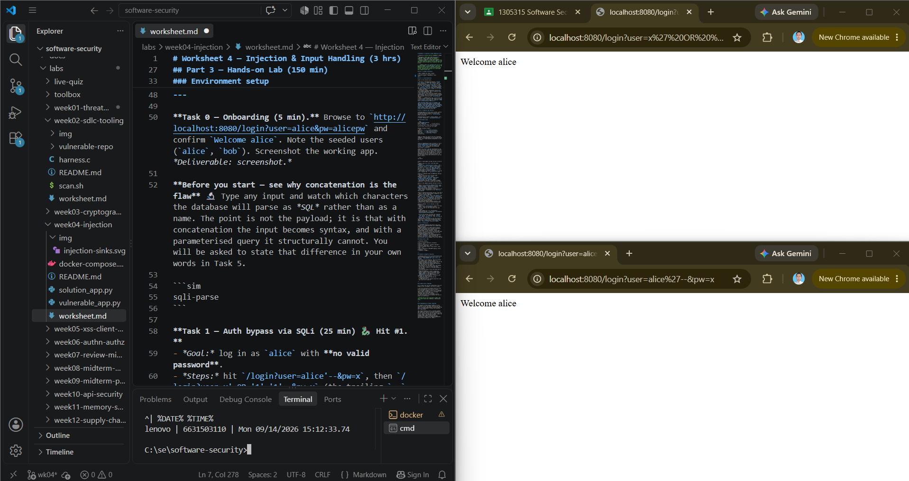
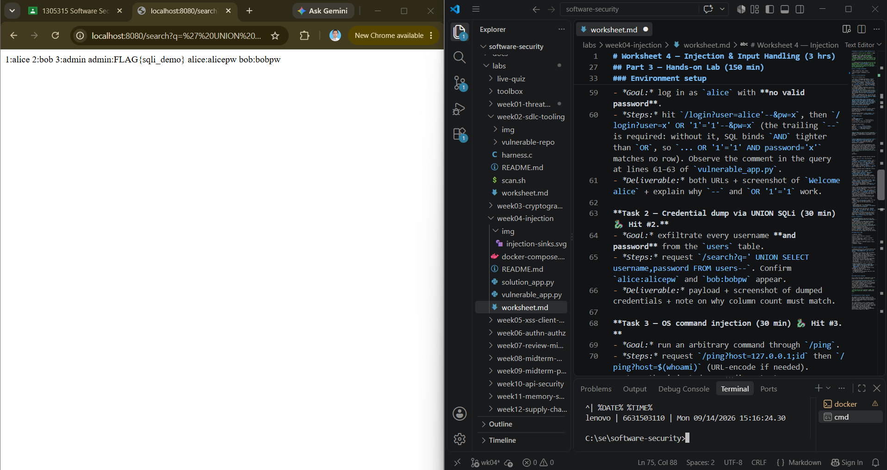
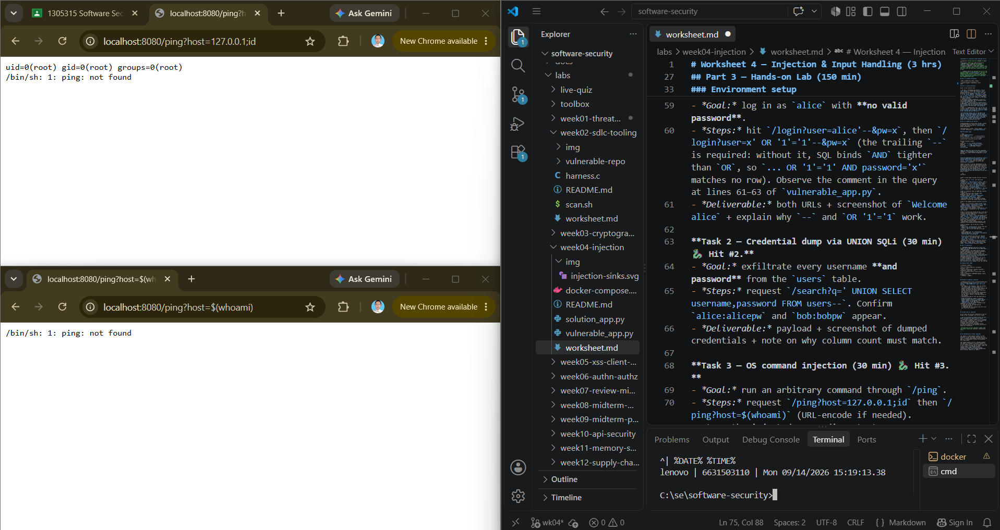
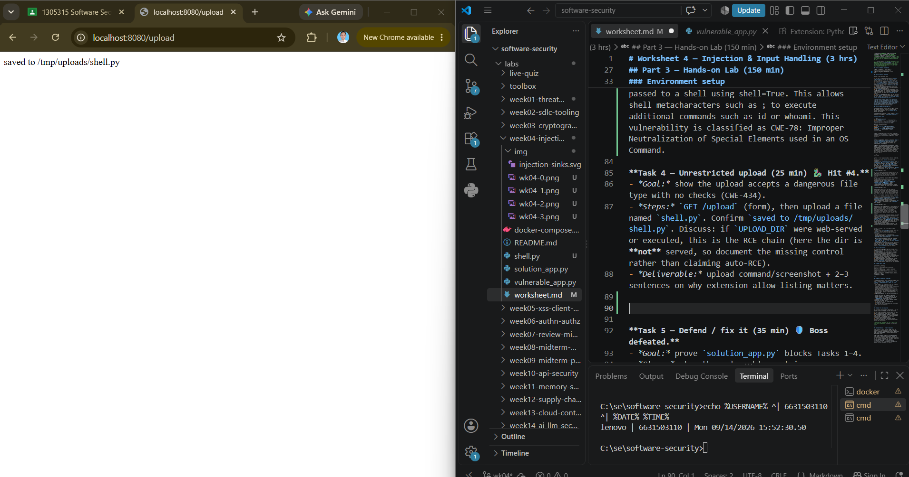
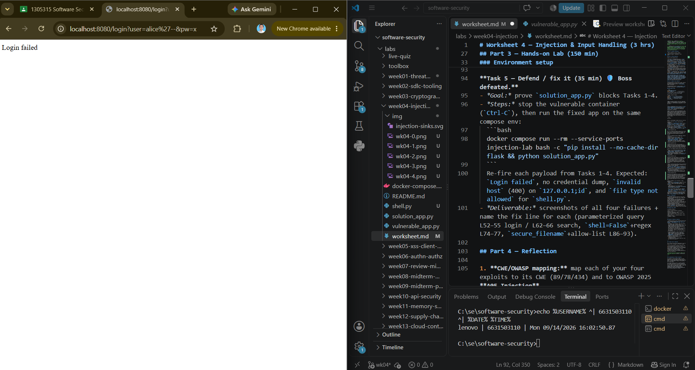
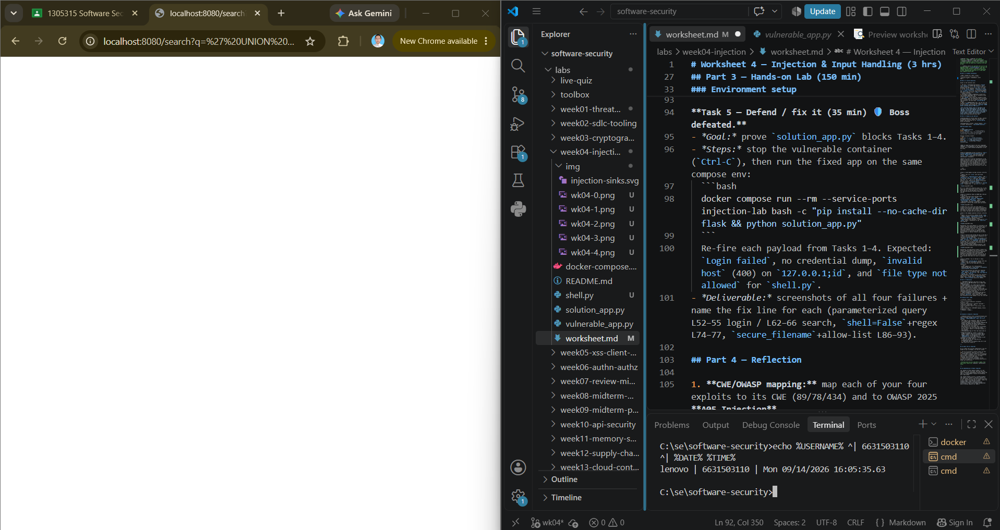
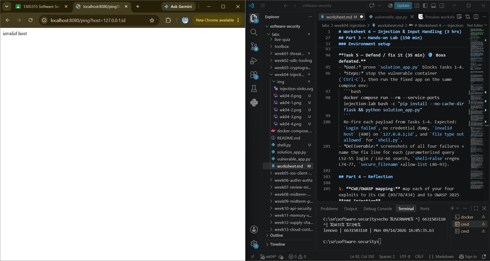
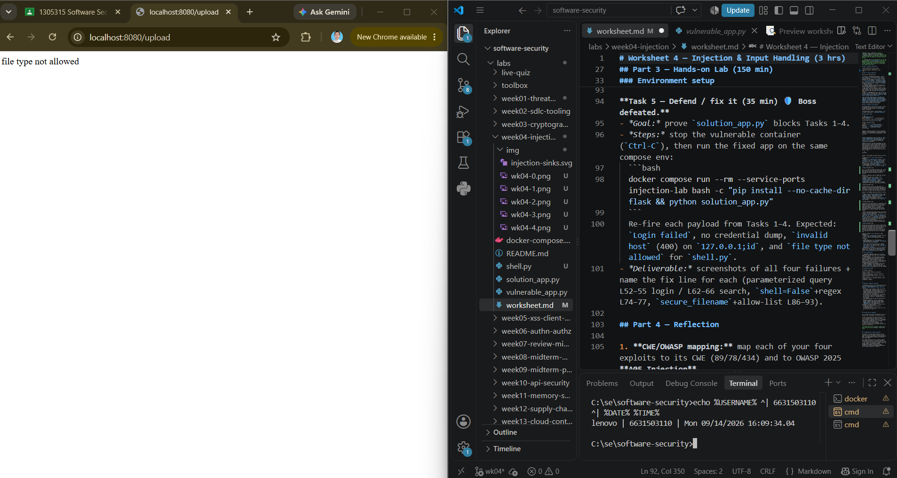

# Worksheet 4 — Injection & Input Handling (3 hrs)

> **Course:** Software Security (KOSEN69) · **Week 4**
> **Aligned:** OWASP 2025 **A05 Injection** · **CWE-89** (SQLi), **CWE-78** (OS command injection), **CWE-434** (unrestricted upload)
> **Signature game:** 🐉 **SQLi Boss Fight** — each successful injection lands a "hit" on the boss; the boss falls when you dump every credential and land an RCE.

> ⚠️ **Ethics note:** All payloads here are for the provided sandbox (`vulnerable_app.py`) and your own DVWA/Juice Shop containers **only**. Never test systems you do not own or have written permission to test. Unauthorized injection is a crime under most computer-misuse laws.

## Part 1 — Student Information

| Name | Student ID | Date | Group |
|------|-----------|------|-------|
| Nararat Kritphet | 6631503110 | 14/9/2026 |       |

## Part 2 — Lecture Questions

Answer in 2–4 sentences each.

1. Why does a **parameterized query** (`execute(sql, (params,))`) defeat SQL injection, while string formatting (`"... '%s'" % user`) does not? Reference how the database treats data vs. code.


A parameterized query keeps SQL code and user data separate. The database treats the user input as data, not as SQL code. But string formatting puts the user input directly into the SQL, so the input can change the SQL command.

2. In the `/ping` endpoint, `subprocess.run("ping -c 1 " + host, shell=True)` is vulnerable. Explain how `shell=True` turns user input into **CWE-78**, and how an argument array (`["ping","-c","1",host]`) removes the shell.

A parameterized query keeps SQL code and user data separate. The database treats the user input as data, not as SQL code. But string formatting puts the user input directly into the SQL, so the input can change the SQL command.

3. Distinguish **input validation** (allow-list) from **output handling**. Why is validation alone insufficient defense for SQLi?

Input validation checks if the input is in the allowed format or values. Output handling is about how the result is used or shown after processing. Validation alone cannot fully stop SQL injection, so we should also use parameterized queries.

4. The `/upload` route saves any filename to disk (**CWE-434**). What two properties must a directory and a filename have for an upload to become remote code execution, and which does `solution_app.py` remove?

An uploaded file can become RCE if the upload directory can be accessed from the web and the server can execute that file. In this lab, the upload directory is not web-served, so the uploaded file cannot be run from the website. solution_app.py also blocks dangerous file types with an allow-list.

5. What is a **UNION-based** SQLi, and why must the injected `SELECT` return the same number of columns as the original query? Relate to `/search?q=' UNION SELECT username,password FROM users--`.

UNION-based SQL injection adds another SELECT query to the original query. In this lab, UNION SELECT username,password FROM users-- tries to get usernames and passwords from the users table. The two queries must have the same number of columns so the database can combine their results.


## Part 3 — Hands-on Lab (150 min)

**Learning goals:** extract data via SQLi, achieve OS command injection, exploit an unrestricted upload, then prove each fix in `solution_app.py` blocks the payload.

**Prerequisites:** Docker + Docker Compose, `curl`, a browser. Working dir: `labs/week04-injection/`.

### Environment setup

```bash
cd labs/week04-injection
docker compose up            # builds python:3.12-slim, installs flask, runs vulnerable_app.py
# vulnerable app -> http://localhost:8080   (service name: injection-lab, port 8080)
```
Optional secondary targets:
```bash
docker run --rm -it -p 80:80 vulnerables/web-dvwa        # DVWA  -> http://localhost
docker run --rm -p 3000:3000 bkimminich/juice-shop       # Juice Shop -> http://localhost:3000
```

**What to submit per task:** the exact **payload/command**, a **screenshot** of the response proving success, and a **2–3 sentence mitigation** in your own words.

---

**Task 0 — Onboarding (5 min).** Browse to `http://localhost:8080/login?user=alice&pw=alicepw` and confirm `Welcome alice`. Note the seeded users (`alice`, `bob`). Screenshot the working app. *Deliverable: screenshot.*

**Before you start — see why concatenation is the flaw** 🔬 Type any input and watch which characters the database will parse as *SQL* rather than as a name. The point is not the payload; it is that with concatenation the input becomes syntax, and with a parameterised query it structurally cannot. You will be asked to state that difference in your own words in Task 5.

```sim
sqli-parse
```

**Task 1 — Auth bypass via SQLi (25 min) 🐉 Hit #1.**
- *Goal:* log in as `alice` with **no valid password**.
- *Steps:* hit `/login?user=alice'--&pw=x`, then `/login?user=x' OR '1'='1'--&pw=x` (the trailing `--` is required: without it, SQL binds `AND` tighter than `OR`, so `... OR '1'='1' AND password='x'` matches no row). Observe the comment in the query at lines 61–63 of `vulnerable_app.py`.
- *Deliverable:* both URLs + screenshot of `Welcome alice` + explain why `--` and `OR '1'='1` work.



OR '1'='1' makes the condition always true, so the login does not require the correct password. The -- marks the rest of the SQL query as a comment, so the remaining password-checking condition is ignored.

**Task 2 — Credential dump via UNION SQLi (30 min) 🐉 Hit #2.**
- *Goal:* exfiltrate every username **and password** from the `users` table.
- *Steps:* request `/search?q=' UNION SELECT username,password FROM users--`. Confirm `alice:alicepw` and `bob:bobpw` appear.
- *Deliverable:* payload + screenshot of dumped credentials + note on why column count must match.



A UNION query must return the same number of columns as the original query because the database combines the results of both SELECT statements. If the number of columns does not match, the database will reject the query and the injection will fail.

**Task 3 — OS command injection (30 min) 🐉 Hit #3.**
- *Goal:* run an arbitrary command through `/ping`.
- *Steps:* request `/ping?host=127.0.0.1;id` then `/ping?host=$(whoami)` (URL-encode if needed). Capture the injected command's output.
- *Deliverable:* both payloads + screenshot of `id`/`whoami` output + explanation of the `shell=True` flaw (CWE-78).



Explanation: The /ping endpoint is vulnerable to OS command injection because user-controlled input is passed to a shell using shell=True. This allows shell metacharacters such as ; to execute additional commands such as id or whoami. This vulnerability is classified as CWE-78: Improper Neutralization of Special Elements used in an OS Command.

**Task 4 — Unrestricted upload (25 min) 🐉 Hit #4.**
- *Goal:* show the upload accepts a dangerous file type with no checks (CWE-434).
- *Steps:* `GET /upload` (form), then upload a file named `shell.py`. Confirm `saved to /tmp/uploads/shell.py`. Discuss: if `UPLOAD_DIR` were web-served or executed, this is the RCE chain (here the dir is **not** served, so document the missing control rather than claiming auto-RCE).
- *Deliverable:* upload command/screenshot + 2–3 sentences on why extension allow-listing matters.



Explanation: The application accepts a Python file without checking whether the file extension or type is allowed. Extension allow-listing is important because it can prevent users from uploading potentially executable file types such as .py. In this lab, the upload directory is not web-served, so the upload alone does not result in automatic RCE.

**Task 5 — Defend / fix it (35 min) 🛡️ Boss defeated.**
- *Goal:* prove `solution_app.py` blocks Tasks 1–4.
- *Steps:* stop the vulnerable container (`Ctrl-C`), then run the fixed app on the same compose env:
  ```bash
  docker compose run --rm --service-ports injection-lab bash -c "pip install --no-cache-dir flask && python solution_app.py"
  ```
  Re-fire each payload from Tasks 1–4. Expected: `Login failed`, no credential dump, `invalid host` (400) on `127.0.0.1;id`, and `file type not allowed` for `shell.py`.
- *Deliverable:* screenshots of all four failures + name the fix line for each (parameterized query L52–55 login / L62–66 search, `shell=False`+regex L74–77, `secure_filename`+allow-list L86–93).

---

Login SQLi: Parameterized query — L52–55


---

Search SQLi: Parameterized query — L62–66


---
Command injection: shell=False + regex validation — L74–77


---
File upload: secure_filename + extension allow-list — L86–93


File upload: secure_filename + extension allow-list — L86–93

## Part 4 — Reflection

1. **CWE/OWASP mapping:** map each of your four exploits to its CWE (89/78/434) and to OWASP 2025 **A05 Injection**.

The login SQL injection and UNION SQL injection are classified as CWE-89 (SQL Injection), while the OS command injection is CWE-78 (Improper Neutralization of Special Elements used in an OS Command). The unrestricted file upload is CWE-434 (Unrestricted Upload of File with Dangerous Type). These vulnerabilities are mapped to OWASP 2025 A05: Injection as specified in this lab.

2. **Real breach:** the **2017 Equifax breach** exposed ~147M people after attackers exploited a known input-handling flaw (Apache Struts CVE-2017-5638). In 3–4 sentences, connect that failure to the lessons in this lab (untrusted input reaching a powerful interpreter; the cost of an unpatched/unvalidated input path).

The 2017 Equifax breach exposed the personal information of approximately 147 million people after attackers exploited a known vulnerability in Apache Struts (CVE-2017-5638). Like the vulnerabilities demonstrated in this lab, the incident shows how untrusted input can reach a powerful interpreter or vulnerable component and lead to serious consequences. The breach also highlights the importance of validating input and keeping software and security components patched. A failure to maintain a secure and updated input-handling path can turn a relatively small vulnerability into a major data breach.

3. **Best mitigation:** of parameterized queries, allow-list validation, least privilege, and avoiding `shell=True`, which single control would have prevented the most damage in this lab, and why?

Least privilege would have prevented the most damage in this lab. The vulnerable command injection ran with root privileges, as shown by the id output (uid=0(root)), meaning a successful command injection could potentially have much greater impact. Even if an injection vulnerability remained, limiting the application's privileges would reduce what an attacker could access or modify. However, parameterized queries and avoiding shell=True are still the more direct controls for preventing the specific injection vulnerabilities.

## Grading rubric (100)

| Criterion | Points |
|-----------|-------:|
| Part 2 — Lecture questions (conceptual accuracy) | 20 |
| Part 3 — Exploitation + evidence (payloads + screenshots, Tasks 1–4) | 40 |
| Part 3 — Defense (Task 5: fixes proven, lines cited) | 25 |
| Part 4 — Reflection (CWE/OWASP mapping, breach, mitigation) | 15 |
| **Total** | **100** |

---

## Evidence & Integrity (required)

- **Identity proof:** every screenshot/diagram must show a terminal running `printf '%s | %s | ' "$(whoami)" '<YOUR-STUDENT-ID>'; date '+%F %T %Z'` **in the
  same image as the evidence**. When the evidence is a browser page, a DevTools panel or a
  rendered response, put that terminal **beside the browser and capture the whole screen** — a
  cropped window carries nothing that identifies you, and the lab's own output is
  byte-identical for the whole cohort *by design*, so the stamp is the only thing that makes
  the shot yours. Generic or borrowed evidence is not accepted.
- **Personalized flag (if this lab issues one):** ____________________
  *Flags are unique per student — submitting another student's flag is a violation. How to submit: **learn.zcr.ai/submit** (full guide: `SUBMISSION.md` in the repo root).*
- **Explain in your own words** *(graded on your reasoning, not copied text):*
  1. What did you do, and **why did the vulnerability work**?
  2. **Why does your fix actually stop it** — and what could still break it?

---

## 🤖 Audit the AI (required)

AI is a power tool you must **distrust** — you are graded on your *critique*, not the AI's answer.

1. Ask an AI assistant to exploit **or** fix this week's vulnerability. Paste its full answer.
2. **Find what's wrong or risky** in it — insecure code, a subtly incomplete fix, a hallucinated API/function/CVE, a missed edge case, or wrong reasoning. Quote the exact line(s).
3. Produce the **correct, verified** version yourself and explain in 2–3 sentences why the AI's output was insufficient.

> Disclose your AI use in the Part 1 table. This task counts toward your **Defense + Reflection** score.

---

## 🧠 Comprehension & Prompt (required)

**A. Explain in Plain English (EiPE).** In 2–3 sentences, in your own words, describe what this week's vulnerable code/endpoint actually *does* and *why it is exploitable* — explain the mechanism, don't dump jargon.

**B. Prompt Problem.** Write a **single prompt** that makes an AI produce a *correct, secure* fix for one finding. Run it: does the exploit now fail? If not, refine the prompt and try again. Submit the **final prompt + the verified result**.
*Graded on the prompt's precision and your verification — this trains problem decomposition and AI literacy (Denny et al. 2024).*
