# Worksheet 4 — Injection & Input Handling (3 hrs)

> **Course:** Software Security (KOSEN69) · **Week 4**
> **Aligned:** OWASP 2025 **A05 Injection** · **CWE-89** (SQLi), **CWE-78** (OS command injection), **CWE-434** (unrestricted upload)
> **Signature game:** 🐉 **SQLi Warm-up** — each successful injection lands a "hit"; you clear it when you dump every credential and land an RCE.

> ⚠️ **Ethics note:** All payloads here are for the provided sandbox (`vulnerable_app.py`) and your own DVWA/Juice Shop containers **only**. Never test systems you do not own or have written permission to test. Unauthorized injection is a crime under most computer-misuse laws.

## Part 1 — Student Information

| Name | Student ID | Date | Group |
|Neree Booncharoen|6631503018|10/9/2026|1|
|      |           |      |       |

## Part 2 — Lecture Questions

Answer in 2–4 sentences each.

1. Why does a **parameterized query** (`execute(sql, (params,))`) defeat SQL injection, while string formatting (`"... '%s'" % user`) does not? Reference how the database treats data vs. code.
Amswer:A parameterized query separates SQL code from user data, so the database treats the parameter only as a value, not as part of the SQL command. Therefore, characters such as ', --, or OR in user input cannot change the structure of the query. In contrast, string formatting inserts the user input directly into the SQL statement, allowing the input to become SQL code.
2. In the `/ping` endpoint, `subprocess.run("ping -c 1 " + host, shell=True)` is vulnerable. Explain how `shell=True` turns user input into **CWE-78**, and how an argument array (`["ping","-c","1",host]`) removes the shell.
Amswer: When subprocess.run("ping -c 1 " + host, shell=True) is used, the entire string is interpreted by a system shell, so malicious characters in host can be interpreted as additional shell commands. This creates CWE-78 (OS Command Injection) because untrusted user input can influence command execution. Using an argument array such as ["ping", "-c", "1", host] passes each argument directly to the program without invoking a shell, so shell metacharacters are not interpreted as commands.
3. Distinguish **input validation** (allow-list) from **output handling**. Why is validation alone insufficient defense for SQLi?
Amswer:Input validation checks whether incoming data matches an allowed format or allow-list, while output handling ensures data is safely encoded or handled when it is used in another context. Validation alone is not sufficient against SQL injection because an input that looks valid in one context may still alter SQL syntax when concatenated into a query. The primary defense is to use parameterized queries so user input is always treated as data rather than SQL code.
4. The `/upload` route saves any filename to disk (**CWE-434**). What two properties must a directory and a filename have for an upload to become remote code execution, and which does `solution_app.py` remove?
Amswer:For an uploaded file to lead to remote code execution, the file must be stored in a directory that the web server can execute/serve as application code, and the uploaded filename/content must be something the server recognizes as executable code (such as a server-side script). This combination allows an attacker to upload code and then access it through the web server to execute it. solution_app.py removes the dangerous executable-file property by restricting uploaded filenames/types so that executable server-side code cannot be uploaded.
5. What is a **UNION-based** SQLi, and why must the injected `SELECT` return the same number of columns as the original query? Relate to `/search?q=' UNION SELECT username,password FROM users--`.
Amswer:A UNION-based SQL injection adds another SELECT statement to the original query so that data from another table can be returned as part of the query result. The injected SELECT must return the same number of columns as the original query because SQL UNION combines result sets with compatible column structures. In /search?q=' UNION SELECT username,password FROM users--, the attacker attempts to make the application return the username and password columns from the users table alongside the original search results.


## Part 3 — Hands-on Lab (150 min)

**Learning goals:** extract data via SQLi, achieve OS command injection, exploit an unrestricted upload, then prove each fix in `solution_app.py` blocks the payload.

**Prerequisites:** Docker + Docker Compose, `curl`, a browser. Working dir: `labs/week04-injection/`.

### Environment setup

```bash
cd labs/week04-injection
docker compose up            # builds python:3.12-slim, installs flask, runs vulnerable_app.py
# vulnerable app -> http://localhost:8080   (service name: injection-lab, port 8080)
```
Optional secondary targets:
```bash
docker run --rm -it -p 80:80 vulnerables/web-dvwa        # DVWA  -> http://localhost
docker run --rm -p 3000:3000 bkimminich/juice-shop       # Juice Shop -> http://localhost:3000
```

**What to submit per task:** the exact **payload/command**, a **screenshot** of the response proving success, and a **2–3 sentence mitigation** in your own words.

---

**Task 0 — Onboarding (5 min).** Browse to `http://localhost:8080/login?user=alice&pw=alicepw` and confirm `Welcome alice`. Note the seeded users (`alice`, `bob`). Screenshot the working app. *Deliverable: screenshot.*
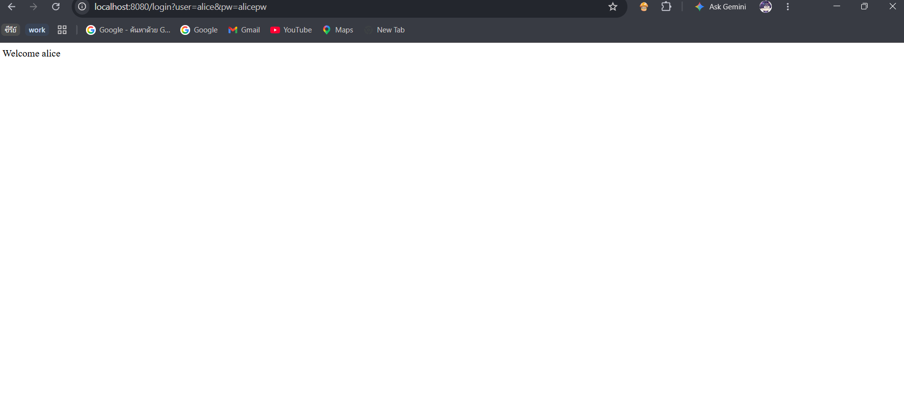

**Before you start — see why concatenation is the flaw** 🔬 Type any input and watch which characters the database will parse as *SQL* rather than as a name. The point is not the payload; it is that with concatenation the input becomes syntax, and with a parameterised query it structurally cannot. You will be asked to state that difference in your own words in Task 5.

```sim
sqli-parse
```

**Task 1 — Auth bypass via SQLi (25 min) 🐉 Hit #1.**
- *Goal:* log in as `alice` with **no valid password**.
- *Steps:* hit `/login?user=alice'--&pw=x`, then `/login?user=x' OR '1'='1'--&pw=x` (the trailing `--` is required: without it, SQL binds `AND` tighter than `OR`, so `... OR '1'='1' AND password='x'` matches no row). Observe the comment in the query at lines 61–63 of `vulnerable_app.py`.
- *Note — browser vs `curl`:* pasted into a **browser**, the space in `x' OR '1'='1'--` is encoded for you; with **`curl`** an unencoded space silently returns a **blank page (no error)**. Use `curl -G "http://localhost:8080/login" --data-urlencode "user=x' OR '1'='1'--" --data-urlencode "pw=x"` — same `-G --data-urlencode` form for Task 2's `q=`.
- *Deliverable:* both URLs + screenshot of `Welcome alice` + explain why `--` and `OR '1'='1` work.
 answer:http://localhost:8080/login?user=alice'--&pw=x 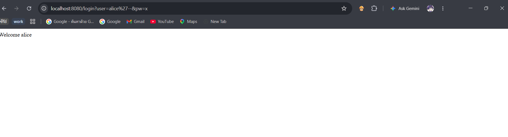,http://localhost:8080/login?user=x%27%20OR%20%271%27=%271%27--&pw=x 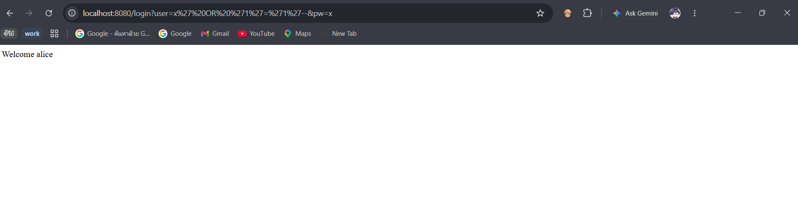
 Because The OR '1'='1' condition is always true, so the login query can match a user without knowing the correct password. The -- starts a SQL comment, so the remaining password condition is ignored. This allows the attacker to bypass the authentication check.


**Task 2 — Credential dump via UNION SQLi (30 min) 🐉 Hit #2.**
- *Goal:* exfiltrate every username **and password** from the `users` table.
- *Steps:* request `/search?q=' UNION SELECT username,password FROM users--`. Confirm `alice:alicepw` and `bob:bobpw` appear.
- *Deliverable:* payload + screenshot of dumped credentials + note on why column count must match.
Answer: 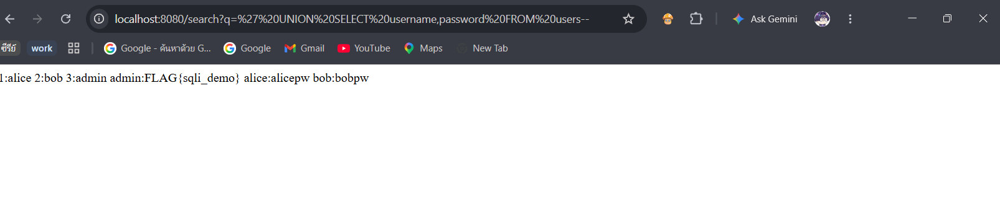 The number of columns in the UNION SELECT must match the number of columns returned by the original query. If the column counts do not match, the database will reject the UNION query and return an error. In this case, username and password provide two columns, matching the original query.

**Task 3 — OS command injection (30 min) 🐉 Hit #3.**
- *Goal:* run an arbitrary command through `/ping`.
- *Steps:* request `/ping?host=127.0.0.1;id` then `/ping?host=$(whoami)` (URL-encode if needed). Capture the injected command's output.
- *Deliverable:* both payloads + screenshot of `id`/`whoami` output + explanation of the `shell=True` flaw (CWE-78).
Answer: payload1 127.0.0.1;id 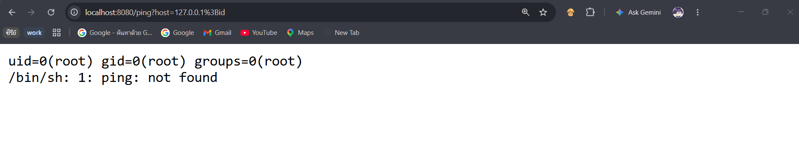 , payload2 127.0.0.1;whoami 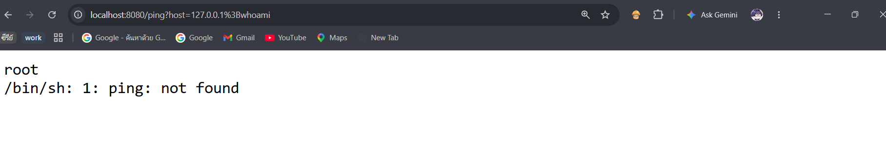
- *Goal:* run an arbitrary command through `/ping`, then read this lab's command-injection flag with it.
- *Steps:* request `/ping?host=127.0.0.1;id` then `/ping?host=127.0.0.1;whoami` (URL-encode if needed). Capture the injected command's output. Then use the same injection to read the flag file the server keeps at `/flag.txt` (the space needs `--data-urlencode`, see the note on Task 1):
  ```bash
  curl -G "http://localhost:8080/ping" --data-urlencode "host=127.0.0.1;cat /flag.txt"
  ```
- *Deliverable:* the three payloads + screenshot of the `id`/`whoami` output **and** the `FLAG{...}` from `/flag.txt` + explanation of the `shell=True` flaw (CWE-78).

**Task 4 — Unrestricted upload (25 min) 🐉 Hit #4.**
- *Goal:* show the upload accepts a dangerous file type with no checks (CWE-434).
- *Steps:* `GET /upload` (form), then upload a file named `shell.py`. Confirm `saved to /tmp/uploads/shell.py`. Via the browser form this just works; via `curl` the file field is named **`f`**: `curl -F "f=@shell.py" "http://localhost:8080/upload"`. Discuss: if `UPLOAD_DIR` were web-served or executed, this is the RCE chain (here the dir is **not** served, so document the missing control rather than claiming auto-RCE).
- *Deliverable:* upload command/screenshot + 2–3 sentences on why extension allow-listing matters.
Answer: 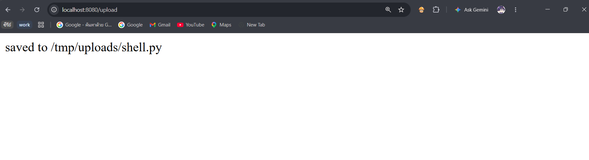 The application accepts a .py file without checking whether the file extension is allowed, which creates an unrestricted file upload vulnerability (CWE-434). An extension allow-list should permit only safe file types that the application actually needs and reject executable or dangerous file types. In this lab, the upload directory is not web-served or executed, so uploading shell.py does not automatically result in RCE.

**Task 5 — Defend / fix it (35 min) 🛡️ Warm-up cleared.**
- *Goal:* prove `solution_app.py` blocks Tasks 1–4.
- *Steps:* stop the vulnerable container (`Ctrl-C`), then run the fixed app on the same compose env:
  ```bash
  docker compose run --rm --service-ports injection-lab bash -c "pip install --no-cache-dir flask && python solution_app.py"
  ```
  Re-fire each payload from Tasks 1–4. Expected: `Login failed`, no credential dump, `invalid host` (400) on `127.0.0.1;id`, and `file type not allowed` for `shell.py`.
- *Deliverable:* screenshots of all four failures + name the fix line for each (parameterized query L52–55 login / L62–66 search, `shell=False`+regex L74–77, `secure_filename`+allow-list L86–93).
Answer: http://127.0.0.1:5000/login?user=alice%27--&pw=x 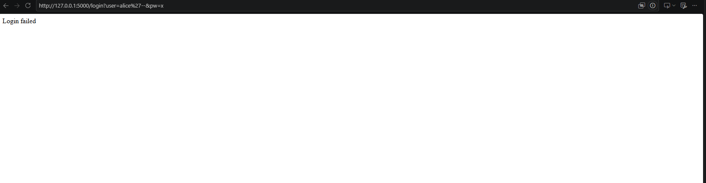 ,http://127.0.0.1:5000/search?q=%27%20UNION%20SELECT%20username,password%20FROM%20users--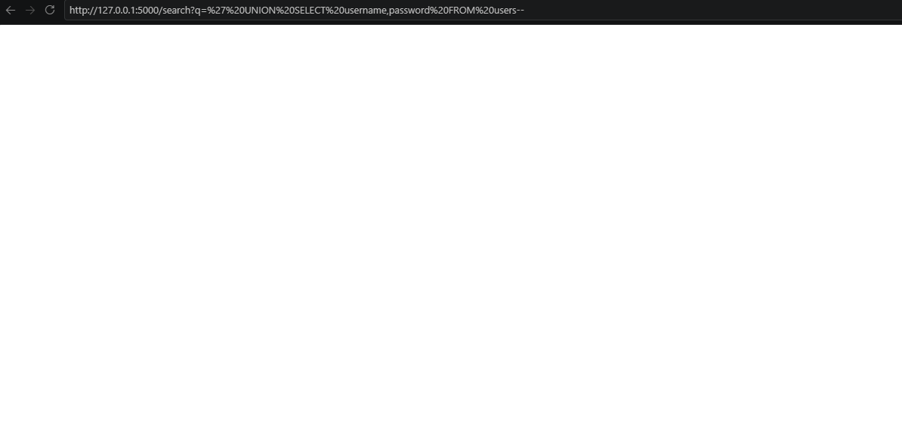 ,http://127.0.0.1:5000/ping?host=127.0.0.1%3Bid 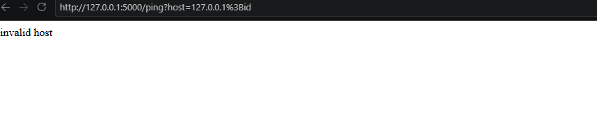 , http://127.0.0.1:5000/upload 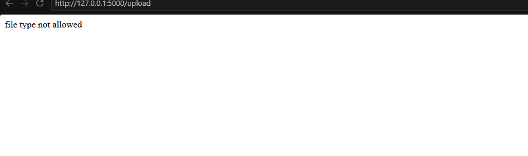, The fixed application prevents SQL injection by using parameterized queries, so user input is treated as data rather than SQL code. It also validates the host and disables shell interpretation for the ping command, while the upload endpoint uses secure_filename and an extension allow-list to reject dangerous file types.

## Part 4 — Reflection

1. **CWE/OWASP mapping:** map each of your four exploits to its CWE (89/78/434) and to OWASP 2025 **A05 Injection**.
Answer:Task 1: CWE-89 — SQL Injection → OWASP A05: Injection
Task 2: CWE-89 — SQL Injection → OWASP A05: Injection
Task 3: CWE-78 — OS Command Injection → OWASP A05: Injection
Task 4: CWE-434 — Unrestricted Upload of File with Dangerous Type → Not A05: Injection.
2. **Real breach:** the **2017 Equifax breach** exposed ~147M people after attackers exploited a known input-handling flaw (Apache Struts CVE-2017-5638). In 3–4 sentences, connect that failure to the lessons in this lab (untrusted input reaching a powerful interpreter; the cost of an unpatched/unvalidated input path).
Answer:The 2017 Equifax data breach shows how dangerous a software vulnerability can be when it is not properly patched. Equifax failed to patch a known Apache Struts vulnerability (CVE-2017-5638), which attackers exploited to compromise its systems and access sensitive information belonging to approximately 147 million people. This is similar to the lab because both demonstrate how a vulnerability can allow attackers to move from a simple input or software weakness to a much larger system compromise.
3. **Best mitigation:** of parameterized queries, allow-list validation, least privilege, and avoiding `shell=True`, which single control would have prevented the most damage in this lab, and why?
Answer:The single control that would have prevented the most damage in this lab is parameterized queries. It would have prevented both SQL injection attacks in Tasks 1 and 2 by keeping user input separate from SQL code, so the database treats the input as data rather than executable SQL. This is especially important because Task 2 allowed the attacker to extract sensitive user credentials.

## Grading rubric (100)

| Criterion | Points |
|-----------|-------:|
| Part 2 — Lecture questions (conceptual accuracy) | 20 |
| Part 3 — Exploitation + evidence (payloads + screenshots, Tasks 1–4) | 40 |
| Part 3 — Defense (Task 5: fixes proven, lines cited) | 25 |
| Part 4 — Reflection (CWE/OWASP mapping, breach, mitigation) | 15 |
| **Total** | **100** |

---

## Evidence & Integrity (required)

- **Identity proof:** every screenshot/diagram must show a terminal running `printf '%s | %s | ' "$(whoami)" '<YOUR-STUDENT-ID>'; date '+%F %T %Z'` **in the
  same image as the evidence**. When the evidence is a browser page, a DevTools panel or a
  rendered response, put that terminal **beside the browser and capture the whole screen** — a
  cropped window carries nothing that identifies you, and the lab's own output is
  byte-identical for the whole cohort *by design*, so the stamp is the only thing that makes
  the shot yours. Generic or borrowed evidence is not accepted.
- **Personalized flag (if this lab issues one):** ____________________
  *Flags are unique per student — submitting another student's flag is a violation. How to submit: **learn.zcr.ai/submit** (full guide: `SUBMISSION.md` in the repo root).*
- **Explain in your own words** *(graded on your reasoning, not copied text):*
  1. What did you do, and **why did the vulnerability work**?
  Answer:I tested the vulnerable endpoints using SQL injection, UNION SQL injection, OS command injection, and an unrestricted file upload. The vulnerabilities worked because the application directly trusted or combined user-controlled input with SQL commands, shell commands, or file handling without sufficient validation.
  2. **Why does your fix actually stop it** — and what could still break it?
  Answer:he fixes separate user input from executable commands, validate input, and restrict uploaded file types. Parameterized queries prevent SQL input from being interpreted as SQL code, while shell=False and host validation prevent command injection. However, the application could still be vulnerable if developers introduce unsafe string concatenation, weak validation, allow dangerous file types, or give the application excessive privileges.

---

## 🤖 Audit the AI (required)

AI is a power tool you must **distrust** — you are graded on your *critique*, not the AI's answer.

1. Ask an AI assistant to exploit **or** fix this week's vulnerability. Paste its full answer.
Answer:Prompt:Explain and provide a secure fix for the SQL injection vulnerability in the login endpoint. Replace unsafe SQL string construction with a parameterized query. Explain why the fix prevents SQL injection.

AI Answer:A parameterized query prevents SQL injection by keeping user input separate from the SQL statement. Instead of inserting the username and password directly into the SQL string, the application passes them as parameters, so the database treats them as data rather than SQL commands.
2. **Find what's wrong or risky** in it — insecure code, a subtly incomplete fix, a hallucinated API/function/CVE, a missed edge case, or wrong reasoning. Quote the exact line(s).
Answer:The AI answer was generally correct, but it was incomplete because it did not show the actual corrected code or verify the fix by testing the original SQL injection payload. A secure fix should be tested to confirm that the attack no longer bypasses authentication.
3. Produce the **correct, verified** version yourself and explain in 2–3 sentences why the AI's output was insufficient.
Answer:The login endpoint should use a parameterized query, such as execute(sql, (user, pw)), instead of concatenating user input into the SQL statement. I verified the fix by testing the original SQL injection payload against the fixed application, and it returned “Login failed” instead of authenticating the attacker.

> Disclose your AI use in the Part 1 table. This task counts toward your **Defense + Reflection** score.

---

## 🧠 Comprehension & Prompt (required)

**A. Explain in Plain English (EiPE).** In 2–3 sentences, in your own words, describe what this week's vulnerable code/endpoint actually *does* and *why it is exploitable* — explain the mechanism, don't dump jargon.
Answer:The login endpoint takes a username and password from the user and uses them in an SQL query. It is exploitable because the application directly combines user input with SQL code, allowing an attacker to change the meaning of the query.

**B. Prompt Problem.** Write a **single prompt** that makes an AI produce a *correct, secure* fix for one finding. Run it: does the exploit now fail? If not, refine the prompt and try again. Submit the **final prompt + the verified result**.
*Graded on the prompt's precision and your verification — this trains problem decomposition and AI literacy (Denny et al. 2024).*
Answer:Single prompt:Fix the SQL injection vulnerability in the login endpoint by replacing unsafe SQL string concatenation with a parameterized query. Do not unnecessarily change the endpoint behavior. Explain why the parameterized query prevents SQL injection, provide the corrected code, and verify the fix by testing the original SQL injection payload and confirming that authentication is not bypassed.

Verified result:After applying the fix, the original SQL injection payload no longer bypassed authentication and the application returned “Login failed.” This confirms that the user input was treated as data rather than executable SQL.
