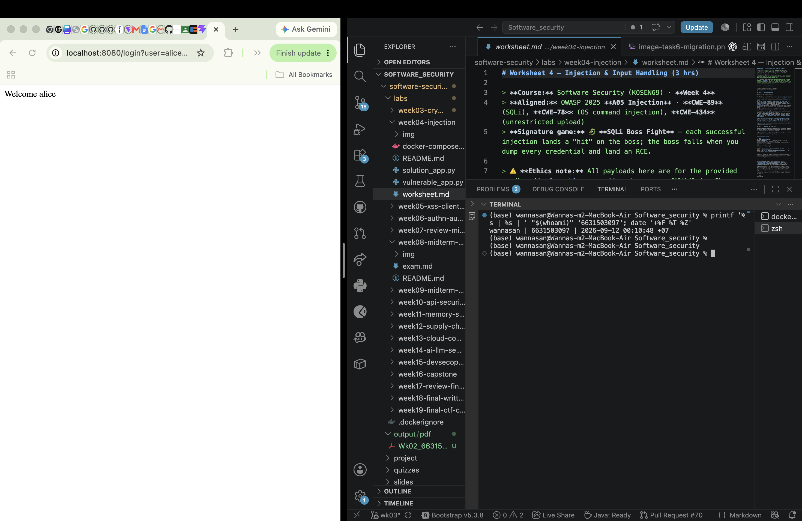
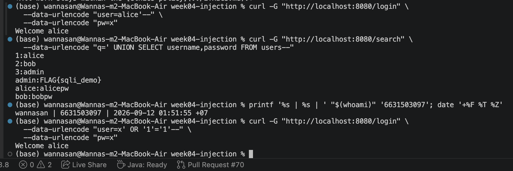
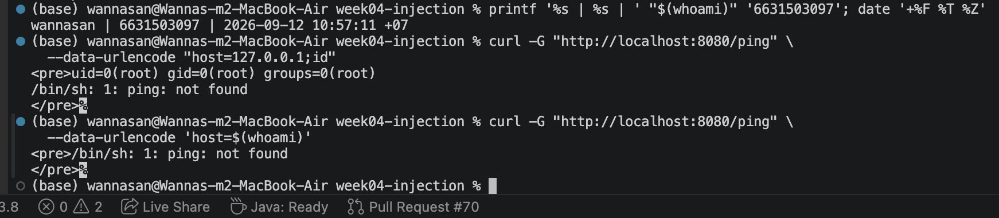
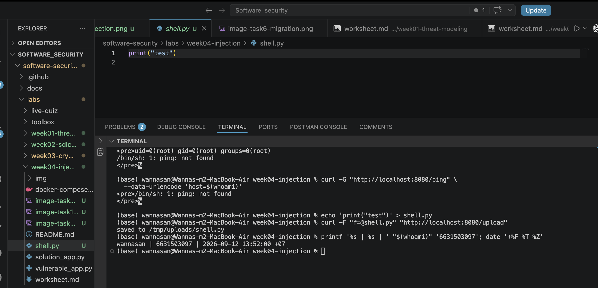
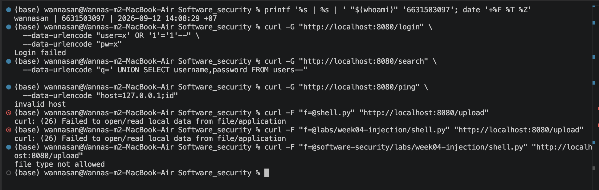

# Worksheet 4 — Injection & Input Handling (3 hrs)

> **Course:** Software Security (KOSEN69) · **Week 4**
> **Aligned:** OWASP 2025 **A05 Injection** · **CWE-89** (SQLi), **CWE-78** (OS command injection), **CWE-434** (unrestricted upload)
> **Signature game:** 🐉 **SQLi Boss Fight** — each successful injection lands a "hit" on the boss; the boss falls when you dump every credential and land an RCE.

> ⚠️ **Ethics note:** All payloads here are for the provided sandbox (`vulnerable_app.py`) and your own DVWA/Juice Shop containers **only**. Never test systems you do not own or have written permission to test. Unauthorized injection is a crime under most computer-misuse laws.

## Part 1 — Student Information

| Name | Student ID | Date | Group |
|------|-----------|------|-------|
| Wanna-San | 6631503097 | 2026-09-12 | The Outsider |

**AI-use disclosure:** I used ChatGPT/Codex for guidance, drafting, checking requirements, and help with code and worksheet structure. I personally ran the commands, checked the results, and captured the evidence screenshots.

## Part 2 — Lecture Questions

Answer in 2–4 sentences each.

1. Why does a **parameterized query** (`execute(sql, (params,))`) defeat SQL injection, while string formatting (`"... '%s'" % user`) does not? Reference how the database treats data vs. code.

   A parameterized query sends the SQL structure and the user values separately, so the database treats the values only as data. String formatting puts the input directly inside the SQL statement, which lets characters such as quotes and comments change the query.

2. In the `/ping` endpoint, `subprocess.run("ping -c 1 " + host, shell=True)` is vulnerable. Explain how `shell=True` turns user input into **CWE-78**, and how an argument array (`["ping","-c","1",host]`) removes the shell.

   With `shell=True`, the whole string is interpreted by a command shell, so `;` and `$()` in the host value become shell instructions. Passing an argument array with `shell=False` sends the host as one argument to `ping`, so the shell does not interpret those characters.

3. Distinguish **input validation** (allow-list) from **output handling**. Why is validation alone insufficient defense for SQLi?

   An input allow-list accepts only values that match an expected type or format, while output handling makes data safe for the place where it is displayed. Validation helps, but it can miss an unexpected input; parameterized queries are still the main SQLi defense because they keep input separate from SQL syntax.

4. The `/upload` route saves any filename to disk (**CWE-434**). What two properties must a directory and a filename have for an upload to become remote code execution, and which does `solution_app.py` remove?

   For this upload to become RCE, the file must be placed somewhere that the server serves or executes, and the filename/type must be accepted as executable code. `solution_app.py` uses `secure_filename()` and an extension allow-list, so a `.py` file is rejected; it also stores accepted uploads in a directory that is not web-served by this app.

5. What is a **UNION-based** SQLi, and why must the injected `SELECT` return the same number of columns as the original query? Relate to `/search?q=' UNION SELECT username,password FROM users--`.

   UNION-based SQLi adds an attacker-controlled `SELECT` to the application's query so rows from another table appear in the response. The original `/search` query returns two columns, so the injected `SELECT username,password` must also return two compatible columns for SQLite to combine the results.


## Part 3 — Hands-on Lab (150 min)

**Learning goals:** extract data via SQLi, achieve OS command injection, exploit an unrestricted upload, then prove each fix in `solution_app.py` blocks the payload.

**Prerequisites:** Docker + Docker Compose, `curl`, a browser. Working dir: `labs/week04-injection/`.

### Environment setup

```bash
cd labs/week04-injection
docker compose up            # builds python:3.12-slim, installs flask, runs vulnerable_app.py
# vulnerable app -> http://localhost:8080   (service name: injection-lab, port 8080)
```
Optional secondary targets:
```bash
docker run --rm -it -p 80:80 vulnerables/web-dvwa        # DVWA  -> http://localhost
docker run --rm -p 3000:3000 bkimminich/juice-shop       # Juice Shop -> http://localhost:3000
```

**What to submit per task:** the exact **payload/command**, a **screenshot** of the response proving success, and a **2–3 sentence mitigation** in your own words.

---

**Task 0 — Onboarding (5 min).** Browse to `http://localhost:8080/login?user=alice&pw=alicepw` and confirm `Welcome alice`. Note the seeded users (`alice`, `bob`). Screenshot the working app. *Deliverable: screenshot.*

**Command/URL:** `http://localhost:8080/login?user=alice&pw=alicepw`

**Observed result:** `Welcome alice`



The normal login confirmed that the local application and seeded `alice` account were working before testing. In a real application, passwords should be stored with a password-hashing algorithm and login input must never be concatenated into SQL.

**Before you start — see why concatenation is the flaw** 🔬 Type any input and watch which characters the database will parse as *SQL* rather than as a name. The point is not the payload; it is that with concatenation the input becomes syntax, and with a parameterised query it structurally cannot. You will be asked to state that difference in your own words in Task 5.

```sim
sqli-parse
```

**Task 1 — Auth bypass via SQLi (25 min) 🐉 Hit #1.**
- *Goal:* log in as `alice` with **no valid password**.
- *Steps:* hit `/login?user=alice'--&pw=x`, then `/login?user=x' OR '1'='1'--&pw=x` (the trailing `--` is required: without it, SQL binds `AND` tighter than `OR`, so `... OR '1'='1' AND password='x'` matches no row). Observe the comment in the query at lines 61–63 of `vulnerable_app.py`.
- *Deliverable:* both URLs + screenshot of `Welcome alice` + explain why `--` and `OR '1'='1` work.

**Commands tested:**

```bash
curl -G "http://localhost:8080/login" \
  --data-urlencode "user=alice'--" \
  --data-urlencode "pw=x"

curl -G "http://localhost:8080/login" \
  --data-urlencode "user=x' OR '1'='1'--" \
  --data-urlencode "pw=x"
```

**Observed result:** Both payloads returned `Welcome alice` without a valid password.



The quote closes the username string and `--` comments out the remaining password condition. In the second payload, `OR '1'='1'` creates a true condition so a row can match; a parameterized login query stops both payloads by treating them as username data.

**Task 2 — Credential dump via UNION SQLi (30 min) 🐉 Hit #2.**
- *Goal:* exfiltrate every username **and password** from the `users` table.
- *Steps:* request `/search?q=' UNION SELECT username,password FROM users--`. Confirm `alice:alicepw` and `bob:bobpw` appear.
- *Deliverable:* payload + screenshot of dumped credentials + note on why column count must match.

**Command tested:**

```bash
curl -G "http://localhost:8080/search" \
  --data-urlencode "q=' UNION SELECT username,password FROM users--"
```

**Observed result:** The response included `alice:alicepw`, `bob:bobpw`, and the seeded local admin entry. The same genuine evidence image is shown under Task 1.

The injected `UNION SELECT` reads usernames and passwords from the `users` table and adds them to the normal search results. Its two columns must match the two columns returned by the original query; binding the search pattern as a parameter prevents the payload from becoming SQL syntax.

**Task 3 — OS command injection (30 min) 🐉 Hit #3.**
- *Goal:* run an arbitrary command through `/ping`.
- *Steps:* request `/ping?host=127.0.0.1;id` then `/ping?host=$(whoami)` (URL-encode if needed). Capture the injected command's output.
- *Deliverable:* both payloads + screenshot of `id`/`whoami` output + explanation of the `shell=True` flaw (CWE-78).

**Commands tested:**

```bash
curl -G "http://localhost:8080/ping" \
  --data-urlencode "host=127.0.0.1;id"

curl -G "http://localhost:8080/ping" \
  --data-urlencode 'host=$(whoami)'
```

**Observed result:** The first response included `uid=0(root) gid=0(root) groups=0(root)`. The container also reported that `ping` was not installed, but the `id` output still proved that the injected command ran.



`shell=True` sends the complete string through a shell, so `;` and `$()` are interpreted as command syntax instead of ordinary host data. The fix uses a host allow-list and passes an argument array with `shell=False`, removing the shell interpreter from the input path.

**Task 4 — Unrestricted upload (25 min) 🐉 Hit #4.**
- *Goal:* show the upload accepts a dangerous file type with no checks (CWE-434).
- *Steps:* `GET /upload` (form), then upload a file named `shell.py`. Confirm `saved to /tmp/uploads/shell.py`. Discuss: if `UPLOAD_DIR` were web-served or executed, this is the RCE chain (here the dir is **not** served, so document the missing control rather than claiming auto-RCE).
- *Deliverable:* upload command/screenshot + 2–3 sentences on why extension allow-listing matters.

**Commands tested:** 

```bash
echo 'print("test")' > shell.py
curl -F "f=@shell.py" "http://localhost:8080/upload"
```

**Observed result:** `saved to /tmp/uploads/shell.py`



The route accepts a `.py` file because it has no extension or type allow-list. This is not RCE in this lab because `/tmp/uploads` is not served or executed; safe filenames, an extension allow-list, storage outside the web root, and no-execute permissions reduce the risk of completing that chain.

**Task 5 — Defend / fix it (35 min) 🛡️ Boss defeated.**
- *Goal:* prove `solution_app.py` blocks Tasks 1–4.
- *Steps:* stop the vulnerable container (`Ctrl-C`), then run the fixed app on the same compose env:
  ```bash
  docker compose run --rm --service-ports injection-lab bash -c "pip install --no-cache-dir flask && python solution_app.py"
  ```
  Re-fire each payload from Tasks 1–4. Expected: `Login failed`, no credential dump, `invalid host` (400) on `127.0.0.1;id`, and `file type not allowed` for `shell.py`.
- *Deliverable:* screenshots of all four failures + name the fix line for each (parameterized query L52–55 login / L62–66 search, `shell=False`+regex L74–77, `secure_filename`+allow-list L86–93).

**Fixed application command:**

```bash
docker compose run --rm --service-ports injection-lab bash -c "pip install --no-cache-dir flask && python solution_app.py"
```

The exact attacks from Tasks 1–4 were then repeated against the fixed app. The SQLi login returned `Login failed`, the UNION payload produced no credential dump, `127.0.0.1;id` returned `invalid host`, and the `shell.py` upload returned `file type not allowed`.



| Attack | Verified fix location | Why it works |
|---|---|---|
| Login SQLi | `solution_app.py:52-55` | Bound parameters keep the username and password as data rather than SQL syntax. |
| Search UNION SQLi | `solution_app.py:62-65` | The LIKE pattern is bound as a value, so the UNION text is not parsed as SQL. |
| Command injection | `solution_app.py:72-77` | A regex allow-list rejects the payload, and an argument array with `shell=False` avoids shell parsing. |
| Unrestricted upload | `solution_app.py:86-93` | `secure_filename()` normalizes the name and the extension allow-list rejects `.py`. |

All four attacks were blocked by `solution_app.py` in the genuine Task 5 retest. Parameterization is the primary SQLi defense, while the ping and upload controls enforce safe input at their specific sinks.

## Part 4 — Reflection

1. **CWE/OWASP mapping:** map each of your four exploits to its CWE (89/78/434) and to OWASP 2025 **A05 Injection**.

   The two SQL injection attacks map to CWE-89, the OS command injection maps to CWE-78, and the unrestricted upload maps to CWE-434. The worksheet groups all four under OWASP 2025 A05 Injection because untrusted input reaches a powerful interpreter or unsafe operation.

2. **Real breach:** the **2017 Equifax breach** exposed ~147M people after attackers exploited a known input-handling flaw (Apache Struts CVE-2017-5638). In 3–4 sentences, connect that failure to the lessons in this lab (untrusted input reaching a powerful interpreter; the cost of an unpatched/unvalidated input path).

   The worksheet and slides describe Equifax as an example where a known Apache Struts input-handling flaw was left unpatched and exposed about 147 million people. Like this lab, untrusted request data reached a powerful interpreter and was treated as instructions. It shows why vulnerable components must be patched and why input paths need controls at the point where the data is interpreted.

3. **Best mitigation:** of parameterized queries, allow-list validation, least privilege, and avoiding `shell=True`, which single control would have prevented the most damage in this lab, and why?

   Parameterized queries would have prevented the most demonstrated damage because they stop both the login bypass and the full credential dump. They make the database keep user input as data even when the input contains quotes, comments, or UNION syntax.

## Grading rubric (100)

| Criterion | Points |
|-----------|-------:|
| Part 2 — Lecture questions (conceptual accuracy) | 20 |
| Part 3 — Exploitation + evidence (payloads + screenshots, Tasks 1–4) | 40 |
| Part 3 — Defense (Task 5: fixes proven, lines cited) | 25 |
| Part 4 — Reflection (CWE/OWASP mapping, breach, mitigation) | 15 |
| **Total** | **100** |

---

## Evidence & Integrity (required)

- **Identity proof:** every screenshot/diagram must show a terminal running `printf '%s | %s | ' "$(whoami)" '<YOUR-STUDENT-ID>'; date '+%F %T %Z'` **in the
  same image as the evidence**. When the evidence is a browser page, a DevTools panel or a
  rendered response, put that terminal **beside the browser and capture the whole screen** — a
  cropped window carries nothing that identifies you, and the lab's own output is
  byte-identical for the whole cohort *by design*, so the stamp is the only thing that makes
  the shot yours. Generic or borrowed evidence is not accepted.
- **Personalized flag (if this lab issues one):** No personalized flag was issued or submitted in my Week 4 run. The lab was completed locally and the application used its local demo values.
  *Flags are unique per student — submitting another student's flag is a violation. How to submit: **learn.zcr.ai/submit** (full guide: `SUBMISSION.md` in the repo root).*
- **Explain in your own words** *(graded on your reasoning, not copied text):*
  1. What did you do, and **why did the vulnerability work**?
  2. **Why does your fix actually stop it** — and what could still break it?

  1. I tested normal login, two SQLi logins, a UNION credential dump, command injection, and a dangerous file upload against the provided local app. They worked because the app joined untrusted values directly into SQL, a shell command, or a filesystem path, so the values were treated as instructions instead of only data.
  2. The fixed app binds SQL values, removes shell interpretation, validates hosts, and restricts upload filenames and extensions. Residual risk remains if later code builds new queries or shell strings, or if upload checks trust only the extension without checking content and storage permissions.

**FINAL WEEK 4 COMMIT LINK: `<ADD AFTER FINAL COMMIT>`**

---

## 🤖 Audit the AI (required)

AI is a power tool you must **distrust** — you are graded on your *critique*, not the AI's answer.

1. Ask an AI assistant to exploit **or** fix this week's vulnerability. Paste its full answer.
2. **Find what's wrong or risky** in it — insecure code, a subtly incomplete fix, a hallucinated API/function/CVE, a missed edge case, or wrong reasoning. Quote the exact line(s).
3. Produce the **correct, verified** version yourself and explain in 2–3 sentences why the AI's output was insufficient.

**AI answer used:**

> To fix the SQL injection, validate the username and password before creating the query. Allow only letters and numbers, reject input containing quotes, `--`, or SQL keywords such as `OR` and `UNION`, and then build the SQL string as before. This blocks the common SQL injection payloads while keeping the rest of the login code unchanged.

**What was wrong or risky:** The risky line is: “reject input containing quotes, `--`, or SQL keywords such as `OR` and `UNION`, and then build the SQL string as before.” A block-list can miss other encodings or payload forms, and continuing to concatenate input leaves the root SQLi flaw in place.

**Correct, verified version:** The verified `solution_app.py:52-55` uses `db().execute("SELECT id, username FROM users WHERE username = ? AND password = ?", (user, pw))`. This keeps the input separate from SQL syntax, and the genuine Task 5 retest with `x' OR '1'='1'--` returned `Login failed`; validation can still be added as defense-in-depth, but it is not the primary SQLi fix.

> Disclose your AI use in the Part 1 table. This task counts toward your **Defense + Reflection** score.

---

## 🧠 Comprehension & Prompt (required)

**A. Explain in Plain English (EiPE).** In 2–3 sentences, in your own words, describe what this week's vulnerable code/endpoint actually *does* and *why it is exploitable* — explain the mechanism, don't dump jargon.

The vulnerable app joins request values directly into SQL queries, a shell command, and a file path. Because of that, special input can be interpreted as SQL or shell instructions, or can make the application store a dangerous file type instead of treating all input only as data.

**B. Prompt Problem.** Write a **single prompt** that makes an AI produce a *correct, secure* fix for one finding. Run it: does the exploit now fail? If not, refine the prompt and try again. Submit the **final prompt + the verified result**.
*Graded on the prompt's precision and your verification — this trains problem decomposition and AI literacy (Denny et al. 2024).*

**Final prompt:** “Fix only the SQL injection in the SQLite `/login` route while preserving its existing successful and failed login behavior. Replace SQL string concatenation with a parameterized query using `?` placeholders and a tuple of `(user, pw)` values; do not use manual escaping or a block-list as the main defense. Verify the fix with `curl -G "http://localhost:8080/login" --data-urlencode "user=x' OR '1'='1'--" --data-urlencode "pw=x"` and report the actual response.”

**Verified result:** The genuine Task 5 run returned `Login failed` for that payload.
