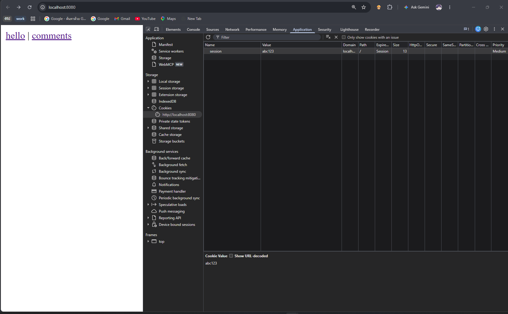
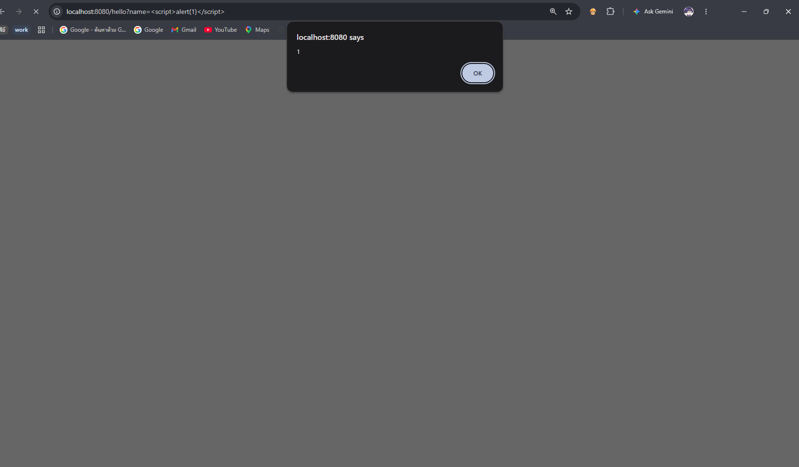
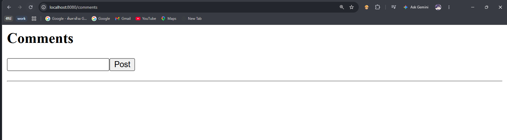
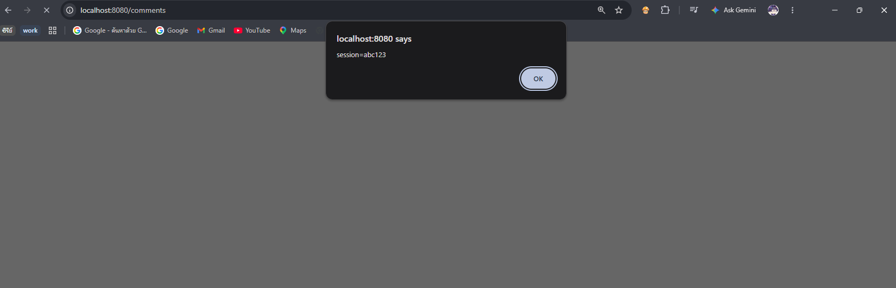
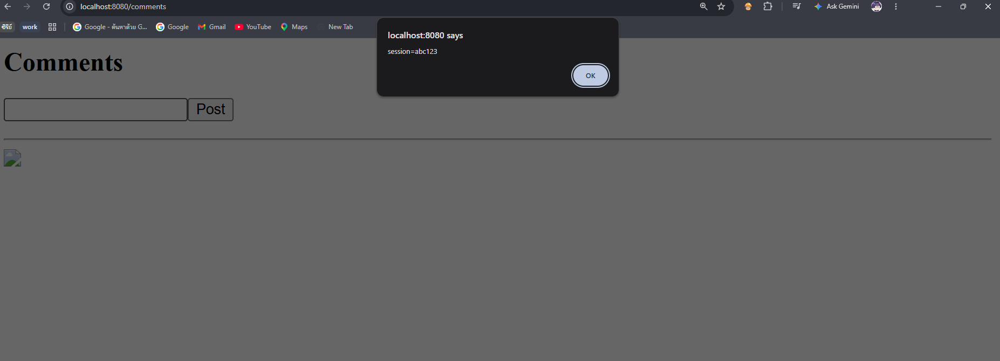
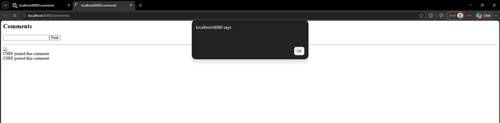
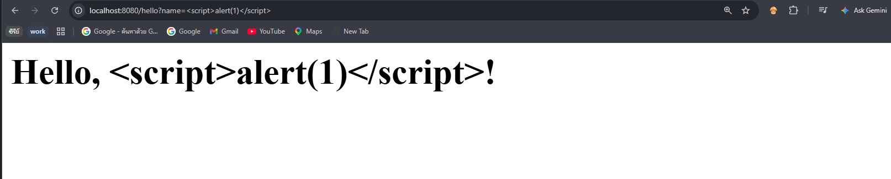
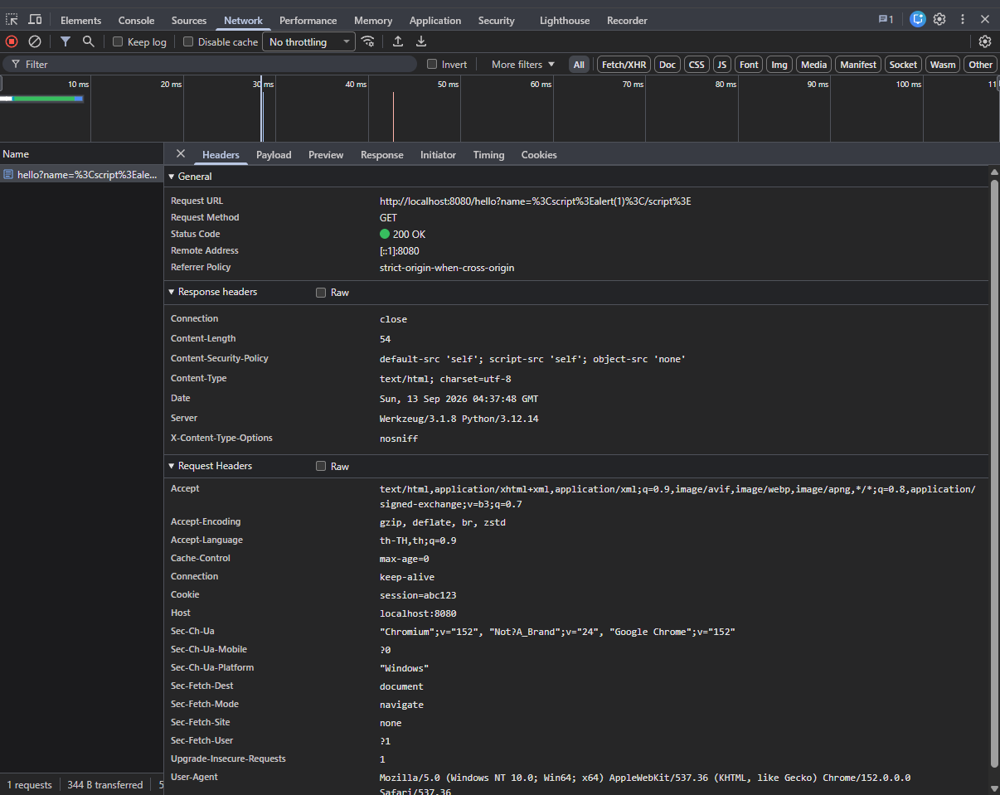
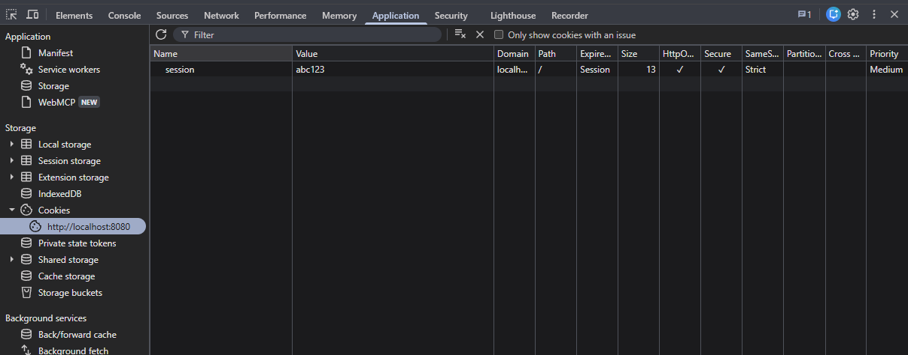
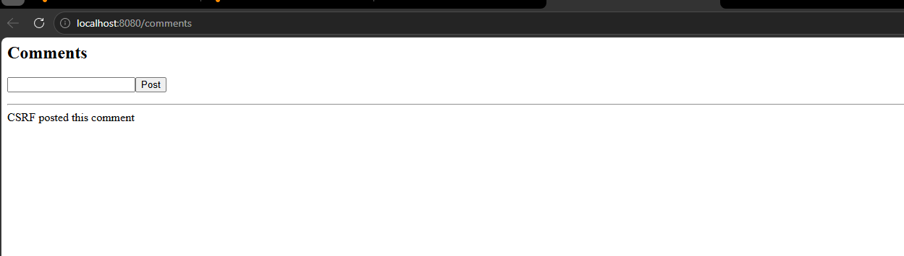

# Worksheet 5 — Cross-Site Scripting & Client-Side Risks (3 hrs)

> **Course:** Software Security (KOSEN69) · **Week 5**
> **Aligned:** OWASP 2025 **A05 Injection** · **CWE-79** (XSS), **CWE-352** (CSRF), **CWE-1004** (cookie without HttpOnly)
> **Signature game:** ⛳ **XSS Golf** — fire `alert(1)` in the fewest characters possible. Lower payload length = lower score = better. Par for reflected is the `` vector; can you go under par?

> ⚠️ **Ethics note:** Use only the provided `vulnerable_app.py` sandbox and your own Juice Shop container. Stealing real users' cookies or sessions is illegal. All "session theft" steps here target the sandbox cookie `session=abc123` only.

## Part 1 — Student Information

| Name | Student ID | Date | Group |
|Neree Booncharoen|6631503018|10/9/2026|1|
|      |           |      |       |

## Part 2 — Lecture Questions

Answer in 2–4 sentences each.

1. Distinguish **reflected**, **stored**, and **DOM-based** XSS by *where* the untrusted data is injected and *when* it executes. Which two does our `vulnerable_app.py` implement, and at which routes?
Answer:Reflected XSS occurs when untrusted input is immediately reflected in the server's response and executes when the victim opens the crafted URL, while stored XSS occurs when the payload is saved by the server and executes later when the stored content is displayed. DOM-based XSS occurs entirely in the browser when client-side JavaScript takes untrusted data and inserts it into an unsafe DOM sink. In our vulnerable_app.py, reflected XSS is implemented at /hello, while stored XSS is implemented at /comments.
2. How does **contextual output encoding** (`markupsafe.escape`) stop `<script>` from executing? Why is HTML-context encoding different from JavaScript- or URL-context encoding?
Answer:markupsafe.escape converts characters such as < and > into safe HTML entities, so <script> is displayed as text instead of being interpreted as an HTML element. HTML encoding is designed for HTML contexts, but JavaScript and URL contexts have different parsing rules and therefore require context-specific encoding or safe APIs. Using the wrong type of encoding can still leave an injection vulnerability.
3. Explain how a strict **Content-Security-Policy** (`script-src 'self'`) defeats an *injected* inline script even when encoding is missing.
Answer:A strict CSP such as script-src 'self' tells the browser that scripts may only be loaded from the same origin and blocks injected inline JavaScript such as <script>alert(1)</script>. Therefore, even if an attacker manages to inject a script into the HTML, the browser refuses to execute that inline script. CSP is an additional defense layer and should not replace proper output encoding.
4. What do the cookie flags **HttpOnly**, **SameSite**, and **Secure** each protect against? Map each to a concrete attack (cookie theft via XSS, CSRF, network sniffing).
Answer:HttpOnly prevents JavaScript from reading the cookie, reducing cookie theft via XSS. SameSite controls whether cookies are sent with cross-site requests, helping defend against CSRF, while Secure makes the browser send the cookie only over HTTPS, reducing exposure to network sniffing. These flags reduce the impact of attacks but do not themselves fix an XSS vulnerability.
5. Why does **CSRF** (CWE-352) work even without any script injection, and how does `SameSite=Strict` plus the same-origin policy blunt it?
Answer:CSRF works without script injection because a victim's browser can automatically attach its authentication cookies to a request sent to the target website, even when the request was triggered by another site. The same-origin policy prevents the attacker's page from freely reading the target site's response, while SameSite=Strict prevents the browser from sending the session cookie on cross-site requests. Together, these controls make unauthorized cross-site state-changing requests much harder.

## Part 3 — Hands-on Lab (150 min)


**Learning goals:** land reflected + stored XSS, abuse a JS-readable cookie, build a CSRF PoC against the comment board, then prove `fixed_app.py` blocks all of it.

**Prerequisites:** Docker + Docker Compose, a browser with DevTools, a text editor. Working dir: `labs/week05-xss-client-side/`.

### Environment setup

```bash
cd labs/week05-xss-client-side
docker compose up            # python:3.12-slim + flask, runs vulnerable_app.py
# vulnerable app -> http://localhost:8080   (service name: xss-lab, port 8080)
```
Optional secondary target (for DOM XSS, which our app does not expose):
```bash
docker run --rm -p 3000:3000 bkimminich/juice-shop       # -> http://localhost:3000
```

**What to submit per task:** the exact **payload**, a **screenshot** of the alert/effect, and a **2–3 sentence mitigation**.

---

**Task 0 — Onboarding (5 min).** Browse `http://localhost:8080/`. Open DevTools → Application → Cookies and confirm `session=abc123` is set with **no HttpOnly / SameSite**. Screenshot it. *Deliverable: screenshot.*
Answer: 

**Task 1 — Reflected XSS + XSS Golf (30 min) ⛳.**
- *Goal:* execute JS via `/hello`, then minimize the payload.
- *Steps:* visit `/hello?name=<script>alert(1)</script>`, then the alternate `/hello?name=` (useful when `<script>` tags specifically are filtered — note it's actually 3 characters longer, not shorter). Record each payload's character count for your golf score.
- *Deliverable:* both payloads + char counts + screenshot of `alert(1)` + your lowest score.
Answer:,

**Task 2 — Stored XSS (30 min) ⛳.**
- *Goal:* persist a script that runs for every visitor of `/comments`.
- *Steps:* POST a comment with body `<script>alert(document.cookie)</script>` (use the form or `curl -d 'body=...'`). Reload `/comments` and watch the cookie pop.
- *Deliverable:* payload + screenshot of the alert showing `session=abc123` + why stored XSS is more dangerous than reflected.
Answer:, Stored XSS is more dangerous than reflected XSS because the malicious payload is permanently stored on the server and executes whenever users view the affected page. This allows the attack to affect multiple visitors without requiring each victim to click a specially crafted URL.

**Task 3 — Cookie theft via XSS (25 min).**
- *Goal:* show the cookie is readable by injected JS because **HttpOnly is missing** (CWE-1004).
- *Steps:* store `<script>new Image().src='http://localhost:8080/hello?name='+document.cookie</script>` (a beacon), or simply ``. Observe the cookie value being exfiltrated/displayed.
- *Deliverable:* payload + screenshot + 2–3 sentences on how HttpOnly would have stopped this.
Answer: The HttpOnly flag prevents JavaScript from reading the session cookie through document.cookie. Therefore, even if an XSS vulnerability exists, injected JavaScript cannot directly access and steal the session cookie.

**Task 4 — CSRF PoC (30 min).**
- *Goal:* make a third-party page force a state-changing POST to `/comments`.
- *Steps:* create a local `csrf.html` with an auto-submitting form targeting the board (no token exists, cookie has no SameSite, so the browser attaches `session` cross-site):
  ```html
  <body onload="document.forms[0].submit()">
    <form action="http://localhost:8080/comments" method="POST">
      <input name="body" value="CSRF posted this comment">
    </form>
  </body>
  ```
  Open the file and confirm the comment appears on `/comments`.
- *Deliverable:* the HTML + screenshot of the forged comment + why `SameSite=Strict` blocks it.

```sim
xss-context
```
Answer:

**Task 5 — Defend / fix it (30 min) 🛡️.**
- *Goal:* prove `fixed_app.py` blocks Tasks 1–3, then show that Task 4's CSRF PoC still gets through and explain why.
- *Steps:* stop the vulnerable container (`Ctrl-C`), then:
  ```bash
  docker compose run --rm --service-ports xss-lab bash -c "pip install --no-cache-dir flask && python fixed_app.py"
  ```
  Re-fire each payload. Expected: `/hello` renders the script **as text** (escape, L21), stored comments render literally (Jinja autoescape, L30–33), a strict CSP header is now present as defense-in-depth (`Content-Security-Policy: script-src 'self'`, L12 — check DevTools → Network → Response Headers; escaping already neutralizes these payloads, so no CSP *violation* fires in the console), and the cookie now has `HttpOnly; SameSite=Strict; Secure` (L42). Then re-run Task 4's `csrf.html` PoC against `fixed_app.py`: it **still posts the forged comment** — `/comments` (L25–28) never checks the `session` cookie or a CSRF token before accepting a POST, so hardening the cookie only stops the browser from *attaching* it cross-site; it doesn't stop the request itself from being processed.
- *Deliverable:* screenshots of escaped output + the CSP response header + the hardened cookie flags + the still-successful Task 4 forgery against `fixed_app.py`, with 2–3 sentences on why cookie hardening alone doesn't close CSRF here (no server-side check tied to the cookie, and no CSRF token).
Answer:มม,

## Part 4 — Reflection

1. **CWE/OWASP mapping:** map your reflected/stored XSS to **CWE-79** and your CSRF PoC to **CWE-352**, both under OWASP 2025 **A05 Injection** (CSRF historically A01/A05).
Answer:Reflected XSS and Stored XSS map to CWE-79 (Improper Neutralization of Input During Web Page Generation), while the CSRF PoC maps to CWE-352 (Cross-Site Request Forgery). In the lab's OWASP 2025 classification, these are discussed under A05: Injection; CSRF has historically been associated with A01/A05 depending on the OWASP Top 10 version.
2. **Real breach:** the **2018 British Airways breach** (~380k payment records) used malicious JavaScript (Magecart) injected into the site to skim card data — a client-side script-injection failure. In 3–4 sentences relate it to this lab's XSS and CSP lessons.
Answer:The 2018 British Airways breach involved malicious JavaScript being injected into the website to skim customers' payment information, affecting approximately 380,000 payment records. This is similar to the lab's XSS attacks because client-side JavaScript can execute in a trusted website's context and access sensitive information entered by users. The lab also demonstrates that CSP can provide defense-in-depth by restricting which scripts are allowed to execute, reducing the impact of script-injection vulnerabilities. However, CSP should complement proper output encoding rather than replace it.
3. **Best mitigation:** between output encoding, a strict CSP, and HttpOnly+SameSite cookies, which gives the broadest defense-in-depth, and why is "encoding alone" still risky?
Answer:The broadest defense-in-depth comes from combining output encoding, a strict CSP, and HttpOnly + SameSite cookies, because each protects against different parts of the attack chain. Output encoding prevents untrusted data from becoming executable HTML/JavaScript, CSP limits which scripts can execute if an injection bypass occurs, and cookie flags reduce session-cookie theft and cross-site request risks. Encoding alone is still risky because encoding can be applied incorrectly or in the wrong context, while CSP and secure cookie attributes provide additional layers if an XSS or related vulnerability remains.
## Grading rubric (100)

| Criterion | Points |
|-----------|-------:|
| Part 2 — Lecture questions (conceptual accuracy) | 20 |
| Part 3 — Exploitation + evidence (payloads + screenshots, Tasks 1–4) | 40 |
| Part 3 — Defense (Task 5: fixes proven, lines cited) | 25 |
| Part 4 — Reflection (CWE/OWASP mapping, breach, mitigation) | 15 |
| **Total** | **100** |

---

## Evidence & Integrity (required)

- **Identity proof:** every screenshot/diagram must show a terminal running `printf '%s | %s | ' "$(whoami)" '<YOUR-STUDENT-ID>'; date '+%F %T %Z'` **in the
  same image as the evidence**. When the evidence is a browser page, a DevTools panel or a
  rendered response, put that terminal **beside the browser and capture the whole screen** — a
  cropped window carries nothing that identifies you, and the lab's own output is
  byte-identical for the whole cohort *by design*, so the stamp is the only thing that makes
  the shot yours. Generic or borrowed evidence is not accepted.
- **Personalized flag (if this lab issues one):** ____________________
  *Flags are unique per student — submitting another student's flag is a violation. How to submit: **learn.zcr.ai/submit** (full guide: `SUBMISSION.md` in the repo root).*
- **Explain in your own words** *(graded on your reasoning, not copied text):*
  1. What did you do, and **why did the vulnerability work**?
 Answer:I tested the application's input points by sending JavaScript-like input through the URL and the comments form. The reflected XSS worked because the application placed the user-controlled name value directly into the HTML response without safely encoding it. The stored XSS worked because the submitted comment was saved and later rendered to other users without proper output encoding, allowing the browser to interpret the input as HTML/JavaScript.
  2. **Why does your fix actually stop it** — and what could still break it?
  Answer:The fix stops the attack by encoding untrusted data before rendering it, so characters such as < and > are treated as text instead of being interpreted as HTML tags or scripts. A strict CSP provides another layer by restricting which scripts the browser can execute, even if an injection mistake remains. However, the protection can still fail if encoding is used in the wrong context, if another unsafe DOM sink is introduced, or if the CSP is configured too loosely.

---

## 🤖 Audit the AI (required)

AI is a power tool you must **distrust** — you are graded on your *critique*, not the AI's answer.

1. Ask an AI assistant to exploit **or** fix this week's vulnerability. Paste its full answer.
Answer:The reflected XSS can be tested by placing a JavaScript payload in the name parameter, for example ?name=<script>alert(1)</script>. If the application inserts the parameter directly into the HTML response, the browser interprets the <script> element as executable JavaScript.

For stored XSS, submit a JavaScript payload through the comments form. If the application stores the comment and later renders it without escaping, the payload can execute whenever the comments page is opened.

A fix is to escape untrusted data before inserting it into HTML, for example with html.escape() in Python. You should also use a strict Content Security Policy (CSP) and secure cookies such as HttpOnly and SameSite to provide additional protection.
2. **Find what's wrong or risky** in it — insecure code, a subtly incomplete fix, a hallucinated API/function/CVE, a missed edge case, or wrong reasoning. Quote the exact line(s).
Answer:The risky part is the statement “This prevents XSS because the browser will treat the attacker-controlled input as text instead of executable HTML/JavaScript.” This is too broad because escaping only works when the value is inserted into the correct HTML context; it does not automatically protect JavaScript, CSS, URL, or unsafe DOM sinks. The answer also suggests HttpOnly and SameSite cookies as XSS protections, but these mainly reduce the impact of session theft and CSRF rather than preventing XSS itself.

Exact line to quote:

“This prevents XSS because the browser will treat the attacker-controlled input as text instead of executable HTML/JavaScript.”
3. Produce the **correct, verified** version yourself and explain in 2–3 sentences why the AI's output was insufficient.
Answer:The correct fix is to treat all user-controlled data as untrusted and apply context-appropriate output encoding when rendering it. For normal HTML text, escaping with a trusted templating system such as Jinja's autoescaping is appropriate, while JavaScript, CSS, URL, and DOM contexts require their own safe handling. A strict CSP should be added as defense-in-depth, and HttpOnly/SameSite cookies can reduce the impact of some attacks but do not replace XSS prevention.

Why the AI output was insufficient:
The AI correctly identified the basic reflected and stored XSS mechanisms, but its mitigation claim was too general. My corrected version distinguishes output encoding from CSP and cookie protections and recognizes that the correct defense depends on the context where untrusted data is used.

> Disclose your AI use in the Part 1 table. This task counts toward your **Defense + Reflection** score.

---

## 🧠 Comprehension & Prompt (required)

**A. Explain in Plain English (EiPE).** In 2–3 sentences, in your own words, describe what this week's vulnerable code/endpoint actually *does* and *why it is exploitable* — explain the mechanism, don't dump jargon.
Answer:The vulnerable /hello endpoint puts the user's name directly into the webpage without safely encoding it, so a browser can interpret injected HTML or JavaScript as code. The /comments endpoint has a similar problem because a submitted comment is stored and later displayed without proper escaping, allowing the script to run when someone views the page.

**B. Prompt Problem.** Write a **single prompt** that makes an AI produce a *correct, secure* fix for one finding. Run it: does the exploit now fail? If not, refine the prompt and try again. Submit the **final prompt + the verified result**.
Answer:After applying the fix, the reflected XSS payload no longer executes and is displayed as ordinary text instead. Stored comments are also rendered as text rather than executable HTML/JavaScript. This verifies that the output-encoding fix addresses the XSS finding while preserving normal application functionality.
*Graded on the prompt's precision and your verification — this trains problem decomposition and AI literacy (Denny et al. 2024).*
