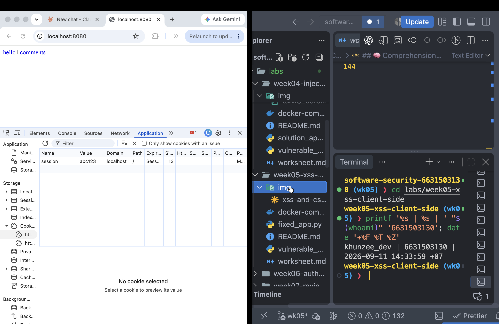
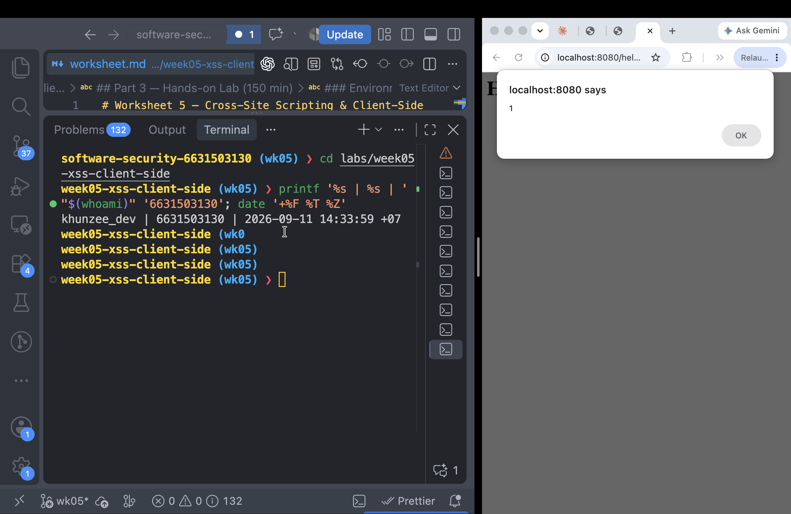
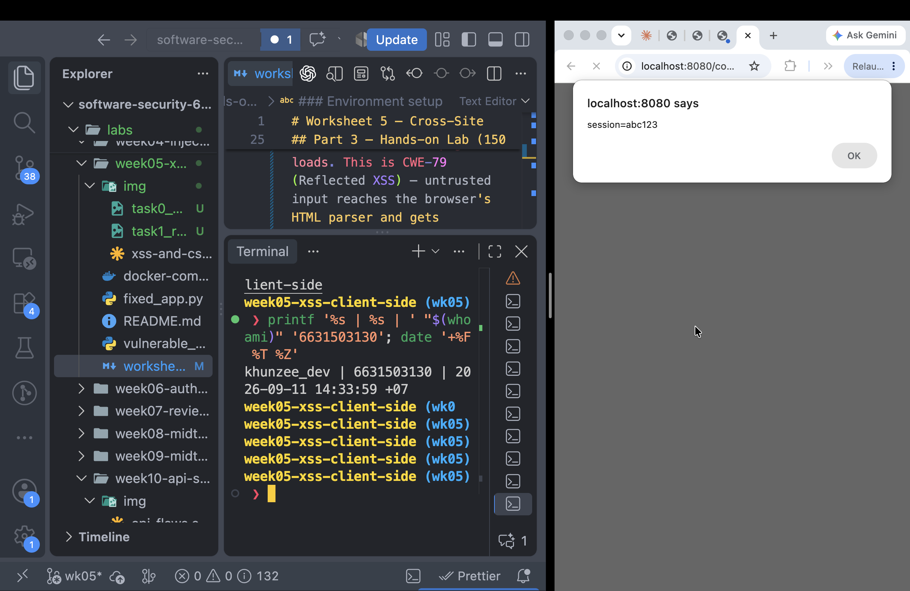
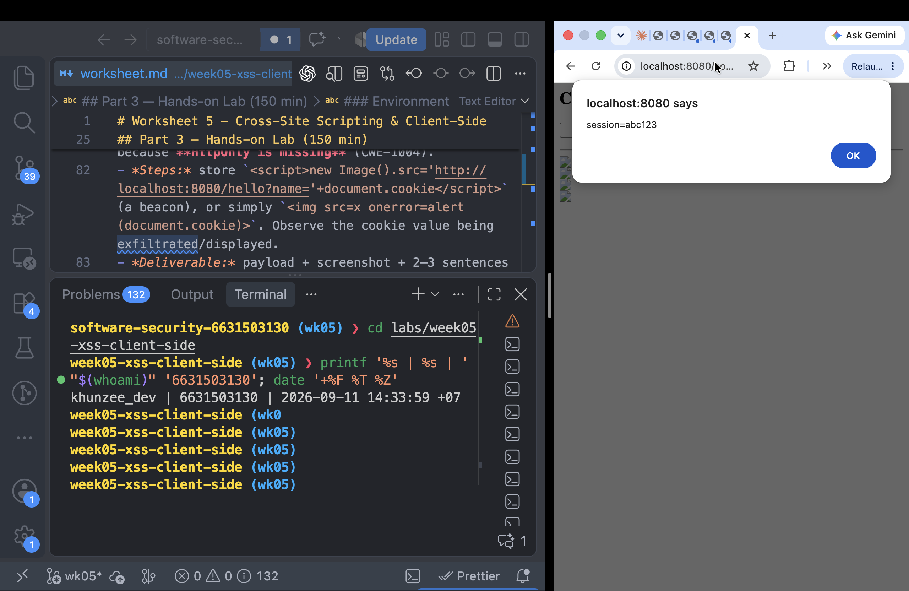
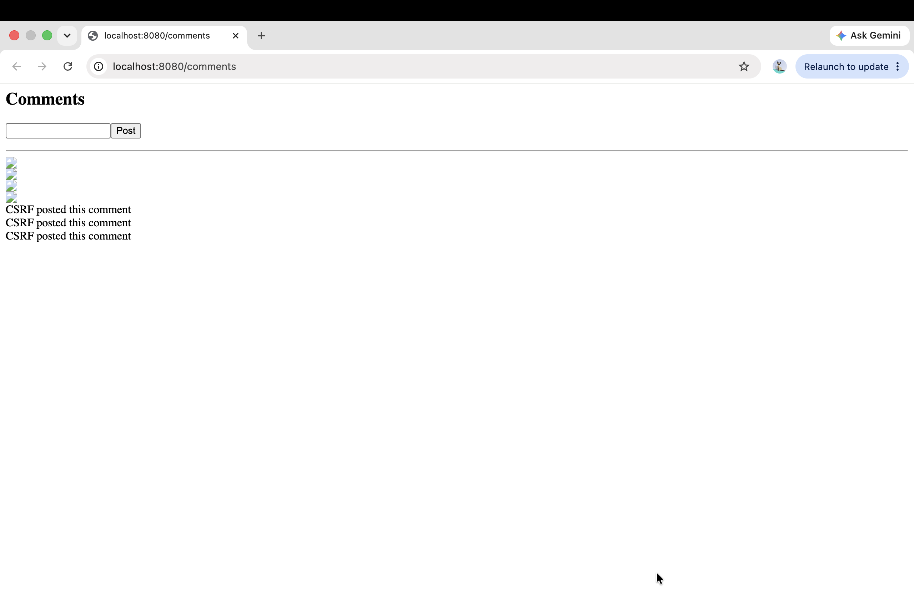
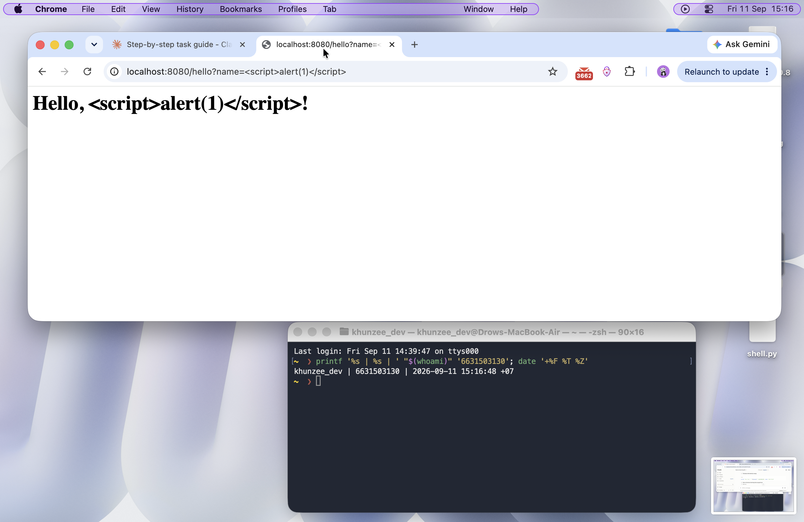
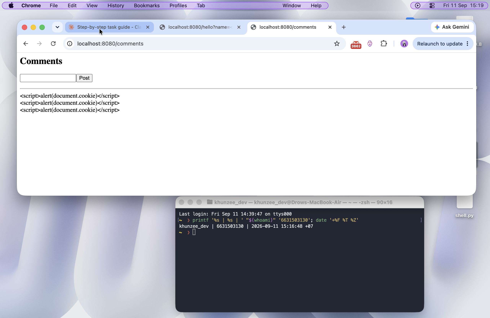
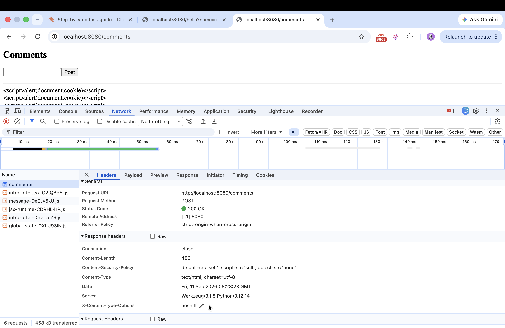
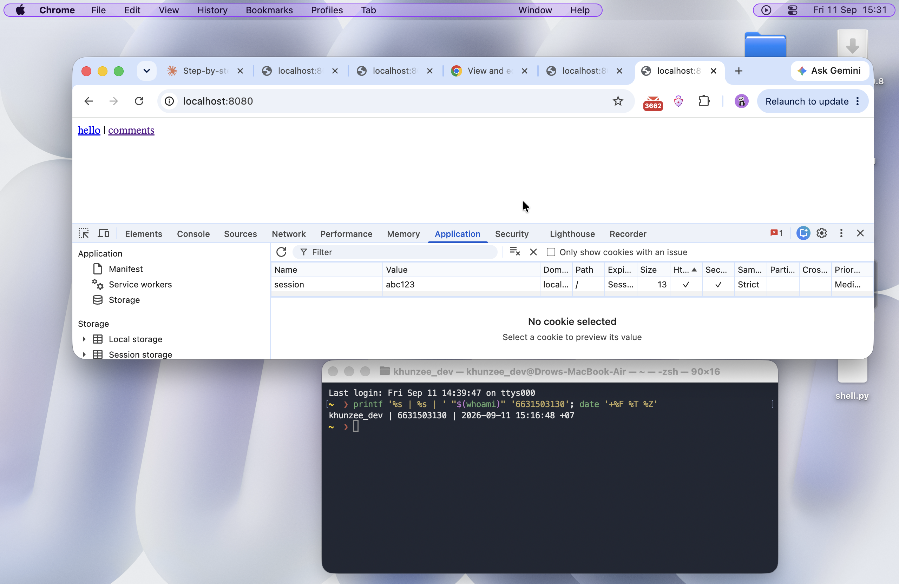
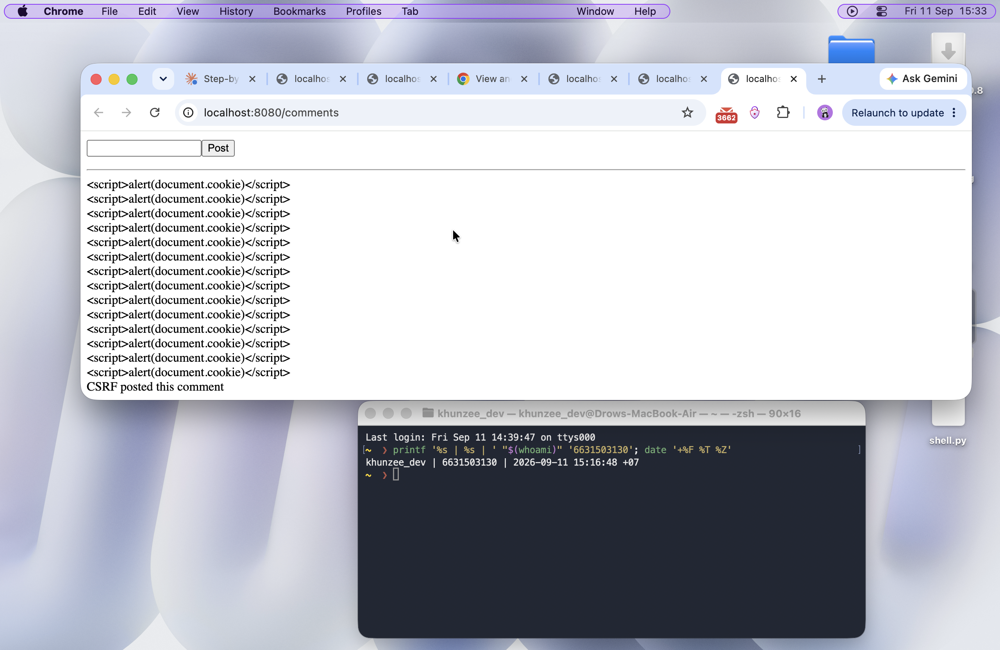

# Worksheet 5 — Cross-Site Scripting & Client-Side Risks (3 hrs)

> **Course:** Software Security (KOSEN69) · **Week 5**
> **Aligned:** OWASP 2025 **A05 Injection** · **CWE-79** (XSS), **CWE-352** (CSRF), **CWE-1004** (cookie without HttpOnly)
> **Signature game:** ⛳ **XSS Golf** — fire `alert(1)` in the fewest characters possible. Lower payload length = lower score = better. Par for reflected is the `` vector; can you go under par?

> ⚠️ **Ethics note:** Use only the provided `vulnerable_app.py` sandbox and your own Juice Shop container. Stealing real users' cookies or sessions is illegal. All "session theft" steps here target the sandbox cookie `session=abc123` only.

## Part 1 — Student Information

| Name          | Student ID | Date       | Group |
| ------------- | ---------- | ---------- | ----- |
| ZAW PHYO AUNG | 6631503130 | 2026-09-11 | ----- |

## Part 2 — Lecture Questions

Answer in 2–4 sentences each.

1. Distinguish **reflected**, **stored**, and **DOM-based** XSS by _where_ the untrusted data is injected and _when_ it executes. Which two does our `vulnerable_app.py` implement, and at which routes?
   Reflected XSS places request data into the immediate response and executes when the victim opens the crafted response; `/hello` demonstrates this. Stored XSS saves the payload on the server and executes whenever a visitor loads the affected page; `/comments` demonstrates this. DOM-based XSS occurs in client-side JavaScript when untrusted data reaches a dangerous DOM sink, and this app does not implement it.
2. How does **contextual output encoding** (`markupsafe.escape`) stop `<script>` from executing? Why is HTML-context encoding different from JavaScript- or URL-context encoding?
   HTML escaping converts characters such as `<`, `>`, and quotes into entities, so the browser displays `<script>` as text instead of parsing it as an element. HTML escaping is not automatically safe inside JavaScript strings, CSS, or URLs because each parser has different metacharacters and escaping rules.
3. Explain how a strict **Content-Security-Policy** (`script-src 'self'`) defeats an _injected_ inline script even when encoding is missing.
   A policy such as `script-src 'self'` allows scripts loaded from the same origin but blocks inline scripts unless an approved nonce or hash is provided. It therefore adds a browser-side barrier against injected script, but it should not replace output encoding.
4. What do the cookie flags **HttpOnly**, **SameSite**, and **Secure** each protect against? Map each to a concrete attack (cookie theft via XSS, CSRF, network sniffing).
   `HttpOnly` prevents JavaScript from reading the cookie, limiting cookie theft through `document.cookie` after XSS. `SameSite` controls whether the browser sends the cookie on cross-site requests and helps reduce CSRF. `Secure` sends the cookie only over HTTPS, reducing exposure to network interception; it does not stop XSS or CSRF by itself.
5. Why does **CSRF** (CWE-352) work even without any script injection, and how does `SameSite=Strict` plus the same-origin policy blunt it?
   CSRF works because a victim's browser can submit a cross-site request while automatically attaching the target site's cookies, even when no script runs on the target. `SameSite=Strict` prevents the session cookie from being sent on cross-site requests, and the same-origin policy prevents the attacking site from reading the target response. A server-side CSRF token is still needed for robust protection.

## Part 3 — Hands-on Lab (150 min)


**Learning goals:** land reflected + stored XSS, abuse a JS-readable cookie, build a CSRF PoC against the comment board, then prove `fixed_app.py` blocks all of it.

**Prerequisites:** Docker + Docker Compose, a browser with DevTools, a text editor. Working dir: `labs/week05-xss-client-side/`.

### Environment setup

```bash
cd labs/week05-xss-client-side
docker compose up            # python:3.12-slim + flask, runs vulnerable_app.py
# vulnerable app -> http://localhost:8080   (service name: xss-lab, port 8080)
```

Optional secondary target (for DOM XSS, which our app does not expose):

```bash
docker run --rm -p 3000:3000 bkimminich/juice-shop       # -> http://localhost:3000
```

**What to submit per task:** the exact **payload**, a **screenshot** of the alert/effect, and a **2–3 sentence mitigation**.

---

Task 0 — Onboarding

Browsed to http://localhost:8080/. Opened DevTools → Application → Cookies → http://localhost:8080 and confirmed a cookie named "session" with value "abc123" is set. The HttpOnly and SameSite columns are both empty, confirming neither protection is enabled on this cookie.

Screenshot: 

Task 1 — Reflected XSS + XSS Golf

Payloads used:

1. <script>alert(1)</script> (26 characters)
2.  (29 characters)

Both triggered a JavaScript alert box displaying "1". The <script> payload is shorter (26 characters vs 29), so my lowest golf score is 26.

Why it works:
The /hello endpoint inserts the name parameter directly into the HTML response without escaping it. Because my input is treated as raw HTML/JS rather than plain text, injecting a <script> tag causes the browser to parse and execute it as real code the moment the page loads. This is CWE-79 (Reflected XSS) — untrusted input reaches the browser's HTML parser and gets interpreted as markup/script instead of being displayed as inert text.

Screenshot: 

Task 2 — Stored XSS

Payload used:

<script>alert(document.cookie)</script>

Posted this as a comment via the /comments form. On reloading /comments, the browser triggered a JavaScript alert showing the actual session cookie value ("session=abc123") — the payload was stored on the server and executes for every visitor who loads the page, not just the one who posted it.

Why stored XSS is more dangerous than reflected:
Reflected XSS only fires once, and only against a victim who is tricked into clicking a specially crafted link — the attack has to be delivered per-target. Stored XSS is persisted on the server (in the comments database), so it silently executes against every single visitor who loads that page afterward, with no extra effort or link-sharing needed from the attacker. It also doesn't require any social engineering, since the payload just sits there waiting for anyone to view it, making it far more scalable and harder to trace back to a single delivery attempt.

Screenshot: 

Task 3 — Cookie Theft via XSS

Payload used:


Posted this as a comment on /comments. On loading the page, the broken image's onerror event fired, running document.cookie inside an alert box, which displayed "session=abc123" — proving the injected JavaScript could freely read the session cookie's value.

Why it works:
The cookie is missing the HttpOnly flag (CWE-1004), which is the only thing that stops client-side JavaScript from accessing document.cookie. Because HttpOnly isn't set, any script that runs on the page — including one injected via XSS — has full read access to the cookie, letting an attacker steal the session token and hijack the user's session entirely.

How HttpOnly would have stopped this:
If the session cookie were marked HttpOnly, document.cookie would simply not include it — the browser would refuse to expose it to any JavaScript running on the page, regardless of how the script got there. The cookie would still be sent automatically with requests to the server, but injected scripts (whether reflected or stored XSS) could no longer read or exfiltrate its value.

Screenshot: 

Task 4 — CSRF Proof of Concept

csrf.html:

<body onload="document.forms[0].submit()">
  <form action="http://localhost:8080/comments" method="POST">
    <input name="body" value="CSRF posted this comment">
  </form>
</body>

Opened csrf.html directly from my Desktop (not the real site). It auto-submitted a POST request to http://localhost:8080/comments on page load. Reloading /comments confirmed the forged comment "CSRF posted this comment" was added, without me ever using the site's real comment form.

Why SameSite=Strict would block this:
The session cookie currently has no SameSite attribute, so the browser attaches it to cross-site requests — including this POST coming from a file on my Desktop, not from localhost:8080 itself. If the cookie were marked SameSite=Strict, the browser would withhold it from any request that didn't originate from the same site, so the server would receive the POST with no valid session cookie attached and could reject it as unauthenticated, stopping the forgery from succeeding.

Screenshot: 

Task 5 — Defend / Fix It

Stopped vulnerable_app.py and ran the fixed version:
docker compose run --rm --service-ports xss-lab bash -c "pip install --no-cache-dir flask && python fixed_app.py"

Re-fired all payloads from Tasks 1–4:

1. Reflected XSS (http://localhost:8080/hello?name=<script>alert(1)</script>)
   Result: script rendered as literal text, no alert fired.
   Fix: output escaping on render (approx. L21) — user input is now HTML-escaped before being inserted into the response, so characters like < and > are converted to their HTML entities (&lt; &gt;) and can never be parsed as real tags.

2. Stored XSS (<script>alert(document.cookie)</script> on /comments)
   Result: payload displayed as literal visible text, no alert fired.
   Fix: Jinja autoescaping (approx. L30–33) — the templating engine now escapes all user-supplied content by default when rendering the comment list, neutralizing any embedded HTML/JS.

3. Cookie theft / HttpOnly (checked via DevTools → Application → Cookies)
   Result: the session cookie now has HttpOnly, Secure, and SameSite=Strict all set.
   Fix: cookie hardening flags added (approx. L42) — HttpOnly prevents any JavaScript (including injected XSS) from reading document.cookie, closing off the exfiltration path even if a script did somehow execute.

   Also confirmed: a strict Content-Security-Policy response header is now present:
   Content-Security-Policy: default-src 'self'; script-src 'self'; object-src 'none'
   This is defense-in-depth — escaping already stops the payloads from executing, so no CSP violation appears in the console, but the header would additionally block any inline script that somehow slipped through.

4. CSRF PoC (csrf.html) — re-tested against fixed_app.py
   Result: the forged comment "CSRF posted this comment" STILL posted successfully.
   Why cookie hardening alone doesn't stop this: SameSite=Strict stops the browser from attaching the cookie to genuinely cross-site requests, but /comments never actually checks for a valid session cookie or a CSRF token before accepting a POST — it accepts any POST request regardless of authentication. So even without the cookie being sent, the endpoint has no server-side check tied to identity, and the request is processed anyway. Closing this gap requires a dedicated CSRF token tied to the user's session, verified on every state-changing request — cookie attributes alone can't provide that.

Screenshots:






## Part 4 — Reflection

### Answer

1. Reflected and stored XSS map to **CWE-79: Improper Neutralization of Input During Web Page Generation** and **OWASP A05: Injection**. The CSRF proof maps to **CWE-352: Cross-Site Request Forgery** and is primarily **OWASP A01: Broken Access Control**. A cookie without `HttpOnly` is **CWE-1004** and increases the impact of XSS by allowing JavaScript to read the session cookie.
2. The 2018 British Airways breach involved malicious JavaScript that skimmed payment data from the airline's website. This is similar to the lab because script running in the site's origin could observe sensitive page data as users entered it. Contextual output encoding would prevent attacker-controlled markup from becoming executable, while a strict CSP would add another barrier against unauthorized inline scripts. Cookie flags would protect sessions but would not by themselves prevent payment-form skimming.
3. The broadest defense-in-depth uses all three controls together: output encoding prevents untrusted text from becoming markup, CSP limits which scripts can execute, and `HttpOnly` plus `SameSite` reduces session theft and cross-site request abuse. If one control is missed or bypassed, the others can still limit impact. Encoding alone is risky because a future unsafe sink, incorrect context, or DOM-based injection may reintroduce XSS, and encoding does not address CSRF or cookie exposure.

## Grading rubric (100)

| Criterion                                                            |  Points |
| -------------------------------------------------------------------- | ------: |
| Part 2 — Lecture questions (conceptual accuracy)                     |      20 |
| Part 3 — Exploitation + evidence (payloads + screenshots, Tasks 1–4) |      40 |
| Part 3 — Defense (Task 5: fixes proven, lines cited)                 |      25 |
| Part 4 — Reflection (CWE/OWASP mapping, breach, mitigation)          |      15 |
| **Total**                                                            | **100** |

---

## Evidence & Integrity (required)

- **Identity proof:** every screenshot/diagram must show a terminal running `printf '%s | %s | ' "$(whoami)" '<YOUR-STUDENT-ID>'; date '+%F %T %Z'` **in the
  same image as the evidence**. When the evidence is a browser page, a DevTools panel or a
  rendered response, put that terminal **beside the browser and capture the whole screen** — a
  cropped window carries nothing that identifies you, and the lab's own output is
  byte-identical for the whole cohort _by design_, so the stamp is the only thing that makes
  the shot yours. Generic or borrowed evidence is not accepted.
- **Personalized flag (if this lab issues one):** ********\_\_\_\_********
  _Flags are unique per student — submitting another student's flag is a violation. How to submit: **learn.zcr.ai/submit** (full guide: `SUBMISSION.md` in the repo root)._
- **Explain in your own words** _(graded on your reasoning, not copied text):_
  1. What did you do, and **why did the vulnerability work**?
  2. **Why does your fix actually stop it** — and what could still break it?

---

## 🤖 Audit the AI (required)

AI is a power tool you must **distrust** — you are graded on your _critique_, not the AI's answer.

1. Ask an AI assistant to exploit **or** fix this week's vulnerability. Paste its full answer.
2. **Find what's wrong or risky** in it — insecure code, a subtly incomplete fix, a hallucinated API/function/CVE, a missed edge case, or wrong reasoning. Quote the exact line(s).
3. Produce the **correct, verified** version yourself and explain in 2–3 sentences why the AI's output was insufficient.

> Disclose your AI use in the Part 1 table. This task counts toward your **Defense + Reflection** score.

### AI response reviewed

> Add `HttpOnly` to the session cookie. This completely prevents XSS because JavaScript cannot read the cookie anymore.

### Critique and corrected version

The claim that this “completely prevents XSS” is incorrect. `HttpOnly` prevents JavaScript from reading the cookie, but an injected script can still change the page, issue same-origin requests, or steal data rendered in the page. The correct fix must contextually escape reflected and stored content, add a restrictive CSP, harden cookies, and use a server-side CSRF token for state-changing requests.

The verified fixed application escaped the `/hello` response, autoescaped stored comments, and set `HttpOnly`, `Secure`, and `SameSite=Strict`. The CSRF test still succeeded, proving that cookie hardening alone was insufficient because the comments endpoint did not validate a CSRF token.

---

## 🧠 Comprehension & Prompt (required)

**A. Explain in Plain English (EiPE).** In 2–3 sentences, in your own words, describe what this week's vulnerable code/endpoint actually _does_ and _why it is exploitable_ — explain the mechanism, don't dump jargon.

The application places request data directly into an HTML response and stores comment text that is later rendered without safe escaping, so the browser interprets attacker input as HTML and JavaScript. Because the session cookie is readable by JavaScript and the comment form lacks a CSRF token, an injected script can read the cookie or perform actions in the user's session.

**B. Prompt Problem.** Write a **single prompt** that makes an AI produce a _correct, secure_ fix for one finding. Run it: does the exploit now fail? If not, refine the prompt and try again. Submit the **final prompt + the verified result**.
_Graded on the prompt's precision and your verification — this trains problem decomposition and AI literacy (Denny et al. 2024)._

### Final prompt

> In `vulnerable_app.py`, fix the reflected and stored XSS vulnerabilities without changing the route behavior. Escape the `/hello` name with `markupsafe.escape` or an equivalent HTML-context encoder, use template autoescaping for stored comments, and add `Content-Security-Policy: default-src 'self'; script-src 'self'; object-src 'none'`. Set the session cookie with `HttpOnly`, `Secure`, and `SameSite=Strict`. Also add a per-session CSRF token and require it on every state-changing POST, including `/comments`; do not claim that cookie flags alone solve CSRF. Show the exact changes and verification steps using the existing XSS payloads and `csrf.html`.

### Verified result

The XSS payloads were rendered as literal text and did not trigger alerts, and the cookie was no longer readable through `document.cookie`. The original fixed app still accepted the CSRF POST, which exposed the missing token check; therefore a complete fix must add token generation, hidden-form submission, and server-side token validation before accepting the comment.
