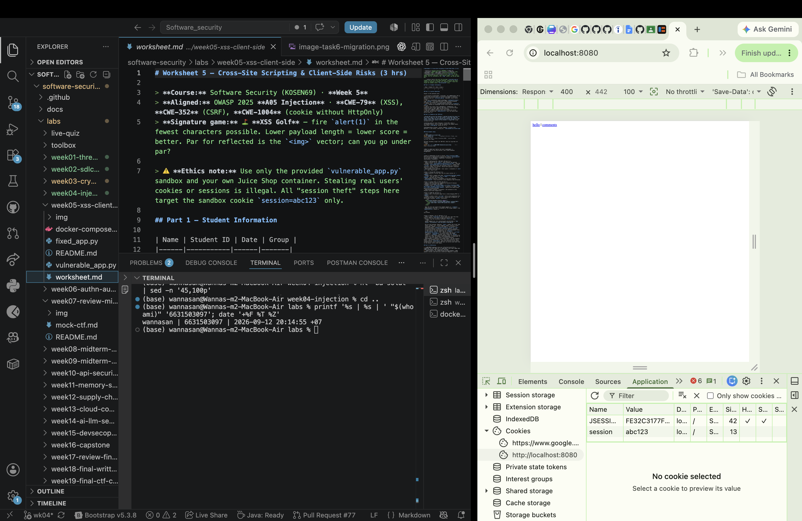
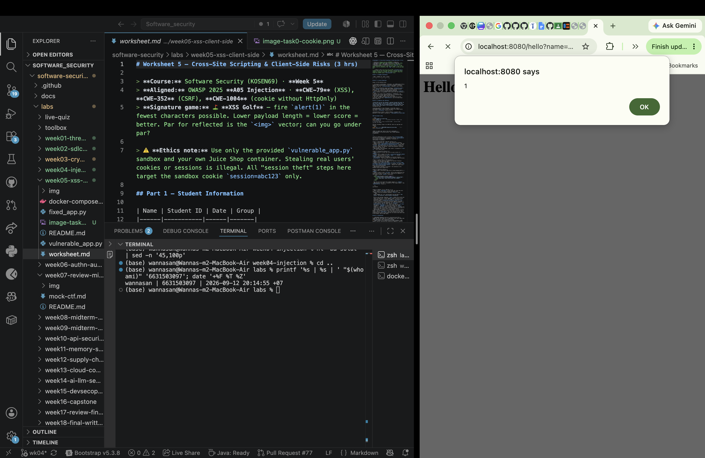
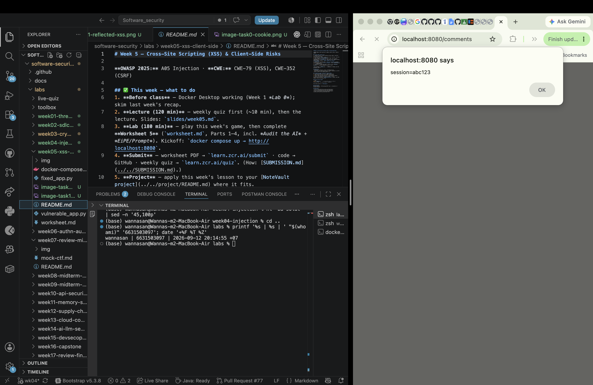
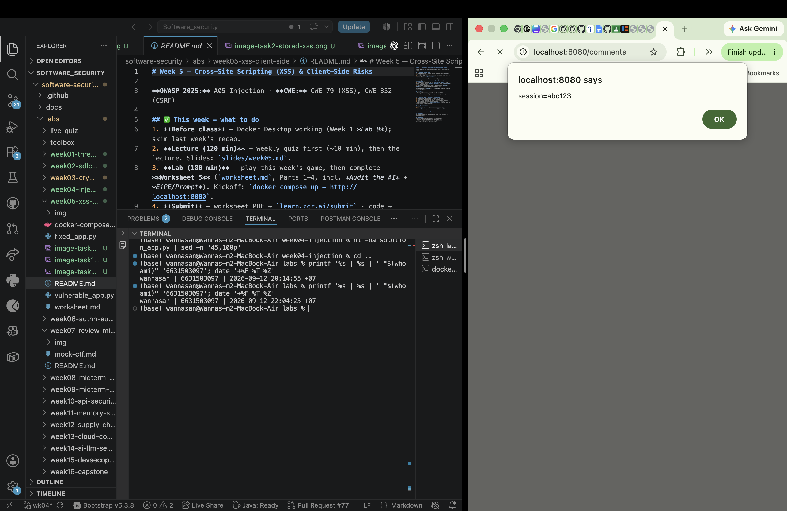
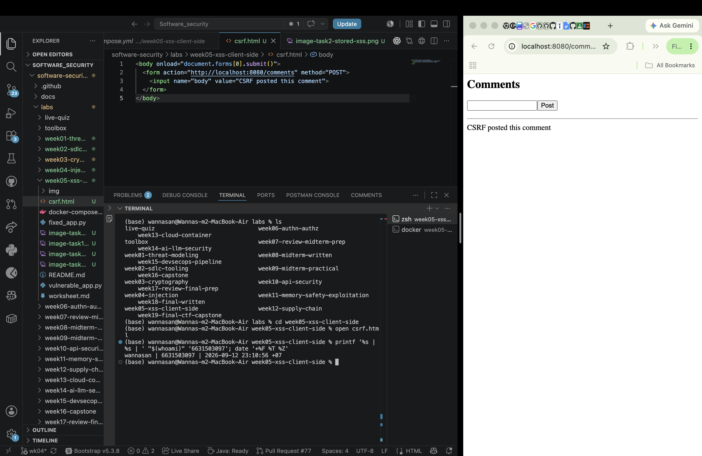
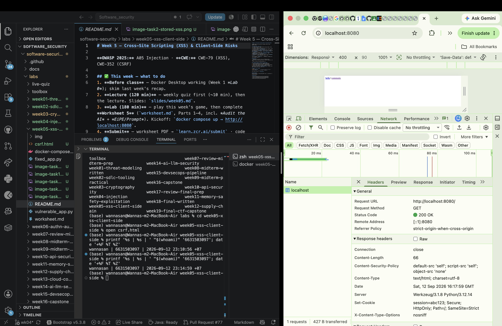
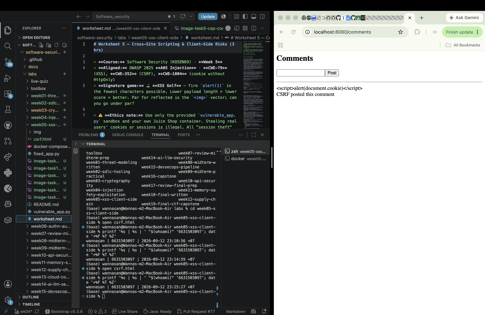

# Worksheet 5 — Cross-Site Scripting & Client-Side Risks (3 hrs)

> **Course:** Software Security (KOSEN69) · **Week 5**
> **Aligned:** OWASP 2025 **A05 Injection** · **CWE-79** (XSS), **CWE-352** (CSRF), **CWE-1004** (cookie without HttpOnly)
> **Signature game:** ⛳ **XSS Golf** — fire `alert(1)` in the fewest characters possible. Lower payload length = lower score = better. Par for reflected is the `` vector; can you go under par?

> ⚠️ **Ethics note:** Use only the provided `vulnerable_app.py` sandbox and your own Juice Shop container. Stealing real users' cookies or sessions is illegal. All "session theft" steps here target the sandbox cookie `session=abc123` only.

## Part 1 — Student Information

| Name | Student ID | Date | Group |
|------|-----------|------|-------|
| Wanna-San | 6631503097 | 2026-09-12 | The Outsider |

**AI-use disclosure:** I used ChatGPT/Codex for guidance, drafting, troubleshooting, checking requirements, and help with worksheet and code changes. I personally ran the commands, performed the browser tests, checked the results, and captured the screenshots.

## Part 2 — Lecture Questions

Answer in 2–4 sentences each.

1. Distinguish **reflected**, **stored**, and **DOM-based** XSS by *where* the untrusted data is injected and *when* it executes. Which two does our `vulnerable_app.py` implement, and at which routes?

   Reflected XSS sends request data straight back in the current response, while stored XSS saves the payload on the server and executes it when the page is loaded later. DOM XSS happens when client-side JavaScript writes unsafe data into the DOM. The graded app implements reflected XSS at `/hello` and stored XSS at `/comments`; it does not implement DOM XSS.

2. How does **contextual output encoding** (`markupsafe.escape`) stop `<script>` from executing? Why is HTML-context encoding different from JavaScript- or URL-context encoding?

   HTML escaping changes characters such as `<` and `>` into safe entities, so the browser displays the payload as text instead of creating a script element. JavaScript strings and URLs have different special characters and parsing rules, so each output context needs the encoder made for that context.

3. Explain how a strict **Content-Security-Policy** (`script-src 'self'`) defeats an *injected* inline script even when encoding is missing.

   `script-src 'self'` allows scripts only from the application's own origin and blocks injected inline script by default. CSP reduces the damage of an escaping mistake, but it is defense-in-depth and does not replace contextual output encoding.

4. What do the cookie flags **HttpOnly**, **SameSite**, and **Secure** each protect against? Map each to a concrete attack (cookie theft via XSS, CSRF, network sniffing).

   HttpOnly prevents JavaScript from reading a session cookie, which reduces cookie theft through XSS. SameSite limits when the browser attaches the cookie to cross-site requests and therefore reduces CSRF, while Secure sends it only over HTTPS to reduce exposure on an unencrypted connection.

5. Why does **CSRF** (CWE-352) work even without any script injection, and how does `SameSite=Strict` plus the same-origin policy blunt it?

   CSRF needs no XSS because a third-party page can submit a form and the browser may automatically attach the target site's cookies. SameSite=Strict limits cross-site cookie attachment and the same-origin policy prevents the attacker from reading the response, but this lab's `/comments` still accepts the forged POST because it checks neither authentication nor a CSRF token.

## Part 3 — Hands-on Lab (150 min)


**Learning goals:** land reflected + stored XSS, abuse a JS-readable cookie, build a CSRF PoC against the comment board, then prove `fixed_app.py` blocks all of it.

**Prerequisites:** Docker + Docker Compose, a browser with DevTools, a text editor. Working dir: `labs/week05-xss-client-side/`.

### Environment setup

```bash
cd labs/week05-xss-client-side
docker compose up            # python:3.12-slim + flask, runs vulnerable_app.py
# vulnerable app -> http://localhost:8080   (service name: xss-lab, port 8080)
```
Optional secondary target (for DOM XSS, which our app does not expose):
```bash
docker run --rm -p 3000:3000 bkimminich/juice-shop       # -> http://localhost:3000
```

**What to submit per task:** the exact **payload**, a **screenshot** of the alert/effect, and a **2–3 sentence mitigation**.

---

**Task 0 — Onboarding (5 min).** Browse `http://localhost:8080/`. Open DevTools → Application → Cookies and confirm `session=abc123` is set with **no HttpOnly / SameSite**. Screenshot it. *Deliverable: screenshot.*

**URL:** `http://localhost:8080/`

**Observed result:** DevTools showed `session=abc123` without HttpOnly or SameSite protection.



This confirmed that the vulnerable app set a JavaScript-readable cookie that could also be attached more freely to cross-site requests. HttpOnly and SameSite reduce those risks, while Secure should be enabled when the application is served over HTTPS.

**Task 1 — Reflected XSS + XSS Golf (30 min) ⛳.**
- *Goal:* execute JS via `/hello`, then minimize the payload.
- *Steps:* visit `/hello?name=<script>alert(1)</script>`, then the alternate `/hello?name=` (useful when `<script>` tags specifically are filtered — note it's actually 3 characters longer, not shorter). Record each payload's character count for your golf score.
- *Deliverable:* both payloads + char counts + screenshot of `alert(1)` + your lowest score.

**Payloads tested:**

```html
<script>alert(1)</script>

```

Both payloads were tested against `http://localhost:8080/hello?name=...` and executed `alert(1)`. The `<script>` payload is 25 characters, the `` payload is 28 characters, and my lowest golf score was **25**.



The `/hello` route inserts `name` directly into HTML without escaping, so the browser parses the injected markup as code. HTML-context output encoding is the primary fix; CSP adds another layer but should not replace encoding.

**Task 2 — Stored XSS (30 min) ⛳.**
- *Goal:* persist a script that runs for every visitor of `/comments`.
- *Steps:* POST a comment with body `<script>alert(document.cookie)</script>` (use the form or `curl -d 'body=...'`). Reload `/comments` and watch the cookie pop.
- *Deliverable:* payload + screenshot of the alert showing `session=abc123` + why stored XSS is more dangerous than reflected.

**Stored payload:**

```html
<script>alert(document.cookie)</script>
```

**Observed result:** The payload stayed in the in-memory comment list and executed when `/comments` rendered. The alert displayed `session=abc123`.



Stored XSS is more dangerous than reflected XSS because the payload is saved and can attack every visitor who loads the affected page. Jinja autoescaping or explicit contextual escaping should render the comment as text instead of executable markup.

**Task 3 — Cookie theft via XSS (25 min).**
- *Goal:* show the cookie is readable by injected JS because **HttpOnly is missing** (CWE-1004).
- *Steps:* store `<script>new Image().src='http://localhost:8080/hello?name='+document.cookie</script>` (a beacon), or simply ``. Observe the cookie value being exfiltrated/displayed.
- *Deliverable:* payload + screenshot + 2–3 sentences on how HttpOnly would have stopped this.

**Payload tested:**

```html

```

**Observed result:** The alert displayed `session=abc123`.



JavaScript could read the cookie because HttpOnly was missing. HttpOnly would hide the session cookie from `document.cookie`, but it would not remove the XSS vulnerability itself, so output encoding is still required.

**Task 4 — CSRF PoC (30 min).**
- *Goal:* make a third-party page force a state-changing POST to `/comments`.
- *Steps:* create a local `csrf.html` with an auto-submitting form targeting the board (no token exists, cookie has no SameSite, so the browser attaches `session` cross-site):
  ```html
  <body onload="document.forms[0].submit()">
    <form action="http://localhost:8080/comments" method="POST">
      <input name="body" value="CSRF posted this comment">
    </form>
  </body>
  ```
  Open the file and confirm the comment appears on `/comments`.
- *Deliverable:* the HTML + screenshot of the forged comment + why `SameSite=Strict` blocks it.

**Exact `csrf.html` used:**

```html
<body onload="document.forms[0].submit()">
  <form action="http://localhost:8080/comments" method="POST">
    <input name="body" value="CSRF posted this comment">
  </form>
</body>
```

**Observed result:** Opening the local file submitted the forged POST, and `/comments` displayed `CSRF posted this comment`.



The attack works because `/comments` accepts a state-changing POST without checking a CSRF token. SameSite=Strict can prevent a session cookie from being attached cross-site, but it is not a complete fix here because this endpoint accepts and processes the request without checking authentication or CSRF state.

```sim
xss-context
```

**Task 5 — Defend / fix it (30 min) 🛡️.**
- *Goal:* prove `fixed_app.py` blocks Tasks 1–3, then show that Task 4's CSRF PoC still gets through and explain why.
- *Steps:* stop the vulnerable container (`Ctrl-C`), then:
  ```bash
  docker compose run --rm --service-ports xss-lab bash -c "pip install --no-cache-dir flask && python fixed_app.py"
  ```
  Re-fire each payload. Expected: `/hello` renders the script **as text** (escape, L21), stored comments render literally (Jinja autoescape, L30–33), a strict CSP header is now present as defense-in-depth (`Content-Security-Policy: script-src 'self'`, L12 — check DevTools → Network → Response Headers; escaping already neutralizes these payloads, so no CSP *violation* fires in the console), and the cookie now has `HttpOnly; SameSite=Strict; Secure` (L42). Then re-run Task 4's `csrf.html` PoC against `fixed_app.py`: it **still posts the forged comment** — `/comments` (L25–28) never checks the `session` cookie or a CSRF token before accepting a POST, so hardening the cookie only stops the browser from *attaching* it cross-site; it doesn't stop the request itself from being processed.
- *Deliverable:* screenshots of escaped output + the CSP response header + the hardened cookie flags + the still-successful Task 4 forgery against `fixed_app.py`, with 2–3 sentences on why cookie hardening alone doesn't close CSRF here (no server-side check tied to the cookie, and no CSRF token).

**Fixed application command:**

```bash
docker compose run --rm --service-ports xss-lab bash -c "pip install --no-cache-dir flask && python fixed_app.py"
```

**Verified results:**

- Reflected XSS was escaped and rendered as text instead of executing (`fixed_app.py:17-22`).
- Stored XSS was rendered literally through Jinja autoescaping (`fixed_app.py:25-34`).
- The response included `Content-Security-Policy: default-src 'self'; script-src 'self'; object-src 'none'` and `X-Content-Type-Options: nosniff` (`fixed_app.py:10-14`).
- `Set-Cookie` included `Secure`, `HttpOnly`, and `SameSite=Strict` (`fixed_app.py:37-43`).
- Re-running the same `csrf.html` still created `CSRF posted this comment`.





Escaping and Jinja autoescaping neutralize the XSS payloads, while CSP and HttpOnly reduce the impact of a future rendering mistake. The CSRF request still succeeds because `/comments` at lines 25-28 does not validate a token or tie the POST to authenticated session state, so cookie hardening alone does not authorize the request.

## Part 4 — Reflection

1. **CWE/OWASP mapping:** map your reflected/stored XSS to **CWE-79** and your CSRF PoC to **CWE-352**, both under OWASP 2025 **A05 Injection** (CSRF historically A01/A05).

   Reflected and stored XSS map to CWE-79, the forged request maps to CWE-352, and the cookie without HttpOnly is CWE-1004. Following this worksheet's framing, the demonstrated client-side injection issues are discussed under OWASP 2025 A05 Injection.

2. **Real breach:** the **2018 British Airways breach** (~380k payment records) used malicious JavaScript (Magecart) injected into the site to skim card data — a client-side script-injection failure. In 3–4 sentences relate it to this lab's XSS and CSP lessons.

   The worksheet and slides describe the 2018 British Airways breach as malicious Magecart JavaScript skimming about 380,000 payment records. Like this lab, harmful script ran in the trusted site context and could access sensitive information shown to users. Contextual output encoding helps stop injected markup, while a carefully configured CSP can reduce which scripts the browser is allowed to execute.

3. **Best mitigation:** between output encoding, a strict CSP, and HttpOnly+SameSite cookies, which gives the broadest defense-in-depth, and why is "encoding alone" still risky?

   Contextual output encoding is the primary XSS fix because it stops untrusted values from becoming browser code at the vulnerable sink. A strict CSP gives broad defense-in-depth if an output sink is missed, and HttpOnly plus SameSite limits cookie impact; encoding alone is still risky if developers use the wrong encoder or forget a rendering path.

## Grading rubric (100)

| Criterion | Points |
|-----------|-------:|
| Part 2 — Lecture questions (conceptual accuracy) | 20 |
| Part 3 — Exploitation + evidence (payloads + screenshots, Tasks 1–4) | 40 |
| Part 3 — Defense (Task 5: fixes proven, lines cited) | 25 |
| Part 4 — Reflection (CWE/OWASP mapping, breach, mitigation) | 15 |
| **Total** | **100** |

---

## Evidence & Integrity (required)

- **Identity proof:** every screenshot/diagram must show a terminal running `printf '%s | %s | ' "$(whoami)" '<YOUR-STUDENT-ID>'; date '+%F %T %Z'` **in the
  same image as the evidence**. When the evidence is a browser page, a DevTools panel or a
  rendered response, put that terminal **beside the browser and capture the whole screen** — a
  cropped window carries nothing that identifies you, and the lab's own output is
  byte-identical for the whole cohort *by design*, so the stamp is the only thing that makes
  the shot yours. Generic or borrowed evidence is not accepted.
- **Personalized flag (if this lab issues one):** No personalized flag was issued or submitted in my Week 5 run. The lab was completed locally and no arena challenge was used.
  *Flags are unique per student — submitting another student's flag is a violation. How to submit: **learn.zcr.ai/submit** (full guide: `SUBMISSION.md` in the repo root).*
- **Explain in your own words** *(graded on your reasoning, not copied text):*
  1. What did you do, and **why did the vulnerability work**?
  2. **Why does your fix actually stop it** — and what could still break it?

  1. I tested reflected and stored scripts, showed that JavaScript could read the sandbox cookie, and used a separate page to submit a forged comment. The XSS worked because user values were inserted into HTML without escaping, while the CSRF worked because the browser could submit a POST that the server accepted without a token check.
  2. The fixed app escapes user output, adds CSP, and hardens the cookie, so the tested XSS becomes harmless text and JavaScript cannot use the cookie in the same way. CSRF still works in this app because the POST endpoint has no authentication or CSRF-token validation, and a future unsafe HTML sink could reintroduce XSS.

**FINAL WEEK 5 COMMIT LINK: https://github.com/6631503097/software-security/commit/2d43d97**

---

## 🤖 Audit the AI (required)

AI is a power tool you must **distrust** — you are graded on your *critique*, not the AI's answer.

1. Ask an AI assistant to exploit **or** fix this week's vulnerability. Paste its full answer.
2. **Find what's wrong or risky** in it — insecure code, a subtly incomplete fix, a hallucinated API/function/CVE, a missed edge case, or wrong reasoning. Quote the exact line(s).
3. Produce the **correct, verified** version yourself and explain in 2–3 sentences why the AI's output was insufficient.

**AI answer used:**

> Add a strict Content-Security-Policy header such as `script-src 'self'` and the XSS problem is fixed. The policy blocks inline scripts, so the application can continue inserting the submitted name and comments into HTML. Also set the session cookie to HttpOnly so an injected script cannot steal it.

**What was wrong or risky:** The incomplete line is: “the application can continue inserting the submitted name and comments into HTML.” CSP is defense-in-depth, not permission to keep an unsafe output sink, and HttpOnly protects cookie readability rather than fixing XSS or CSRF.

**Correct, verified version:** The actual `fixed_app.py` escapes the reflected value at line 21 and uses Jinja autoescaping for stored comments at lines 29-34, with CSP and HttpOnly added as extra protection. In the genuine Task 5 test the XSS payloads rendered as text, but the CSRF page still posted successfully because `/comments` checks neither a session nor a CSRF token.

> Disclose your AI use in the Part 1 table. This task counts toward your **Defense + Reflection** score.

---

## 🧠 Comprehension & Prompt (required)

**A. Explain in Plain English (EiPE).** In 2–3 sentences, in your own words, describe what this week's vulnerable code/endpoint actually *does* and *why it is exploitable* — explain the mechanism, don't dump jargon.

The vulnerable routes insert untrusted names and comments directly into HTML, so the browser interprets attacker-controlled markup as page code. CSRF is different: it abuses the browser's ability to send a request automatically, even though no script was injected into the target page.

**B. Prompt Problem.** Write a **single prompt** that makes an AI produce a *correct, secure* fix for one finding. Run it: does the exploit now fail? If not, refine the prompt and try again. Submit the **final prompt + the verified result**.
*Graded on the prompt's precision and your verification — this trains problem decomposition and AI literacy (Denny et al. 2024).*

**Final prompt:** “Fix the reflected and stored XSS in the Flask Week 5 application while preserving the normal `/hello` and `/comments` behavior. Use HTML-context escaping or Jinja autoescaping for every user-controlled value, do not concatenate raw user input into HTML, and add `Content-Security-Policy: default-src 'self'; script-src 'self'; object-src 'none'` only as defense-in-depth. Verify with the existing payload `<script>alert(document.cookie)</script>` and report whether it executes or renders as text.”

**Verified result:** In the genuine fixed-app test, the payload rendered literally as harmless text and did not execute.
