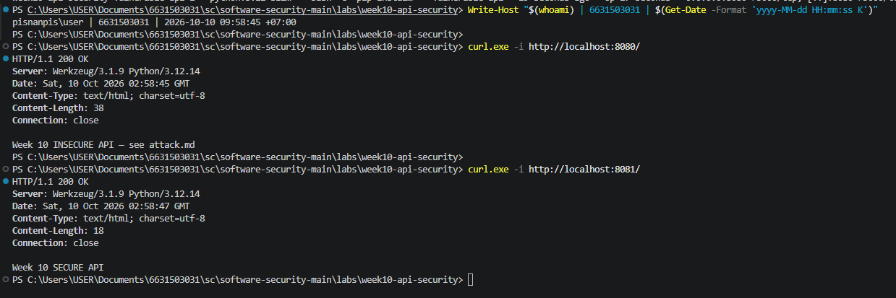
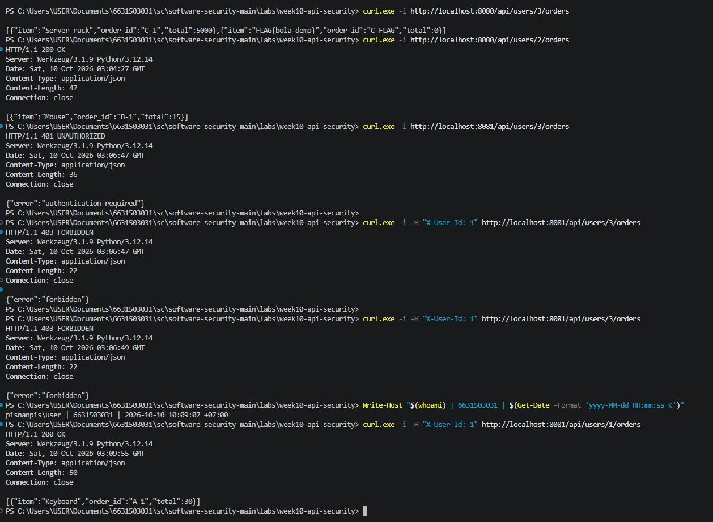
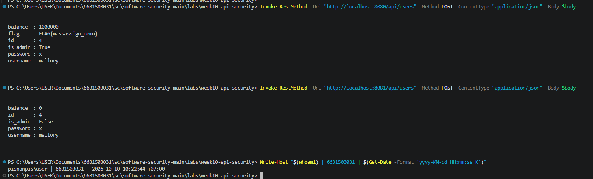
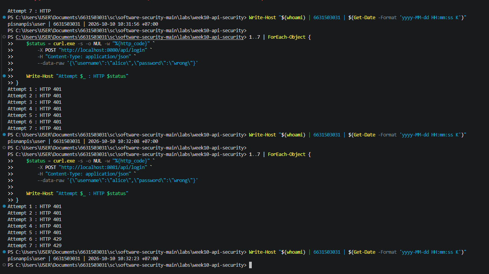
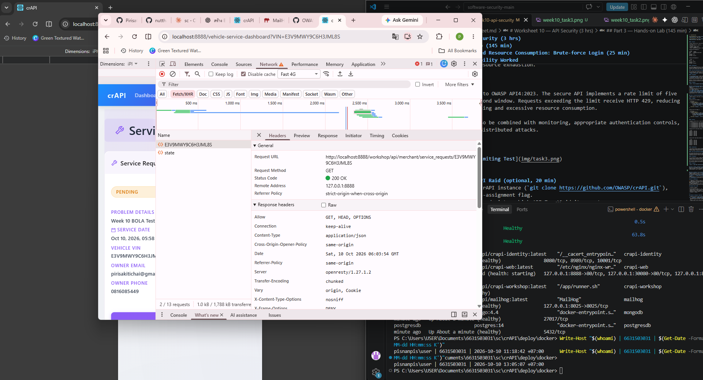
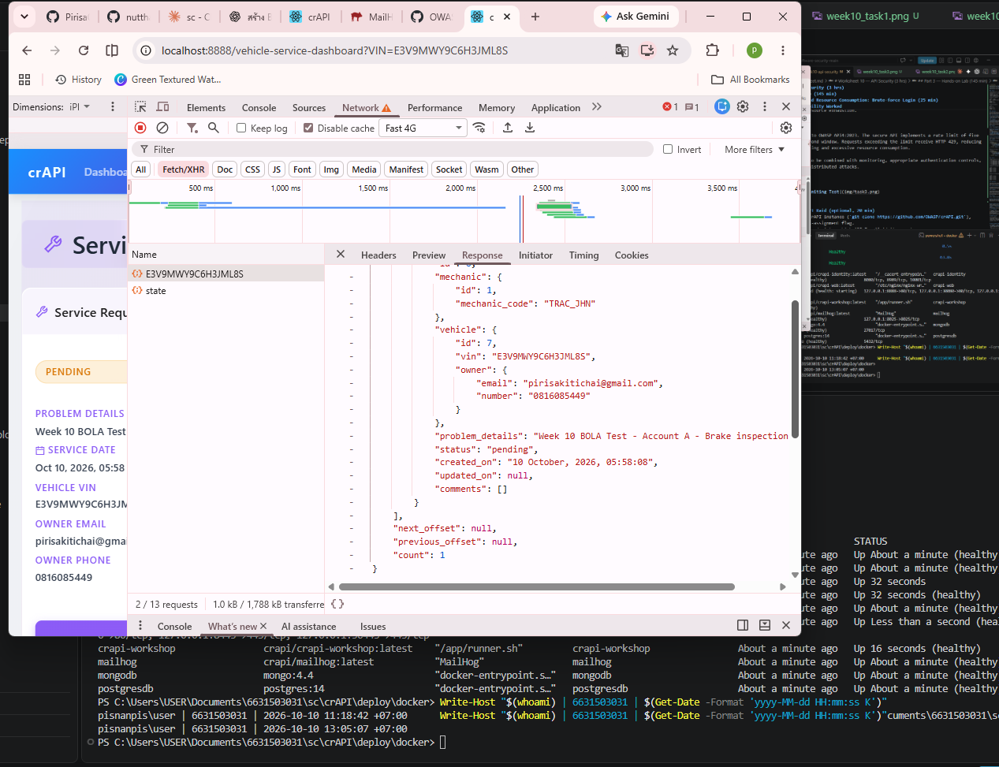
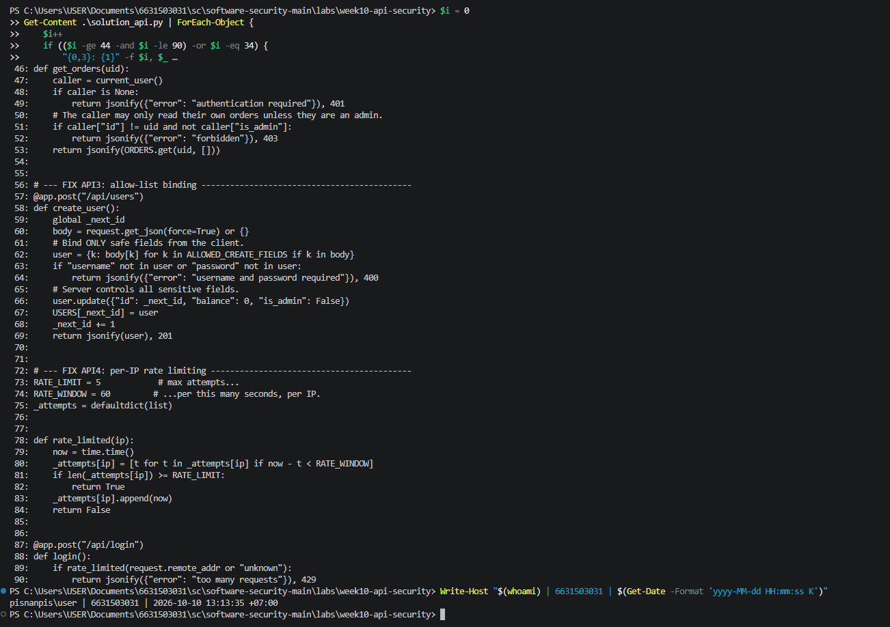
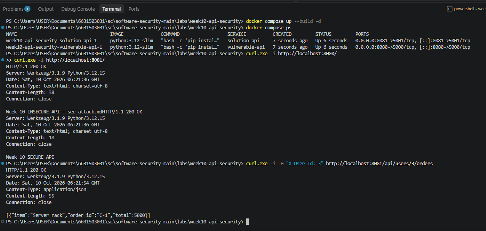
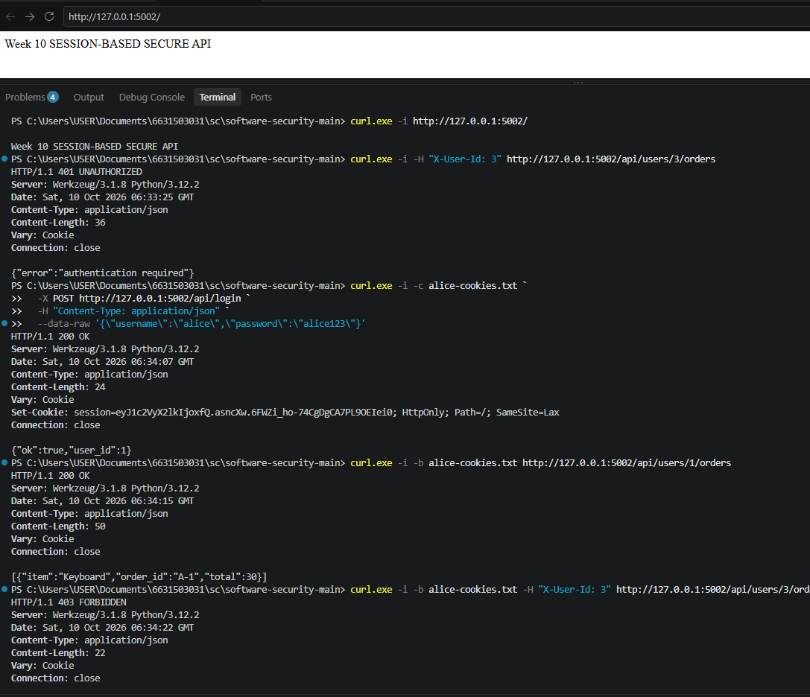

# Worksheet 10 — API Security (3 hrs)

> **Course:** Software Security (KOSEN69) · Week 10
> **Aligned:** OWASP API Security Top 10:2023 — API1 BOLA · API3 Broken Object Property Level Auth (Mass Assignment) · API4 Unrestricted Resource Consumption
> **Signature game:** 🥷 crAPI Raid
>
> **Ethics note:** Run exploits **only** against the lab targets shipped here (`vulnerable_api.py` on `:8080`) or your own OWASP crAPI instance. Never test BOLA, mass assignment, or brute-force against systems you do not own or are not explicitly authorized to test.

## Part 1 — Student Information

| Name | Student ID | Date | Group |
|------|-----------|------|-------|
| Pirisa Kitichai | 6631503031 | 10/10/2069 |       |


## Part 2 — Lecture Questions

### 1. Define BOLA (API1:2023). Why is it the #1 API risk, and why can't a WAF reliably stop it?

BOLA (Broken Object Level Authorization) occurs when an API allows users to access objects that they do not own or are not authorized to access.

It is ranked #1 because APIs frequently use object IDs to access data, and missing authorization checks can expose sensitive information across different users.

A WAF cannot reliably prevent BOLA because the HTTP request may look completely normal. The WAF usually cannot determine whether the authenticated user actually owns the requested object. Authorization must therefore be enforced by the backend.

### 2. What is mass assignment / broken object property level authorization (API3:2023)? Contrast a blocklist vs. an allow-list of bindable fields.

Mass assignment occurs when an API automatically accepts user-provided fields and assigns them to internal objects without checking which properties users are allowed to modify.

For example, an attacker could submit `is_admin: true` or `balance: 1000000` during account creation to gain unauthorized privileges.

- **Blocklist:** Blocks specific dangerous fields, but newly added or forgotten fields may still be exploited.
- **Allow-list:** Explicitly permits only approved fields, such as `username` and `password`, while rejecting or ignoring everything else.

An allow-list is safer because sensitive fields are controlled by the server instead of the client.

### 3. API4:2023 is unrestricted resource consumption. Give two distinct impacts (security and availability) of an unthrottled `/api/login`.

**Security impact:** Attackers can repeatedly guess passwords without restrictions, increasing the risk of brute-force attacks and unauthorized account access.

**Availability impact:** Excessive login requests can consume CPU, memory, and network resources, slowing down the API or making it unavailable to legitimate users.

Rate limiting helps reduce both risks by restricting the number of requests within a specific time window.

### 4. In `vulnerable_api.py`, `current_user()` trusts the `X-User-Id` header. Why is a client-supplied header NOT authentication, and what should replace it?

A client-supplied header is not authentication because users can freely modify its value. An attacker could change `X-User-Id: 1` to `X-User-Id: 3` and impersonate another user.

The API should instead use secure authentication, such as server-managed sessions or signed access tokens that are validated by the backend.

The server must verify the user's identity rather than trusting information directly supplied by the client.

### 5. Why does object-level authorization have to be checked per request, per object rather than once at login?

Authentication at login only confirms who the user is, not which objects they are allowed to access.

Each API request may target a different object, and users may attempt to access another user's data by changing the object ID in the URL.

Therefore, the backend must verify ownership or permissions for every requested object on every request. This prevents unauthorized access even when the requester is already logged in.


## Part 3 — Hands-on Lab (145 min)

**Learning goals:** Exploit BOLA, mass assignment, and a missing rate limit against a live API; then read the secure version and explain each fix.

**Prerequisites:** Docker + Docker Compose, `curl`. (Optional bonus: cloned OWASP crAPI.)

**Environment setup**
```bash
cd labs/week10-api-security
docker compose up         # INSECURE API on :8080, SECURE API on :8081
# Seeded users: alice(id 1) bob(id 2) carol(id 3, admin, balance 9999)
```

**What to submit per task:** the exact command(s) + raw response/HTTP status, a screenshot, and a 2–3 sentence mitigation note mapping the bug to its OWASP API id.

### Task 0 — Onboarding (15 min)
Confirm both APIs respond: `curl http://localhost:8080/` and `curl http://localhost:8081/`. Note which port is insecure. Record the three seeded users.
**Deliverable:** both root responses + the user table.


### Task 0 — Onboarding (15 min)

**Commands:**
```powershell
curl.exe -i http://localhost:8080/
curl.exe -i http://localhost:8081/
```

**Results:**

| API | Port | HTTP Status | Response |
|---|---|---|---|
| Insecure API | 8080 | 200 OK | Week 10 INSECURE API — see attack.md |
| Secure API | 8081 | 200 OK | Week 10 SECURE API |

**Seeded Users:**

| User ID | Username | Role | Balance |
|---|---|---|---|
| 1 | alice | User | Not specified |
| 2 | bob | User | Not specified |
| 3 | carol | Admin | 9999 |

**Observation:**

Both APIs responded successfully with HTTP 200 OK. Port 8080 runs the vulnerable API, while port 8081 runs the secure API. The lab contains three seeded users: alice, bob, and carol. Carol has administrator privileges and a balance of 9999.

**Evidence:**



### Task 1 — BOLA: read another user's orders (35 min)
**Goal:** Read carol's (admin) orders without being carol — API1:2023.
**Steps:**
1. `curl http://localhost:8080/api/users/3/orders` — note you receive the "Server rack" order with no auth.
2. Iterate the id: `curl http://localhost:8080/api/users/2/orders`.
3. On the secure API observe the ladder: `curl -i http://localhost:8081/api/users/3/orders` (401), `curl -i -H "X-User-Id: 1" http://localhost:8081/api/users/3/orders` (403), `curl -i -H "X-User-Id: 1" http://localhost:8081/api/users/1/orders` (200).
**Deliverable:** the leaked order JSON + the 401/403/200 transcript + mitigation note.


### Task 1 — BOLA: Read Another User's Orders (35 min)

**OWASP Category:** API1:2023 — Broken Object Level Authorization (BOLA)

#### 1. Commands

**Vulnerable API (Port 8080):**

```powershell
curl.exe -i http://localhost:8080/api/users/3/orders
curl.exe -i http://localhost:8080/api/users/2/orders
```

**Secure API (Port 8081):**

```powershell
curl.exe -i http://localhost:8081/api/users/3/orders
curl.exe -i -H "X-User-Id: 1" http://localhost:8081/api/users/3/orders
curl.exe -i -H "X-User-Id: 1" http://localhost:8081/api/users/1/orders
```

#### 2. Results

| API | Test Case | HTTP Status | Result |
|---|---|---|---|
| Insecure | Access Carol's orders | 200 OK | Orders exposed |
| Insecure | Access Bob's orders | 200 OK | Orders exposed |
| Secure | No authentication | 401 Unauthorized | Access denied |
| Secure | Alice accesses Carol's orders | 403 Forbidden | Access denied |
| Secure | Alice accesses her own orders | 200 OK | Access allowed |

**Vulnerable API — Carol's Orders (200 OK):**

```json
[
  {"item":"Server rack","order_id":"C-1","total":5000},
  {"item":"FLAG{bola_demo}","order_id":"C-FLAG","total":0}
]
```

**Vulnerable API — Bob's Orders (200 OK):**

```json
[
  {"item":"Mouse","order_id":"B-1","total":15}
]
```

**Secure API — No Authentication (401 Unauthorized):**

```json
{"error":"authentication required"}
```

**Secure API — Alice Accessing Carol's Orders (403 Forbidden):**

```json
{"error":"forbidden"}
```

**Secure API — Alice Accessing Her Own Orders (200 OK):**

```json
[
  {"item":"Keyboard","order_id":"A-1","total":30}
]
```

#### 3. Observation

I tested the vulnerable API by changing the user ID in the URL. I was able to access Carol's and Bob's orders without authentication, including Carol's sensitive order information and the lab flag. The secure API returned HTTP 401 without authentication, HTTP 403 when Alice tried to access Carol's orders, and HTTP 200 when Alice accessed her own orders.

#### 4. Why the Vulnerability Worked

The vulnerable API did not verify whether the requester was authorized to access the requested user's orders. By changing the user ID in the URL, I could retrieve another user's data without permission. This is a Broken Object Level Authorization (BOLA) vulnerability.

#### 5. Mitigation

The vulnerability maps to OWASP API1:2023 (BOLA). The API should authenticate users and check object ownership on every request. If the requester does not own the resource and lacks authorized administrative privileges, the server should return HTTP 403. The lab's secure API demonstrates this ownership check, although its client-controlled `X-User-Id` header should be replaced with trusted authentication in production.

#### 6. Evidence




### Task 2 — Mass assignment: self-promote to admin (30 min)
**Goal:** Smuggle `is_admin` + `balance` into user creation — API3:2023.
**Steps:**
1. `curl -X POST http://localhost:8080/api/users -H "Content-Type: application/json" -d '{"username":"mallory","password":"x","is_admin":true,"balance":1000000}'`
2. Confirm the response echoes `"is_admin": true, "balance": 1000000`.
3. Repeat against `:8081` and confirm the smuggled fields are forced to `is_admin:false, balance:0`.
**Deliverable:** both responses side by side + mitigation note (allow-list in `solution_api.py`).


### Task 2 — Mass Assignment: Self-Promote to Admin

**OWASP Category:** API3:2023 — Broken Object Property Level Authorization

#### 1. Commands

```powershell
$body = @{
    username = "mallory"
    password = "x"
    is_admin = $true
    balance = 1000000
} | ConvertTo-Json

Invoke-RestMethod -Uri "http://localhost:8080/api/users" -Method POST -ContentType "application/json" -Body $body

Invoke-RestMethod -Uri "http://localhost:8081/api/users" -Method POST -ContentType "application/json" -Body $body
```

#### 2. Results

| Field | Insecure API | Secure API |
|---|---|---|
| username | mallory | mallory |
| id | 4 | 4 |
| is_admin | True | False |
| balance | 1000000 | 0 |
| flag | FLAG{massassign_demo} | None |

**Insecure API Response:**

```text
balance  : 1000000
flag     : FLAG{massassign_demo}
id       : 4
is_admin : True
password : x
username : mallory
```

**Secure API Response:**

```text
balance  : 0
id       : 4
is_admin : False
password : x
username : mallory
```

#### 3. Observation

The insecure API allowed me to create an account with administrator privileges and a balance of 1000000 by including sensitive fields in the JSON request. The secure API ignored these unauthorized fields and assigned safe default values instead.

#### 4. Why the Vulnerability Worked

The vulnerable API accepted user-controlled properties without restricting which fields could be assigned. This allowed me to modify sensitive account properties, including `is_admin` and `balance`, during account creation.

#### 5. Mitigation

This vulnerability maps to OWASP API3:2023. The secure API uses an allow-list (`ALLOWED_CREATE_FIELDS`) to accept only permitted fields and assigns sensitive properties on the server. This prevents users from granting themselves administrator privileges or modifying account balances through mass assignment.

However, production systems must also protect sensitive response fields, including passwords, and store passwords using secure password hashing.

#### 6. Evidence




### Task 3 — Unrestricted resource consumption: brute-force login (25 min)
**Goal:** Show `/api/login` has no throttle — API4:2023.
**Steps:**
1. Run the brute-force loop from `attack.md` against `:8080` (guesses incl. `alice123`) — all attempts processed.
2. On `:8081` loop 7 times: `for i in $(seq 1 7); do curl -s -o /dev/null -w "%{http_code}\n" -X POST http://localhost:8081/api/login -H "Content-Type: application/json" -d '{"username":"alice","password":"wrong"}'; done`
3. Confirm the 6th/7th attempt returns `429`.
**Deliverable:** the `401 401 401 401 401 429 429` sequence + mitigation note.


### Task 3 — Unrestricted Resource Consumption: Brute-force Login (25 min)

**OWASP Category:** API4:2023 — Unrestricted Resource Consumption

#### 1. Commands

**Insecure API (Port 8080):**

```powershell
1..7 | ForEach-Object {
    $status = curl.exe -s -o NUL -w "%{http_code}" `
        -X POST "http://localhost:8080/api/login" `
        -H "Content-Type: application/json" `
        --data-raw '{\"username\":\"alice\",\"password\":\"wrong\"}'

    Write-Host "Attempt $_ : HTTP $status"
}
```

**Secure API (Port 8081):**

```powershell
1..7 | ForEach-Object {
    $status = curl.exe -s -o NUL -w "%{http_code}" `
        -X POST "http://localhost:8081/api/login" `
        -H "Content-Type: application/json" `
        --data-raw '{\"username\":\"alice\",\"password\":\"wrong\"}'

    Write-Host "Attempt $_ : HTTP $status"
}
```

#### 2. Results

| Attempt | Insecure API | Secure API |
|---|---|---|
| 1 | 401 Unauthorized | 401 Unauthorized |
| 2 | 401 Unauthorized | 401 Unauthorized |
| 3 | 401 Unauthorized | 401 Unauthorized |
| 4 | 401 Unauthorized | 401 Unauthorized |
| 5 | 401 Unauthorized | 401 Unauthorized |
| 6 | 401 Unauthorized | 429 Too Many Requests |
| 7 | 401 Unauthorized | 429 Too Many Requests |

**Insecure API — Raw Status Output:**

```text
Attempt 1 : HTTP 401
Attempt 2 : HTTP 401
Attempt 3 : HTTP 401
Attempt 4 : HTTP 401
Attempt 5 : HTTP 401
Attempt 6 : HTTP 401
Attempt 7 : HTTP 401
```

**Secure API — Raw Status Output:**

```text
Attempt 1 : HTTP 401
Attempt 2 : HTTP 401
Attempt 3 : HTTP 401
Attempt 4 : HTTP 401
Attempt 5 : HTTP 401
Attempt 6 : HTTP 429
Attempt 7 : HTTP 429
```

#### 3. Observation

I sent seven incorrect login attempts to both APIs. The insecure API processed all seven requests and returned HTTP 401 each time. The secure API returned HTTP 429 on the sixth and seventh attempts, showing that rate limiting was enforced.

#### 4. Why the Vulnerability Worked

The insecure API does not limit repeated login attempts. This allows an attacker to continuously guess passwords and send excessive requests, increasing the risk of account compromise and server resource exhaustion.

#### 5. Mitigation

This vulnerability maps to OWASP API4:2023. The secure API implements a rate limit of five requests within a 60-second window. Requests exceeding the limit receive HTTP 429, reducing automated password guessing and excessive resource consumption.

Rate limiting should also be combined with monitoring, appropriate authentication controls, and protection against distributed attacks.

#### 6. Evidence




### Task 4 — Bonus: crAPI Raid (optional, 20 min)
Against your own OWASP crAPI instance (`git clone https://github.com/OWASP/crAPI.git`), capture one BOLA or mass-assignment flag.
**Deliverable:** flag + endpoint + which API Top 10 id it maps to.


### Task 4 — Bonus: crAPI Raid (20 min)

**Target:** Local OWASP crAPI Instance  
**OWASP Category:** API1:2023 — Broken Object Level Authorization (BOLA)

#### 1. Objective

To investigate whether one authenticated user can access another user's private vehicle service request information.

#### 2. Endpoint and Test

**Endpoint:**

`GET /workshop/api/merchant/service_requests/{VIN}`

**Test Procedure:**

1. Logged in as Account A and registered a vehicle.
2. Created a service request with the description:
   `Week 10 BOLA Test - Account A - Brake inspection needed`
3. Logged in as Account B using a separate test account.
4. Opened Account A's vehicle service history using the same VIN.
5. Inspected the HTTP response in Chrome DevTools.

#### 3. Results

| Field | Result |
|---|---|
| Application | OWASP crAPI |
| Vulnerability | BOLA |
| OWASP ID | API1:2023 |
| HTTP Method | GET |
| Endpoint | /workshop/api/merchant/service_requests/{VIN} |
| HTTP Status | 200 OK |
| Authorization Result | Cross-account data access succeeded |
| Service Request Status | PENDING |
| Flag | Not observed |

**Observed Data:**

- Service request created by Account A
- Problem description: Week 10 BOLA Test - Account A - Brake inspection needed
- Service request status: PENDING
- Vehicle information and owner contact details were visible to Account B

#### 4. Observation

I created a service request using Account A and then logged in with Account B. By opening the service history endpoint using Account A's vehicle VIN, I was able to view Account A's service request information with HTTP 200 OK.

#### 5. Why the Vulnerability Worked

The API accepted a vehicle VIN supplied in the request without adequately verifying whether the authenticated user was authorized to access that vehicle's service requests. As a result, Account B could retrieve another user's private service information.

#### 6. Mitigation

This vulnerability maps to OWASP API1:2023 (BOLA). The API should verify the authenticated user's ownership or explicit access permissions for the requested vehicle before returning service records.

Unauthorized access should return HTTP 403 Forbidden, while requests without valid authentication should return HTTP 401 Unauthorized. The server must enforce these checks on every request rather than relying on the VIN being difficult to guess.

#### 7. Evidence

#### 7. Evidence

**Evidence 1 — Unauthorized Access to Service Request**



**Evidence 2 — HTTP 200 OK and Endpoint**



### Task 5 — Defend / fix it (20 min)
**Goal:** Explain the fixes using the secure reference `solution_api.py`.
**Steps:** Read the three `# --- FIX ...` blocks. For each, quote the line(s) that defeat your Task 1–3 exploit: the per-object ownership check (`caller["id"] != uid and not caller["is_admin"]`), `ALLOWED_CREATE_FIELDS` binding, and the `RATE_LIMIT=5 / RATE_WINDOW=60` limiter.
**Deliverable:** for each of API1/API3/API4 — the exploit that worked on `:8080`, the line in `solution_api.py` that blocks it, and the new HTTP status on `:8081`.


### Task 5 — Defend / Fix It (20 min)

**Objective:** Analyze the secure reference implementation in `solution_api.py` and explain how it prevents the vulnerabilities demonstrated in Tasks 1–3.

#### 1. API1:2023 — Broken Object Level Authorization (BOLA)

**Vulnerable Endpoint:** `GET /api/users/{uid}/orders`

**Exploit on Insecure API (Port 8080):**

I accessed Carol's orders without authentication by requesting `/api/users/3/orders`. The API returned HTTP 200 OK and exposed Carol's order information.

**Fix in `solution_api.py` (Lines 47–53):**

```python
caller = current_user()
if caller is None:
    return jsonify({"error": "authentication required"}), 401

if caller["id"] != uid and not caller["is_admin"]:
    return jsonify({"error": "forbidden"}), 403

return jsonify(ORDERS.get(uid, []))
```

**Secure API Results:**

| Test Case | HTTP Status |
|---|---|
| No authentication | 401 Unauthorized |
| Alice accesses Carol's orders | 403 Forbidden |
| Alice accesses her own orders | 200 OK |

**Explanation:**

The secure API checks the requesting user's identity and verifies whether they own the requested orders. If the requester is not the owner and does not have administrator privileges, the API returns HTTP 403. This prevents ordinary users from accessing another user's order records.

**Remaining Risk:**

The lab still identifies users using the client-controlled `X-User-Id` header. In a production system, this should be replaced with verified authentication, such as server-managed sessions or properly validated access tokens.

#### 2. API3:2023 — Mass Assignment

**Vulnerable Endpoint:** `POST /api/users`

**Exploit on Insecure API (Port 8080):**

I created a user named `mallory` and included `is_admin: true` and `balance: 1000000` in the JSON request. The vulnerable API accepted these values and created an account with administrator privileges.

**Fix in `solution_api.py` (Lines 34, 62–69):**

```python
ALLOWED_CREATE_FIELDS = {"username", "password"}

user = {k: body[k] for k in ALLOWED_CREATE_FIELDS if k in body}

if "username" not in user or "password" not in user:
    return jsonify({"error": "username and password required"}), 400

user.update({"id": _next_id, "balance": 0, "is_admin": False})
USERS[_next_id] = user
_next_id += 1
return jsonify(user), 201
```

**Secure API Results:**

| Field | Insecure API | Secure API |
|---|---|---|
| username | mallory | mallory |
| is_admin | true | false |
| balance | 1000000 | 0 |
| HTTP Status | Not recorded | Not recorded |

**Explanation:**

The secure API uses an explicit allow-list to accept only `username` and `password` from the request body. Sensitive properties such as `is_admin`, `balance`, and `id` are controlled by the server. This prevents users from assigning administrator privileges or unauthorized balances during account creation.

**Remaining Risk:**

The reference implementation returns the password in the response and stores it without hashing. A production API should hash passwords using a secure password-hashing algorithm and never expose them in responses.

#### 3. API4:2023 — Unrestricted Resource Consumption

**Vulnerable Endpoint:** `POST /api/login`

**Exploit on Insecure API (Port 8080):**

I submitted seven incorrect login attempts. All seven requests returned HTTP 401, demonstrating that the vulnerable API did not enforce the five-request rate limit.

**Fix in `solution_api.py` (Lines 73–90):**

```python
RATE_LIMIT = 5
RATE_WINDOW = 60
_attempts = defaultdict(list)

def rate_limited(ip):
    now = time.time()
    _attempts[ip] = [t for t in _attempts[ip] if now - t < RATE_WINDOW]
    if len(_attempts[ip]) >= RATE_LIMIT:
        return True
    _attempts[ip].append(now)
    return False

@app.post("/api/login")
def login():
    if rate_limited(request.remote_addr or "unknown"):
        return jsonify({"error": "too many requests"}), 429
```

**Secure API Results:**

| Attempt | Insecure API | Secure API |
|---|---|---|
| 1 | 401 | 401 |
| 2 | 401 | 401 |
| 3 | 401 | 401 |
| 4 | 401 | 401 |
| 5 | 401 | 401 |
| 6 | 401 | 429 |
| 7 | 401 | 429 |

**Explanation:**

The secure API tracks login attempts by IP address within a 60-second window. After five requests, additional requests are blocked with HTTP 429. This reduces excessive login attempts and limits automated password guessing.

**Remaining Risk:**

The rate limiter stores attempts in memory and only tracks IP addresses. In production, attackers could use multiple IP addresses, and application restarts would reset the counters. A shared rate-limiting system and additional account-based controls would provide stronger protection.

#### 4. Summary

| OWASP API ID | Vulnerability | Fix Applied | Secure Result |
|---|---|---|---|
| API1:2023 | BOLA | Per-object ownership check | 401 / 403 / 200 |
| API3:2023 | Mass Assignment | Allow-list binding | is_admin=false, balance=0 |
| API4:2023 | Unrestricted Resource Consumption | Rate limiting (5 requests / 60 seconds) | HTTP 429 |

#### 5. Evidence




## Part 4 — Reflection

1. **Mapping:** complete a table — finding | endpoint | OWASP API id | fix applied.
2. **Real breach:** research an API authorization breach (e.g., the Optus or T-Mobile BOLA/IDOR incidents). Which API Top 10 id matches, and would the `solution_api.py` ownership check have prevented it?
3. **Best mitigation:** of object-level auth, allow-list binding, and rate limiting — which gives the most risk reduction for an API platform, and why?

## Grading rubric (100)

| Criterion | Weight |
|-----------|--------|
| Lecture questions (Part 2) | 20 |
| Exploitation + evidence (Tasks 1–4: commands, output, screenshots) | 40 |
| Defense (Task 5: fixes mapped to `solution_api.py`) | 25 |
| Reflection (Part 4: mapping, breach, best mitigation) | 15 |
| **Total** | **100** |

---

## Evidence & Integrity (required)

- **Identity proof:** every screenshot/diagram must show a terminal running `printf '%s | %s | ' "$(whoami)" '<YOUR-STUDENT-ID>'; date '+%F %T %Z'` **in the
  same image as the evidence**. When the evidence is a browser page, a DevTools panel or a
  rendered response, put that terminal **beside the browser and capture the whole screen** — a
  cropped window carries nothing that identifies you, and the lab's own output is
  byte-identical for the whole cohort *by design*, so the stamp is the only thing that makes
  the shot yours. Generic or borrowed evidence is not accepted.
- **Personalized flag (if this lab issues one):** ____________________
  *Flags are unique per student — submitting another student's flag is a violation. How to submit: **learn.zcr.ai/submit** (full guide: `SUBMISSION.md` in the repo root).*
- **Explain in your own words** *(graded on your reasoning, not copied text):*
  1. What did you do, and **why did the vulnerability work**?
  2. **Why does your fix actually stop it** — and what could still break it?

---

## 🤖 Audit the AI (required)


### 1. AI Assistant and Original Answer

**AI Tool:** ChatGPT

**Task:** Review the security fix for Broken Object Level Authorization (BOLA) in Week 10.

**Original Prompt:**

"Help me complete Task 5 — Defend / Fix It using the actual code from solution_api.py and explain how the secure API prevents BOLA."

**AI Answer (BOLA section from our previous Task 5 discussion):**

> **API1:2023 — Broken Object Level Authorization (BOLA)**
>
> Vulnerable Endpoint: `GET /api/users/{uid}/orders`
>
> The vulnerable API allowed me to access Carol's orders without authentication by requesting `/api/users/3/orders`. The API returned HTTP 200 OK and exposed Carol's order information.
>
> **Fix in solution_api.py (Lines 47–53):**

```python
caller = current_user()
if caller is None:
    return jsonify({"error": "authentication required"}), 401

if caller["id"] != uid and not caller["is_admin"]:
    return jsonify({"error": "forbidden"}), 403

return jsonify(ORDERS.get(uid, []))
```

> **AI Explanation:**
>
> The secure API checks the requesting user's identity and verifies whether they own the requested orders. If the requester is not the owner and does not have administrator privileges, the API returns HTTP 403. This prevents ordinary users from accessing another user's order records.

### 2. Problems and Risks Found

The AI correctly identified the object-level authorization check, but its explanation was incomplete because the implementation still trusts a client-controlled HTTP header.

**Problematic line from the AI answer:**

```python
caller = current_user()
```

The actual `current_user()` implementation in `solution_api.py` (Lines 37–41) is:

```python
def current_user():
    try:
        return USERS.get(int(request.headers.get("X-User-Id", 0)))
    except (TypeError, ValueError):
        return None
```

**Why this is risky:**

The `X-User-Id` header can be modified by the client. An attacker could submit `X-User-Id: 3` to impersonate Carol, who is an administrator in the lab.

If the server accepts this header as the user's identity, the ownership check may incorrectly authorize the attacker.

Therefore, the AI's explanation that the fix prevents unauthorized access is too broad. The ownership check is correct, but the authentication mechanism is still insecure.

### 3. Corrected Secure Approach

The API should use a server-verified authentication mechanism instead of trusting `X-User-Id`.

**Improved example using Flask sessions:**

```python
from flask import jsonify, session

@app.get("/api/users/<int:uid>/orders")
def get_orders(uid):
    authenticated_id = session.get("user_id")

    if authenticated_id is None:
        return jsonify({
            "error": "authentication required"
        }), 401

    caller = USERS.get(authenticated_id)

    if caller is None:
        return jsonify({
            "error": "authentication required"
        }), 401

    if caller["id"] != uid and not caller["is_admin"]:
        return jsonify({
            "error": "forbidden"
        }), 403

    return jsonify(ORDERS.get(uid, [])), 200
```

The session identity must be established only after successful login and password verification. The application must also use a securely configured session secret and appropriate cookie security settings.

### 4. Verification and Evidence

I tested the secure reference API on port 8081 to verify whether the BOLA protection could be bypassed by spoofing the `X-User-Id` header.

**Test Command:**

```powershell
curl.exe -i -H "X-User-Id: 3" http://localhost:8081/api/users/3/orders
```

**Actual HTTP Response:**

```http
HTTP/1.1 200 OK
Content-Type: application/json
```

```json
[{"item":"Server rack","order_id":"C-1","total":5000}]
```

**Finding:**

The server returned Carol's order data even though the requester only supplied a client-controlled `X-User-Id` header. This confirms that the reference implementation's object ownership check can be bypassed through identity spoofing.

The correct approach is to authenticate the user through a server-verified session or validated access token before checking object ownership.

**Verification Status:** The identity-spoofing vulnerability was confirmed through a real HTTP request. The proposed session-based fix has not yet been executed or verified.

**Evidence:**




### 5. Why the AI Answer Was Insufficient

The AI focused on object ownership but overlooked that the user's identity was obtained from an untrusted HTTP header. This means the ownership check can be bypassed through identity impersonation. A stronger solution must authenticate the requester securely before checking authorization for each object.

### 6. AI Use Disclosure

I used ChatGPT to assist with reviewing the Week 10 API security fixes and explaining the differences between the vulnerable and secure implementations.

I compared its explanation with the actual code in `solution_api.py` and reviewed the HTTP results from Task 1. I identified the remaining risk in the `X-User-Id` authentication mechanism and proposed an improved session-based design.

---


## 🧠 Comprehension & Prompt (Required)

### A. Explain in Plain English (EiPE)

The vulnerable API returns a user's order information based on the ID in the URL without checking whether the requester is allowed to see it. An attacker can change the ID to access someone else's private orders. Even the secure reference implementation has a weakness because it trusts the `X-User-Id` header, which attackers can modify to impersonate another user.

### B. Prompt Problem

**Selected Vulnerability:** API1:2023 — Broken Object Level Authorization (BOLA)

#### 1. Final AI Prompt

"Fix the BOLA vulnerability in my Flask API. The current implementation trusts the client-controlled `X-User-Id` header. Replace this with a server-verified login session using hashed passwords and a securely configured session secret. Enforce per-object authorization so unauthenticated requests return 401, unauthorized cross-user requests return 403, and authorized requests return 200. Preserve protection against mass assignment and excessive login attempts. Provide runnable code and tests that verify header spoofing no longer works."

#### 2. Original Exploit Result

The secure reference API on port 8081 returned HTTP 200 OK when I forged `X-User-Id: 3` to access Carol's orders.

**Exploit command:**

```powershell id="bcs6kj"
curl.exe -i -H "X-User-Id: 3" http://localhost:8081/api/users/3/orders
```

**Actual response:**

```http id="8p7chz"
HTTP/1.1 200 OK
```

```json id="ifpsuq"
[{"item":"Server rack","order_id":"C-1","total":5000}]
```

This confirmed that the reference implementation's ownership check could be bypassed by spoofing the caller's identity.

#### 3. AI-Assisted Secure Fix

I created a separate implementation named `secure_session_api.py` that uses Flask sessions and securely hashed passwords instead of trusting the `X-User-Id` header.

The API verifies the login credentials before establishing a session, retrieves the authenticated user from that session, and checks object ownership on every request.

The improved implementation runs on `http://127.0.0.1:5002`.

#### 4. Verified Test Results

I executed four HTTP requests against the improved API and recorded the actual responses.

| Test Case | Expected HTTP | Actual HTTP | Result |
|---|---|---|---|
| Forged `X-User-Id: 3` without login | 401 | 401 | PASS |
| Alice logs in with valid credentials | 200 | 200 | PASS |
| Alice accesses her own orders | 200 | 200 | PASS |
| Alice accesses Carol's orders with forged header | 403 | 403 | PASS |

**Test 1 — Forged Header Without Authentication**

```powershell id="mwtyuo"
curl.exe -i -H "X-User-Id: 3" http://127.0.0.1:5002/api/users/3/orders
```

**Actual Result:** HTTP 401 Unauthorized

```json id="ka4xv2"
{"error":"authentication required"}
```

**Test 2 — Alice Login**

```powershell id="kfhgl3"
curl.exe -i -c alice-cookies.txt -X POST http://127.0.0.1:5002/api/login -H "Content-Type: application/json" --data-raw '{\"username\":\"alice\",\"password\":\"alice123\"}'
```

**Actual Result:** HTTP 200 OK

```json id="klipkm"
{"ok":true,"user_id":1}
```

**Test 3 — Authorized Access**

```powershell id="j7jjir"
curl.exe -i -b alice-cookies.txt http://127.0.0.1:5002/api/users/1/orders
```

**Actual Result:** HTTP 200 OK

```json id="x34oez"
[{"item":"Keyboard","order_id":"A-1","total":30}]
```

**Test 4 — Cross-User Access With Forged Header**

```powershell id="v07wvj"
curl.exe -i -b alice-cookies.txt -H "X-User-Id: 3" http://127.0.0.1:5002/api/users/3/orders
```

**Actual Result:** HTTP 403 Forbidden

#### 5. Final Verification and Conclusion

**Result: PASS — The original header-spoofing exploit was blocked in the improved implementation.**

The original secure reference API trusted the `X-User-Id` header and returned Carol's orders with HTTP 200. After implementing session-based authentication and per-object authorization, the same unauthenticated header-spoofing attempt returned HTTP 401.

Additionally, when Alice logged in and attempted to access Carol's orders using a forged header, the improved API returned HTTP 403. These results confirm that the tested BOLA identity-spoofing exploit no longer succeeds in the improved local implementation.

#### 6. Evidence

**Original BOLA Testing**


**Reference API Header-Spoofing Vulnerability**


**Verified Session-Based Fix**




