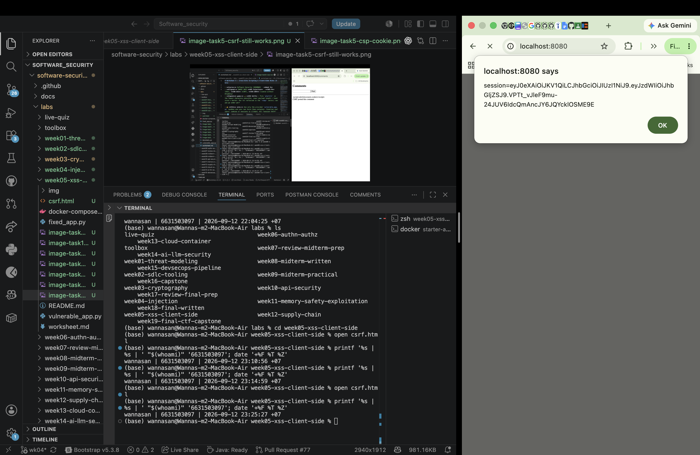

# Term Project Report — Secure Build

> Fill in every section. Keep the headings. Total **100 pts** (see rubric at the end).
> This is **team work** (2–3). Do not share your report with other teams.

## Cover

| Field | Value |
|---|---|
| Team name | |
| Members (name + ID) | |
| Target application | |
| Repository URL | |
| Date | |

## AI-tool usage disclosure
*Academic integrity: state how you used any AI tools (ChatGPT, Copilot, etc.) — e.g. searching, coding, translating, drafting. "None" is a valid answer.*

| Tool | How it was used |
|---|---|
| | |

---

## 1. Executive Summary
*(½ page) What the app is, how many findings by severity, and the overall risk before vs. after your fixes.*

---

## 2. System Scope & Function
- What the application does; in-scope components and endpoints.
- **Data-Flow Diagram (DFD):** processes, data stores, external entities, **trust boundaries** (insert image).

---

## 3. Threat Model — STRIDE  *(20 pts)*

| Element / data flow | S | T | R | I | D | E | Top threat & mitigation |
|---|---|---|---|---|---|---|---|
| | | | | | | | |

*Then rank the top 5 risks by likelihood × impact.*

---

## 4. Vulnerability Findings  *(25 pts)*

One block per finding (copy as needed):

### Finding F-01 — Unsalted MD5 Password Hashing
| Field | Value |
|---|---|
| CWE | CWE-916 / CWE-327 |
| OWASP 2025 | A04 Cryptographic Failures |
| Severity | High |
| Location | `project/starter-app/app.py:67-69`, `116-117`, and `128-130` |
| Reproduction | Obtain the two unsalted MD5 values from NoteVault's `seed()` data and run Hashcat in raw-MD5 mode (`hashcat -m 0`). The Week 3 exercise recovered both seeded passwords through offline guessing. |
| Impact | Anyone who obtains the user table can test password guesses quickly without contacting the application. Recovered passwords can compromise NoteVault accounts and may create additional risk if a user reused the same password elsewhere. |
| Evidence | Week 3 Hashcat result shown below |

**Recommended mitigation:** Replace MD5 with Argon2id for new passwords and use rehash-on-login to migrate a correctly verified legacy MD5 record. Argon2id applies a unique salt and deliberately expensive time and memory costs, making offline guessing substantially harder.


---

### Finding F-02 — SQL Injection in Login and Note Search
| Field | Value |
|---|---|
| CWE | CWE-89 |
| OWASP 2025 | A05 Injection |
| Severity | High |
| Location | Original vulnerable queries: `project/starter-app/app.py:128-130` and `178-179`. Fixed queries: `128-131` and `179-182`. |
| Reproduction | The original source formatted request values directly into the `/login` and `/search` SQL statements. The fixed local build was tested with username `alice'--` on `/login` and search term `' UNION SELECT id,title,body FROM notes--` on `/search`. |
| Impact | An attacker may bypass authentication or read note data outside the intended search. Successful exploitation could expose user data and weaken the application's access controls. |
| Evidence | Direct before/after code evidence at the locations above. Manual verification against the actual NoteVault container returned HTTP 401 and `login failed` for the login payload; the UNION search returned an empty list and exposed no other users' notes. No Week 4 lab screenshot is presented as NoteVault evidence. |

**Recommended mitigation:** Replace both formatted SQL strings with SQLite parameterized queries. Bind the login values as `(username, password_hash)` and bind the search pattern as `(user, "%" + term + "%")` so request data cannot change the SQL structure.

---

### Finding F-03 — Stored XSS in Note Rendering and JavaScript-Readable Session Cookie
| Field | Value |
|---|---|
| CWE | CWE-79; related CWE-1004 |
| OWASP 2025 | A05 Injection |
| Severity | High |
| Location | Original rendering: `project/starter-app/app.py:43` and `104-107`; original cookie: `app.py:137`. Fixed rendering: `app.py:43-44`, `100-106`, and `185-190`; fixed cookie: `app.py:136-138`. |
| Reproduction | Start NoteVault with `TEAM_ID='The Outsider' docker compose up --build`, sign in as the seeded Alice user, and create a note titled `XSS Test` with body `<script>alert(document.cookie)</script>`. Before the fix, loading the home page executed the stored payload and the alert displayed the JavaScript-readable NoteVault session cookie. |
| Impact | A malicious note could execute script whenever its owner viewed the page. The script could alter the page or perform actions in the user's session, and the missing HttpOnly flag also allowed it to read the session cookie. |
| Evidence | Genuine Week 5 NoteVault browser test shown below; the session value visible in the screenshot is not copied into this report text. |

**Recommended mitigation:** Pass note records directly to Jinja and let autoescaping render titles and bodies as text on both the home and search pages. Set the session cookie to HttpOnly and SameSite; use Secure as well when NoteVault is deployed over HTTPS.



---

## 5. Remediation  *(25 pts)*

Per finding: the fix, **before/after** code, and the commit that implements it.

### Fix for F-01
```diff
- vulnerable line
+ fixed line
```
- **Why this fixes it:** …
- **Commit:** `<hash>`
- **Proof the exploit now fails:** (screenshot)

### Fix for F-02
```diff
- q = "SELECT * FROM users WHERE username = '%s' AND password = '%s'" % (
-     username, hashlib.md5((password or "").encode()).hexdigest())
- row = con.execute(q).fetchone()
+ row = con.execute(
+     "SELECT * FROM users WHERE username = ? AND password = ?",
+     (username, hashlib.md5((password or "").encode()).hexdigest()),
+ ).fetchone()

- q = "SELECT id,title,body FROM notes WHERE owner='%s' AND body LIKE '%%%s%%'" % (user, term)
- rows = con.execute(q).fetchall()
+ rows = con.execute(
+     "SELECT id,title,body FROM notes WHERE owner = ? AND body LIKE ?",
+     (user, "%" + term + "%"),
+ ).fetchall()
```
- **Why this fixes it:** SQLite receives a fixed query structure and binds each value as data, so quotes, comments, and UNION text cannot become SQL syntax.
- **Commit:** `<ADD AFTER THE NoteVault F-02 FIX IS IMPLEMENTED AND COMMITTED>`
- **Proof the exploit now fails:** The actual NoteVault container preserved normal behavior: `alice` login returned HTTP 302 and the authenticated search for `milk` returned `groceries: milk, eggs`. The login SQLi returned HTTP 401 with `login failed`, while the authenticated UNION search returned HTTP 200 with no rows and did not expose the admin notes.

### Fix for F-03
```diff
- <h3>Your notes</h3>{{ notes_html|safe }}
+ <h3>Your notes</h3>
+ <li>#{{ note["id"] }} <b>{{ note["title"] }}</b>: {{ note["body"] }}</li>

- rows = con.execute("SELECT id,title,body FROM notes WHERE owner = ?", (user,)).fetchall()
- notes_html = "".join(
-     "<li>#%d <b>%s</b>: %s</li>" % (r["id"], r["title"], r["body"]) for r in rows)
- return render_template_string(PAGE, user=user, is_admin=(user and role_of(user) == "admin"),
-                               notes_html=notes_html)
+ notes = con.execute("SELECT id,title,body FROM notes WHERE owner = ?", (user,)).fetchall()
+ return render_template_string(PAGE, user=user, is_admin=(user and role_of(user) == "admin"),
+                               notes=notes)

- resp.set_cookie("session", tok)
+ resp.set_cookie("session", tok, httponly=True, samesite="Lax")

- "".join("<li>%s: %s</li>" % (r["title"], r["body"]) for r in rows)
+ "<li>{{ row['title'] }}: {{ row['body'] }}</li>"
```
- **Why this fixes it:** Jinja autoescaping converts the stored markup into text before it reaches the browser, including on the search-results page. HttpOnly prevents browser JavaScript from reading the session cookie, while SameSite=Lax reduces cross-site cookie attachment; Secure is intentionally reserved for an HTTPS deployment so the documented local HTTP login continues to work.
- **Commit:** https://github.com/6631503097/software-security/commit/2d43d97
- **Proof the exploit now fails:** The rebuilt NoteVault container returned HTTP 302 for normal login and note creation, and a normal note still appeared correctly. The stored payload appeared as escaped text on both home and search, with no executable payload element; an isolated browser check confirmed zero matching executable scripts and an empty `document.cookie` after login because the session cookie was HttpOnly.
- **Fixed-state verification:** No fixed-state screenshot is claimed. Genuine runtime testing confirmed that normal login and notes still worked, the stored payload rendered only as text on home and search, no executable payload element remained, and the HttpOnly session cookie was absent from `document.cookie` with SameSite=Lax set.

---

## 6. Supply-Chain Hardening  *(15 pts)*
- **SBOM** (CycloneDX) generated — attach `sbom.json`, note component count.
- **Artifact signed & verified** with Cosign — paste the `cosign verify` output.
- One-paragraph **SLSA** self-assessment (which level, why).

---

## 7. Security CI Pipeline  *(10 pts)*
- Link to the GitHub Actions workflow (SAST + SCA + secret scanning).
- Screenshot of a build **failing** on a HIGH/CRITICAL finding.
- How the gate is configured (what fails the build).

---

## 8. Conclusion & Reflection  *(5 pts — clarity)*
- Residual risks and what you'd harden next.
- Lessons learned.

---

## Appendix
- Tools used, references (OWASP/CWE links), and the team's task split.

---

## Grading rubric (100)

| Criterion | Pts |
|---|---|
| Threat model quality & completeness (§3) | 20 |
| Vulnerability findings — correctness, CWE/OWASP mapping, depth (§4) | 25 |
| Remediation quality — correct, minimal, well-explained (§5) | 25 |
| Supply-chain hardening — SBOM + signing + provenance (§6) | 15 |
| CI pipeline — works, fails build appropriately (§7) | 10 |
| Presentation & report clarity (§1, §8) | 5 |

*All work stays within the [ethics policy](../ETHICS.md).*
